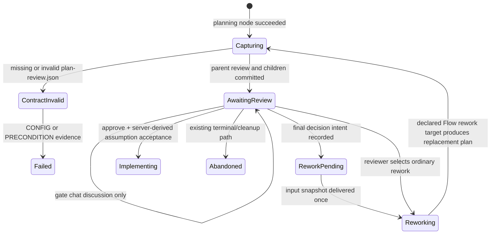

# Implementation Plan: Typed Plan Review and Flow-native Decision Requests

Branch: `feature/plan-review-decision-requests`
Created: 2026-07-14

## Settings

- Testing: yes — TDD, focused RED → GREEN → refactor slices; every new test must be discovered by its declared Vitest project.
- Logging: verbose — structured `DEBUG` at validation/branch points, `INFO` for durable lifecycle changes, `WARN` for retryable recovery, and `ERROR` for terminal failures; never log plan contents or user answers wholesale.
- Docs: yes — Phase 0 is a mandatory specification gate; as-built synchronization and contract validation are mandatory before completion.

## Roadmap Linkage

Milestone: `none`

Rationale: `.ai-factory/ROADMAP.md` has M1–M43 complete. Phase 0 must decide whether to add a new M44 entry after the contract is frozen; this plan must not silently relabel completed work.

## Goal and hard scope

Make Plan review explicit, auditable, and safe without parsing prose or inventing a second Inbox state machine:

1. A planning Flow produces a strict, machine-readable `plan-review.json` companion artifact.
2. Plan assumptions are visible at approval time; approval records acceptance of their server-derived defaults.
3. Blocking plan decisions become Flow-native `decision_request` HITLs. Each is an actionable Inbox projection, and the final answer deterministically reworks the plan before a clean approval can occur.
4. Only source Flow definitions that actually perform Plan review are migrated and released as new package versions. Installed/pinned historic revisions and existing runs stay immutable.
5. Gate chat remains the non-durable clarification channel. Manual takeover, ACP permission handling, ordinary forms, code-review gates, and agent `ask_human` are not redesigned.

Explicitly excluded: an in-browser editor for plans/files; semantic regex/LLM parsing of Markdown or ACP updates; a new global Inbox data store; a new run status; and a new supervisor/ACP semantic-question protocol.

## Evidence-based current state

- `aif-dev` source is `maister-plugins/packages/aif/flows/dev/flow.yaml`; it currently executes `plan → improve → plan_review → implement`. Its `plan_review` is a generic `human` node with `approve|rework`, a `plan_review_comments` string, and no typed artifact. The same legacy pattern exists in `maister-plugins/packages/superpowers/flows/dev/flow.yaml` and `flows/plan/flow.yaml`.
- `web/test-fixtures/aif-flows/` and `web/lib/flows/__tests__/_fixtures/aif-flow/` are engine fixtures, not shipped package sources. They must be kept in sync as fixtures, but must not be mistaken for release sources.
- The engine already has a `plan` artifact kind, deterministic `artifact_instances`, rework staleness/supersession, graph `human` pauses, `NeedsInput|NeedsInputIdle` recovery, HITL assignments, and Inbox-as-projection. It does **not** validate a `produces[].path` JSON file against `produces[].schema`; file locators presently refer to mutable run-directory paths.
- `runReviewHuman()` in `web/lib/flows/graph/runner-graph.ts` is the continuable Flow seam: it creates the human HITL + assignment and pauses the graph. `respondToHitl()` in `web/lib/services/hitl.ts` supplies the required row-lock, two-phase file write, same-payload retry, and resume patterns.
- `agent_question` is deliberately unsuitable: it terminates/supersedes an agent run and later retriggers agent/triage work. The new capability must remain inside the graph human-node lifecycle.
- `hitl_requests.kind` and `assignments.action_kind` are closed persisted discriminants. `decision_request` therefore needs a database migration and full read/API/UI fan-out. Inbox HITL cards are not `inbox_items`; social unread/read state is separate.
- The latest currently reserved-looking identifiers are ADR-136 and migration `0099_agent_human_ask`. Before code begins, re-check `main`; candidates are ADR-137 and migration `0100` / journal index 100, followed by a mandatory rebase-and-renumber pass.

## Target architecture

### Ownership boundaries

| Concern | Source of truth | Explicit non-owner |
| --- | --- | --- |
| Plan content + classifications | Immutable validated `plan-review` / `plan-document` artifacts for a node attempt | Markdown parsing, ACP events, Inbox cards |
| Pending decision lifecycle and durable answer | `hitl_requests` of kind `decision_request`, plus assignment/event audit | `inbox_items`, browser state |
| Inbox presentation | Query projection over open HITL + assignment rows | A second decision table or unread counter |
| Flow continuation | Parent `human` Plan-review HITL and graph rework transition | Standalone-agent `ask_human`, supervisor protocol |
| Discussion | Existing gate-chat transcript | Decision option selection or decision authority |

### Contract v1

The planning agent writes a JSON file at the runner-provided `MAISTER_PLAN_REVIEW_FILE`; it never puts semantic questions only in prose. The runner captures a content-hashed immutable copy named `plan-review.json` under the run/attempt artifact area before it can be shown or acted on. The reviewed Markdown plan is captured similarly as a `plan-document` artifact. The staging path is not an audit location and is never read after capture.

```ts
type PlanReviewV1 = {
  schemaVersion: 1;
  plan: {
    title: string;
    documentArtifact: "plan-document"; // manifest id; runner resolves the instance
  };
  assumptions: Array<{
    id: string;                         // ^[a-z][a-z0-9_-]{0,63}$, unique globally
    statement: string;
    defaultDecision: { id: string; label: string };
    impact: string;
    blocking: false;
  }>;
  decisions: Array<{
    id: string;                         // same uniqueness rule
    question: string;
    options: Array<{ id: string; label: string; consequences: string }>;
    recommendation?: string;            // must name an option id when present
    blocking: true;
  }>;
};
```

The Phase-0 schema freezes strict unknown-key handling, text/array size bounds, option-id uniqueness, maximum blocker count, and empty-array semantics. A decision with dependent sub-questions must be one compound choice; v1 has no cross-decision dependency graph. The runner adds provenance (`artifact instance id`, SHA-256, node attempt, Flow revision) rather than trusting agent-supplied artifact ids/hashes.

### Reusable Flow capability

Introduce a declarative `settings.plan_review` capability on a `human` node rather than recognizing `node.id === "plan_review"` or matching prompts. It names the current `plan-document` and `plan-review` artifact definitions, the comments variable, the ordered answers variable, the declared `rework` transition, and a required positive `max_decision_reworks` bound. The latter bounds only automatic reworks caused by completed decision sets; it is independent of the ordinary human-node `rework.maxLoops` bound and is persisted in the parent review schema/lineage for replay and recovery. Manifest/compiler validation must require:

- `type: human`, a compatible engine minimum (`3.1.0` after the engine bump), an `approve` transition that moves forward outside the declared rework targets, and an allowed `rework` transition;
- current `plan` artifacts of the declared ids, with the JSON contract captured and validated before the pause;
- a rework configuration whose target is Flow-declared, not a hard-coded node id; and
- exactly the parent outcomes `approve` and `rework`, with no `takeover` outcome or file-editor implication; manual takeover remains unchanged for non-Plan-review human nodes.

A configured Plan-review node always calls the existing human pause seam with `forcePause: true`: `humanGate=auto_pass`, `notify_only`, and a safe-forward default never bypass assumptions or blockers. When a validated contract contains blockers, the runner derives the decision-cycle count from the parent-review lineage before child creation. At `max_decision_reworks`, it fails closed with `PRECONDITION`, records the exhausted bound, and creates no card whose answer could not be applied; it never approves or ships the old plan. A no-blocker review remains approvable. This gives an operator an explicit relaunch/abandon path without adding a run status or an unbounded loop.

The producer declares both artifacts. The runner gives plan-capable agents two confined, per-attempt output-file paths, validates/copies them into immutable artifact storage, hashes them, and records them with `recordCurrentArtifact()` before `runReviewHuman()` opens the review. Invalid/missing JSON fails the producing node with actionable `CONFIG`/`PRECONDITION` evidence and never opens a misleading review or extracts questions from prose.

### State and data flow

```mermaid
sequenceDiagram
    participant P as Planning agent
    participant R as Graph runner
    participant A as Artifact index
    participant H as hitl_requests + assignments
    participant I as Inbox projection
    participant U as Human

    P->>R: write plan.md + plan-review.json to runner paths
    R->>R: strict validate, copy immutable snapshots, hash
    R->>A: current plan-document + plan-review artifacts
    R->>H: parent human review, N decision_request rows, assignments (one tx)
    R-->>I: durable HITL lifecycle event; cards project open rows
    U->>H: choose one server-allowed option
    alt blockers remain
        H-->>I: decision card closes; parent review stays pending
    else last blocker
        H->>H: persist ordered answers + prepare parent rework intent
        H->>R: write parent input artifact, mark final delivery, resume once
        R->>R: consume parent rework and rerun declared plan target
        R->>A: old plan artifacts stale/superseded; new review cycle begins
    end
    U->>H: approve clean review
    H->>H: record server-derived accepted assumption defaults
    H->>R: existing graph resume to implement
```

The run remains in the existing `NeedsInput` or `NeedsInputIdle` state throughout unanswered decisions; it does not get a new status. After the final handoff from `NeedsInputIdle`, a graph-only cap-safe claim moves it to `NeedsInput`, then `runFlow()` resumes it; no ACP permission resume path participates. No individual decision wakeup resumes the Flow.



### Persisted design and migration

Migration `0100` is required because persisted discriminants, a foreign reference, and idempotency need database enforcement. It is additive and forward-only; old rows remain valid and need no backfill.

- Add `decision_request` to the application/DB representation of `hitl_requests.kind` and `assignments.action_kind`.
- Add nullable `parent_hitl_request_id → hitl_requests(id)`, `source_artifact_id → artifact_instances(id)`, and `decision_id` to `hitl_requests`. For `decision_request`, all three are required; the parent must be the same-run Plan-review `human` row, the source artifact must be its validated Plan-review instance, and the `decision_id` is the contract id. The service verifies the cross-row parent-kind/schema invariant under lock; a kind-shape CHECK rejects decision-only fields on unrelated kinds and malformed decision schema discriminants.
- Add a partial unique index for `(run_id, source_artifact_id, decision_id)` for `kind='decision_request'`, preventing duplicate cards when the graph re-enters after a crash, plus a pending projection index keyed by parent/response/creation time. The direct parent FK is the only child-ownership authority; it is never inferred from a prompt, node id, or Inbox projection.
- Reuse `response`, `responded_at`, `assignments`, `assignment_events`, domain-event outbox, and node-attempt/artifact history for answer/auditing. Do **not** add a parallel `plan_decisions` table: the artifact owns definitions and HITL owns pending state.
- Ship the Drizzle triple: SQL migration, `_journal.json` entry, matching `meta/0100_snapshot.json`, schema-shape/migration tests, narrative DB docs and all relevant ERDs. Re-check main after rebase; renumber SQL/journal/snapshot/ADR references together if another branch wins either number.

### Response, idempotency, recovery, and authorization

The web response route keeps its current path. `runId` and `hitlRequestId` remain URL parameters; actor identity is auth context; the body contains only `{ optionId }`. The service derives the run, project, current artifact, option list, parent review, Flow transition, and filesystem output path from server state. No body-controlled project/path/node identifier is accepted.

For each option response, lock the decision row, its direct parent review row, and sibling open decisions in deterministic id order. Reject any status outside the exact `NeedsInput|NeedsInputIdle` allow-list, a parent/artifact that is no longer current, an unknown option, a conflicting replay, a system-closed child, or premature parent approval. Same-payload retries are no-ops except that they re-run an incomplete delivery handoff.

For non-final answers, atomically record response + assignment completion + audit/outbox event and leave the parent review open. For the final answer use the existing two-phase discipline:

1. transaction: persist the canonical answer and parent `rework` intent, but do not mark the final delivery complete;
2. external side effect: atomically write the parent node's server-assembled input file (ordered answers plus provenance; never raw client JSON);
3. transaction: mark final decision and parent review delivered, close their assignments, append audit/domain events, then schedule exactly one graph resume.

If a user selects ordinary parent `rework` while child cards remain open, the same transaction locks and system-closes every unresolved child with a server-authored `parent_reworked` closure envelope, stamps `responded_at`, closes the corresponding assignments, and emits audit/outbox events before writing the parent rework input. A racing child answer therefore returns `CONFLICT`; it is never mistaken for a human decision. This does not reuse the `agent_question` supersession fields or semantics.

If phase 2/3 crashes, `ensurePlanReviewDecisionHandoff()` is safe to call from a same-payload retry and reconciliation: it reconstructs the input only from locked persisted rows, rewrites it idempotently, and resumes only once. For `NeedsInput`, it schedules the normal graph `runFlow()` resume. For `NeedsInputIdle`, a graph-only scheduler-locked claim moves the run to `NeedsInput` and then schedules `runFlow()`; it does not call `resumeRun()` or the ACP permission resume-driver, because Plan-review has no deferred ACP operation to replay. The same graph-only idle claim serves parent approve/rework. The recovery predicate and tests must cover both statuses, cap-queued claims, and no-supervisor-call proof. A terminal/abandoned run rejects replay and closes all decision assignments in the same transaction as the terminal cleanup.

V1 requires an authenticated MAIster user with `answerHitl`; project membership is derived after auth from the run. Existing external HITL list endpoints omit `decision_request`; an external response addressed to an otherwise visible decision row returns `403 UNAUTHORIZED` with no mutation, even for a global personal token carrying the existing human scope. The session route accepts only `{ optionId }` for a child decision: a non-final answer returns `200 { ok: true, state: "awaiting-decisions", remainingDecisionCount }`; a final handoff or cap-queued graph resume returns `202 { ok: true, state: "rework-scheduled" | "resume-queued", remainingDecisionCount: 0 }`. Parent approval/rework retains the existing response envelope but receives the custom Plan-review handler. The API/OpenAPI documents this instead of accidentally granting tokens plan authority.

### UI and real-time policy

- The Plan-review panel shows the immutable plan snapshot, assumptions, defaults, impacts, and an approval label such as “Approve plan and accept N assumptions”. Approval stores the server-derived accepted defaults in the parent review response/audit envelope.
- Each blocking item is a dedicated Inbox/run-detail decision card: question, options, recommendation, consequences, current plan provenance, actionable error, and remaining count. It never falls back to raw JSON controls.
- While blockers are unresolved, approval is disabled in UI and rejected by the service. On the last answer, the UI clearly says that MAIster is regenerating the plan; the next approval applies only to the replacement artifact.
- Gate chat stays a separate, non-durable discussion attached to the parent review. It does not create/answer `decision_request` rows and its content is never parsed into choices. Decision cards receive no automatic chat channel.
- HITL cards remain actionable projections, not `inbox_items`; social unread/read endpoints and counts remain unchanged. `decision_request` is visible while unresolved and disappears only after durable delivery. The plan must document this distinction explicitly.
- Extend the existing per-run SSE/webhook HITL lifecycle payload with an optional `planReview` object (`parentHitlRequestId`, `sourceArtifactId`, `decisionId`, `remainingDecisionCount`, `state`) emitted only after durable state transitions. Existing event consumers remain compatible; neither plan text nor an answer value is emitted. Run-detail clients refetch through the existing single `RunStreamProvider`; an action locally updates/revalidates Inbox. V1 intentionally adds no unrelated global Inbox stream, polling loop, or second `EventSource`.

## Requirements and acceptance criteria

### Functional

1. A conforming Plan-review Flow produces an immutable, versioned `plan-review.json` and a plan document artifact; a malformed/missing contract never becomes a review card.
2. Assumptions always have stable ids, a default, and impact; `approve` records exactly the defaults from the current validated artifact.
3. Every blocker has stable id, valid options, and optional valid recommendation. It creates exactly one actionable `decision_request` per run/artifact/id, directly tied to its parent review, visible in Inbox and run detail.
4. An approval cannot bypass an unanswered blocker. Parent rework atomically system-closes its unanswered children; the last decision causes the declared Flow rework target to execute with a deterministic answer envelope, then requires a fresh review/approval.
5. Replays, concurrent answers, write failures, idle checkpoints, process restarts, stale artifacts, terminal runs, parent rework races, and bounded decision-rework exhaustion are deterministic, auditable, and recoverable or loudly refused.
6. Existing `human_review`, form/human HITL, agent questions, ACP permissions, gate chat, and manual takeover retain their current lifecycle and UI behavior.
7. Only current source Plan-review flows are migrated and shipped in new package tags; installed historical revisions and in-flight runs retain their pinned behavior.

### Non-functional

- No prose/LLM/ACP-event parsing is an authority for decisions; only the strict artifact schema is.
- A Plan-review node cannot auto-pass, notify-only, or enter manual takeover; every decision cycle is finite and fails closed before accepting an answer it cannot apply.
- Inputs, output paths, ids, option choices, and actor authorization are server-derived or strict allow-listed. No decision text, full plan, or user answer is logged as structured log values.
- All durable multi-store transitions list crash windows and recovery. DB changes are transactional/CAS guarded; filesystem writes use `atomicWriteJson`/tmp+rename.
- EN and RU strings are complete, localized, accessible, and explain remediation. Keyboard option selection, focus restoration, and disabled/loading/error states are covered.
- No new dependency, port, environment variable, sidecar, or Docker wiring is expected. If discovery changes that premise, add the required deployment task touching `.env.example`, compose overlays, and docs before code lands.

### Acceptance-to-test mapping

| Acceptance area | Primary proof |
| --- | --- |
| Contract, strict validation, immutable provenance | Unit parser/config tests + `node-output` and `runner-graph-artifacts` integration tests |
| One child card per blocker and no second source of truth | Migration/schema tests + `runner-graph`/assignment integration + portfolio Inbox queries |
| Explicit assumptions and approval refusal | HITL service/route tests + `RunHitlResponse` component tests |
| Last answer reworks exactly once | Concurrent-response, write-failure, restart, and `NeedsInputIdle` integration cases |
| Compatibility boundaries | Existing form/human/permission/agent-question/takeover regressions; old pinned Flow revision smoke |
| API, authorization, events, and webhook docs | Route/contract/stream tests for user/member/viewer/token principals and ordered post-commit payloads |
| Mature human UX | EN/RU component tests plus an authenticated Plan-review Inbox E2E from blockers → rework → fresh approval |

### TDD test ownership and non-overlap

| Layer | RED-first responsibility | Must not duplicate |
| --- | --- | --- |
| Pure unit | strict JSON/parser bounds, `settings.plan_review` grammar, explicit auto-pass/takeover/cycle-bound refusals | DB locking, routes, or DOM rendering |
| Database/integration | migration shape, parent FK, unique/projection indexes, atomic parent/child creation, parent-rework closure, races, recovery, and graph-only idle claim | component copy or browser navigation |
| Route/contract | session response shapes/statuses, `answerHitl` authorization, external omission/403, compatible AsyncAPI/webhook payloads | service concurrency internals |
| Component | localized assumptions/options/errors, disabled approval, focus/keyboard behavior, stale-card removal, single-provider stream use | HTTP authorization matrix |
| E2E | one authenticated blocker → final rework → fresh approval journey, plus no duplicate EventSource regression | parser permutations or every failure window |

Every test is introduced RED, made GREEN by the smallest production change, then refactored only after its declared Vitest/Playwright project discovers it. Fixtures assert ids, states, counts, and redaction—not trivial snapshots or duplicate happy paths.

### Decisions to freeze in Phase 0

| Decision | Proposed default | Why it is safe |
| --- | --- | --- |
| Decision persistence | Extend `hitl_requests`; no new `plan_decisions` table | Artifact definitions plus HITL state avoid duplicated authority. |
| Rework after final blocker | Automatic declared `rework` transition | Prevents approving a plan that predates the human answer. |
| Parent/child closure | Direct parent FK; parent rework system-closes unanswered children | Removes ambiguous ownership and makes parent/child races deterministic. |
| Plan-review execution policy | Force human pause; allow only `approve`/`rework` | Auto-pass, notify-only, and takeover cannot bypass a blocker. |
| Decision cycle bound | Required `max_decision_reworks`; fail `PRECONDITION` before unusable cards | Keeps automatic regeneration finite without inventing a run status. |
| Idle resume | Scheduler-locked graph claim then `runFlow()` | Prevents an ACP permission resume-driver from replaying a non-existent deferred request. |
| External/API-token answer support | List omission and direct 403 `UNAUTHORIZED` | Keeps the first release session-authenticated and prevents token plan authority. |
| Roadmap label | Do not invent M44 until Phase 0 | The completed roadmap remains truthful while the new milestone is named deliberately. |

## Tasks

### Phase 0 — SDD contract freeze (must complete before code)

- [x] Task 1: Freeze the product, architecture, persistence, state-machine, API, event, and screen contract in a new ADR and analytics set.
  - Files: `docs/decisions.md` (reserve/recheck ADR-137), `docs/VISION.md`, `docs/PRODUCT_VIEW.md`, `docs/architecture.md`, `docs/flow-dsl.md`, `docs/flow-aif-plugin.md`, `docs/system-analytics/{flow-graph,hitl,artifacts,flows,flow-packages,packages,runs,social-board}.md`, `docs/database-schema.md`, `docs/db/{erd,hitl-domain,artifacts-domain,runs-domain}.md`, `docs/screens/{inbox.md,runs/flow-run.md}`, `docs/api/{web.openapi.yaml,external/operations.openapi.yaml,async/web-runs.asyncapi.yaml,async/outbound-webhooks.asyncapi.yaml}`, `docs/error-taxonomy.md`, and `.ai-factory/ROADMAP.md` only if a new M44 is explicitly accepted.
  - Deliverable: a single internally consistent V1 contract with the JSON schema, semantic capability grammar including forced pause and `max_decision_reworks`, direct parent/child FK and closure semantics, tables/indexes/CHECKs, exact state transitions/refusals, graph-only idle-resume path, API examples/statuses, authorization matrix, external omission/403 policy, Inbox read/unread policy, package immutability policy, sequence/state/failure-recovery diagrams, and a no-new-supervisor-protocol decision.
  - Logging: define event names/fields and redaction rules in the spec; implementation logs must include ids/hashes/counts/statuses, never plan text or answers.
  - Dependencies: none. Exit gate: ADR/migration candidates rechecked against `main`; Mermaid and ADR anchors validate; every described piece is labeled Designed until code reaches its phase.

- [x] Task 2: Write the RED contract and migration tests before production changes.
  - Files: new focused tests beside `web/lib/flows/{config,output-schema}/__tests__`, `web/lib/flows/graph/__tests__/{node-output,runner-graph-artifacts,runner-graph.integration}.test.ts`, `web/lib/services/__tests__/hitl.integration.test.ts`, `web/lib/db/__tests__/{schema-shape,migration-0100-plan-review}.integration.test.ts`, plus test-runner config only if `vitest list` proves a path is not included.
  - Deliverable: failing tests with the ownership matrix above: V1 contract validation, semantic manifest refusal (auto-pass/takeover/cycle bounds), immutable capture, migration parent-FK/shape/indexes, decision creation/deduplication, parent-rework child closure, all decision/rework transitions, session/external authorization, exact 200/202/403 contracts, idempotent replay, graph-only idle recovery, and legacy-kind compatibility.
  - Logging: test fixtures assert event/log metadata only (ids, kind, count, status), not sensitive payload content.
  - Dependencies: Task 1. Exit gate: each file is listed by its unit/integration Vitest project and is proven discoverable with `vitest list` or equivalent; focused RED failures are explained, not skipped.

### Phase 1 — Typed artifact and DSL foundation

- [x] Task 3: Implement strict Plan-review artifact capture and reusable Flow capability validation.
  - Files: `web/lib/flows/{engine-version,config.schema,config}.ts`, `web/lib/flows/graph/{compile,node-output,artifact-store,artifact-content,runner-graph}.ts`, `web/lib/flows/output-schema.ts` or a focused `plan-review-contract.ts`, related unit/integration tests, and EN/RU-independent Flow editor labels/validation surfaces as needed.
  - Deliverable: engine `3.1.0`; strict V1 parser; runner-provided confined plan-document/plan-review staging paths; bounded immutable copies + SHA-256 metadata; current/stale/superseded handling; compile-time `settings.plan_review` validation without node-id/prompt heuristics; required positive `max_decision_reworks`; exactly `approve|rework`; and a forced assigned human pause that cannot auto-pass, notify-only, or offer takeover. Invalid artifacts or exhausted decision cycles fail before a human pause/child card.
  - Logging: `INFO` for capture/validation success with run/node/attempt/artifact id/hash/byte count; `WARN` for invalid/missing output; `ERROR` only for unrecoverable copy/read failures, with no payload body.
  - Dependencies: Task 2. Exit gate: RED tests turn green; existing file-artifact and structured-output assertions are migrated by path; `pnpm --dir web typecheck` and unit suite are green.

### Phase 2 — Durable decision-request model

- [x] Task 4: Add the additive migration and schema/query fan-out for `decision_request`.
  - Files: `web/lib/db/schema.ts`, `web/lib/db/migrations/0100_*`, `web/lib/db/migrations/meta/{_journal.json,0100_snapshot.json}`, `web/lib/assignments/{service.ts,...}`, `web/lib/queries/{hitl,portfolio,inbox-context,hitl-stage}.ts`, schema/migration/integration tests.
  - Deliverable: persisted kind/action unions, `parent_hitl_request_id` + `source_artifact_id` + `decision_id`, decision row-shape checks, a locked same-run parent-kind/schema invariant, partial unique/idempotency and parent-pending projection indexes, and query DTOs that expose a structured card view. Existing rows require no backfill and old kind values remain valid.
  - Logging: `INFO` for decision request creation/deduplication/completion (run, artifact, decision id, assignment id); `WARN` for a stale/malformed reference; never log option consequences or answers.
  - Dependencies: Task 1, Task 2, Task 3. Exit gate: migration applies to a populated representative DB without data loss; newest journal/snapshot pair matches; schema and migration suites are green.

- [x] Task 5: Create decisions atomically when a configured Plan-review human node pauses.
  - Files: `web/lib/flows/graph/{runner-graph,ledger,default-artifacts}.ts`, `web/lib/assignments/service.ts`, domain/webhook event helpers, `web/lib/runs/{run-stream-event,stream-options}.ts`, runner/assignment/artifact tests.
  - Deliverable: one transaction creates the parent review HITL, its assignment, zero-or-more deduplicated blocker requests linked by parent FK and their assignments, pending state, and durable event intent. The parent schema carries server-derived artifact provenance, assumptions, and decision-cycle counter; only blockers project as child cards. A no-blocker Plan review follows legacy behavior plus explicit assumptions. A bounded-cycle refusal occurs before this transaction, so no partial/card-without-rework state is possible.
  - Logging: `INFO` with `blockerCount`, artifact hash and ids after commit; `DEBUG` for an empty blocker set; `WARN` on a dedupe/re-entry no-op.
  - Dependencies: Task 3–4. Exit gate: normal, re-entry, and crash-before/after-transaction tests prove no partial parent/child state; the run remains exactly `NeedsInput|NeedsInputIdle` and no new status consumer is introduced.

### Phase 3 — Safe answers, rework, and recovery

- [x] Task 6: Extend the HITL response service with decision-specific validation, final-answer handoff, and reconciliation.
  - Files: `web/lib/services/hitl.ts`, a focused `web/lib/services/plan-review-decisions.ts`, `web/lib/flows/{hitl-validate.ts,graph/runner-graph.ts}`, `web/lib/runs/{resume,resume-driver,keepalive-sweeper,state-transitions}.ts` only where existing recovery hooks require it, `web/app/api/runs/[runId]/hitl/[hitlRequestId]/respond/route.ts`, and integration/route tests.
  - Deliverable: separate Plan-review parent/child dispatch from legacy form/human handling; exact state allow-list; locked direct-parent/sibling checks; server-derived options and assumptions; explicit premature-approval refusal; deterministic answer envelope into the configured rework/comments variables; final-answer two-phase write/delivery; same-payload retry; conflicting-retry `CONFLICT`; parent-rework system closure of unresolved children; and restart/idle recovery through `ensurePlanReviewDecisionHandoff()`. `NeedsInputIdle` uses a scheduler-locked graph claim followed by `runFlow()`—never `resumeRun()` or a permission resume-driver.
  - Logging: `DEBUG` for validation branch, parent id, and remaining count; `INFO` for accepted decision, child system closure, and final rework scheduling; `WARN` for retryable atomic-write/recovery; `ERROR` for terminal refusal with run/request ids and error code only.
  - Dependencies: Task 4–5. Exit gate: integration tests simulate concurrent final answers, child-vs-parent-rework races, disk-write failure between every phase, process restart, `NeedsInputIdle`/cap queue with no supervisor call, stale artifact, terminal rejection, and unchanged legacy form/human/agent-question paths; full web unit + integration suites are green.

- [x] Task 7: Publish exact HTTP/SSE/webhook contracts and prohibit unintended external decision authority.
  - Files: `web/app/api/v1/ext/{hitl,runs/[runId]/hitl}/route.ts` and response route where filtering/refusal is required, `web/lib/runs/{run-stream-event,run-stream-controller}.ts`, `web/app/api/runs/[runId]/stream/route.ts` if DTO forwarding needs it, `docs/api/{web.openapi.yaml,external/operations.openapi.yaml,async/web-runs.asyncapi.yaml,async/outbound-webhooks.asyncapi.yaml}`, route/stream/contract tests.
  - Deliverable: documented response request/response/error examples—`200 awaiting-decisions`, `202 rework-scheduled|resume-queued`, and session-only child `{ optionId }`; `answerHitl` authorization; url/auth/body identifier table; external list omission and direct `403 UNAUTHORIZED` refusal; and post-commit backward-compatible optional `planReview` event payloads for request/answer/remaining-count changes. Supervisor SSE and ACP contracts are unchanged.
  - Logging: structured HTTP refusal/response fields (`runId`, `hitlRequestId`, `kind`, `remainingCount`, `code`, latency); no request body or answer value.
  - Dependencies: Task 6. Exit gate: authenticated/unauthenticated/member/viewer/API-token paths, event ordering, reconnect payload, and webhook examples pass contract tests; no new global Inbox stream/poll is introduced.

### Phase 4 — Mature Plan-review and Inbox UX

- [x] Task 8: Add localized Plan-review assumptions and structured decision-card UX without altering unrelated Inbox semantics.
  - Files: `web/components/{board/run-hitl-response,board/hitl-decision-controls,inbox/hitl-card,inbox/hitl-inbox-list}.tsx`, `web/app/(app)/runs/[runId]/layout.tsx`, `web/lib/queries/{hitl,inbox-context}.ts`, `web/i18n/{en,ru}/*.json`, component/query tests, `web/e2e/inbox.spec.ts` and a dedicated Plan-review journey.
  - Deliverable: immutable-plan context, assumption/default/impact display, explicit approval text/count, recommended-option/consequence cards, disabled premature approval, meaningful loading/error/retry states, answered-card removal, remaining count, action-local refresh, and keyboard/screen-reader behavior. Reuse the existing `RunStreamProvider`/`useRunPageStream` subscription; do not open another EventSource. Gate chat remains available only as existing parent-review clarification and never renders decision choices as free-form JSON.
  - Logging: client-visible errors map typed codes to localized remedies; client telemetry/logging (if any) contains kind/id/status only and never the plan or answer.
  - Dependencies: Task 5–7. Exit gate: component and authenticated E2E coverage confirms no raw JSON editor, EN/RU labels, option affordances, unauthorized disabled state, reload/retry behavior, and unchanged social unread/read counts.

### Phase 5 — Migrate only source Plan-review Flows and release safely

- [x] Task 9: Upgrade every current source Flow that performs Plan review, then cut package-scoped releases without touching historic installs.
  - Files outside this repository (separate scoped changes): `maister-plugins/packages/aif/flows/dev/flow.yaml`, `maister-plugins/packages/aif/{schemas,prompts,capability/skills/aif-plan,...}` as discovery confirms, `maister-plugins/packages/superpowers/flows/{dev,plan}/flow.yaml` and their schema/prompt files; mirrored test fixtures in this repository: `web/test-fixtures/aif-flows/**`, `web/lib/flows/__tests__/_fixtures/aif-flow/flow.yaml` only where their fixture contract intentionally covers the new capability; `docs/flow-aif-plugin.md`.
  - Deliverable: new semantic configuration, declared plan document/contract artifacts, agent instructions to write valid JSON and classify assumptions vs blockers, answer-envelope injection on rework, and raised engine minimum. Package-source releases are one package per version/tag (`aif/vX.Y.Z`, `superpowers/vX.Y.Z`); installed SHA-pinned revisions and active runs are untouched.
  - Logging: planning prompts instruct agents not to log/copy secret content; platform logs package id/version/resolved SHA and contract validation outcome only.
  - Dependencies: Task 3, Task 6–8. Exit gate: package validation/install smoke tests prove the newly tagged source resolves against engine 3.1.0; fixture changes are explicit and runner-discovered; old pinned package revision regression remains green.

### Phase 6 — Cross-layer verification, as-built docs, and merge readiness

- [x] Task 10: Run the completeness/consistency review, rebase reservation check, and release gates.
  - Files: every Phase-0 specification artifact listed in Task 1, affected implementation tests/contracts, and the plan checklist; only directly discovered consistency corrections, no opportunistic refactoring.
  - Deliverable: convert frozen docs from Designed to Implemented only for landed behavior after every backend, contract, and UI phase is present; retain explicit deferrals, and produce a diff-derived inventory proving requirements, config/compiler, forced-pause/cycle policy, artifact lifecycle, migration triple and parent ownership, DB docs/ERDs, session and external OpenAPI/AsyncAPI, single-provider run stream, response guards, Inbox/UI, i18n, Flow sources, tests, and package tags agree. Re-check ADR/migration reservation at rebased `main`; renumber all linked artifacts together if needed.
  - Logging: confirm every lifecycle outcome has an observable structured event/log field and no sensitive payload leakage; document known operational alerts and recovery instructions.
  - Dependencies: Task 1–9. Exit gate: `pnpm --dir web typecheck`; `pnpm --dir web test:unit`; `pnpm --dir web test:integration`; focused `pnpm --dir web test:e2e`; `pnpm validate:docs:all`; `pnpm validate:contracts`; migration journal/snapshot integrity; `git diff --check`; and package release/installation validation all pass. Any unavailable infrastructure is reported as blocked, never masked by syntax checks.

## Commit plan

- **Commit 1** (after Tasks 1–2): `docs(plan-review): freeze typed decision-request contract`
- **Commit 2** (after Tasks 3–5): `feat(flow): add typed plan-review decision lifecycle`
- **Commit 3** (after Tasks 6–8): `feat(hitl): handle plan-review decisions safely`
- **Commit 4** (after Task 9): `feat(aif): emit typed plan-review artifacts`
- **Commit 5** (after Task 10): `test(plan-review): close cross-layer acceptance coverage`

## Risks and mandated mitigations

| Risk | Mitigation and proof |
| --- | --- |
| Agent produces plausible but invalid JSON | Strict schema and immutable capture before pause; RED validator/runner tests; fail closed with actionable `CONFIG`. |
| Multiple child answers resume twice | Partial unique index, ordered row locks, final-delivery marker, and race integration test. |
| Parent rework races a child answer | Direct parent FK, deterministic parent/sibling locks, server-authored child closure, and child-vs-parent race tests. |
| Crash between DB intent and input file | Explicit three-phase handoff plus idempotent reconcile/retry tests for every window. |
| Stale plan approved after decisions | Approval locks current artifact and unanswered siblings; last decision forces rework; old artifacts become stale/superseded. |
| Execution policy bypasses a human decision | Compiler requires `approve|rework`; runtime forces the assigned human pause; unattended/notify-only/takeover regression tests prove no bypass. |
| Automatic decision rework reaches an unbounded or exhausted loop | Required bounded `max_decision_reworks`, persisted lineage count, and pre-card `PRECONDITION` refusal; no old plan ships. |
| Idle decision response drives ACP permission recovery | Scheduler-locked graph idle claim plus `runFlow()` only; integration test proves no supervisor resume-driver call. |
| Inbox becomes a second source of truth | Query only `hitl_requests` + assignments; no `inbox_items` writes; unchanged social unread/read assertions. |
| Agent-question semantics leak in | Separate type/service branch and compatibility tests proving agent questions still terminate/retrigger while decisions resume a Flow. |
| Token or event contract leaks decision authority/content | External list omission plus direct 403; optional event metadata only, with no plan or answer body; route/AsyncAPI regression tests. |
| Historic packages/run behavior changes | New source package tags only; regression opens old pinned revision; no migration rewrites stored manifests/runs. |
| ADR/migration collision after parallel work | Reserve/recheck against `main`, then explicit rebase/renumber task including SQL/journal/snapshot and ADR anchors. |

## Final completeness checklist

- [x] Phase-0 docs are complete, internally consistent, labeled honestly, and precede code.
- [x] Contract has one authority, strict versioning/limits, immutable provenance, and no prose parsing fallback.
- [x] Every persisted field has a migration rationale; `0100` is additive, journaled, snapshotted, and preserves live data.
- [x] Every child request has a direct validated parent FK; parent rework system-closes children atomically and cannot race an answer into the next plan.
- [x] Every decision transition names transaction boundaries, side effects, idempotency key, failure response, crash window, and recovery predicate.
- [x] Plan-review cannot auto-pass, notify-only, or takeover; its decision-rework cycle is bounded and fails closed before unusable cards exist.
- [x] No new run status was added; all existing status/read-model/scheduler/sweeper guards were consciously checked.
- [x] `NeedsInputIdle` uses the graph-only cap-safe claim then `runFlow()`; no ACP permission resume-driver is invoked for Plan-review.
- [x] HTTP 200/202, external omission/403, authz, session/external OpenAPI, SSE, webhook, UI DTO, and error taxonomy agree.
- [x] Inbox is a projection and social unread/read behavior is unchanged by design and by test.
- [x] Flow source list is exhaustive (`aif-dev`, `superpowers dev`, `superpowers plan`); fixtures are clearly distinguished from shipped sources; historical installed revisions are unchanged.
- [x] Tests are RED first, runner-discovered, ownership-partitioned with no trivial overlap, green per phase, and include integration/recovery/auth/E2E coverage.
- [x] EN/RU UX, accessibility, observability/redaction, docs validation, contracts, migration integrity, and package release gates are green.
