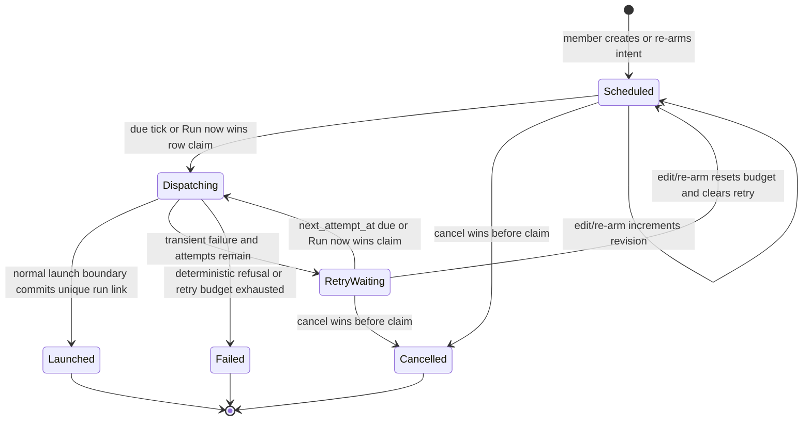

# Implementation Plan: Project Automations and One-Time Scheduled Task Launches

Branch: proposed `feature/project-automations-scheduled-launches` (not created; this request is plan-only)
Created: 2026-07-15

## Settings

- Testing: yes — TDD, with RED → GREEN → refactor checkpoints for every behavior-bearing slice.
- Logging: verbose — structured Pino events at each intent state transition and dispatcher boundary; never log secrets, host paths, raw launch payloads, or raw provider errors.
- Docs: yes — mandatory documentation checkpoint before implementation starts and an as-built consistency checkpoint before merge.

## Roadmap Linkage

Milestone: "none"

Rationale: the feature brief does not assign an existing roadmap milestone. Phase 0 creates the candidate milestone/ADR linkage after rechecking `main`, instead of attaching it speculatively.

## Plan Scope and Non-goals

Phase 1 delivers a member-facing, project-scoped Automations surface and one-time scheduling for the next Flow Run of an existing configured task. It reuses the M24 scheduler clock and the existing Flow/agent launch boundaries. Creation does not create a Run, reserve an execution slot, or spawn an agent; at due time the dispatcher must durably reserve its external Git attempt before it performs any side effect.

In scope:

- `Schedule run` as a sibling submit mode of the existing task `LaunchPopover`, retaining its selected launch request rather than reducing it to only a task id.
- Durable, recoverable one-time task-launch intents; inspect, edit while pending, cancel, and Run now.
- An aggregate project `?tab=automations` read model for one-time task launches, recurring task schedules, and effective project-agent cron/event bindings.
- Read-only admin diagnostics and links from `/admin/scheduler`; no project automation editor there.
- EN/RU parity, documented time/DST semantics, bounded retries, state/outcome reporting, and TDD verification.

Out of scope:

- A generic workflow/automation builder, arbitrary shell execution, new webhook authoring, persistent agents, agent inboxes, new domain-event kinds, second-level precision, notifications, organisation policy, marketplace work, or recurrent Flow templates that mint tasks.
- Destructive consolidation or renaming of `run_schedules` and `agent_schedules`.
- A second clock, per-intent `scheduler_jobs` rows, supervisor database access, polling, or a side-channel `runs` insert.

## Repository-grounded Current State

| Concern | Current source of truth | Planning consequence |
| --- | --- | --- |
| Clock and job leases | `web/lib/scheduler/{jobs,tick-service}.ts`, `/api/cron/tick`, `web/instrumentation.ts` | Extend the seeded 60-second `run_schedule.dispatcher`; do not add a timer or job kind. The optional process timer remains an existing driver only. |
| Recurring tasks | `run_schedules`, `web/lib/run-schedules/{service,dispatch,queries,cron}.ts` | Reuse validation, `FOR UPDATE SKIP LOCKED`, launchability and `launchRun` seams, but not the recurring W1 loss-by-design recovery model. |
| Flow launch | `web/lib/services/runs.ts` (`launchRun`/`launchRunStaged`) | The normal path creates a worktree before it inserts `runs`; a unique Run FK alone cannot close that crash window. Scheduled dispatch must enter this boundary through a durable reservation that gives it a fixed run/branch/worktree identity while retaining ordinary compatibility checks, snapshots, isolation, cap admission, and evidence. |
| Agent triggers | `agent_schedules`, `web/lib/agents/{triggers,project-links}.ts` | The current project-agent PATCH deletes and reinserts every binding, while event delivery deduplicates only by `(agent_id, trigger_event_id)`. Project Automation therefore needs id-aware reconciliation, a revision fence, and deterministic matching before it can show per-binding telemetry. It remains the only binding editor. |
| Project IA | `web/app/(app)/projects/[slug]/page.tsx`, `web/components/board/project-tabs.tsx` | Rename the already-existing `schedules` tab to `automations` and retain `?tab=schedules` as a compatibility alias; do not add a fifteenth tab. |
| Current task UI | `web/components/board/launch-popover.tsx` | The schedule dialog must preserve the same validated launch selection and must not offer `allowConcurrent` force-relaunch for a “next Run” intent. |
| Admin boundary | `web/app/(app)/admin/scheduler/page.tsx`, `web/lib/queries/scheduler.ts` | The admin remains an engine/health cockpit. It may expose read-only intent diagnostics and links, never member automation CRUD. |
| Contracts/docs | `docs/api/web.openapi.yaml`, `docs/system-analytics/{scheduler,run-schedules,agents,tasks,runs}.md`, DB/ERD/screen docs | Documentation is currently accurate for recurring schedules only; it must be frozen before code. Existing docs also omit implemented `skipped_flagged` recurrence behavior. |

## Frozen Domain Model and Decisions

### 1. Product IA and authority

- The visible project tab is **Automations** at `/projects/{slug}?tab=automations`. `?tab=schedules` resolves to the same tab for existing links; all newly rendered links use `automations`.
- A single aggregate reader returns heterogeneous automation rows. It does **not** merge their persistence or mutation ownership.
- `readBoard` (viewer+) reads Automations. `manageSchedules` (member+) plus `launchRun` creates, edits, cancels, or runs one-time task automations; creation also verifies `launchUnattended` whenever the stored execution policy needs it. Recurring mutations retain `manageSchedules`. Agent-binding configuration remains `editSettings` (admin+) through the existing project-agent owner; its row exposes a clear **Manage agent automation** deep link.
- The one-time intent is an authorised request at creation. Execution is a narrow system execution of that previously authorised intent, not a generic no-op authorizer; it may launch only the durable project/task/request/reservation it claimed. Removal of the creator later does not silently cancel it. Project/task/runner/package eligibility is always re-evaluated at dispatch.

### 2. Dedicated one-time intent and pre-side-effect reservation, not a pre-created Run

Add `scheduled_task_launches`, `scheduled_task_launch_attempts`, and a small append-only `scheduled_task_launch_events` audit ledger. Do not overload `run_schedules`, `scheduler_jobs`, or `agent_schedules`.

`scheduled_task_launches` contains, at minimum:

- `id`, `project_id`, nullable `task_id` (`ON DELETE SET NULL`) plus task key/number/title snapshot for an actionable deleted-target audit;
- creator/last-actor references, requested local ISO date-time, IANA `timezone`, DST disambiguation, resolved `scheduled_for_at` UTC, `armed_at`, and immutable validated `launch_request` (only the public launch subset: `flowId`, `runnerId`, `baseBranch`, `baseCommit`, `targetBranch`, `deliveryPolicy`, `executionPolicy`, `packageVersions`, `brainContext`, and `autoPromote`; always reject internal agent/trigger/queue/experiment fields and force `allowConcurrent=false`);
- state, revision, `next_attempt_at`, attempt budget/count, claim id/fence/expiry/origin, latest outcome/error code/sanitized bounded message, and late-by duration;
- a normalized `request_hash` plus an opaque, length-bounded `idempotency_key`, unique on `(project_id, created_by_user_id, idempotency_key)`; same key plus same hash replays the existing intent, while a different hash is `CONFLICT`; and
- project-list and due-claim indexes, state-shape checks (claim fields only while `Dispatching`, bounded attempts, and no stale claim fields in terminal rows); and
- events for `created`, `edited/rearmed`, `claimed`, `retry_scheduled`, `cancelled`, `launched`, and `failed`, with actor/system attribution and safe code-level metadata.

`scheduled_task_launch_attempts` is the durable external-effect reservation. Its unique live attempt stores `scheduled_launch_id`, preallocated `run_id`, task attempt number, branch, worktree path, request hash, claim fence, and reservation state. The claiming transaction persists it before `addWorktree`; a later invocation uses the same identity, never creates an arbitrary replacement. A verified orphan may be guardedly cleaned and replayed; an unverifiable path/branch fails safely and is never deleted.

Add nullable `runs.scheduled_launch_id` with a unique constraint and extend the existing `trigger_source` union with `scheduled`. This is the sole persisted Run link: DTOs derive the resulting Run by joining `runs`, and no reciprocal mutable `resulting_run_id` column is added to the intent. The relation lets recovery finalize a Run already inserted before the intent finalization. It is not a generic automation framework.

The migration preserves `run_schedules` and existing `agent_schedules`. It adds `runs.agent_schedule_id` (`ON DELETE SET NULL`) and bounded per-binding telemetry: `last_attempt_at`, `last_attempt_fence`, `last_outcome`, safe code/message, and `last_run_id`. The project-agent link gains a schedules revision. Binding configuration remains owned by its existing PATCH route, but that route must reconcile stable IDs instead of deleting/reinserting unchanged rows.

### 3. One-time state machine, claim fence, and recovery

- Only `Scheduled` and `RetryWaiting` may be edited, cancelled, or claimed. Edit increments `revision`, clears the transient error, records an event, and deliberately resets the intent-scoped retry budget with a new `armed_at`.
- The winning tick or Run now transaction locks one row (`FOR UPDATE SKIP LOCKED`), writes a unique claim/fence, allocates the one live `scheduled_task_launch_attempts` reservation (including Run/branch/worktree identity), increments the attempt count, and commits `Dispatching` before calling `launchRun` outside the lock. Losers get typed `CONFLICT`; cancellation is guaranteed only until dispatch wins its claim.
- A dispatcher lease expires after the documented scheduler attempt window. Recovery first resolves an existing `runs.scheduled_launch_id`; if absent, it loads the reservation and follows a fixed matrix: no worktree → re-enter the normal launch seam with the same reservation; matching managed provenance → remove only the reserved, uncommitted worktree/branch then re-enter; mismatching/malformed provenance or a moved branch → terminal safe failure with no deletion. If the Run exists, finalization is idempotent. This explicitly fixes the recurring schedule W1 limitation without changing recurrence semantics.
- `launchRun` receives a server-only reservation and uses its preallocated `runId`, task attempt number, branch, and worktree path. It persists `runs.scheduled_launch_id` in its ordinary Run transaction, then retains the existing capability/runner/policy/workspace materialization and compensation behavior. The dispatcher never calls the supervisor or inserts Runs directly.
- The due scan orders by `(next_attempt_at, id)` and every claimed item becomes terminal or moves to a future retry time, so a capped scan cannot be blocked permanently by poison rows. The dispatcher records a truncation summary/WARN when more than its bounded batch remains.
- Retry only `EXECUTOR_UNAVAILABLE`, supervisor/network `SPAWN`/timeout-class failures, with three attempts total per `armed_at` and 1/5/15-minute backoff. A structural/configuration/preflight refusal becomes `Failed` immediately. No retry creates another Run; a retry exhaustion is a visible, terminal actionable outcome.

### 4. Time semantics

- Store the resolved instant as Postgres `timestamptz` (UTC) and retain the submitted local wall time, IANA zone, and chosen disambiguation for display/audit.
- Add `@js-temporal/polyfill` to `web/package.json` and lockfile. A shared pure helper converts a local time using the exact IANA zone; the server is canonical.
- A nonexistent spring-forward wall time is rejected with `MaisterError("CONFIG")` and an actionable field error. An ambiguous fall-back time requires the member to choose `earlier` or `later`; the UI shows both resolved offsets/UTC previews. Never silently move a one-time launch.
- Past instants and unsupported zones are rejected. The UI displays the selected local time, IANA zone, resolved UTC instant, and “starts on the next scheduler tick (normally within 60 seconds)” rather than promising second precision.
- After downtime, every still-pending due intent is eligible once on the next M24 tick. It records lateness and launches once; it does not backfill missed intervals or spend retry budget merely because MAIster was down.
- Edits after `Dispatching` starts are rejected (409); a terminal intent is immutable. The user creates a new one after a terminal refusal.

### 5. Execution-time decision matrix

| Condition at due/Run now claim | Decision | Durable outcome / UI |
| --- | --- | --- |
| Normal launchability, capacity available | Call `launchRun` with the stored request and durable reservation; its ordinary Run transaction persists the unique `scheduled_launch_id`. | `Launched`, derived Run link and normal Run status. |
| Global Flow cap full | Call normal `launchRun`; it creates the ordinary `Pending` Run/queue position. | `Launched` with queued Run link; no cap bypass. |
| MAIster was down at requested instant | Claim once when tick resumes, then apply this matrix. | `Launched` or its normal refusal; display late-by. |
| Active Run, Review, HumanWorking, NeedsInput, or Crashed recovery owed | Do not force/relaunch concurrently. | Terminal `Failed` / typed `PRECONDITION`, reason to wait/recover then schedule again. |
| Open task relation blocker, flagged task, unconfigured task, Done/Abandoned task/latest Run | Do not inherit permissive manual-relaunch behavior. | Terminal `Failed` / typed `PRECONDITION` with specific safe remediation. |
| Archived project or deleted task | Claim only to terminalize; perform no launch side effect. | Terminal `Failed`, preserved target snapshot and explanation. |
| Package/Flow/engine incompatibility, removed runner, invalid stored request | No retry because repair needs a user/config change. | Terminal `Failed`, typed `CONFIG`/`PRECONDITION`, actionable remediation. |
| Supervisor/runner temporarily unavailable | Retry with the bounded policy above. | `RetryWaiting`, attempt count/next retry; terminal `Failed` on exhaustion. |
| Branch/repository preflight refuses | No automatic retry; a human must repair repository state. | Terminal `Failed` with sanitized typed reason. |
| Cancel/edit versus claim | Row lock and required intent revision CAS decide. A cancel/edit before claim wins; after `Dispatching` or a stale revision it receives 409. | No overwrite of newer state; event ledger identifies winner. |
| Run now versus tick | Both use the same claim/reservation function and required intent revision. | Exactly one Run at most; loser receives 409 or reads terminal outcome. |

### 6. API contract and DTOs

Freeze the following OpenAPI paths and Zod schemas before route code:

- `POST /api/projects/{slug}/scheduled-launches` — requires `manageSchedules`, `launchRun`, and an `Idempotency-Key`; it additionally checks `launchUnattended` when applicable. Authenticates and authorizes before parsing or resolving a project. The strict body contains only the stored public launch subset, task, local time, timezone, and DST disambiguation. It returns 201 on first create, 200 on a same-hash key replay, and 409 on a different-hash key replay; it stores an intent only, never a Run.
- `GET /api/projects/{slug}/scheduled-launches/{id}` — detailed one-time DTO plus safe event audit, project-scoped 404/no-probe.
- `PATCH /api/projects/{slug}/scheduled-launches/{id}` — only pending edit/re-arm fields; requires a quoted `If-Match` intent revision and returns 409 for a stale revision or a completed claim.
- `POST /api/projects/{slug}/scheduled-launches/{id}/cancel` and `POST .../run-now` — require the same `If-Match` revision, use the single claim/reservation operation, and return the resulting intent/outcome; neither is a delete.
- `GET /api/projects/{slug}/automations?limit=1..50&cursor=...` — a bounded, cursor-paginated discriminated union: `one_time_task_launch`, `recurring_task_schedule`, `agent_cron`, and `agent_event`. The opaque versioned cursor encodes the complete stable tuple: active rows sort by `nextActionAt ASC`, then kind rank and id; no-next/terminal rows sort after active rows by `updatedAt DESC`, then kind rank and id. Every row has type, name, effective target, trigger/timezone/next execution when meaningful, state, latest safe outcome/error, creator/owner where meaningful, resulting Run link, and a type-specific `detailHref`.
- `GET /api/projects/{slug}/automations/{kind}/{id}` — a read-only type-specific detail DTO, preserving each owner’s model rather than inventing unified mutation. It provides the data required by the planned detail UI for recurring and agent rows as well as one-time rows.
- Existing `/schedules` routes remain the only recurring-task mutation contract. Existing project-agent PATCH remains the only binding editor. Phase 1 has no new agent trigger-now endpoint: agent rows deep-link to the authoritative editor, and event bindings never invent a synthetic event.

Every one-time create/read/mutation DTO includes `revision`; its response carries `ETag: "<revision>"`. The three mutable routes require the exact quoted value in `If-Match`; missing, malformed, stale, or post-claim values are `CONFLICT` and include the safe current DTO only when the caller still has `readBoard` access.

Identifier/trust table for every new route:

| Identifier | Source | Rule |
| --- | --- | --- |
| `slug`, intent id | URL param | Resolve project then intent through server DB joins; foreign/missing intent is 404. |
| actor | auth context | Authenticate and authorize before parsing body or resolving project/intent; require the exact action set for the route and never trust a body user/project id. |
| task id, runner/Flow/package selection, local time/zone | body-controlled | Strict Zod/Temporal validation plus shared no-side-effect launch-request normalization. Compare task to server-derived project, resolve selectable launch options server-side, reject mismatch without filesystem access, and revalidate mutable prerequisites at dispatch. |
| idempotency key, request hash | header/server state | Header is opaque and length-bounded; server hashes canonical normalized request bytes. Never accept a client hash. |
| revision, claim/fence/run link | header/server state | `If-Match` is required on mutable one-time routes; claim/fence/reservation/run link are never browser-controlled. CAS and unique DB constraints own races. |

All route errors use the existing `MaisterError` taxonomy and current project-route mapper (`CONFIG` 400, `PRECONDITION`/`CONFLICT` 409, `EXECUTOR_UNAVAILABLE` 503). New state/outcome labels are not new error codes. DTOs and logs omit repo paths, credentials, capability secret values, raw payloads, and unsafe upstream text.

### 7. Agent-binding identity, event ownership, and telemetry

- Extend the project-agent response and PATCH input with stable schedule IDs plus `schedulesRevision`. When `schedules` is present, PATCH requires the matching revision and reconciles by ID inside the existing transaction: update unchanged IDs in place, insert only client-new rows, and delete only stored IDs omitted from the replacement. A mismatched revision is `CONFLICT`; disabling an attachment keeps its current token-revocation behavior.
- Each cron fire passes its `agentScheduleId` to `launchAgentRun`, records its own fenced result, and persists the link on `runs.agent_schedule_id`. The aggregate row is therefore based on a real owned attempt, not a projection guess.
- For an event, the consumer loads eligible matching bindings in deterministic `id ASC` order. The first is the sole launch owner; every later matching binding records `suppressed_duplicate_binding`, the owner's Run link when available, and a safe explanation. This preserves the existing at-most-one `(agent_id, trigger_event_id)` behaviour while making row telemetry truthful. New and replacement configuration must reject duplicate enabled event kinds for one `(project, agent)` pair; an implementation preflight reports legacy overlaps and applies the deterministic owner rule until an admin removes them.
- Every telemetry result uses an attempt fence (`last_attempt_at`/claim id) so an older completion cannot overwrite a newer fire. Event and cron errors record a bounded code/message only; raw event payloads and upstream errors never enter `agent_schedules` or the aggregate DTO.
- Agent event and cron rows expose **Manage agent automation**, not a Phase-1 Run-now action. The existing manual agent launch surface remains separate and continues to require `launchRun`.

## Contract Surface Checklist

| Changed surface | Canonical artifacts |
| --- | --- |
| HTTP paths/DTOs/status/error examples | `docs/api/web.openapi.yaml`, route Zod schemas/tests |
| State/dispatch/recovery/time semantics | new `docs/system-analytics/project-automations.md`; update `scheduler.md`, `run-schedules.md`, `tasks.md`, `runs.md`, and `agents.md`. Define state/attempt counters, lateness, retry-exhaustion, and the boundary between operational audit and Observatory’s read-only ledgers. |
| New DB tables/columns/indexes | Drizzle schema + `0104_*` migration triple, `docs/database-schema.md`, `docs/db/scheduler-domain.md`, `docs/db/erd.md`, and relevant runs/agents domain docs. Both ERDs show intent → attempt → Run and agent binding → Run cardinalities. |
| Project/admin screen IA | new `docs/screens/projects/project-automations.md`, update screen index, project-board and admin-scheduler docs |
| Durable architectural decision | `docs/decisions.md` ADR-139, `.ai-factory/ROADMAP.md`, aligned product/architecture description only where wording changes |
| Error and authorization semantics | `docs/error-taxonomy.md`, OpenAPI, `web/lib/authz.ts` action tests |
| EN/RU copy | `web/messages/en.json`, `web/messages/ru.json`, i18n parity tests |

## Commit Plan

- **Commit 1** (Tasks 1–2): `docs(automations): freeze one-time launch contract`
- **Commit 2** (Tasks 3–7, after every RED checkpoint is GREEN): `feat(scheduler): add recoverable scheduled launch intents`
- **Commit 3** (Tasks 8–10): `feat(api): expose project automation read and control APIs`
- **Commit 4** (Tasks 11–14): `feat(ui): add project automations experience`
- **Commit 5** (Tasks 15–17): `docs(automations): verify as-built automation contracts`

## Phase Gates

Every behavior-bearing slice follows RED → GREEN → refactor: RED is a recorded, runnable checkpoint against the immediately preceding green baseline, GREEN implements only the tested contract, and refactor reruns the same tests before proceeding. RED code is not a phase handoff or a releasable commit. Every commit and phase exit is green in its configured projects: `pnpm --filter maister-web test:unit` and `pnpm --filter maister-web test:integration`. Task 3 verifies the Vitest include globs before new tests are accepted; any pre-existing failure or harness limitation is quarantined explicitly with a reason and follow-up, never silently tolerated. UI/route observable changes include their existing assertion migrations in the same phase. The final gate additionally runs typecheck, build, docs, migration, and the separately scoped default/live E2E commands listed in Task 17.

## Tasks

### Phase 0 — Specification freeze before implementation

- [x] **Task 1: Freeze the product, state-machine, race, and ownership contract.**
  - **Files:** create `docs/system-analytics/project-automations.md`, `docs/screens/projects/project-automations.md`; update `docs/system-analytics/{scheduler,run-schedules,agents,tasks,runs}.md`, `docs/screens/{README.md,admin-scheduler.md,projects/project-board.md,projects/project-settings-agents.md}`.
  - **Deliverable:** turn the frozen decisions above into the SSOT: entity definitions, state transition table, full decision matrix, due/claim/reservation/recovery sequence, reservation cleanup matrix, agent-binding ID/revision/event-owner rules, time/DST policy, privacy boundary, status labels, UI projections, and explicit recurrence compatibility. Define operational counters for claimed/launched/retried/failed/late intents and state explicitly that Observatory remains a read model over durable ledgers. Correct the existing `skipped_flagged` documentation drift while preserving M28's W1 behavior.
  - **Dependencies:** none. **Logging:** specify required structured fields (`scheduledLaunchId`, `projectId`, `taskId`, `state`, `claimId`, `attempt`, `outcome`, `errorCode`, `lateByMs`) and prohibited fields.
  - **Tests/evidence:** validate all new Mermaid diagrams with `pnpm validate:docs`; trace every matrix row to an API/service/test task before Phase 1 starts.
  - **Acceptance:** no state, crash window, destructive cleanup condition, race winner, retry class, telemetry owner, or agent mutation owner remains implicit.

- [x] **Task 2: Reserve shared namespaces and freeze external contracts.**
  - **Files:** `docs/decisions.md` (ADR-139), `.ai-factory/ROADMAP.md`, `docs/api/web.openapi.yaml`, `docs/error-taxonomy.md`; recheck `main` before editing; migration target `web/lib/db/migrations/0104_*`.
  - **Deliverable:** reserve the actual next ADR/migration numbers from `main` (ADR-139 and migration 0104), write the ADR header before links, add complete routes/schemas/enums/examples, `Idempotency-Key` replay/mismatch, `If-Match`/ETag, cursor encoding/order, the type-specific automation detail route, and the identifier table. Label Designed vs Implemented honestly.
  - **Dependencies:** Task 1. **Logging:** contract does not expose sensitive diagnostics; error examples use safe code/message forms.
  - **Tests/evidence:** `pnpm validate:docs`; run `pnpm validate:docs:adr:all`; record the current journal/snapshot check. Budget a post-rebase renumber pass, including prose grep for superseded numbers.
  - **Acceptance:** API, decision, roadmap, and system analytics use one terminology and one enum set.

- [x] **Task 3 (RED): Add executable specification tests before schema/service code.**
  - **Files:** create `web/lib/scheduled-launches/__tests__/{time.test.ts,decision.test.ts,dispatch.integration.test.ts,service.integration.test.ts}`; extend `web/lib/db/__tests__/{check-migrations.integration.test.ts,migration-journal-integrity.test.ts}` and selected launch/agent regression fixtures.
  - **Deliverable:** write the smallest failing Phase-1 tests for Temporal conversion/DST, static state legality, canonical request hashing, whitelisted launch-request normalization, task deletion/archive representation, schema checks, and migration integrity. Do not pre-write dispatcher, reservation, route, cursor, or agent-binding tests here: their dedicated RED checkpoints are Tasks 5, 8, and 11. Use unit tests only for pure time/hash/decision helpers; use real Postgres for migration and constraint coverage. Assert files match `web/vitest.workspace.ts` unit/integration globs with `vitest --project unit --list` and `vitest --project integration --list`.
  - **Dependencies:** Tasks 1–2. **Logging:** assertions verify only safe structured fields are emitted; no raw request/error serialization.
  - **Tests/evidence:** record each RED failure against the absent domain, make its immediate GREEN implementation pass, then retain a green suite after refactor and before commit.
  - **Acceptance:** no later behavior task lacks a named runnable test home or a unique RED→GREEN evidence pair.

### Phase 1 — Durable model and launch idempotency

- [x] **Task 4 (GREEN): Add the migration, Drizzle model, and safe typed domain primitives.**
  - **Files:** `web/lib/db/schema.ts`, new generated `web/lib/db/migrations/0104_*` SQL, `meta/_journal.json`, matching snapshot; create `web/lib/scheduled-launches/{types,time,service,queries}.ts`; add `@js-temporal/polyfill` and `pnpm-lock.yaml`.
  - **Deliverable:** implement intent, attempt-reservation, and append-only event tables; `runs.scheduled_launch_id`/`runs.agent_schedule_id`/`trigger_source='scheduled'`; due/list/unique/check constraints; safe audit snapshots; canonical request hashing; and Temporal conversion. Use `task_id SET NULL` plus display snapshot so task deletion cannot erase audit evidence. Add bounded telemetry and a schedules revision to existing agent structures, preserve rows, and never add a divergent reciprocal Run link.
  - **Dependencies:** Task 3. **Logging:** log migration/domain state changes with IDs/codes only; helper errors are typed `CONFIG`/`PRECONDITION`, not generic errors.
  - **Tests/evidence:** make Task 3 RED cases green; migration applies to an existing fixture DB, journal's newest entry has a snapshot, and existing schedule/agent trigger fixtures retain their data.
  - **Acceptance:** creating an intent creates neither a Run nor a reservation; an accepted due claim has exactly one durable reservation before Git; existing scheduling configuration survives migration unchanged except additive identity/telemetry fields.

- [x] **Task 5 (RED): Specify recoverable launch admission and race tests at the real launch seam.**
  - **Files:** extend `web/lib/services/__tests__/runs-launch-{gate,materialize,pin}.test.ts`; create/extend `web/lib/scheduled-launches/__tests__/launch-idempotency.integration.test.ts`, `dispatch.integration.test.ts`; inspect `web/lib/services/runs.ts` call graph.
  - **Deliverable:** failing real-Postgres/disposable-Git cases for crash before reservation, after reservation before `addWorktree`, after managed worktree/provenance before Run insert, after Run insert before intent finalization, and each safe recovery branch (absent, verified, and unverifiable/mismatched worktree). Also cover stale-claim reclamation, concurrent ticks, Run now/tick, cancel/tick, edit/tick, and idempotent re-entry finding the same Run. Cover Run snapshot/provenance equality with a manual run for the same stored request.
  - **Dependencies:** Task 4. **Logging:** expect claim/fence/recovery logs with no payload values.
  - **Tests/evidence:** run the new integration file through the real Testcontainers harness; failures must prove missing recovery/idempotency behavior, not fixture setup.
  - **Acceptance:** test design covers every crash window from claim through reservation, Git materialization, Run insertion, and intent finalization, including the rule that recovery never deletes an unverified path or branch.

- [x] **Task 6 (GREEN): Implement the one-time service, normal-launch handoff, and durable recovery.**
  - **Files:** `web/lib/scheduled-launches/{service,dispatch,queries,types}.ts`; `web/lib/services/runs.ts`; `web/lib/worktree.ts`, `web/lib/worktree-provenance.ts`; `web/lib/db/schema.ts`; targeted launch/query consumers of `triggerSource`.
  - **Deliverable:** implement create/edit/cancel/run-now, single-row state transitions, bounded retry/backoff, stale-claim recovery, reservation allocation, and the unique one-to-one Run handoff. Refactor `launchRun` only enough to accept a server-owned scheduled reservation, persist `scheduled_launch_id` in its ordinary Run transaction, and retain ordinary capability/runner/policy/workspace snapshot behavior. Add a guarded reservation cleanup helper that verifies managed provenance, expected branch/path, and safe branch state before it can remove anything; it must fail terminally rather than guess. The dispatcher never calls the supervisor or inserts Runs directly.
  - **Dependencies:** Task 5. **Logging:** DEBUG claim input/eligibility; INFO state transitions/run link; WARN stale/dropped claim, retry, and refusal; ERROR unexpected handler fault. Fields must be stable IDs, code, attempt and lateness only.
  - **Tests/evidence:** make Task 5 green; add real DB tests for task deletion, project archive, busy/Review/HumanWorking/Crashed, blockers/flagged/unconfigured/terminal, cap→Pending, incompatible Flow, unavailable runner, preflight refusal, retry exhaustion, exact reservation reuse, and exactly-one Run.
  - **Acceptance:** recovery of any reachable `Dispatching` state converges to one Run or one terminal/retry state; no intent consumes capacity before due, and no recovery can delete an unmanaged worktree or branch.

- [x] **Task 7 (refactor): Consolidate launchability and audit-safe outcome mapping.**
  - **Files:** `web/lib/scheduled-launches/*`, `web/lib/runs/launchability.ts`, `web/lib/services/runs.ts`, `web/lib/queries/runs-list.ts`, related test fixtures.
  - **Deliverable:** factor small pure decision/mapping helpers; explicitly keep unattended one-time eligibility separate from permissive manual force-relaunch and recurring overlap policy. Grep every `triggerSource`, run-status and scheduler-cap consumer and update all allow-list predicates, including Runs-list scheduled filtering/classification/labeling for `trigger_source='scheduled'` as well as legacy recurring cron.
  - **Dependencies:** Task 6. **Logging:** retain event names/fields through refactor; no catch-all fallback.
  - **Tests/evidence:** targeted unit + integration suites green before and after refactor; document any intentionally unchanged recurrence behavior.
  - **Acceptance:** no duplicated or deny-list state guard can admit a future state accidentally.

### Phase 2 — M24 dispatcher, agent telemetry, API, and aggregate read model

- [x] **Task 8 (RED): Add tick wiring and automation-read contract tests.**
  - **Files:** extend `web/lib/run-schedules/__tests__/tick.integration.test.ts`, `web/lib/scheduler/__tests__/jobs.integration.test.ts`, `web/app/api/projects/[slug]/schedules/__tests__/routes.test.ts`; create `web/app/api/projects/[slug]/{automations,scheduled-launches}/__tests__/*`; extend agent trigger/project-link integration fixtures.
  - **Deliverable:** first fail through real `runSchedulerTick({ jobKind: 'run_schedule' })`, then assert one-time due/recovery processing, project isolation, cursor bounds and stable tuple, union/detail discriminants, permission matrix, auth-before-body/no-probe behavior, `Idempotency-Key` same/mismatch replay, `If-Match` conflicts, and typed error status mapping. Add agent cron/event cases that prove ID-preserving reconciliation, stale schedules revision rejection, deterministic event owner, and fenced telemetry writes.
  - **Dependencies:** Task 7. **Logging:** tests assert job summary includes counts/partial failures without raw intent/error data.
  - **Tests/evidence:** verify the scheduler test uses the actual dispatch arm, not a directly invoked handler; recurrence and agent baseline suites stay green.
  - **Acceptance:** a missing tick registration would make this phase red.

- [x] **Task 9 (GREEN): Wire the existing dispatcher and project Automation read service.**
  - **Files:** `web/lib/scheduler/tick-service.ts`, `web/lib/run-schedules/dispatch.ts` or focused dispatcher composition module, `web/lib/scheduled-launches/queries.ts`, `web/lib/queries/scheduler.ts`, `web/types/scheduler.ts`; `web/lib/agents/{triggers,project-links,launch}.ts` and schema/query types for telemetry.
  - **Deliverable:** invoke the one-time dispatcher under the seeded `run_schedule.dispatcher` and its existing budget; individual intent failures must settle the item while the shared job succeeds. Build the bounded discriminated aggregate query over one-time, recurrence, and effective attached agent bindings with the frozen cursor tuple and type-specific detail readers. Extend agent trigger execution to pass `agentScheduleId`, reconcile IDs/revisions in the sole project-agent PATCH owner, choose a deterministic event owner, and record fenced safe outcome/error/run linkage for every affected binding without breaking the `(agent_id, trigger_event_id)` backstop.
  - **Dependencies:** Task 8. **Logging:** one scheduler summary combines recurrence and one-time counters; agent telemetry logs schedule id/agent id/outcome only.
  - **Tests/evidence:** green real-tick test, agent cron/event regression including deduped event behavior, list order/cursor tests, and admin read-only query tests.
  - **Acceptance:** all rows tell the truth about latest outcome and ownership; no duplicate/masked event binding claims to have launched a separate Run, and no agent row pretends it can Run now in Phase 1.

- [x] **Task 10 (GREEN): Implement project-scoped route handlers and OpenAPI parity.**
  - **Files:** create `web/app/api/projects/[slug]/scheduled-launches/{route.ts,[launchId]/route.ts,[launchId]/cancel/route.ts,[launchId]/run-now/route.ts}` and `automations/{route.ts,[kind]/[automationId]/route.ts}`; update `docs/api/web.openapi.yaml` fixtures/examples.
  - **Deliverable:** authenticate and authorize before body parsing or lookup, derive project and identifiers server-side, apply `readBoard`/`manageSchedules`/`launchRun`/`launchUnattended` exactly, enforce canonical idempotency and ETag/`If-Match`, map typed errors, return safe type-specific DTOs, and leave existing recurring/agent mutation APIs authoritative. Do not add an agent trigger-now route in this phase.
  - **Dependencies:** Task 9. **Logging:** routes log operation, server-derived project/intent id, actor id and result code; no request body dump.
  - **Tests/evidence:** route integration covers 401/403/404/409/503, auth-before-invalid-body, cross-project ids, invalid/past/ambiguous times, request-key replay/mismatch, stale ETag/race conflicts, cursor corruption, all detail kinds, and no leaked host path/secret in JSON or logs.
  - **Acceptance:** every OpenAPI route/status/schema example has a tested route behavior.

### Phase 3 — Project Automations UX and localization

- [x] **Task 11 (RED): Add UI helper/component tests before rendering the new surface.**
  - **Files:** create `web/components/automations/__tests__/*`; extend `web/components/board/__tests__/{launch-popover,project-tabs}.test.ts`, `web/components/schedules/__tests__/*`, `web/components/board/panels/__tests__/agents-attach-*.test.ts`.
  - **Deliverable:** failing focused tests for Schedule-run launch request preservation, local/UTC/DST preview, ETag/idempotency error recovery, status/action mapping, unavailable actions, legacy `schedules` tab alias, one-time/recurring/agent list and detail discriminants, and agent Manage deep link. Agent rows must never render a Phase-1 Run-now control.
  - **Dependencies:** Task 10. **Logging:** client error view uses only safe API messages; tests assert no raw route/internal fields render.
  - **Tests/evidence:** unit runner includes each file; avoid snapshot-only markup assertions.
  - **Acceptance:** a task cannot be schedule-created with a launch request that the normal launch dialog would reject.

- [x] **Task 12 (GREEN): Add Schedule run and aggregate Automations components.**
  - **Files:** `web/components/board/launch-popover.tsx`; create `web/components/automations/{automations-panel,scheduled-launch-modal,automations-table,automation-detail}.tsx`; adapt `web/components/schedules/*`; `web/app/(app)/projects/[slug]/page.tsx`, `web/components/board/project-tabs.tsx`.
  - **Deliverable:** use the existing launch selection dialog as a sibling schedule submit mode, show explicit local time/zone/UTC preview and DST remediation, then post an intent only. Preserve returned revision/ETag and use it for all one-time mutations. Replace the visible Schedules tab with an Automations panel that groups/filters aggregate rows, follows type-specific detail links, provides safe one-time actions, delegates recurring controls to current APIs, and deep-links agent configuration to the authoritative editor. Show derived result Runs, readable attention/error states, and no fictitious agent Run-now control.
  - **Dependencies:** Task 11. **Logging:** client stores no sensitive payload; errors are surfaced immediately through `readApiError`/localized code mapping.
  - **Tests/evidence:** make Task 11 green; test keyboard/focus handling and disabled/busy states for race-sensitive controls.
  - **Acceptance:** project members understand automation language without seeing scheduler jobs, leases, raw targets, or engine terms.

- [x] **Task 13 (GREEN): Deliver EN/RU localization and accessible status/error affordances.**
  - **Files:** `web/messages/{en,ru}.json`, `web/lib/__tests__/{i18n-parity.test.ts,i18n-scheduler-kind-keys.test.ts}`, automation component tests.
  - **Deliverable:** add matching `automations`/navigation/status/outcome/DST/retry/error keys; migrate schedule labels carefully so the admin remains infrastructure-oriented. Use icon+label actions, `aria-live` error/status feedback, clear resulting Run links, and no dead remediation CTA.
  - **Dependencies:** Task 12. **Logging:** localization does not interpolate unsafe error payloads.
  - **Tests/evidence:** EN/RU parity and focused render tests green.
  - **Acceptance:** every state and action in the API union has both EN and RU user-facing wording.

- [x] **Task 14 (refactor): Preserve the single agent-binding editor and clean component seams.**
  - **Files:** `web/components/automations/*`, `web/components/board/panels/{agents-attach-panel,agents-attach-edit-modal}.tsx`, `web/lib/agents/project-links.ts`, affected tests.
  - **Deliverable:** remove duplicated schedule-edit state if introduced, retain one aggregating project-agent PATCH owner with stable binding IDs and schedules revision, and preserve telemetry through unchanged reconciliation. Keep agent trigger-now out of Phase 1 rather than creating a second editor or action surface. Confirm legacy `?tab=schedules` compatibility has a documented retirement condition.
  - **Dependencies:** Task 13. **Logging:** retain audit fields and explicit conflict failures.
  - **Tests/evidence:** project agent attachment/trust/config full-replacement regression tests and automation UI suite green.
  - **Acceptance:** changing an agent binding in either path cannot overwrite an unseen schedule or bypass package attachment/effective-instance trust.

### Phase 4 — End-to-end verification, docs as-built, and merge readiness

- [x] **Task 15: Add minimal real journeys and regression coverage.**
  - **Files:** extend `web/e2e/run-schedules.spec.ts` or create `web/e2e/project-automations.spec.ts`; create or extend an opt-in live-supervisor spec/config; preserve `web/e2e/platform-agents-binding.spec.ts`; relevant Testcontainers fixtures.
  - **Deliverable:** in the default Playwright lane, exercise the member UI/API/DB journey through a deterministic no-side-effect outcome (for example an intentionally busy target), including create, inspect, cancel, Run now, overdue recovery display, and a visible terminal refusal. In the opt-in live-supervisor lane, execute one valid due/Run-now path through normal Run creation and follow its Run. Keep recurrence and agent-binding journeys intact.
  - **Dependencies:** Task 14. **Logging:** use fixture-safe codes/ids only.
  - **Tests/evidence:** run default `pnpm --filter maister-web test:e2e`; run the live configuration separately when its supervisor/runtime prerequisites are present; record a blocked live lane explicitly rather than silently skipping it.
  - **Acceptance:** the default lane proves the user contract without relying on session spawn, while the live lane proves the normal Run lifecycle across UI, API, DB, dispatcher, Git workspace, and supervisor.

  - **As-built verification:** the deterministic default Playwright journey passes. The opt-in live-supervisor journey remains explicitly blocked because this checkout has no configured real ACP runtime and Git workspace prerequisites; it is not silently skipped.

- [x] **Task 16: Reconcile documentation, schema/ERD, contract, and implementation status.**
  - **Files:** all Phase-0 docs plus `docs/{database-schema.md,error-taxonomy.md,PRODUCT_VIEW.md,VISION.md,architecture.md}`, `docs/db/{scheduler-domain,erd,agents-domain,runs-domain}.md`, `docs/screens/README.md`, `.ai-factory/{DESCRIPTION.md,ARCHITECTURE.md,ROADMAP.md}` only where the shipped contract changes.
  - **Deliverable:** update Designed sections to Implemented only for landed code; add migration/ADR cross-links, database narrative and both Mermaid ERDs (intent → reservation attempt → Run; binding → Run), precise route/idempotency/ETag examples, scheduler/agent telemetry counters, and state that supervisor remains DB-free. Verify no docs claim recurrence gained recoverable one-time semantics or that Observatory owns write-side automation state.
  - **Dependencies:** Task 15. **Logging:** docs expose safe operational remediation only.
  - **Tests/evidence:** `pnpm validate:docs:all`; `pnpm validate:docs:adr:all`; manual API/DB/analytics terminology, state-enum, route/status, and Mermaid-cardinality grep.
  - **Acceptance:** docs, OpenAPI, ERD, screen reference, and source have identical states, permissions and time behavior.

- [~] **Task 17: Run quality gates, adversarial traceability review, and post-rebase namespace repair.**
  - **Files:** changed feature files; migration journal/snapshot; ADR/plan references.
  - **Deliverable:** rebase on current `main`, reserve/renumber ADR/migration if needed, check all consumer fanout for `trigger_source='scheduled'` (including Runs-list scheduled filters/labels and analytics), re-run migration upgrade preservation, and conduct an adversarial review against the matrix below.
  - **Dependencies:** Task 16. **Logging:** verify no test/log fixture introduces sensitive values.
  - **Tests/evidence:** `pnpm --filter maister-web typecheck`; `pnpm --filter maister-web test:unit`; `pnpm --filter maister-web test:integration`; `pnpm --filter maister-web build`; `pnpm validate:docs:all`; migration integrity/check commands; E2E from Task 15; `git diff --check`.
  - **Acceptance:** every phase suite is green, migration triple is coherent, no new untracked state transition is possible, and no unrelated change is included.

  - **As-built verification:** typecheck, focused unit (48), targeted real-Postgres integration (34), default Playwright acceptance, production build, documentation validation, and diff checks pass. The repository-wide unit command is blocked by a reproducible 4 GB Vitest worker OOM in the unrelated `components/studio/__tests__/upstream-divergence-drawer.dom.test.ts`; all Automations tests and the remaining isolated candidate DOM suites pass.

## Acceptance-Criteria Traceability

| Requirement / JTBD | Spec | API/DB/service | UI | Tests / evidence |
| --- | --- | --- | --- | --- |
| 1. Member schedules future configured task in explicit timezone | T1 time policy | T4, T10 | T12 | T3, T11, T15 |
| 2. No Run/slot before due | T1 state model | T4, T6 | T12 | T3/T6 integration |
| 3. Existing scheduler clock launches it | T1 dispatch | T9 | T12 outcome | T8 real-tick |
| 4. At most one Run under races and crashes | T1 claim/reservation table | T4/T6 durable reservation + unique Run link | T12 conflict state | T5/T6 disposable-Git integration |
| 5. Ordinary immutable provenance/snapshots | T1 launch boundary | T6 reserved `launchRun` handoff | T12 Run link | T5 snapshot/recovery comparison |
| 6–7. Inspect/edit/cancel/Run now and cancel winner | T1 state machine | T6, T10 ETag/CAS | T12 | T5/T10/T15 |
| 8. Downtime/overdue recovery | T1 recovery | T6, T9 | T12 lateness | T5/T8/T15 |
| 9. Typed actionable failures | T2 error contract | T6, T10 | T12–13 | T6/T10 |
| 10. Unified Automation view | T1 product IA | T9 aggregate DTO | T12 | T8/T11/T15 |
| 11. Single authoritative agent editor and truthful binding telemetry | T1 ownership/event-owner rules | T4/T9/T14 | T12 Manage link | T3/T8/T9/T14 regressions |
| 12. Admin stays health-only | T1 screen contract | T9 read-only query | T12/T16 links | T8/admin tests |
| 13. Existing recurrent/agent behavior survives | T1 compatibility | T9 | T12 | existing suites in T8/T14/T15 |
| 14. All sources agree | T1–2 | T4/T10 | T12 | T16 docs gates |
| 15. Complete quality gates pass | T3 runners | all phases | T12 | T17 default + live-lane command set |

## Risks, Repair, and Completion Review

- **Reservation risk:** an intent claim and unique `runs.scheduled_launch_id` are insufficient before a Run exists because normal launch materializes Git first. The durable reservation, provenance verification, and guarded cleanup/re-entry matrix are mandatory before accepting the feature.
- **Launch-request drift:** preserve the member's normalized, whitelisted requested choices and request hash, then revalidate mutable eligibility/snapshot at dispatch through `launchRun`; never fall back to an arbitrary mutable default silently.
- **API concurrency risk:** a key without request hash or a mutable request without `If-Match` can create divergent intent state. Same-key/same-hash replay, mismatched-key conflict, ETag/CAS, and auth-before-body tests are mandatory.
- **Agent telemetry gap:** aggregate rows cannot fabricate latest outcomes for cron/event bindings. Preserve binding IDs through revision-fenced reconciliation, choose a deterministic event owner, record suppressed matches honestly, and retain the existing event dedupe backstop.
- **Migration collisions:** resolved during rebase as ADR-139/migration 0104. Preserve the SQL+journal+snapshot triple and keep all current-contract references aligned before merge.
- **No deployment wiring expected:** this adds no env var, port, sidecar, mounted path, or background process. The only dependency is a web package; lockfile/build validation proves container compatibility. If implementation introduces runtime configuration, add the required `.env.example`/compose/docs task before code lands.

Adversarial completion review must reject the change until it finds no missing state transition, crash-window recovery branch, unsafe orphan cleanup, undefined race winner, duplicate launch path/clock, lost overdue window, unbounded retry/poison row, stale authorisation, idempotency/ETag ambiguity, unstable union cursor, inconsistent API/DB enum, hidden agent-editor fork, ambiguous agent-event owner, untracked migration, UI action without server authority, server outcome without a user explanation, secret/path leak, or acceptance criterion without a test and contract source.

## Implementation Start

After review, begin with Task 1 only. Do not implement from this plan until the Phase-0 state/decision contract is accepted.
