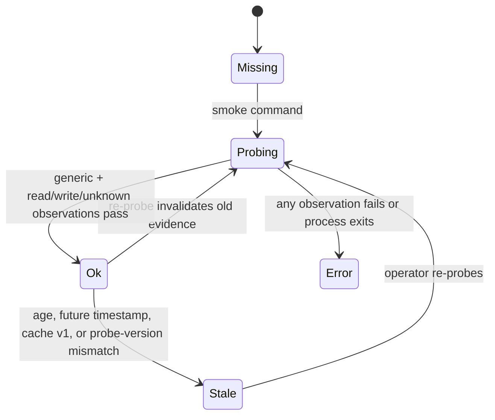

# Agent Runner Parity and Package Skills Hardening

## Status

Implementation is in review-fix hardening on
`feature/agent-runner-parity-package-skills-hardening`. Focused regression
artifacts cover the addressed ownership, cache, lifecycle, and contract paths,
but they have not been executed in the current dependency-broken workspace;
the full and listener/Testcontainers gates are likewise unverified. Task 6.2
and the final acceptance decision are explicitly **NO-GO**.

## Value

Package-backed standalone agents can use every proven ACP adapter in read-only workspaces, receive their providing package's passive skills, and fail closed when evidence, package content, or profile configuration is invalid. Operator and Studio surfaces expose the same contract the runtime enforces.

## Scope

- Adapter-id-based read-only eligibility with versioned, fresh wire evidence.
- Descriptor-owned L2 materialization with adapter-generic L1 and L3 enforcement.
- Pinned-package wholesale skill materialization and Claude package subagents.
- Run-scoped, path-confined, concurrent-safe materialization ownership and cleanup.
- Strict `{ mcps?: string[] }` agent capability profiles through definition, resync, launch, and Studio.
- Package schema lifecycle parity: root schema refs are validated and materialized into every member flow revision.
- Supervisor diagnostics API, system analytics, screens, and verification parity.

## Non-goals

- No ADR-041 flow-run enforcement flip.
- No agent `model`, inline `mcp_servers`, `multiagent`, freeform metadata, YAML container, converter, import/export, continuous daemon, or managed-agent runner contract.
- No package-skill selection UI or cross-package skill additions.
- No change to flow-driven or flow-node-bound skill behavior.
- No DB schema, migration, new route, SSE event, environment variable, sidecar, port, or deployment mount. The existing admin resync response gains additive logical `invalid[].artifactPath`/`missing[]` detail and is specified in Web OpenAPI.

## Requirements

| Id | Requirement |
| --- | --- |
| A1 | Read-only compatibility and evidence are keyed by stable adapter id; web and supervisor mirrors agree. |
| A2 | Evidence-required adapters launch read-only only with generic smoke `ok` plus read-only wire evidence that is `ok`, current-probe compatible, not future-dated, and younger than seven days. Refusal precedes every launch side effect. |
| A3 | L1 allows read and denies write/unknown inline without HITL leakage; L2 is descriptor-owned best effort; L3 detects real repo dirt. |
| A4 | `dangerously_skip_permissions` stays refused for read-only workspaces and non-Claude `mode=subagent` stays refused. |
| A5 | OpenCode native persona materialization ships only if its installed source proves a bounded file-only contract; otherwise the explicit no-tract result is documented. |
| B1 | Standalone sessions materialize every passive skill root from the pinned attached providing package; catalog selection flags cannot omit them. |
| B2 | Claude receives package skills and subagents. Other adapters receive only descriptor-supported skills. |
| B3 | Ownership is run-scoped, atomic, path-confined, concurrent-safe, crash-recoverable, and never deletes user-owned content. |
| B4 | Manual, cron, domain-event, and webhook paths converge on `launchAgentRun`; `none`, `repo_read`, and `worktree` use their actual launch cwd. |
| B5 | Attached-package trust authorizes passive skills; stdio MCP execution still requires exec trust. |
| C1 | `capability_profile` is strict `{ mcps?: string[] }`, using the canonical id schema, stable deduplication, max 32 entries, and no unknown keys. |
| C2 | Invalid definitions report logical package artifact context (not a host path) and are never inserted/updated/disabled by that resync; genuinely missing definitions retain disable behavior, while a non-ENOENT package-directory read failure fails the whole resync before missing-row cleanup. |
| C3 | Studio shows strict profile issues and blocks commit/cut/publish until valid. |
| D1 | Package form/output refs resolve only to root `schemas/<name>.json` (Studio writes canonical `./schemas/<name>.json`; the legacy bare form is normalized); package install copies and validates those root schemas in every member flow revision before it is usable. |
| Q1 | Delivery follows SDD then TDD RED -> GREEN -> behavior-preserving refactor with runnable, minimally overlapping, non-trivial tests. |
| Q2 | Code stays strictly typed, structured-logged, fail-fast, and consistent with SOLID, KISS, DRY, and project dependency rules. |

## Core invariants

- Cache v1 remains readable for generic readiness. Only cache-v1 nested read-only `ok` evidence is diagnostically `stale`; a nested `error` remains `error`. Cache v2 carries `probeVersion`.
- Diagnostic `stale` is derived, never persisted as successful evidence.
- A probe invalidates targeted read-only evidence before work; generic and read-only cache lifecycles are serialized under one crash-released mutex, and only complete read/write/unknown observations may write `ok`.
- Materialization ownership uses `.maister/agent-materialization/` with a cwd index, per-run records, and `preparing | active | releasing` states under a bounded per-cwd SQLite transaction mutex. The OS releases a mutex when its process exits; no stale pathname is compare-and-unlinked. Capability profile roots and flow-bound subagent definitions use the same lease; capability settings carry a typed writer/run marker plus a durable backup/write operation journal. Only an explicit settings lease may reclaim settings, and a restored user file is preserved when the lease is released.
- Ownership paths are normalized relative paths under adapter-approved roots. Absolute, empty, traversal, duplicate, out-of-root, and symlink-escape paths are invalid.
- Form/output schema refs are confined to package-root `schemas/<name>.json`; package installers copy that directory into each member flow revision, reject conflicting member bytes, and validate through the exact runtime loader before `Installed` is recorded.
- `runs.agent_workspace` is the durable workspace decision. No migration is required; if a new durable decision is discovered, implementation stops for contract replanning.
- Known domain refusals use `MaisterError`; API/UI never string-match messages.

## State and refusal contracts

### Evidence

Read-only launch allow-list:

1. Workspace is `worktree`; read-only evidence is not required, or
2. Workspace is `none | repo_read`, permission policy is not dangerous, adapter descriptor is read-only capable, and its evidence policy is `not_required`, or
3. Same read-only workspace/policy/capability conditions and both generic plus nested evidence evaluate `ok` and fresh.

Every other state refuses with `EXECUTOR_UNAVAILABLE` before workspace creation, run/session insert, or token issuance.

### Materialization ownership

```mermaid
stateDiagram-v2
    [*] --> Preparing: durable intent written
    Preparing --> Active: paths copied and index committed
    Preparing --> Recovered: zero-owner intent rolls back; committed/foreign leases finish safely
    Active --> Releasing: terminal cleanup intent
    Releasing --> [*]: last lease deleted and records removed
    Releasing --> Recovered: cleanup retries idempotently
    Recovered --> Active: live owner remains
    Recovered --> [*]: terminal owner cleaned
```

Corrupt ownership state preserves files and fails loudly. It never guesses ownership.
Terminal DB state commits before filesystem release. Preparing recovery rolls
back only its zero-owner, path-prevalidated intent paths; foreign leases always
win, and releasing cleanup may finish an index update that committed before its run
record was removed. A corrupt or symlinked release target is structured-ERROR
logged after commit and cannot roll back the terminal run state. Review keeps
its materialization for rework; a failed ephemeral release retains its checkout
and ownership record for GC retry.

## API contract

- Existing `GET /diagnostics`; no new route.
- Nested `smoke.readOnlySession.status` adds diagnostic-only `stale`.
- Nested `smoke.readOnlySession.probeVersion` is `integer | null`.
- Nested `smoke.readOnlySession.staleReason` is required: it is
  `probe_contract | freshness` exactly when status is `stale`, otherwise
  exactly `null`.
- `checkedAt` remains nullable ISO date-time; `protocolVersion` keeps ACP wire-version meaning.
- Web OpenAPI documents the existing admin resync response's additive
  `invalid[].artifactPath` and `missing[]` fields; all AsyncAPI event schemas
  are unchanged.

## DB and artifact contract

- No Drizzle schema or migration change.
- Existing `runs.agent_workspace` is the terminal enforcement snapshot.
- New durable state is filesystem-only under `.maister/agent-materialization/`, written atomically and excluded/restored by the dirty watchdog.
- Package-root schemas are copied into existing filesystem-backed flow revision caches; no database column or migration is required.

## UI expectations

- Settings separates normal Ready from read-only eligibility and shows missing, stale-age, stale-version, error, ok, and not-required states with `checkedAt` and one smoke remediation.
- Project-agent launch keeps the typed refusal context and never displays a partial run.
- Studio retains the compact structural editor, surfaces exact profile issue paths, and blocks artifact lifecycle actions while invalid. Every current draft flow contributes form/output schema references, so missing, escaping, non-root, malformed, or referenced grammar-invalid documents disable Commit/Publish before the server gate.
- Every new label is localized in EN and RU; no raw enum label is rendered.

## Test strategy

- Pure unit tests: evidence evaluator boundaries, strict profile schema, path validation, ownership state reducers.
- Supervisor contract/wire tests: cache compatibility, diagnostics schema,
  every capable adapter reaching the read-only seam, and one adapter-generic
  read/write/unknown arbitration proof. The one parameterized capable-adapter
  wire matrix is the explicit adapter-contract proof; do not duplicate that
  Cartesian shape at launcher, workspace, or trigger layers.
- Web integration tests: pre-side-effect launch refusal, pinned package inventory, root-schema package install/materialization, workspace/finalize cleanup, trigger convergence, resync non-mutation.
- Component tests: Settings evidence states and Studio strict errors.
- One behavior axis per test; no full adapter x workspace x trigger Cartesian repetition.

## Acceptance criteria

- Every A/B/C/Q requirement has a green test or explicit unchanged-surface verification.
- Supervisor OpenAPI, supervisor/web Zod schemas, analytics, screens, and runtime agree.
- No migration or deployment artifact changes exist.
- Every new test is listed by exactly one Vitest project and full relevant suites are green after refactor.
- Docs, contracts, ADR anchors, typecheck, check-only ESLint, focused suites, and full suites pass.
- Live smoke may be environment-unavailable, but no required adapter becomes eligible without valid cached evidence.

## Traceability

| Requirement | As-built surface | Verification |
| --- | --- | --- |
| A1-A2 | Adapter-id launch gate, cache v2, `probeVersion`, derived freshness | Supervisor cache/unit tests; web resolver/client tests |
| A3-A5 | Layered ACP wire arbitration; descriptor-selected Claude L2; no OpenCode native-persona tract | Every capable adapter reaches the shared seam; adapter-generic read/write/unknown cases avoid a redundant Cartesian matrix |
| B1-B2 | Pinned manifest member-root inventory; descriptor-supported skills/subagents | Adapter-home and effective-definition tests |
| B3 | `.maister/agent-materialization/` index, per-run states, SQLite mutex, leases, confinement and recovery | Dirty-watchdog ownership, cross-process mutex, symlink and crash-window tests |
| B4-B5 | Central `launchAgentRun` materialization/finalization; existing trigger normalization and stdio exec-trust gate | Launch/trigger/effective tests; historical real-PG evidence exists but current-delta rerun is required |
| C1 | Canonical strict capability-profile schema through launch | Definition, artifact-validation and Studio component tests |
| C2 | Invalid-existing resync protected from missing-row cleanup | Registry real-PG integration test is required; historical evidence does not verify the current delta |
| C3 | Strict Studio field validation plus existing artifact lifecycle blocking | Studio editor and artifact-validation unit tests |
| D1 | Root-only schema validation plus package-root schema materialization into member revisions | Artifact-validation and package-attach integration tests |
| Q1-Q2 | SDD artifact, RED evidence, GREEN implementation, refactor, phase commits | Focused ownership/settings/cache/contract evidence is recorded in Task 6.2; full suites and environment-bound integrations remain unverified and cannot satisfy this row yet |

No Drizzle schema/migration, AsyncAPI, deployment, environment, port, sidecar,
or mount changed in this slice. Web OpenAPI changed only for the existing admin
resync response contract.
