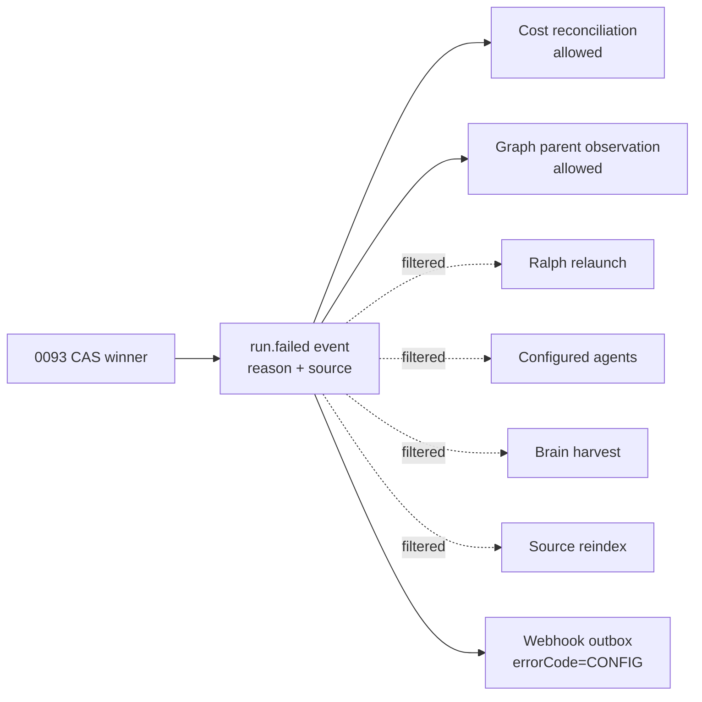
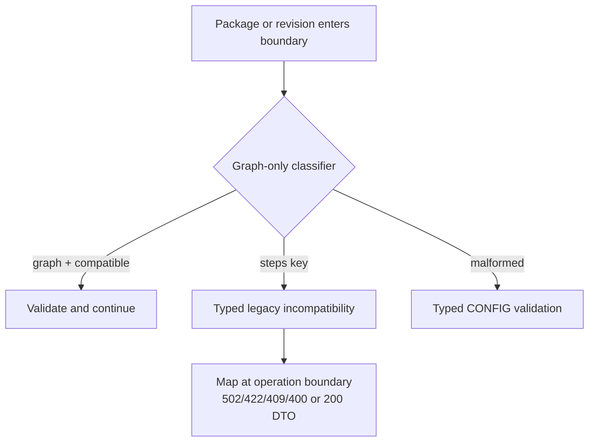
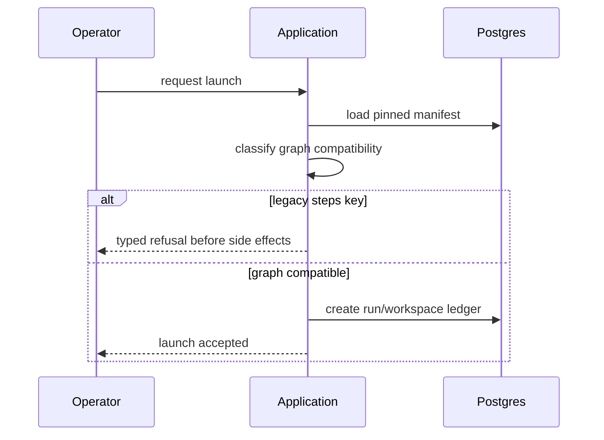
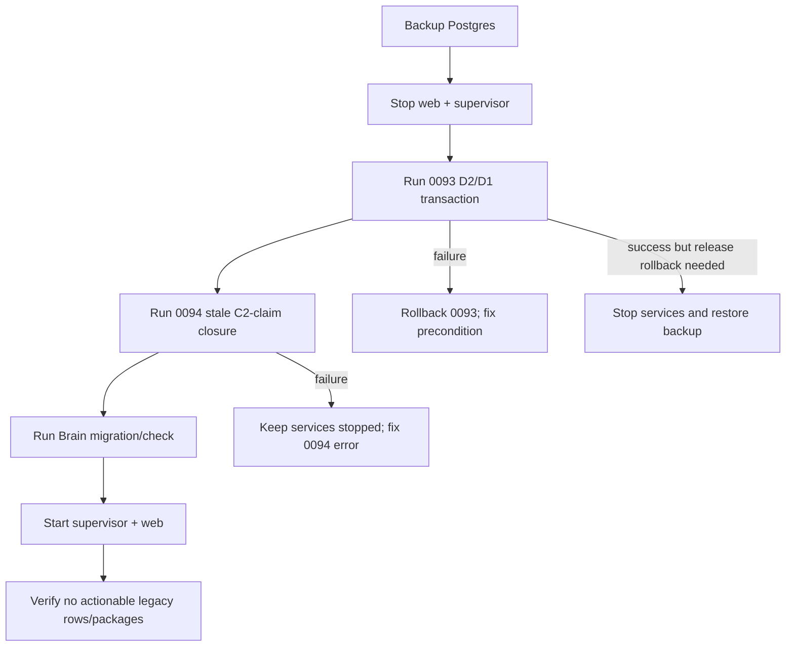

# M43 Postgres-only + graph-only cut-over

Status: Implemented
Owner: platform
Decision: [ADR-129](../../docs/decisions.md#adr-129-postgres-only-and-graph-only-engine-300-cut-over)
Plan: [feature-postgres-graph-only-cutover](../plans/feature-postgres-graph-only-cutover.md)
Engine: `3.0.0`
Migration sequence: `0093_postgres_graph_only_cutover` then
`0094_close-m43-cutover-task-claims`

## Scope and terminology

This specification is the normative implementation contract for the single
breaking release that removes the SQLite dialect and the legacy linear Flow
engine. System analytics describes domain behavior, screen artifacts describe
presentation, and the ADR records rationale; those artifacts do not redefine
the rules below.

`legacy manifest` means a Flow manifest whose top-level JSON/YAML object has a
`steps` key, including `steps: []`. `graph manifest` means a manifest with a
non-empty `nodes` array and no `steps` key. The locked refusal text is:

> legacy steps[] flows are not supported since engine 3.0.0; republish the package with nodes[]

The durable D2 reason is `legacy_steps_engine_3_cutover`; its domain-event
source is `upgrade_cutover`.

A stored graph manifest whose declared engine range excludes `3.0.0` is a
separate typed read/execution incompatibility:
`{ kind: "engine_incompatible", message: <isEngineCompatible reason> }`.
Shape-only intake parsing still accepts that graph so authors can inspect and
repair a future-engine manifest; stored/runtime execution refuses it before
compile or side effects.

## Requirements

| ID | Current evidence | Required invariant | Acceptance criterion |
| --- | --- | --- | --- |
| PG-01 | `web/lib/db/client.ts` accepts `file:` and builds a SQLite client. | `DB_URL` is required and its URL protocol is `postgres:` or `postgresql:` at every web/CLI entry point. | Missing, malformed, `file:`, and MySQL values fail before DB work; both Postgres schemes succeed. |
| PG-02 | `web/instrumentation.ts` logs DB initialization errors and continues. | Main-schema or Brain-schema initialization failure aborts boot after a structured ERROR. | A boot test observes rejection and no startup continuation. |
| PG-03 | Dialect predicates skip locks or use SQLite JSON expressions. | Postgres advisory/row locks and JSONB expressions are unconditional and lock failures propagate. | Real-PG concurrency tests prove serialization and injected query failure aborts. |
| PG-04 | Brain provisioning branches on database dialect. | Brain remains a separate Postgres migration lineage; only schema-applied checks govern availability. | Missing Brain schema is actionable; no dialect branch exists. |
| PG-05 | Dependencies and types include `better-sqlite3` and a PG/SQLite union. | Production, test, and dependency graphs contain one typed PG client. | Dependency/static greps are empty and typecheck is green. |
| GRAPH-01 | `flowYamlV1Schema` accepts `steps` and is `.passthrough()`. | A raw-object precheck rejects every present `steps` key; a non-empty `nodes` array is required. | The manifest truth table below passes with the exact refusal for legacy keys. |
| GRAPH-02 | Filesystem YAML and stored JSONB use several parsers/casts. | One pure graph-shape classifier serves intake; the stored/executable boundary additionally classifies engine-range incompatibility. | No raw stored-manifest cast reaches `compileManifest`; all callers receive a typed result. |
| GRAPH-03 | Engine version is `2.2.0` and the linear runner remains selectable. | Engine is `3.0.0`; no execution path dispatches to a linear runner or linear guard. | Graph regression tests pass and forbidden linear symbols have no production hits. |
| GRAPH-04 | Authoring helpers expose legacy steps/guards. | Grammar, assistant skill, editor/scaffold and validation expose graph nodes and graph gates only. | Drift guards and authoring tests contain no positive legacy fixture. |
| GRAPH-05 | Templates can resolve from `step_runs`. | The public `steps.<nodeId>.*` namespace remains, sourced only from latest `node_attempts`. | A template test resolves node stdout through `steps.*` with no `step_runs` row/table. |
| MIG-01 | `step_runs` stores pre-M11a linear detail. | Migration 0093 intentionally drops the table after D2; run-level history is retained and no export/backfill is created. | Schema/snapshot omit the table; ADR/runbook state irreversible D1 loss. |
| MIG-02 | Actionable legacy runs may survive an engine upgrade. | In one migration transaction, all eight actionable legacy Flow statuses CAS to `Failed`. | Status matrix passes; graph/non-Flow and terminal rows are byte-stable. |
| MIG-03 | Lifecycle state spans attempts, HITL, assignments, sessions, events and outbox. | The materialized candidate set closes every reachable open store, clears resume state, and emits one terminal event/outbox record per CAS winner. | Store-closure and idempotency tests pass atomically. |
| MIG-04 | Stored revision identity may be pinned or legacy-unpinned. | Pinned `flow_revisions.manifest` is authoritative; only unpinned runs fall back to `flows.manifest`; unresolved actionable identity aborts. | Pinned/fallback/null/ambiguous rows match the migration matrix. |
| MIG-05 | Existing consumers react to `run.failed`. | A shared predicate suppresses Ralph, agent triggers, Brain harvesting and source reindex for the D2 reason/source. | Redelivery does not launch/harvest/reindex; cost may reconcile and a graph parent may observe failure. |
| MIG-06 | A C2 fresh-task admission claim can predate D2 while no new run row exists. | Follow-on data migration 0094 clears only a non-null `tasks.queue_claimed_at` at or before that task's recorded D2 event; a later claim remains intact. | Real-Postgres coverage proves stale-claim cleanup and post-cut-over claim preservation. |
| MIG-07 | Clearing a stale C2 claim could make a D2 `Failed` run look like an ordinary auto-retry candidate. | When the latest Flow run has a D2 event and `launch_armed_at` is absent or no later than its `occurred_at`, both C2 consumers atomically hold the task without calling `launchRun`; only a later human re-triage re-arms it. | Poll and slot-free integration tests prove no launch/claim, one hold/comment, and successful post-D2 re-triage. |
| API-01 | Intake endpoints have established status families. | Each operation preserves the exact mapping in the API matrix. | Contract and route tests assert status, code, exact message and zero side effects. |
| API-02 | Launch can discover errors after worktree/run/session mutation. | JSON and staged-stream launch validate graph compatibility before all side effects. | No run/workspace/session/materialization/task mutation is observed on refusal. |
| API-03 | Read models can throw a Zod/compile exception on stored incompatible JSONB. | Read operations return `200` with a typed incompatibility/failure-reason DTO for legacy, malformed, and engine-range-incompatible manifests. | Package, launch-options and run-history pages render without an exception. |
| UX-01 | Legacy installed revisions have no uniform compatibility state. | Viewer shows an incompatible badge, exact remediation, and disables attach/enable/upgrade-to/launch. | DOM tests cover badge, disabled controls and accessible reason. |
| UX-02 | Local editor can enter legacy YAML. | Raw YAML stays editable; canvas, commit, cut and publish are blocked by one validation panel; no converter exists. | Keyboard/focus tests cover the alert and blocked actions. |
| UX-03 | Registration/install errors may discard context or lack focus. | Input is retained and a typed `role=alert` summary receives focus. | EN/RU component tests assert retained values, focus and equivalent meaning. |
| UX-04 | An incompatible enabled revision can be hidden behind a disabled launch affordance. | The picker and board both show the exact typed reason; the board derives it from the authoritative enabled revision, while the picker has `launchable=false`, no runner override and no submit path. | Board pure/DOM, picker component, and route tests prove the reason and bypass absence. |
| UX-05 | A D2 failure can resemble a recoverable runtime failure. | Run detail/list/inspector show a persistent cut-over banner, timestamp and retained evidence/worktree links; Recover/Resume/Respond/Promote/retry are absent. | Component plus seeded E2E coverage agree across the three views. |
| DOC-01 | Current docs promise SQLite/linear behavior. | Current-state code docs, analytics, ERDs, APIs, screens and EN/RU messages describe Postgres/graph-only behavior. | Contract/docs/Mermaid/i18n/ADR-anchor gates pass; the scoped forbidden-current-doc audit has no unmarked current-state hit (historical/negative records are explicitly labeled). |
| DOC-02 | Upgrade behavior is distributed. | Deployment has one ordered audit/backup/stop/migrate/start/verify runbook and backup-only rollback. | Runbook order matches migration preconditions and ADR-129. |
| TEST-01 | Legacy tests overlap layers and some positive fixtures use `steps`. | Every invariant has one primary layer; every new test is discovered; positive fixtures use `nodes`. | Bidirectional traceability has no orphan/duplicate owner and Vitest list includes planned paths. |
| TEST-02 | A broad green suite could miss removed-space regressions. | Static forbidden-symbol/dependency/doc/fixture gates complement behavioral tests. | Final negative-space audit matches only the explicit historical/negative allow-list. |

## Manifest classification

| Input | Shape | Parse result | Compatibility/read result |
| --- | --- | --- | --- |
| `nodes: [valid node]`, no `steps` | graph | accepted | compatible when engine bounds include 3.0.0 |
| `steps: [...]`, no `nodes` | legacy | typed refusal with locked text | incompatible with same actionable reason |
| both keys present | legacy | typed refusal before nodes validation | incompatible; no conversion/precedence |
| `steps: []` | legacy | typed refusal | incompatible; key presence is decisive |
| neither key | malformed | typed `CONFIG` validation error | invalid, distinct from legacy incompatibility |
| `nodes: []` | malformed | typed `CONFIG` validation error | invalid, distinct from legacy incompatibility |
| non-object or malformed node | malformed | typed `CONFIG` validation error | invalid |
| stored legacy JSONB | legacy | never raw-cast/compiled | `200` typed incompatibility on reads; mutation refuses |
| graph with engine range excluding 3.0.0 | graph | shape-only parse accepted | `200` typed incompatibility `{ kind: engine_incompatible, message: <engine reason> }`; executable boundaries refuse before compile |

Extension fields remain accepted by `.passthrough()`. Only the known legacy
`steps` key receives the custom refusal; unrelated `x-*` fields are preserved.

## API operation contract

| Operation | HTTP / code | Response requirement | Side-effect guarantee | UI behavior |
| --- | --- | --- | --- | --- |
| `postProject` | 502 / `FLOW_INSTALL` | Existing error envelope, locked text | Registration compensation removes project/member/flow rows and slug artifacts; shared cache may remain | Focused alert, form retained |
| `installFlowPackage` | 502 / `FLOW_INSTALL` | Existing error envelope, locked text | No Installed/enabled revision or pointer change | Package remains inspectable, action fails visibly |
| `postAdminPackageInstall` | 422 / `CONFIG` | Member-manifest validation error | No usable install/member projection finalized; clone/copy transport errors remain 502 | Focused alert |
| `publishLocalAuthoredCapability` | 422 / `CONFIG` | Locked text | No authored bridge, `flows`, or `flow_revisions` publication | Blocking validation panel |
| `cutStudioLocalPackageVersion` | 409 / `PRECONDITION` | Existing `details.invalidArtifacts` | No export/install/stamp/attach | Blocking validation panel |
| enable/upgrade/rollback | 422 / `CONFIG` | Locked text | Enabled revision/cached manifest pointers unchanged | Controls disabled as early as possible |
| upgrade preview | 200 typed incompatibility | Actionable legacy, malformed, or engine-range reason | Read only | Preview remains renderable |
| launch options | 200 | `flowIssue=incompatible`, reason, `launchable=false`; engine-range reasons use their canonical compatibility text | Read only; no synthetic runner override | No submit/override |
| `postRun` | 400 / `CONFIG` | Existing error envelope, locked text | No run/workspace/session/materialization/task mutation | Launch dialog stays open |
| `extLaunchRun` | 422 / `CONFIG` | External error envelope, locked text | Same launch service and zero side effects | Agent receives typed refusal |
| package/run reads | 200 typed DTO | Compatibility or D2 reason/timestamp | Read only | Viewer/history remain usable |

No route, status, error code, or AsyncAPI webhook field is added. Outbound
`run.failed` data remains `{errorCode: "CONFIG"}`.

## M43 0093/0094 executable contract

### 0093 D2/D1 transaction

### Preconditions and candidate identity

The deploy operator has stopped web and supervisor and has a verified Postgres
backup. The transaction aborts before mutation when an actionable Flow run
cannot resolve the manifest/project identity required for a terminal event.
Candidate identity is `run_kind='flow'` plus authoritative manifest key
presence `? 'steps'`. A pinned revision always wins; fallback to
`flows.manifest` is allowed only for an unpinned row. The candidate relation is
materialized once and reused.

| Run status | D2 transition | Capacity after migration |
| --- | --- | --- |
| Pending | Failed | released |
| Running | Failed | released |
| NeedsInput | Failed | released |
| NeedsInputIdle | Failed | released |
| HumanWorking | Failed | released |
| WaitingOnChildren | Failed | released; parent may observe child failure |
| Review | Failed | released; promotion unavailable |
| Crashed | Failed | released; recovery unavailable |
| Done | unchanged | terminal |
| Failed | unchanged | terminal |
| Abandoned | unchanged | terminal |

### Transaction order and postconditions

1. Validate resolvable actionable identities and materialize candidates.
2. Close open `node_attempts` as Failed/CONFIG.
3. System-cancel unanswered `hitl_requests` with `responded_at`.
4. Cancel open/claimed assignments and append `system_closed` assignment events.
5. Clear run/session ACP handles, cursors and resume markers.
6. CAS the eight actionable statuses to `Failed`, setting terminal timestamps.
7. For CAS winners only, append exactly one `run.failed` domain event with
   `{reason, source}` and one existing-shape webhook outbox record.
8. Drop `step_runs` and its indexes/constraints.

The transaction retains `runs`, workspaces, artifacts, stored revisions and
terminal history. Rerun/redelivery produces no duplicate terminal event or
event-fan-out action. Scheduler admission after restart sees no D2 row as live;
the separate one-time C2 hold is defined below.

### 0094 stale C2-claim closure

Migration 0094 runs immediately after 0093 in the same stopped-service main
migration sequence. It groups durable D2 `run.failed` events by `task_id` and
clears `tasks.queue_claimed_at` only when it is non-null and no later than that
task's latest D2 `occurred_at`. It changes only that stale claim and the task
`updated_at`; it creates no run/event and leaves a claim written after D2
(including a later human re-triage) untouched.

### C2 cut-over hold after 0094

C2 is not a D2 event consumer: after the claim cleanup it reads the latest Flow
run and its exact D2 event. If `launch_armed_at` is absent or at/before that
event's `occurred_at`, the poll and slot-free admission gate share one atomic
hold: they set `triage_status='flagged'`, clear `launch_mode`, and append one
system comment without acquiring a claim or calling `launchRun`. That is a
terminal automation hold, not an automatic retry. A human re-triage after D2
writes a later `launch_armed_at`, so the original event cannot clobber the new
intent and normal C2 admission may resume.

## Event fan-out

Success-gated dependents do not launch from the failed child.

The C2 hold above is deliberately not shown as an event-fan-out consumer: it
does not dispatch the D2 event or create a run; it reads the latest run/event
pair only to prevent a post-upgrade auto-launch.

## Process flows

There is no down-migration and no fabricated `step_runs` history.

## Screen-state contract

| Surface/state | Required presentation | Required controls |
| --- | --- | --- |
| Add project / install refusal | Focused `role=alert`, typed code and exact remediation; entered values retained | Retry after source is republished; no convert action |
| Installed/stored legacy package | `Incompatible with engine 3.0.0` badge and raw/read-only evidence | Attach, enable, upgrade-to and launch disabled |
| Local legacy package | Raw YAML editable; blocking validation panel | Canvas, commit, cut and publish disabled; manual rewrite only |
| Launch dialog | Specific incompatibility reason | No runner override and no submit path |
| Project board task | Incompatible Flow reason beside launch affordance | Launch unavailable without hiding the task |
| D2 run detail/list/inspector | Failed cut-over banner, timestamp, reason, retained timeline/evidence/worktree links | No Recover, Resume, Respond, Promote or retry |
| Valid graph package/run | Existing normal behavior | Existing enabled controls unchanged |

All states have semantically equivalent EN/RU copy, keyboard reachability,
visible focus and programmatic status/alert semantics.

## Inventory and deployment gate

Inventory rows are identifiers and counts only; manifest bodies and secrets are
never logged. Sources: `~/.maister/flows/*/flow.yaml`, stored
`flow_revisions.manifest`, cached `flows.manifest`, installed member manifests,
first-party bundles and `maister-plugins`. Each row records source, id/version,
attachment/project, shape and disposition (`graph-ready`, `republish`, or
`unattached-history`). Merge is blocked by an attached first-party `republish`
row. The read-only SQL queries live in `docs/deployment.md`.

### Inventory snapshot (2026-07-11)

| Source | Result | Disposition |
| --- | --- | --- |
| Host cache | 120 manifests: 60 nodes, 60 steps | All steps rows are old e2e-generated cache ids; unattached test residue retained as read-only incompatibility until ordinary cache GC. |
| External first-party maister-plugins | 24 manifests: 24 nodes, 0 steps | Graph-ready; no republish straggler. |
| Current repository Flow fixtures | 9 manifests: 9 nodes, 0 steps | Graph-ready at inventory time; Task 13 covers inline YAML fixtures. |
| flow_revisions.manifest | 33 nodes, 0 steps | All pinned stored revisions graph-ready. |
| flows.manifest | 10 nodes, 1 steps | Legacy bugfix@v0.0.1 is Installed, not enabled and not package-attached; retain as typed incompatible history. |
| Attached package members | Five aif members at aif-v2.2.0, all nodes | Graph-ready; no attached first-party straggler. |
| D2 actionable legacy runs | 0 | No live run will be terminalized in this snapshot. Migration behavior remains integration-tested. |
| D1 terminal legacy runs / step rows | 0 / 0 | No local historical detail loss in this snapshot; D1 remains an accepted general upgrade effect. |
| Unresolved actionable Flow identities | 0 | Migration abort precondition is clear. |

The merge gate is clear for this snapshot because no attached/enabled
first-party steps[] package remains. A new inventory is required immediately
before deployment.

## Observability and non-functional requirements

| Event | Level | Structured fields | Redaction |
| --- | --- | --- | --- |
| DB initialization | INFO | component, driver=`postgres`, masked host/database | user/password/query removed |
| Fatal DB/boot refusal | ERROR | component, code, stage, sanitized cause | no URL credentials |
| Manifest classification | DEBUG | surface, flowRefId, revision, manifestShape | no manifest body |
| Legacy refusal | WARN | surface, flowRefId, revision, errorCode | no prompt/files/manifest |
| Migration summary | INFO | candidateCount, transitionedCount, closed store counts | identifiers only where needed |
| Per-run D2 transition | WARN | runId, priorStatus, reason, source | no prompt/session token |
| Consumer suppression | DEBUG | consumer, eventId, runId, reason | no payload body |

Configuration and migration failures fail fast. D2 is atomic and idempotent;
0094 idempotently clears only its event-bounded stale C2 claims.
Queries/events are bounded and indexed on existing identity/status paths. No
secret, DB credential or manifest body is logged. Implementation uses pure,
single-purpose classifiers and existing DI seams; no mode flags, fallback
dialect, converter, duplicated parser, new status or new error code are allowed.

## Test ownership and bidirectional traceability

| Requirement(s) | Task | Primary test / project | Focused RED/GREEN command | Acceptance evidence |
| --- | --- | --- | --- | --- |
| PG-01, PG-02 | 4 | `web/lib/db/__tests__/postgres-url.test.ts`, instrumentation unit | `pnpm --filter maister-web exec vitest run --project unit lib/db/__tests__/postgres-url.test.ts lib/__tests__/instrumentation.test.ts` | URL table and rejected boot |
| PG-03, PG-04 | 5 | scheduler/relation/Brain real-PG integration | `pnpm --filter maister-web exec vitest run --project integration lib/__tests__/scheduler.integration.test.ts lib/social/__tests__/social-domain.integration.test.ts` | lock execution/failure + Brain schema refusal |
| PG-05 | 6 | typecheck + static/dependency sentinel | `pnpm --filter maister-web typecheck` | no dependency/union FIXME |
| GRAPH-01, GRAPH-02 | 7 | `manifest-shape.test.ts` pure shape/executable table | `pnpm --filter maister-web exec vitest run --project unit lib/flows/__tests__/manifest-shape.test.ts` | exact legacy truth table plus shape-vs-engine incompatibility boundary |
| GRAPH-03, GRAPH-04 | 7,10 | engine/grammar/graph runner unit | `pnpm --filter maister-web exec vitest run --project unit lib/flows/__tests__/engine-version.test.ts lib/flows/graph/__tests__/runner-core.test.ts` | engine 3 + no linear dispatch |
| GRAPH-05 | 10,12 | `templating.test.ts` | `pnpm --filter maister-web exec vitest run --project unit lib/flows/__tests__/templating.test.ts` | preserved `steps.*` namespace |
| API-01, API-02 | 8 | operation route tests + runs service integration | `pnpm --filter maister-web exec vitest run --project integration app/api/v1/ext/runs/__tests__/route.integration.test.ts` | exact status/code/body and no side effects |
| API-03 | 8,12 | flow-package query integration; run-manifest and graph/status/transcript route units | `pnpm --filter maister-web exec vitest run --project integration lib/queries/__tests__/flow-package-detail.integration.test.ts` and `pnpm --filter maister-web exec vitest run --project unit lib/queries/__tests__/run-manifest.test.ts 'app/api/runs/[runId]/graph/__tests__/route.test.ts' 'app/api/runs/[runId]/graph-status/__tests__/route.test.ts' 'app/api/runs/[runId]/transcript/__tests__/route.test.ts'` | typed 200 DTO and safe incompatible branches |
| UX-01 | 9 | installed-viewer, project-package, and Studio attach control DOM tests | `pnpm --filter maister-web exec vitest run --project unit components/flows/__tests__/package-viewer.test.ts components/board/panels/__tests__/project-packages-section.test.ts components/studio/attach-to-project-button.test.ts` | badge, accessible reason, and disabled attach/enable/upgrade controls |
| UX-02 | 9 | local compatibility classifier plus editor, local-list, and overview Cut-control tests | `pnpm --filter maister-web exec vitest run --project unit lib/local-packages/__tests__/cut-compatibility.test.ts components/studio/__tests__/local-package-editor-blocking.test.ts components/studio/__tests__/local-packages-list.test.ts components/studio/overview-cards.test.ts` | legacy/invalid/engine-range reason; validation panel; canvas/commit/publish suppression; disabled local Cut controls |
| UX-03 | 9 | localized Attach request-error focus DOM test | `pnpm --filter maister-web exec vitest run --project unit components/studio/__tests__/attach-to-project-button-focus.dom.test.ts` | retained attach context, focused typed CONFIG alert, equivalent EN/RU summary |
| UX-04 | 9 | board pure/DOM, launch picker component, and route tests | `pnpm --filter maister-web exec vitest run --project unit lib/queries/__tests__/board-flow-incompatibility.test.ts components/board/__tests__/task-card-launch-reason.test.ts components/board/__tests__/launch-popover.test.ts app/api/runs/launch-options/__tests__/route.test.ts` | authoritative enabled-revision reason beside disabled board affordance; exact picker reason, no override, no submit bypass |
| UX-05 | 12 | D2 history component + authenticated Playwright | `pnpm --dir web exec playwright test m43-cutover-history.spec.ts` | persistent banner and absent actions under the `authed` project |
| MIG-01..MIG-06 | 11 | `migration-0093.integration.test.ts` real PG | `pnpm --filter maister-web exec vitest run --project integration lib/db/__tests__/migration-0093.integration.test.ts` | D2/D1 status/store matrix plus stale-C2-claim and later-claim matrix |
| MIG-07 | 11 | C2 poll and slot-free admission integrations | `pnpm --filter maister-web exec vitest run --project integration lib/scheduler/handlers/__tests__/auto-launch-triaged.integration.test.ts lib/__tests__/admission-gate.integration.test.ts` | no D2 auto-launch/claim, one terminal hold, later human re-triage is eligible |
| MIG-05 | 11 | domain-event consumer unit + emit-site integration | `pnpm --filter maister-web exec vitest run --project unit lib/domain-events/__tests__/cutover.test.ts` | exact suppression predicate; consumer tests exercise fan-out |
| DOC-01, DOC-02 | 1,14 | contract/docs/ADR/Mermaid/i18n validators | `CI=true pnpm validate:docs:all && CI=true pnpm validate:contracts` plus i18n parity and scoped forbidden-current-doc audit | all current-state surfaces agree |
| TEST-01, TEST-02 | 3,13,15,16 | Vitest list + forbidden-symbol audit | `pnpm --filter maister-web exec vitest list --project unit` | no dead/orphan/positive legacy test |

Reverse mapping is the same table read from test/task columns to requirement
columns. A test may support secondary requirements, but only the listed row owns
the primary decision boundary; route tests do not repeat pure manifest
permutations, E2E does not repeat SQL matrices, and static gates do not claim
behavior.

## As-built verification record

The implementation was re-read against this specification after the code
changes. Evidence is anchored to the source of truth rather than inferred from
the diff:

| Contract | As-built evidence | Verification |
| --- | --- | --- |
| PG-01..PG-05 | `web/lib/db/postgres-url.ts`, `client.ts`, `instrumentation.ts`, Postgres-only schema/imports and dependency manifests | URL/boot/client units, typecheck, lint, Drizzle journal check |
| GRAPH-01..GRAPH-05 | `manifest-shape.ts`, `manifest-parser.ts`, `config.schema.ts`, engine `3.0.0`, graph-only `runner.ts`, `context.ts` | 128 focused units; positive first-party graph fixtures; forbidden-symbol audit |
| API-01..API-03 | shared parser at all intake/read boundaries; per-operation legacy status/code/message/side-effect contracts plus typed engine incompatibility | contract validator; route/read-model focused units; operation matrix audit |
| MIG-01..MIG-07 | migration `0093`: precondition, one materialized candidate relation, lifecycle-store closure, eight-status CAS, winner-scoped event, then `DROP TABLE step_runs`; migration `0094`: event-bounded stale C2-claim cleanup; C2: D2-aware terminal hold with explicit re-triage re-arm | migration/C2 integrations are discovered and SQL/snapshot/journal pass static integrity; execution requires a container-capable real-Postgres environment |
| MIG-05 | `isGraphOnlyCutoverFailure` shared by Ralph, agents, Brain harvest and source reindex | five-case predicate unit plus deletion-sensitive consumer integration tests |
| UX-01..UX-05 | typed package/launch incompatibility, blocked Studio controls, `CutoverFailureBanner`, list/board/detail/inspector read models, EN/RU catalogs | focused UI/route tests green; Playwright test discovered under the authenticated project |
| DOC-01..DOC-02 | ADR-129, spec, OpenAPI/AsyncAPI, analytics, ERDs, screen refs, configuration/getting-started/architecture and roadmap | 340 Mermaid blocks, 648 ADR links, all API contracts and EN/RU parity green |

Six final audits were executed: scope/fullness, bidirectional traceability,
internal consistency, migration crash-window/logical holes, forbidden
survivors, and UX/API/DB parity. The audits found and corrected two documentation
holes: stale linear examples and an incorrect claim that existing open-ended
graph packages must raise `engine_min` to 3.0.0. No material source finding
remains.

Environment-qualified release evidence is recorded without converting a
sandbox limitation into a product exception: the complete web unit run has
595 files / 6057 tests green, with two pre-existing listener tests blocked by
`listen EPERM`; supervisor listener suites and Playwright are blocked by the
same socket policy; all eight focused Postgres suites were discovered but
Testcontainers could not find a container runtime. Focused M43 units,
typecheck, contracts, all-doc Mermaid/ADR validation, i18n parity, test
discovery and Drizzle journal integrity are green. The listener, Testcontainers
and browser gates must be rerun in the normal container/socket-enabled CI
runner before merge.

## Phase-0 adversarial review record

| Audit | Finding | Resolution | Open severity |
| --- | --- | --- | --- |
| Fullness | Stored JSONB and filesystem YAML could diverge if only the Zod property were deleted. | GRAPH-01/02 require a raw key-presence classifier before passthrough parsing and make it the shared boundary. | none |
| Bidirectional traceability | Route tests could duplicate the pure six-shape table while missing side effects. | Test ownership assigns shape permutations to config.schema unit, routes to status/body/side-effects, PG to migration integration, and E2E to two journeys. | none |
| Internal consistency | D1 removes the table while the steps.* template namespace must remain. | GRAPH-05 explicitly separates the public namespace from the removed DSL/table and sources it only from node_attempts. | none |
| Migration crash window | Re-evaluating candidates between store updates could close different row sets; an unresolved actionable row could be silently skipped. | MIG-03/04 require one transaction, a materialized candidate relation, pre-mutation abort, CAS winners and event insertion before DROP. | none |
| API status/code | The same manifest fault intentionally maps to 502, 422, 409 or 400 at different boundaries. | API-01 plus per-operation OpenAPI extensions freeze existing status families; no global error remap is allowed. | none |
| Analytics state machine | Generic run.failed consumers could treat an upgrade transition as new work. | MIG-05 requires a shared reason-and-source predicate; Ralph, agents, Brain and reindex are negative assertions. | none |
| Screens versus UI | A Failed D2 run could still expose recovery through a secondary surface. | UX-05 requires list, board, detail and inspector parity and absence of every action, not merely a banner. | none |
| Security/observability | Manifest bodies or credential-bearing DB URLs could leak through verbose logs. | The observability table allows identifiers/counts only and requires masked connection metadata. | none |
| Rollback | A normal application rollback after DROP would imply missing table/runtime compatibility. | Upgrade is non-rolling; rollback is stop-and-restore-from-backup only. | none |

Test discovery was run for both Vitest projects before implementation. Existing
unit and integration suites are discoverable; planned files are under existing
unit patterns (lib/components) or integration patterns (lib/app integration
suffix). The Phase-0 unit baseline is 595 files / 6097 tests green when local
listener permissions are available. The integration baseline completed against
real Testcontainers Postgres. No RED test is committed at this gate.

## Resolved questions and excluded work

- D1 data loss and D2 failure are owner-approved and require no prompt during
  upgrade.
- Stored legacy revisions/runs remain for inspection; only `step_runs` detail is
  removed.
- The `steps.*` template namespace is not the removed `steps[]` DSL and remains.
- No converter, SQLite export, compatibility flag, down-migration, new importer,
  route, status, error code, webhook field, sidecar or environment variable is
  included.
- AsyncAPI is audited unchanged because the existing webhook envelope already
  carries `errorCode`; reason/source are internal event/read-model data.
- Compose/Docker already provision Postgres; they require audit, not noisy edits.

There are no implementation-blocking TBDs or unowned follow-ups.
