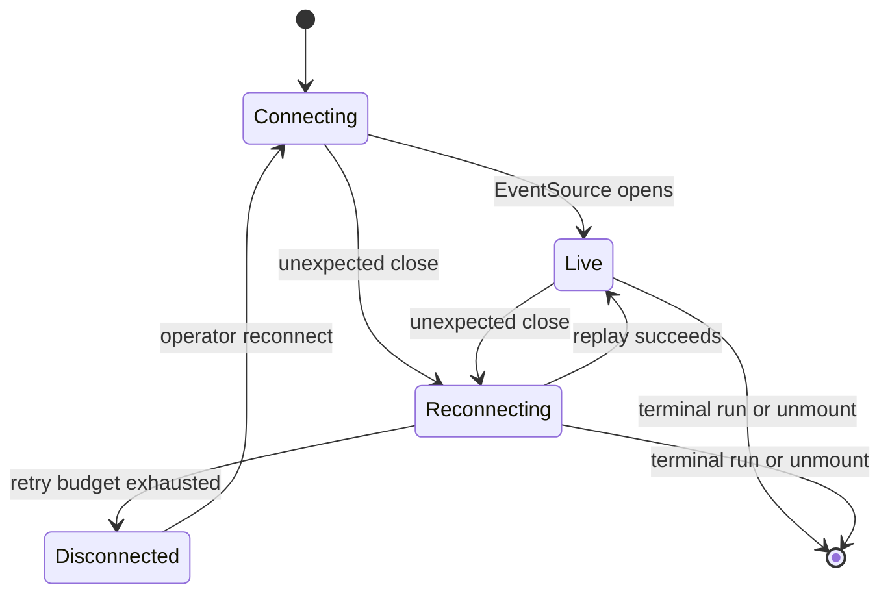
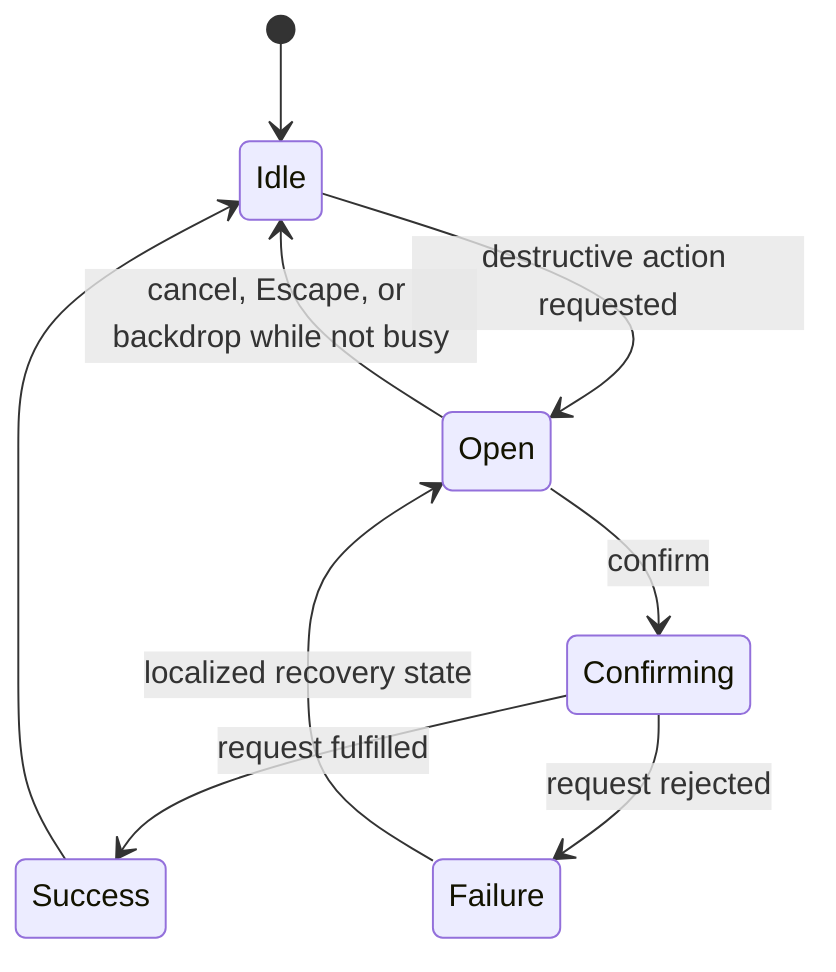
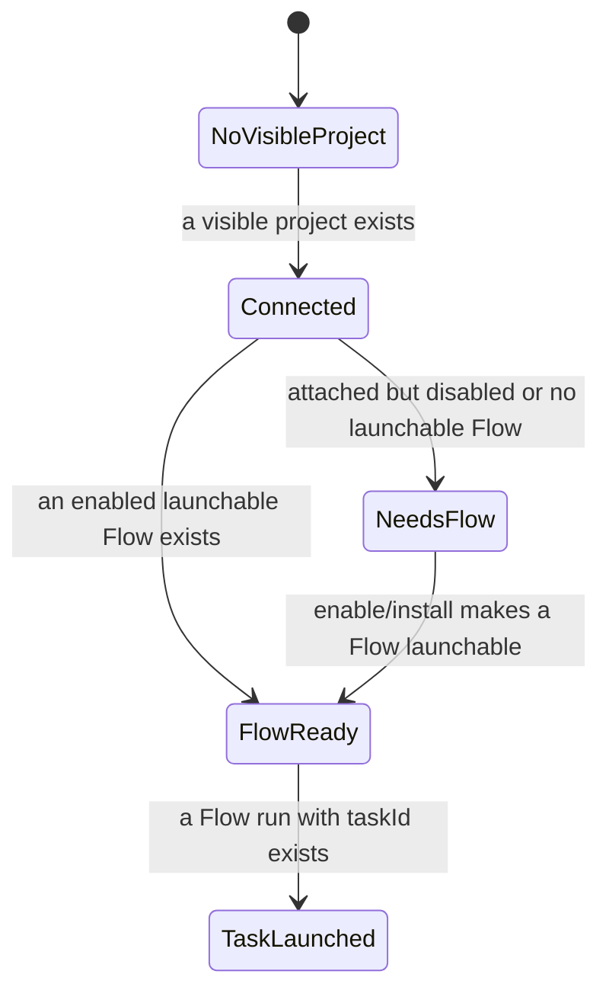

# UI completion batch specification

Status: Implemented — the source and validation evidence below satisfy every
UIF requirement without changing browser SSE, HTTP, database, RBAC,
deployment, or error-taxonomy contracts.

## Scope and precedence

This specification is the implementation source of truth for the
`feature/ui-completion-batch` branch. The product contracts in `docs/`, then
`CLAUDE.md` and `web/CLAUDE.md`, override this file where they differ. It
changes presentation and server read models only: it does not change browser
SSE, HTTP, database, RBAC, deployment, or error-taxonomy contracts.

In scope: feedback, localized error presentation, route loading/error UI,
SSE liveness presentation, first-run guidance, launch disclosure density,
mobile navigation, package-trust confirmation, PR-tab removal, and
review/promotion entry-point reuse.

Out of scope: telemetry, polling, WebSockets, new routes, schema changes,
member project creation, Kanban/DnD, board IA redesign, cost surfaces, and
the project MCP surface (`McpPanel`, `mcp-bind-dialogs`, `McpSelect`).

## Requirements and evidence

| ID | Requirement | Source anchors | RED and final evidence | Docs / observable acceptance |
| --- | --- | --- | --- | --- |
| UIF-01 | One app-wide typed feedback seam renders successful mutations with a green check and failures with localized, non-sensitive copy. | `app/providers.tsx`, `components/feedback/feedback-provider.tsx` | feedback-state unit test; mutation-family tests; one Playwright mutation | `screens/components.md`; a completed request produces exactly one feedback event. |
| UIF-02 | Destructive confirmation is portaled, focus-safe, and cannot dismiss or submit twice while busy. | `components/feedback/confirm-dialog*.tsx`, focus-trap re-export | dialog-frame static test; focus/portal Playwright test | `screens/components.md`; cancel sends no request, confirm sends one unchanged request. |
| UIF-03 | User-visible action errors never render raw server messages, status codes, or unknown `MaisterError` codes. | `lib/ui-error-message.ts`, `lib/api-error.ts`, action owners | known/unknown/malformed resolver tests; action-owner tests | `error-taxonomy.md`; all action messages are localized. |
| UIF-04 | Error boundaries recognize only structural known codes and expose a code only as a localized diagnostic field. | `app/error.tsx`, segment errors, `lib/errors-core.ts` | structural guard and static fallback tests; route boundary browser test | `screens/components.md`; malformed errors reveal no server detail. |
| UIF-05 | Primary async route segments render token skeletons with `aria-busy`. | required `loading.tsx` files and skeleton component | static loading tests; route navigation browser test | route screen docs; no blank primary pane. |
| UIF-06 | Stream liveness is presentation-only, retry-bounded, replay-safe, visible, accessible, and has exactly one deliberate owner per surface. | `lib/run-stream-controller.ts`, `lib/use-run-stream.ts`, run/scratch/studio consumers | controller lifecycle/replay/cleanup tests; interruption Playwright test | `system-analytics/runs.md`, `scratch-runs.md`; never changes `runs.status`. |
| UIF-07 | First-run progress derives only from projects visible to the actor, enabled launchable Flow state, and task-linked Flow runs. | `lib/queries/portfolio.ts`, portfolio components | query integration tests for visibility, disabled attachment, task vs scratch run; browser progression test | `system-analytics/tasks.md`; no membership information leak. |
| UIF-08 | Flowless tasks retain simple-intent creation while receiving explicit packages-tab remediation. | project DTO, `new-task-modal.tsx` | zero-flow display/interaction tests | `system-analytics/tasks.md`; no silent empty flow picker. |
| UIF-09 | Launch initially shows Flow, runner, and execution preset only; disclosures preserve values and version disclosure follows the two state flags. | `launch-popover.tsx` | `deriveInitialDisclosureState` unit test; launch-body browser test | `screens/chrome/launch-dialog.md`; unchanged request body. |
| UIF-10 | One role-projected rail definition drives desktop and one on-demand mobile drawer; Observatory follows existing route authorization. | `left-rail*.tsx`, `top-nav.tsx`, mobile drawer | role-data test; 375px focus/Escape/route-change Playwright test | `screens/chrome/{left-rail,top-nav}.md`; no duplicate interactive rail. |
| UIF-11 | Trust confirmation presents an advisory distinct-project attachment count for exactly the selected `packageInstallId`; server authorization and trust request stay unchanged. | package read model, project packages panel | exact-count query test; confirmation request browser test | `system-analytics/packages.md`; cancellation has no effect. |
| UIF-12 | The obsolete PR tab and deferred panel are absent from type, validation, URL, DOM, and imports; old deep links use existing fallback. | board tabs, board page, deferred panel | tab/route regression plus browser deep-link test | `screens/projects/project-board.md`; no board API change. |
| UIF-13 | Run-header Review/Promote uses the exact inspector eligibility and request operation. | run header, shell, review panel, inspector actions | payload/refusal parity tests; header Playwright paths | `system-analytics/runs.md`; no stale target, truncated diff, missing reviewed commit, or invalid mode can promote. |
| UIF-14 | Every new or changed copy has EN/RU parity; package ICU interpolation stays regression-covered. | `messages/{en,ru}.json`, package detail/composition | parity command; EN/RU interpolation test | screen docs; no code-only changes for healthy `t.raw` composition. |
| UIF-15 | The MCP board surface is untouched and native confirmation/raw-code sentinels are eliminated. | changed-file review and source inventories | `rg` sentinels and diff review | this spec; zero `window.confirm` under `web/`. |

## State boundaries

The liveness state is client presentation only. It never persists a run state,
does not drive scheduler admission, and sends the existing `lastEventId` only
through the existing stream URL.

While confirming, cancellation, backdrop, Escape, and repeat confirmation are
disabled. Exactly the existing request runs after explicit confirmation.

The onboarding projection is read-only and actor-scoped. Scratch and agent
runs never complete `TaskLaunched`; simple-intent task creation remains
available in `NeedsFlow`.

## Accessibility and interaction contract

| Surface | Required behavior |
| --- | --- |
| Toast | Success uses green check; errors use localized text; duplicate completion is suppressed; urgency is announced without raw diagnostic detail. |
| Confirmation | Dialog is portaled to `document.body`, has a label, traps/restores focus, and locks dismissal while busy. |
| Error fallback | Error explanation is localized; recognized code appears only in the labeled diagnostic field; reset and Portfolio recovery are keyboard reachable. |
| Skeleton | `aria-busy="true"`; geometry matches route chrome without data fetches. |
| Liveness pill | Status uses text plus color, announces status changes with `aria-live`, and exposes a localized reconnect action. |
| Mobile rail | Trigger has an accessible name; drawer locks background scroll, traps focus, closes on Escape/route change, and restores focus to the trigger. |

## As-built verification

The RED → GREEN regression coverage named in the requirement matrix is present
in its owning unit, integration, or Playwright suite. The final validation
matrix completed with these commands:

| Area | Command | Result |
| --- | --- | --- |
| Type safety | `pnpm --dir web typecheck`; `pnpm --dir supervisor typecheck` | Passed. |
| Web behavior | `pnpm --dir web test:unit`; `pnpm --dir web test:integration` | Passed, including promotion parity, stream ownership, and the exact selected-install package-count integration case. |
| Supervisor behavior | `pnpm --dir supervisor test:unit`; `pnpm --dir supervisor test:integration` | Passed (378 unit and 96 integration assertions). |
| Documentation and contracts | `CI=true pnpm validate:docs:all`; `CI=true pnpm validate:contracts` | Passed (356 Mermaid diagrams, 677 ADR anchors, and API contract adapters). |
| Browser journeys | `pnpm --dir web test:e2e e2e/portfolio-board.spec.ts e2e/m18-branch-promotion.spec.ts`; `pnpm --dir web test:e2e` | Passed against the Task-2 baseline; the targeted journeys cover the mobile drawer, old PR-tab fallback, and guarded header promotion. |

## Completion guards

- Source sentinels: zero `window.confirm` under `web/`; no user-facing raw
  `?? "CRASH"`/error-code rendering outside the locked MCP surface; no
  `console.*` added to Client Components; the listed MCP surface has no diff;
  all required `loading.tsx` files exist.
- Testing: every new Vitest file is listed by exactly one project; all
  new/affected unit, integration, and target E2E tests are green. Existing
  unrelated full-E2E failures are compared to the Task-2 baseline and are not
  misreported as green.
- Documentation: the four domain analytics documents and screens documents
  remain source-specific and are marked Implemented only where the
  corresponding source and test rows above are complete.
