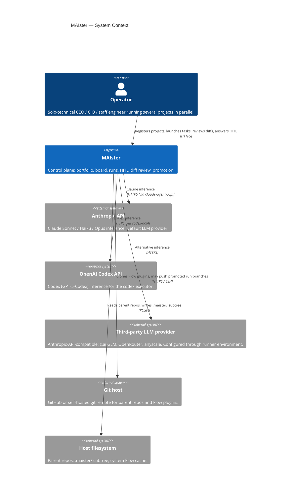
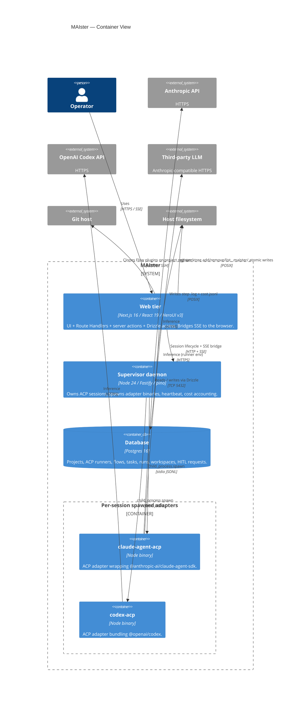
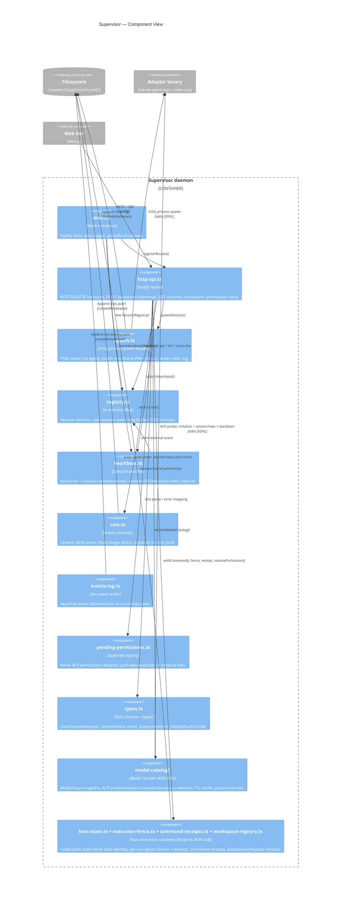
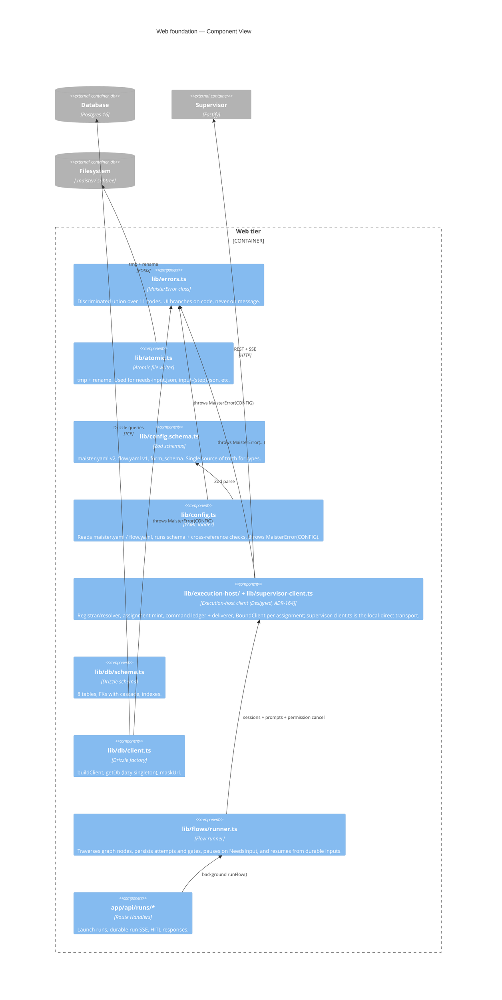
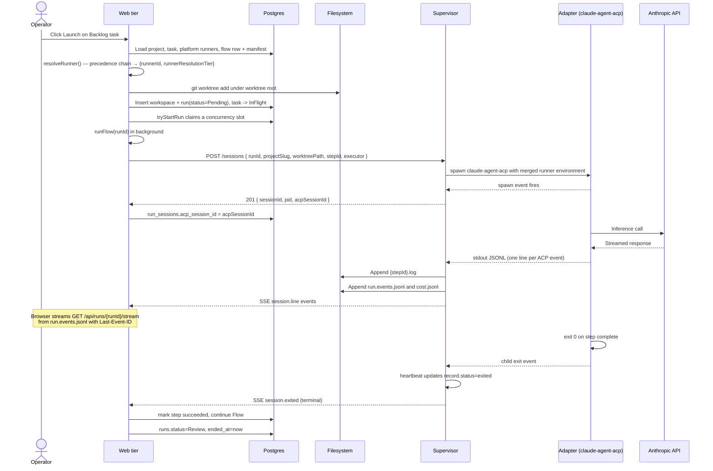
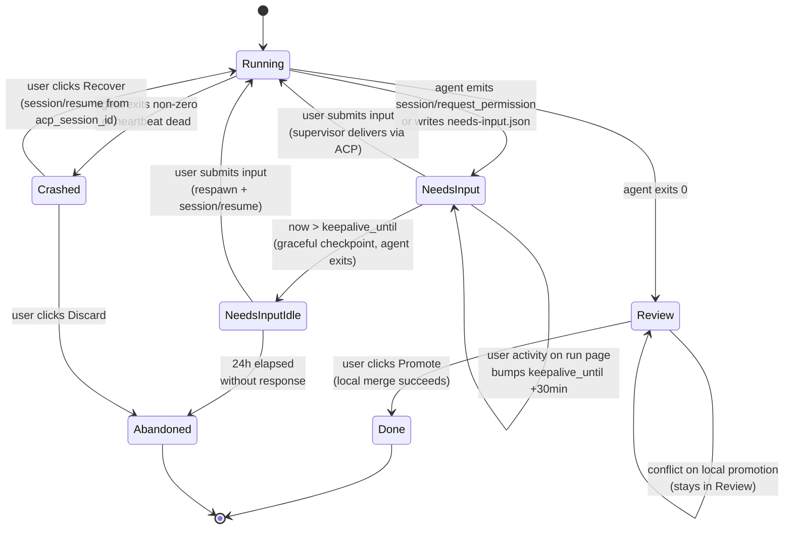
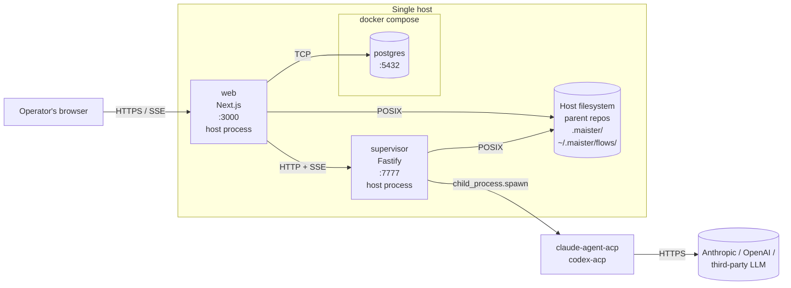

# Architecture

> Read [`VISION.md`](VISION.md) for the product spine and
> [`decisions.md`](decisions.md) for the why behind every locked
> choice. This file is the **how**: C4 diagrams, components, and
> their contracts.

Implementation status legend: **Implemented** present in the current branch ·
**Designed** accepted contract, not yet coded · **Phase 2** later scope.

Current state: web foundation, DB schema, Flow installer/runner, executor
resolution, scheduler, `POST /api/runs`, durable run SSE, HITL response
delivery, project registration, diff/promotion routes, keep-alive
checkpoint/resume, and scratch-run recovery are implemented. GC remains
designed.

## C4 Context — system and its world

The control plane MAIster runs on a single host, talks to a relational
database, spawns coding-agent CLIs as subprocesses, and routes their
LLM calls to one of several providers.

**Personas.**

- **Operator** — primary persona. One human running several projects.
  Credentials auth + global/project RBAC are implemented (`web/lib/authz.ts`);
  still effectively single-operator (no team invites yet).
- _(Phase 2)_ Small-team member — receives HITL items via the same UI.

**External systems.**

- **Anthropic API** — default LLM. Reached by `claude-agent-acp` over
  HTTPS using `ANTHROPIC_API_KEY` (or `ANTHROPIC_AUTH_TOKEN` when
  routed).
- **OpenAI Codex API** — backing for the codex executor, reached by
  `codex-acp`.
- **Third-party LLM provider** — any Anthropic-API-compatible endpoint
  (z.ai GLM, OpenRouter, anyscale) configured per-executor via
  runner provider configuration and `executor.env`.
- **Git host** — GitHub or self-hosted. Read-only for Flow plugin
  install. Push semantics for promoted run branches are operator-controlled.
- **Host filesystem** — parent repos at `projects.repo_path`,
  per-run worktrees at `.maister/<slug>/runs/<run-id>/`, system Flow
  cache at `~/.maister/flows/<id>@<tag>/`.

## C4 Container — deployable units

MAIster ships as two long-running Node processes plus a Postgres
instance on ONE host. The web tier and the supervisor share HTTP+SSE AND
the host filesystem (`MAISTER_RUNTIME_ROOT`, worktrees root, flows cache —
ADR-023): the run stream tails `run.events.jsonl` locally and
worktree/diff/promotion are web-side git operations, so a different host for
the supervisor is not supported in the current target. The web tier
addresses the supervisor as a registered **execution host** with a durable
identity, per-run epoch-fenced **execution assignments**, an enveloped
**command ledger**, and opaque adopted-workspace handles (Designed —
[ADR-164](decisions.md#adr-164-local-execution-host-contract--durable-host-identity-epoch-fenced-assignments-command-ledger-opaque-adopted-workspaces);
[`system-analytics/execution-hosts.md`](system-analytics/execution-hosts.md)).

**Containers.**

| Container           | Status      | Tech                                               | Purpose                                                                                                                                                                                                                                                                                                                                                                                               |
| ------------------- | ----------- | -------------------------------------------------- | ----------------------------------------------------------------------------------------------------------------------------------------------------------------------------------------------------------------------------------------------------------------------------------------------------------------------------------------------------------------------------------------------------- |
| Web tier            | Implemented | Next.js 16 + React 19 + HeroUI v3 + Tailwind 4     | Route Handlers for run launch, HITL response, and durable run SSE; Drizzle access; Flow runner.                                                                                                                                                                                                                                                                                                       |
| Supervisor daemon   | Implemented | Node 24 + Fastify + pino + Zod                     | Owns ACP sessions, spawns adapters, heartbeat watcher, cost accounting, permission deferreds, run event log. (Designed — ADR-164) Also the local execution host: durable identity + fences + receipts + adopted-workspace handles in a private `node:sqlite` state store under `<runtimeRoot>/.maister/execution-host/`. |
| Database            | Implemented | Postgres 16                                        | Persistent state for projects, ACP runners, flows, tasks, runs, workspaces, node attempts, and HITL. (Designed — ADR-164) SSOT for `execution_hosts`, `execution_assignments`, `execution_commands`. |
| `claude-agent-acp`  | Implemented | `@agentclientprotocol/claude-agent-acp@0.37.0`     | ACP adapter wrapping Claude Agent SDK. One process per session.                                                                                                                                                                                                                                                                                                                                       |
| `codex-acp`         | Implemented | `@agentclientprotocol/codex-acp@0.0.44`            | ACP adapter bundling Codex. One process per session.                                                                                                                                                                                                                                                                                                                                                  |
| MCP facade (`mcp/`) | Implemented | `@maister/mcp` — `@modelcontextprotocol/sdk`, Node | Standalone workspace package exposing external MCP tools as a thin REST client of `/api/v1/ext`, incl. `hitl_inbox`, `hitl_list`, and `hitl_respond` (ADR-055). Streamable-HTTP (default, remote): forwards per-request inbound bearer to the REST layer; no ambient token. stdio (local): reads `MAISTER_PROJECT_TOKEN`, then `MAISTER_ACCESS_TOKEN` as fallback. Zero DB/web coupling. See ADR-047. |

**Inter-container contracts.**

- **Web ↔ Supervisor** — HTTP + SSE.
  Contract: [`api/supervisor.openapi.yaml`](api/supervisor.openapi.yaml) (REST routes)
  - [`api/async/supervisor-sse.asyncapi.yaml`](api/async/supervisor-sse.asyncapi.yaml) (SSE event stream).
    Client: `web/lib/execution-host/` (Designed — ADR-164: `BoundClient` per
    assignment + `HostAdminClient`; `web/lib/supervisor-client.ts` is its
    local-direct transport, importable only inside that module — lint-fenced).
- **Web ↔ Database** — Drizzle ORM over `postgres` driver.
  Contract: [`database-schema.md`](database-schema.md) + [`db/erd.md`](db/erd.md).
- **Supervisor ↔ Adapter** — stdio JSONL (Adapter binary speaks ACP
  on stdin/stdout). One child per session, spawned with
  `cwd = worktreePath` and merged env. The supervisor emits raw
  `session.line`, parsed `session.update`, `session.permission_request`,
  and terminal events.

## C4 Component — Supervisor (Implemented)

The supervisor owns process lifecycle and the ACP boundary:

**Component table — Supervisor.**

| Name                  | File                                    | Purpose                                              | Responsibilities                                                                                                                                                                                                                                  | Dependencies                                                              |
| --------------------- | --------------------------------------- | ---------------------------------------------------- | ------------------------------------------------------------------------------------------------------------------------------------------------------------------------------------------------------------------------------------------------- | ------------------------------------------------------------------------- |
| `main`                | `supervisor/src/main.ts`                | Process entrypoint.                                  | Read env, build Fastify + pino, wire components, listen, graceful shutdown.                                                                                                                                                                       | `http-api`, `registry`, `heartbeat`.                                      |
| `http-api`            | `supervisor/src/http-api.ts`            | HTTP surface.                                        | Session lifecycle routes, prompt route, permission input route, checkpoint route, SSE pipe with `Last-Event-ID` replay, error mapping.                                                                                                            | `spawn`, `registry`, `heartbeat`, `cost`, `pending-permissions`, `types`. |
| `spawn`               | `supervisor/src/spawn.ts`               | Process launcher.                                    | Pick binary by `executor.agent`, merge env, line-buffer stdout, write `<stepId>.log`, emit `session.line` events. (Resume is NOT a spawn arg — it is the ACP `session/resume` call in `acp-client.ts`; the adapters ignore `--resume` on argv.)   | `registry` (channel constant), `types`.                                   |
| `registry`            | `supervisor/src/registry.ts`            | In-memory session table.                             | Register, get, list, subscribe, snapshotEvents (1000-entry ring), markIntentionalShutdown.                                                                                                                                                        | `types`.                                                                  |
| `heartbeat`           | `supervisor/src/heartbeat.ts`           | Lifecycle watcher.                                   | exit/error → `session.exited`/`session.crashed`, orphan-PID polling via `process.kill(pid, 0)`.                                                                                                                                                   | `registry`, `types`.                                                      |
| `cost`                | `supervisor/src/cost.ts`                | Cost accounting.                                     | Lenient JSON parse on every line, traverse for `usage` (depth ≤ 8), append record to `cost.jsonl`.                                                                                                                                                | `registry` (channel constant).                                            |
| `events-log`          | `supervisor/src/events-log.ts`          | Durable run events.                                  | Append every `SessionEvent` to `.maister/<slug>/runs/<runId>/run.events.jsonl`.                                                                                                                                                                   | `node:fs`.                                                                |
| `pending-permissions` | `supervisor/src/pending-permissions.ts` | Permission deferreds.                                | Resolve or cancel ACP `requestPermission` handles by `(sessionId, requestId)`.                                                                                                                                                                    | `types`.                                                                  |
| `types`               | `supervisor/src/types.ts`               | Schemas + error.                                     | Zod request/event schemas, `SessionEvent` union, `SupervisorError` class, `httpStatusForCode()`.                                                                                                                                                  | `zod`.                                                                    |
| `model-catalog`       | `supervisor/src/model-catalog/*`        | Model discovery resolver (ADR-076). **Implemented.** | `ModelSource` registry keyed by `(adapter, provider.kind)`; ACP-probe/provider/curated sources; in-memory TTL cache; passive harvest. Serves `POST /model-catalog/resolve`; resolves `env:NAME` secrets supervisor-side only, never returns them. | `spawn` (`buildChildEnv`), `runner-provisioner`, `acp-client`, `types`.   |
| `host-state` | `supervisor/src/host-state.ts` | Execution-host state store. **Designed — ADR-164.** | Open `state.sqlite` (WAL) under `MAISTER_EXECUTION_HOST_STATE_DIR`; mint or verify the pinned `hostKey` (conflict → fatal); per-process `bootId`; tables `host_identity`, `run_fences`, `workspaces`, `command_receipts`; receipt prune (7 d). | `node:sqlite`. |
| `execution-fence` | `supervisor/src/execution-fence.ts` | Fence enforcement. **Designed — ADR-164.** | `hostKey` / epoch / `assignmentId` / `runId` rules in order; persist the high-water BEFORE execution; evict lower-epoch live sessions (`session.exited {reason: fenced}`). | `host-state`, `registry`, `pending-permissions`, `types`. |
| `command-receipts` | `supervisor/src/command-receipts.ts` | Idempotency receipts. **Designed — ADR-164.** | Replay `completed` / `rejected` receipts verbatim (`X-Maister-Command-Replayed`), join in-flight duplicates, `turn_lost` for accepted-without-in-flight; serves `GET /commands/:id`. | `host-state`, `types`. |
| `workspace-registry` | `supervisor/src/workspace-registry.ts` + `workspace-roots.ts` | Opaque workspace handles. **Designed — ADR-164.** | `POST /workspaces/adopt` validation per kind against `MAISTER_WORKSPACE_ROOTS`; `(runId, realpath)` idempotency; `resolveForSession(handle)` — the ONE path-derivation function feeding spawn, confinement, cost, and the events log. | `host-state`, `node:fs`, `types`. |

The `model-catalog` resolver (Implemented, ADR-076) is the supervisor's
model-discovery surface: `POST /model-catalog/resolve` fans a runner draft across
pluggable `ModelSource`s and caches the merged result in memory. The web tier
reaches it via `web/lib/supervisor-client.ts` `resolveModelSuggestions()`, proxied
through the admin-gated `POST /api/admin/acp-runners/model-suggestions`. See
[`system-analytics/model-catalog.md`](system-analytics/model-catalog.md).

## C4 Component — Web foundation (Implemented)

The web tier owns persistence, Flow execution, and the browser-facing routes.

**Component table — Web foundation.**

| Name                                                | File                                       | Purpose                                                                                                                                                                             | Dependencies                                              |
| --------------------------------------------------- | ------------------------------------------ | ----------------------------------------------------------------------------------------------------------------------------------------------------------------------------------- | --------------------------------------------------------- |
| `lib/errors`                                        | `web/lib/errors.ts`                        | `MaisterError` + `isMaisterError` type guard.                                                                                                                                       | (none)                                                    |
| `lib/atomic`                                        | `web/lib/atomic.ts`                        | `atomicWriteJson(path, data)` — tmp + rename.                                                                                                                                       | `node:fs/promises`, `node:crypto`, `pino`.                |
| `lib/config.schema`                                 | `web/lib/config.schema.ts`                 | Zod schemas for `maister.yaml` v2, `flow.yaml` v1, `form_schema`.                                                                                                                   | `zod`.                                                    |
| `lib/config`                                        | `web/lib/config.ts`                        | `loadProjectConfig`, `loadFlowManifest`, `validateFormSchemaVersion`.                                                                                                               | `lib/config.schema`, `lib/errors`, `yaml`, `pino`.        |
| `lib/supervisor-client`                             | `web/lib/supervisor-client.ts`             | `createSession`, `sendPrompt`, `deliverPermission`, `cancelPermission`, `deleteSession`, `listSessions`, `checkpointSession`, `streamSession`, `resolveModelSuggestions` (ADR-076). (Designed — ADR-164) Becomes the local-direct transport behind `lib/execution-host/`; gains enveloped variants + `adoptWorkspace` / `getWorkspace` / `releaseWorkspace` / `getCommandReceipt`. | `lib/errors`, `pino`.                                     |
| `lib/execution-host` | `web/lib/execution-host/*` | (Designed — ADR-164) `registrar` (health → `execution_hosts` policy), `resolver` (30 s memo), `assignments` (`mintAssignment` in the claim tx, release), `commands` + `redact` (ledger rows), `ledger` + `deliverer` (per-kind policy table, CAS FSM, retry budgets), `adoption` (lazy `workspace.adopt` from server state), `recovery` (W1/W2/W4 + retention), `legacy` (evidence backfill + `ensureAssignment`), `client` (`forAssignment` → `BoundClient`, `local` → `HostAdminClient`). | `lib/db`, `lib/errors`, `lib/supervisor-client` (transport only), `pino`. |
| `lib/db/schema`                                     | `web/lib/db/schema.ts`                     | Drizzle table definitions for the 8 tables.                                                                                                                                         | `drizzle-orm/pg-core`.                                    |
| `lib/db/client`                                     | `web/lib/db/client.ts`                     | Drizzle client factory + lazy singleton.                                                                                                                                            | `drizzle-orm`, `lib/errors`.                              |
| `lib/flows/runner`                                  | `web/lib/flows/runner.ts`                  | Flow graph execution and resume gate.                                                                                                                                               | `flows/*`, `db/schema`, `scheduler`, `execution-host` (Designed — ADR-164; was `supervisor-client`). |
| `app/api/runs`                                      | `web/app/api/runs/route.ts`                | Launch a run from a Backlog task.                                                                                                                                                   | `db`, `worktree`, `scheduler`, `flows/runner`.            |
| `app/api/runs/[runId]/stream`                       | `web/app/api/runs/[runId]/stream/route.ts` | Browser-facing durable run SSE.                                                                                                                                                     | `db`, `run.events.jsonl`.                                 |
| `app/api/runs/[runId]/hitl/[hitlRequestId]/respond` | Route Handler                              | HITL response two-phase claim, permission delivery or atomic artifact write, runner wake-up.                                                                                        | `db`, `atomic`, `execution-host` (Designed — ADR-164; was `supervisor-client`), `flows/runner`.      |

## Component map — remaining pieces

These components are implemented unless the status column says otherwise:

| Component                                                    | File                                                  | Purpose                                                                                                                                                                                                                                       | Status      |
| ------------------------------------------------------------ | ----------------------------------------------------- | --------------------------------------------------------------------------------------------------------------------------------------------------------------------------------------------------------------------------------------------- | ----------- |
| `app/api/projects/route.ts`                                  | Route Handler                                         | Register projects from a local path or repo source, slug derivation, slug + repo_path uniqueness, Flow plugin install on register, owner membership.                                                                                          | Implemented |
| `lib/flows`                                                  | `web/lib/flows.ts`                                    | Flow plugin loader: `git clone --branch <tag>`, symlink into project subtree, manifest validation.                                                                                                                                            | Implemented |
| `lib/acp-runners`                                            | `web/lib/acp-runners/*`                               | Platform runner catalog + `resolveRunner()` precedence chain — owned by [`system-analytics/executors.md`](system-analytics/executors.md).                                                                                                     | Implemented |
| `lib/worktree`                                               | `web/lib/worktree.ts`                                 | `git worktree add/remove/list` wrapper, project-scoped paths.                                                                                                                                                                                 | Implemented |
| `lib/scheduler`                                              | `web/lib/scheduler.ts`                                | Global concurrency cap, Pending queue, auto-promote on slot free.                                                                                                                                                                             | Implemented |
| `app/api/projects/[slug]/tasks/route.ts`                     | Route Handler                                         | Create tasks → `Backlog`.                                                                                                                                                                                                                     | Implemented |
| `app/api/runs/route.ts`                                      | Route Handler                                         | Precondition + ACP runner resolution (delegates to `lib/acp-runners/resolve`, snapshots runner identity) + worktree add + supervisor `POST /sessions`.                                                                                        | Implemented |
| `app/api/runs/[runId]/stream/route.ts`                       | Route Handler                                         | SSE bridge tailing `run.events.jsonl`.                                                                                                                                                                                                        | Implemented |
| `app/api/runs/[runId]/hitl/[hitlRequestId]/respond/route.ts` | Route Handler                                         | Two-phase HITL response, permission delivery, atomic input artifact, runner wake-up.                                                                                                                                                          | Implemented |
| `app/api/runs/[id]/activity/route.ts`                        | Route Handler                                         | Bump `keepalive_until` by 30 min while user on the page.                                                                                                                                                                                      | Implemented |
| `app/api/runs/[id]/diff/route.ts`                            | Route Handler                                         | Raw `git diff` rendered in `<pre>`.                                                                                                                                                                                                           | Implemented |
| `app/api/runs/[id]/promote/route.ts`                         | Route Handler                                         | Promote the run branch by delivery-policy mode (`merge`/`rebase_merge`/`ai_rebase_merge`/`pull_request`) — owned by [`system-analytics/workspaces.md`](system-analytics/workspaces.md) + [`branch-sync.md`](system-analytics/branch-sync.md). | Implemented |
| `app/api/scratch-runs/[runId]/recover/route.ts`              | Route Handler                                         | Recover a crashed scratch session through the stored ACP session id.                                                                                                                                                                          | Implemented |
| Projector                                                    | `web/lib/projector/artifact-projector.ts`             | Web-side. Derives event-stream evidence — the tool-call activity log + preview — from the per-run `run.events.jsonl`. Pull-based at runner sync points + startup catch-up. **Never drives run state.**                                        | Implemented |
| ArtifactStore                                                | `web/lib/flows/graph/artifact-store.ts`               | Web-side. CRUD + lifecycle (record / supersede / stale / fail) over the `artifact_instances` evidence index.                                                                                                                                  | Implemented |
| MCP facade                                                   | `mcp/src/`                                            | Standalone `@maister/mcp`: external MCP tools as thin REST clients of `/api/v1/ext` — owned by [`system-analytics/external-operations.md`](system-analytics/external-operations.md).                                                          | Implemented |
| Cross-project HITL inbox                                     | `web/lib/queries/portfolio.ts` + `app/(app)/page.tsx` | Portfolio block listing pending HITL across visible projects (ADR-057) — behavior owned by [`system-analytics/hitl.md`](system-analytics/hitl.md).                                                                                            | Implemented |
| Project Brain                                                | `web/lib/brain/*`                                     | Owned + indexed memory tiers with recall/retain MCP tools (ADR-122/127/128; own migration lineage) — owned by [`system-analytics/project-brain.md`](system-analytics/project-brain.md).                                                       | Implemented |

## Dependency rules

Enforced by review today; a CI gate is Phase 2. The current rules:

1. **`web/lib/` is server-only.** Every module in `web/lib/` imports
   `"server-only"` at the top. No Client Component may import from
   `lib/`.
2. **`supervisor/src/` may not import from `web/`.** They are separate
   workspaces; the only contract is the HTTP+SSE wire.
3. **`MaisterError` is thrown at the boundary, not above.** Validate
   user input, external APIs, subprocess exits, file reads. Trust
   internal invariants (no defensive `MaisterError` on impossible
   states).
4. **No `chokidar` / `fs.watch` / polling for state transitions.**
   Live path: supervisor ACP notifications → SSE. Recovery path:
   supervisor heartbeat + reconcile on startup.
5. **Postgres is the only database backend.** `drizzle-orm/pg-core` defines the
   schema and `DB_URL` must use `postgres://` or `postgresql://`.
6. **No re-exports of `pino` / `zod` / `yaml`.** Components import from
   the dep directly.

## Data flow — Launch to Review (Implemented)

`POST /api/runs` creates the workspace and DB rows. `runFlow()` owns step
execution and moves the run to `Review` on success.

## Data flow — HITL keep-alive + resume (Implemented)

Permission HITL, form/human rows, atomic response artifacts, and runner-owned
resume from `NeedsInput` are implemented. Keep-alive checkpoint to
`NeedsInputIdle` is implemented through the web sweeper and supervisor
checkpoint endpoint.

## Deployment

Current deployment runs `web` and `supervisor` on ONE host and uses Docker
Compose only for Postgres. `compose.yml` defines the local Postgres service;
`compose.production.yml` is the hardened production overlay. The shared
host filesystem is REQUIRED (ADR-023; documented as a Stage-A limitation by
ADR-164): both processes resolve `.maister/` from the same
`MAISTER_RUNTIME_ROOT`, the supervisor keeps its execution-host state under
`<runtimeRoot>/.maister/execution-host/`, and its `MAISTER_WORKSPACE_ROOTS`
must mirror the web tier's worktrees / local-packages roots.

The supervisor is addressed as a registered execution host
(`execution_hosts`, `kind='local_direct'`); `MAISTER_SUPERVISOR_URL` is
transport configuration read at call time by the local-direct transport,
never stored. The HTTP+SSE wire is described in
[`api/supervisor.openapi.yaml`](api/supervisor.openapi.yaml); a supervisor on
a different host is NOT supported in the current target (the two processes
share the filesystem — see ADR-023 and ADR-164 §D12 for the deferred
stages).

## Typed Plan-review artifact boundary (Implemented — ADR-137)

The graph runner, not ACP or the browser, captures and validates the confined
plan document and `plan-review.json` outputs. It persists immutable artifact
instances before one atomic parent/child HITL creation transaction. A final
decision uses the normal graph input artifact and `runFlow()` recovery path;
it does not add a supervisor protocol or a run status. Cross-tier events expose
only IDs, counts, and state, never plan or answer bodies.

## Where to read next

- API contracts: [`api/supervisor.openapi.yaml`](api/supervisor.openapi.yaml),
  [`api/async/supervisor-sse.asyncapi.yaml`](api/async/supervisor-sse.asyncapi.yaml).
- Database: [`db/erd.md`](db/erd.md), [`database-schema.md`](database-schema.md).
- Why each piece is shaped this way: [`decisions.md`](decisions.md).
- Per-domain process flows, state machines, edge cases:
  [`system-analytics/`](system-analytics/).
- Local dev: [`getting-started.md`](getting-started.md).
- Supervisor prose reference: [`supervisor.md`](supervisor.md).
