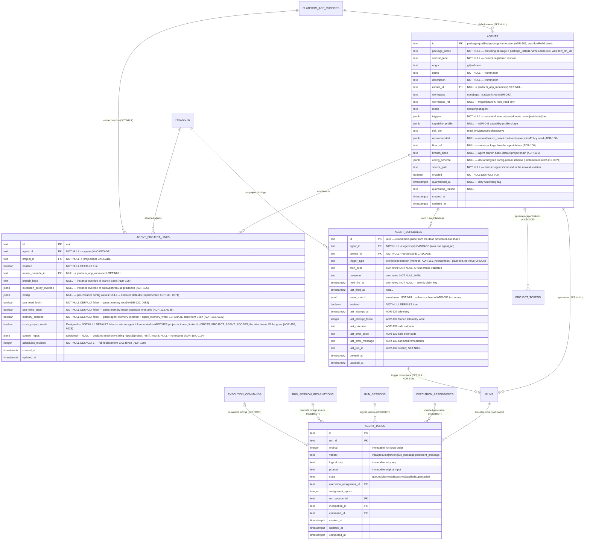

# Platform agents ERD

Tables for the platform-agent substrate (ADR-089/ADR-090): the agent
catalog index, project attachments, trigger bindings, plus the agent-shaped
columns added to `runs`, `tasks`, and `project_tokens`. See
[`../system-analytics/agents.md`](../system-analytics/agents.md) for process
flows and [`../database-schema.md`](../database-schema.md) for the
column-level narrative.

> **Status: Implemented.** Migration `0049_platform_agents.sql` adds `agents` +
> `agent_project_links`, reworks the dead scheduler-clock-era `agent_schedules`
> shape (ADR-060) in
> place, and alters `runs` / `tasks` / `project_tokens`;
> `0051_agents_package_source.sql` reshapes `agents` to package provenance
> (drops `scope`/`project_id`, adds `flow_ref_id`/`version_label`/`origin`/
> `recommended`/`workspace_ref` — ADR-089 rework).
>
> **(Implemented — ADR-106, migration `0068`)** the catalog is re-keyed per-package:
> `agents.flow_ref_id` → `package_name` (NOT NULL, = `package_installs.name`),
> reindex `agents_flow_ref_idx` → `agents_package_name_idx`, add `agents.flow_ref`
> + `agents.branch_base`, extend `recommended` with `executionPolicy`, and add
> `agent_project_links.branch_base` + `agent_project_links.execution_policy_override`.
> The ERD/tables below show the post-0068 shape; the pre-0068 columns they
> replace are noted inline.
>
> **(Implemented — ADR-139, migration `0104`)** stable agent schedule IDs are
> reconciled under `agent_project_links.schedules_revision`; bindings retain
> fenced latest-attempt telemetry and `runs.agent_schedule_id` records the
> binding that launched an agent run.
>
> **(Implemented — ADR-156, migration `0123`; ADR-157, migration `0124`)** the
> attachment gains two per-project axes — `cross_project_reach` (boolean NOT NULL
> DEFAULT false) and `context_repos` (jsonb NULL). Both are additive with
> pre-migration-honest seeds (no reach / no mounts), so neither needs a backfill.
> The matching Run-side launch snapshots `runs.agent_chain_depth` and
> `runs.context_mounts` are drawn in [`runs-domain.md`](runs-domain.md).



Dropped from the prior scheduler-era shape (zero readers/writers existed): `agent_ref`
(text), `scheduler_job_id` (per-schedule job bridge — replaced by the seeded
singleton `agent_tick.dispatcher`), `desired_state` (`continuous` is the
future Mγ stage).

The `agent_turns` storage and production message admission are implemented.
Messages retain FIFO order across capacity claims and persistent parks. Initial
turns retain their input before owned creation; rework input commits with its
new assignment and invalidation of the prior public result. Resume wiring remains
Designed. Its accepted input,
binding and state constraints are defined in the
[schema reference](../database-schema.md#agent_turns-implemented).

## Sibling-table alters (same migration)

| Table | Change |
| ----- | ------ |
| `runs` | `run_kind` gains `'agent'`; new `agent_id` (FK `agents` SET NULL), `trigger_source` (`manual\|cron\|domain_event\|webhook\|flow\|scheduled`, NULL), `trigger_event_id` (bigint, NULL), `trigger_payload` (jsonb, NULL), `agent_workspace` (`none\|repo_read\|worktree`, NULL; migration `0052`) — snapshot of the run's effective workspace axis at spawn; terminal L3 enforcement gates off this, not the mutable catalog index. ADR-139 adds nullable `agent_schedule_id` (FK SET NULL) as binding provenance. |
| `tasks` | `flow_id` → NULLABLE; new `triage_status` (`'triaged'` \| NULL), `runner_id` (FK SET NULL), `target_branch` (text NULL), `promotion_mode` (`local_merge\|pull_request`, NULL). |
| `project_tokens` | `token_kind` gains `'agent'`; new `agent_id` (FK `agents` CASCADE, NULL; CHECK `token_kind='agent'` ⇔ `agent_id IS NOT NULL`). |

### Human-ask provenance (Implemented — ADR-136)

`task_clarifications.origin_agent_id` is an immutable source snapshot rather
than a cascading FK. It identifies the requesting platform agent even if the
agent, source run, or original HITL row is later removed. Re-trigger dispatch
uses the stored agent identity and the target-only domain-event payload; it does
not trust a request body for an agent identifier.

## Keys and constraints

| Table | Constraint | Columns | Purpose |
| ----- | ---------- | ------- | ------- |
| `agent_project_links` | `UNIQUE` | `(agent_id, project_id)` | One attachment per pair. |
| `agent_schedules` | `CHECK` | cron rows: `cron_expr/timezone/next_fire_at NOT NULL`; event rows: `event_match NOT NULL` | Row shape per `trigger_type`. Both CHECKs are `<>`-guarded, so **(ADR-151 — Implemented)** `trigger_type='mention'` rows (all-null cron/event columns) pass unchanged and need NO migration; `trigger_type` itself carries no value CHECK. At most one ENABLED mention row per `(agent_id, project_id)` is enforced in `updateAgentLink`, not by a constraint. |
| `runs` | partial `UNIQUE` | `(agent_id, trigger_event_id) WHERE trigger_event_id IS NOT NULL` | Outbox→spawn no-dup claim (at-least-once redelivery converges to one run). |
| `project_tokens` | `CHECK` | `(token_kind='agent') = (agent_id IS NOT NULL)` | Agent tokens always carry the agent identity. |

## Indexes

| Table | Index | Columns | Purpose |
| ----- | ----- | ------- | ------- |
| `agents` | `agents_package_name_idx` (ADR-106; was `agents_flow_ref_idx`) | `(package_name)` | Providing-package lookups (registration/resync, available-list filter). |
| `agent_project_links` | `agent_project_links_project_idx` | `(project_id)` | Attached-agents-per-project reads. |
| `agent_schedules` | `agent_schedules_project_agent_idx` | `(project_id, agent_id)` | Binding lookups. |
| `agent_schedules` | `agent_schedules_due_cron_idx` | `(trigger_type, enabled, next_fire_at)` | Due-cron scan on the `agent_tick.dispatcher` tick. |

## Cascade chain

```
agents
  ├── agent_project_links  (FK agent_id,  ON DELETE CASCADE)
  ├── agent_schedules      (FK agent_id,  ON DELETE CASCADE)
  ├── project_tokens       (FK agent_id,  ON DELETE CASCADE — ephemeral agent tokens)
  └── runs.agent_id        (ON DELETE SET NULL — run history survives catalog deletes)

projects
  ├── agent_project_links  (FK project_id, ON DELETE CASCADE)
  └── agent_schedules      (FK project_id, ON DELETE CASCADE)
```

There is no admin delete endpoint for package-sourced agents; definitions
leave through their providing package, and `resync` disables missing catalog
rows instead of deleting them. The `ON DELETE` actions remain FK backstops for
future/admin maintenance paths and preserve terminal run history.

**Migration 0068 data policy (Implemented — ADR-106).** The per-flow → per-package
re-key is destructive to the catalog only: migration 0068 runs `DELETE FROM
agents` (which CASCADE-deletes `agent_project_links` + `agent_schedules`, and
SET-NULLs `runs.agent_id` so run history survives) before/while reshaping the
columns, then a post-migration resync (startup reconcile + admin
`POST /api/admin/agents/resync`) re-projects the catalog from installed packages
under the new `package_name` key.

## Linked artifacts

- Process flows: [`../system-analytics/agents.md`](../system-analytics/agents.md).
- Global ERD: [`erd.md`](erd.md); run columns also in [`runs-domain.md`](runs-domain.md).
- Narrative: [`../database-schema.md`](../database-schema.md).
- Decision records: ADR-089, ADR-090, ADR-106 (per-package re-key) in
  [`../decisions.md`](../decisions.md).
- Source (Implemented): `web/lib/db/schema.ts` (migration `0049_platform_agents.sql`);
  per-package reshape `web/lib/db/migrations/0068_m39_package_agents.sql` (Implemented — ADR-106).
