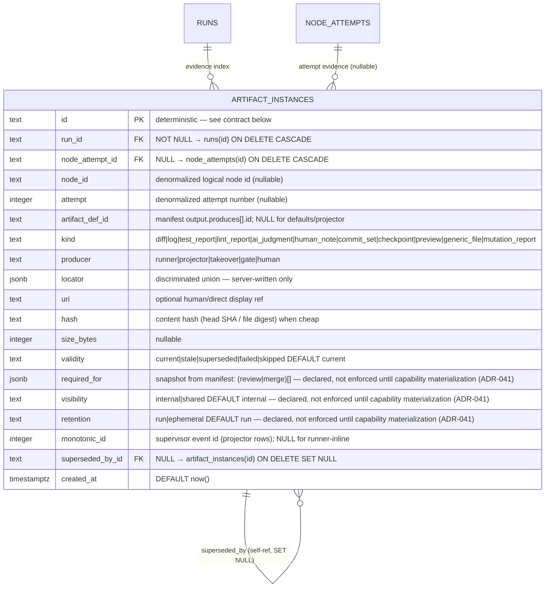

# Artifacts domain ERD

Tables for the typed evidence index introduced by the typed artifact model
(ADR-037), including the Stage B opaque execution-object locator. See
[`../system-analytics/artifacts.md`](../system-analytics/artifacts.md)
for behavior and the validity FSM, and
[`../database-schema.md`](../database-schema.md) for the column-level narrative.

> **Status: Implemented.** The original additive artifact migrations created
> the index and a file-projector cursor. Stage B migration `0135` removed that
> cursor after historical import proof; canonical projector positions now live
> in `execution_event_consumers`.



## Deterministic-id contract

Every `artifact_instances` row has a deterministic `id` so that re-execution
and projector replay **upsert** idempotently (`onConflictDoUpdate`).

| Origin | PK format | Example |
| ------ | --------- | ------- |
| Runner-inline declared output | `run:<nodeAttemptId>:<artifactDefId>` | `run:na_abc123:impl-diff` |
| Runner-inline default (kind-scoped) | `run:<nodeAttemptId>:default:<kind>` | `run:na_abc123:default:log` |
| Canonical-event projector | `proj:<runId>:event:<eventId>` | `proj:run_xyz789:event:59d8…` |
| Imported legacy projector history | `proj:<runId>:<monotonicId>` | `proj:run_xyz789:42` |
| Gate mutation report, undeclared output | `run:<nodeAttemptId>:mutation:<gateId>` | `run:na_abc123:mutation:impl-mutation` |

New projector identities use the canonical `execution_events.id` UUID and the
durable `execution_event_consumers` cursor. `monotonic_id` remains nullable
legacy provenance for imported pre-Stage-B artifacts; it is not a live cursor.

## Locator immutability (git refs)

For runner-recorded and takeover-recorded git artifacts (`git-range` diffs,
`git-log` commit sets), `locator.headRef` holds an **immutable 40-char commit
SHA** — resolved with `git rev-parse` (`resolveRefSha`) at record time — never
a mutable branch name (PR2/F3). The payload route renders against the stored
`headRef`, so advancing the branch after recording never changes an old
artifact's payload. A branch-name fallback is used only when git is unavailable
(synthetic-flow test environments with no real repo).

## Projector cursor ownership

`artifact_projection_cursors` was a file-path-bearing compatibility table and
is absent from the current schema. The artifact projector registers its
consumer name in `execution_event_consumers` and advances the canonical
Postgres `run_sequence` transactionally with its derived rows. Imported legacy
events use the same canonical event consumer after the one-shot importer.

## Cascade chain

```
runs
  └── artifact_instances      (FK run_id,          ON DELETE CASCADE)
        └── artifact_instances.superseded_by_id    (self-ref, ON DELETE SET NULL)

node_attempts
  └── artifact_instances      (FK node_attempt_id, ON DELETE CASCADE)
```

Deleting a run drops all its `artifact_instances` in one statement. Deleting a
`node_attempts` row cascades to its node-attempt-scoped
`artifact_instances` rows (those that referenced it via `node_attempt_id`). The
self-referential `superseded_by_id` is `ON DELETE SET NULL`: deleting a
superseding row leaves the superseded row as-is, with a null `superseded_by_id`
— a history pointer that never blocks deletion.

## Indexes

| Table | Index | Columns | Purpose |
| ----- | ----- | ------- | ------- |
| `artifact_instances` | `artifact_instances_run_idx` | `(run_id)` | Evidence index for a run. |
| `artifact_instances` | `artifact_instances_node_attempt_idx` | `(node_attempt_id)` | All artifacts for a node attempt. |
| `artifact_instances` | `artifact_instances_run_kind_idx` | `(run_id, kind)` | Filter by kind. |
| `artifact_instances` | `artifact_instances_run_validity_idx` | `(run_id, validity)` | Filter by validity (e.g. all stale artifacts for a run). |
| `artifact_projection_cursors` | implicit UNIQUE | `(run_id, scope)` | One cursor row per (run, scope). |

## Linked artifacts

- Process flows: [`../system-analytics/artifacts.md`](../system-analytics/artifacts.md).
- Global ERD: [`erd.md`](erd.md).
- Narrative: [`../database-schema.md`](../database-schema.md).
- Source (Implemented): `web/lib/db/schema.ts` (new tables, migration `0015`).

## Plan-review provenance (Implemented — ADR-137)

The `plan-review` artifact is an immutable validated snapshot, not an agent
claimed locator. `decision_request.source_artifact_id` references this exact
instance; the parent review schema repeats only server-derived ID/hash/attempt
metadata needed for validation and presentation. A superseded artifact cannot
open a decision child or authorize approval.

## Runtime-object stabilization (Designed)

Runtime-object intent separates declared expected size/hash from established
sealed size/hash. Pending nullable fields cannot be compared as though sealed.
The [catalog field contract](../database-schema.md#ab-stabilization-persistence-contract-designed)
and [object lifecycle](../system-analytics/execution-runtime-objects.md) govern
import origins, association locks, no-resurrection and delivery holds.
Artifact validity and required-evidence roles survive every locator replacement;
structured result transport remains a distinct contract. These changes are
forward additions after 0136; the current consolidated ERD still describes the
implemented schema.
