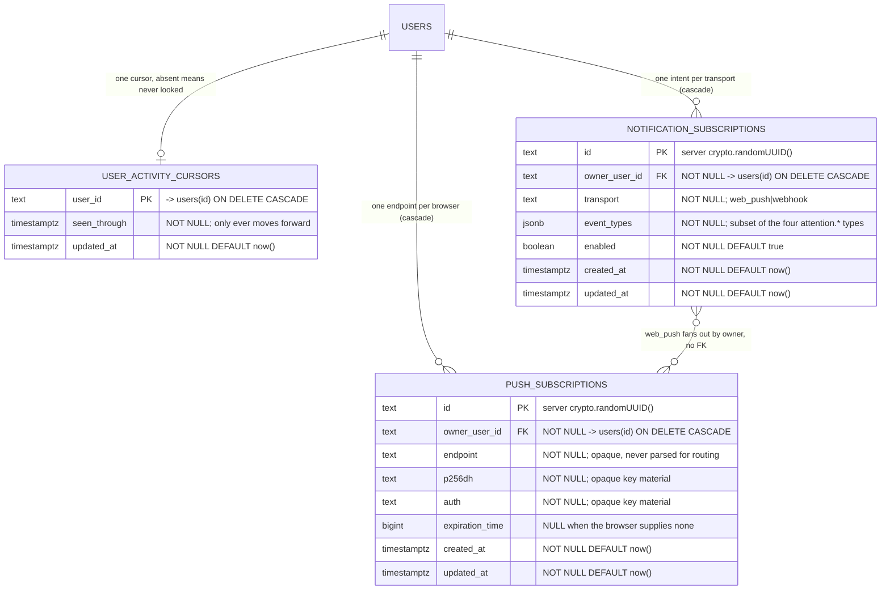

# Attention domain ERD

Tables for the user-scoped attention plane: the per-user activity read cursor
([ADR-168](../decisions.md#adr-168)) and the notification subscription /
web-push tables ([ADR-172](../decisions.md#adr-172)).
See [`../system-analytics/attention.md`](../system-analytics/attention.md) and
[`../system-analytics/notifications.md`](../system-analytics/notifications.md)
for behavior, and [`../database-schema.md`](../database-schema.md) for the exact
DDL, constraint names and index names.

> **Status: Implemented.** Migration `0163` (`user_activity_cursors`) shipped in
> M51 Phase 4; `0164` added `push_subscriptions` and
> `notification_subscriptions`, and `0165` widened the ADR-077 tables (drawn in
> [`webhooks.md`](webhooks.md), not here — it also gives `webhook_deliveries` a
> `push_subscription_id` so one ledger carries both transports).

## Keys and unique constraints

| Constraint | Table | Columns | Why |
| --- | --- | --- | --- |
| PK | `user_activity_cursors` | `user_id` | one cursor per user; the row's absence is meaningful |
| `push_subscriptions_owner_endpoint_key` | `push_subscriptions` | `(owner_user_id, endpoint)` | re-registering the same browser is idempotent |
| `notification_subscriptions_owner_transport_key` | `notification_subscriptions` | `(owner_user_id, transport)` | one delivery intent per transport, so two rows cannot disagree |

## Regular indexes

| Index | Table | Columns | Serves |
| --- | --- | --- | --- |
| `push_subscriptions_owner_idx` | `push_subscriptions` | `(owner_user_id)` | per-owner fan-out at send time |
| `notification_subscriptions_owner_idx` | `notification_subscriptions` | `(owner_user_id)` | resolving a reader's delivery intent |

## Cascade chain

Deleting a user removes their cursor, every push endpoint, and every
notification intent. No row here survives its owner, and none is referenced by
a run, a task or a project — the attention plane reads those, never the reverse.

## Why there is no FK from intent to transport

A `web_push` intent means "notify me on **every** browser I have registered".
Pointing it at one `push_subscriptions` row would silently stop notifying the
others as soon as a second browser appeared. The owner column is the join, and
it is indexed on both sides.

## Linked artifacts

- [ADR-168](../decisions.md#adr-168) · [ADR-172](../decisions.md#adr-172)
- [`../system-analytics/attention.md`](../system-analytics/attention.md)
- [`../system-analytics/notifications.md`](../system-analytics/notifications.md)
- [`webhooks.md`](webhooks.md) — the widened ADR-077 tables
- [`../database-schema.md`](../database-schema.md) — exact DDL
