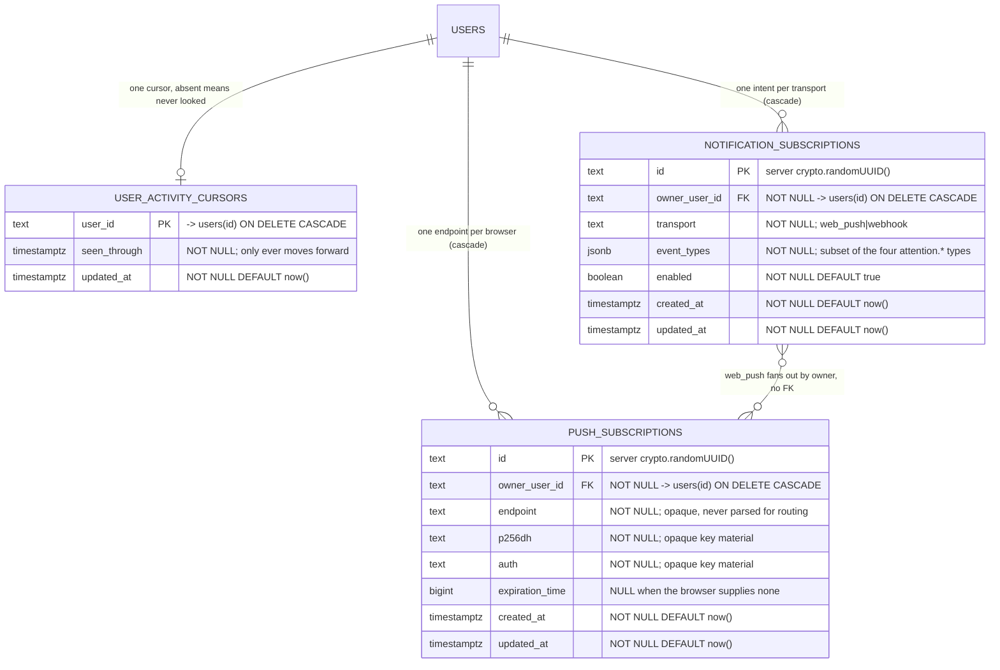
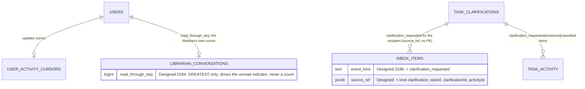

# Attention domain ERD

Tables for the user-scoped attention plane: the per-user activity read cursor
([ADR-169](../decisions.md#adr-169)) and the notification subscription /
web-push tables ([ADR-173](../decisions.md#adr-173)).
See [`../system-analytics/attention.md`](../system-analytics/attention.md) and
[`../system-analytics/notifications.md`](../system-analytics/notifications.md)
for behavior, and [`../database-schema.md`](../database-schema.md) for the exact
DDL, constraint names and index names.

> **Status: Implemented.** Migration `01640` (`user_activity_cursors`) shipped in
> M51 Phase 4; `01650` added `push_subscriptions` and
> `notification_subscriptions`, and `01660` widened the ADR-077 tables (drawn in
> [`webhooks.md`](webhooks.md), not here — it also gives `webhook_deliveries` a
> `push_subscription_id` so one ledger carries both transports).

```mermaid
erDiagram
    USERS ||--o| USER_ACTIVITY_CURSORS : "one cursor, absent means never looked"
    USERS ||--o{ PUSH_SUBSCRIPTIONS : "one endpoint per browser (cascade)"
    USERS ||--o{ NOTIFICATION_SUBSCRIPTIONS : "one intent per transport (cascade)"
    NOTIFICATION_SUBSCRIPTIONS }o--o{ PUSH_SUBSCRIPTIONS : "web_push fans out by owner, no FK"

    USER_ACTIVITY_CURSORS {
        text user_id PK "-> users(id) ON DELETE CASCADE"
        timestamptz seen_through "NOT NULL; only ever moves forward"
        timestamptz updated_at "NOT NULL DEFAULT now()"
    }

    PUSH_SUBSCRIPTIONS {
        text id PK "server crypto.randomUUID()"
        text owner_user_id FK "NOT NULL -> users(id) ON DELETE CASCADE"
        text endpoint "NOT NULL; opaque, never parsed for routing"
        text p256dh "NOT NULL; opaque key material"
        text auth "NOT NULL; opaque key material"
        bigint expiration_time "NULL when the browser supplies none"
        timestamptz created_at "NOT NULL DEFAULT now()"
        timestamptz updated_at "NOT NULL DEFAULT now()"
    }

    NOTIFICATION_SUBSCRIPTIONS {
        text id PK "server crypto.randomUUID()"
        text owner_user_id FK "NOT NULL -> users(id) ON DELETE CASCADE"
        text transport "NOT NULL; web_push|webhook"
        jsonb event_types "NOT NULL; subset of the four attention.* types"
        boolean enabled "NOT NULL DEFAULT true"
        timestamptz created_at "NOT NULL DEFAULT now()"
        timestamptz updated_at "NOT NULL DEFAULT now()"
    }
```

## Keys and unique constraints

| Constraint | Table | Columns | Why |
| --- | --- | --- | --- |
| PK | `user_activity_cursors` | `user_id` | one cursor per user; the row's absence is meaningful |
| `push_subscriptions_owner_endpoint_key` | `push_subscriptions` | `(owner_user_id, endpoint)` | re-registering the same browser is idempotent |
| `notification_subscriptions_owner_transport_key` | `notification_subscriptions` | `(owner_user_id, transport)` | one delivery intent per transport, so two rows cannot disagree |

## Regular indexes

| Index | Table | Columns | Serves |
| --- | --- | --- | --- |
| `push_subscriptions_owner_idx` | `push_subscriptions` | `(owner_user_id)` | per-owner fan-out at send time |
| `notification_subscriptions_owner_idx` | `notification_subscriptions` | `(owner_user_id)` | resolving a reader's delivery intent |

## Cascade chain

Deleting a user removes their cursor, every push endpoint, and every
notification intent. No row here survives its owner, and none is referenced by
a run, a task or a project — the attention plane reads those, never the reverse.

## Why there is no FK from intent to transport

A `web_push` intent means "notify me on **every** browser I have registered".
Pointing it at one `push_subscriptions` row would silently stop notifying the
others as soon as a second browser appeared. The owner column is the join, and
it is indexed on both sides.

## Personal librarian additions (Designed — ADR-189, ADR-190)

The librarian adds no attention table. It adds one inbox kind and one decisions
population that the two counters already read, and keeps its own read cursor
beside the attention cursor rather than inside it.

```mermaid
erDiagram
    USERS ||--o| USER_ACTIVITY_CURSORS : "updates cursor"
    USERS ||--o| LIBRARIAN_CONVERSATIONS : "read_through_seq, the librarian's own cursor"
    TASK_CLARIFICATIONS ||--o{ INBOX_ITEMS : "clarification_requested for the recipient (source_ref, no FK)"
    TASK_CLARIFICATIONS ||--o{ TASK_ACTIVITY : "clarification_requested|answered|cancelled twins"

    INBOX_ITEMS {
        text event_kind "Designed 0188: + clarification_requested"
        jsonb source_ref "Designed: + kind clarification, taskId, clarificationId, activityId"
    }

    LIBRARIAN_CONVERSATIONS {
        bigint read_through_seq "Designed 0184: GREATEST only; drives the unread indicator, never a count"
    }
```

- **`decisions`** gains a fifth population read into the same array: open
  user-origin `task_clarifications` whose `recipient_user_id` is the reader, so
  the count still equals the list length.
- **`updates`** counts a clarification request once: the inbox row's
  `source_ref->>'activityId'` names its `task_activity` twin, and
  `task.clarification_answered` moves to the twinned kinds (ADR-169 D4 applied,
  not changed).
- **`read_through_seq`** is the librarian panel's cursor over
  `librarian_messages.seq`; it never moves `user_activity_cursors` and neither
  counter reads it. See [`librarian-domain.md`](librarian-domain.md) and
  [`../system-analytics/attention.md`](../system-analytics/attention.md).

## Linked artifacts

- [ADR-169](../decisions.md#adr-169) · [ADR-173](../decisions.md#adr-173)
- [`../system-analytics/attention.md`](../system-analytics/attention.md)
- [`../system-analytics/notifications.md`](../system-analytics/notifications.md)
- [`webhooks.md`](webhooks.md) — the widened ADR-077 tables
- [`../database-schema.md`](../database-schema.md) — exact DDL
