# Project Brain ERD (A+B+C)

Tables for the Project Brain bounded context (ADR-122, ADR-127, ADR-128): the
owned-tier memory store, indexed source/chunk tier, immutable per-generation
embeddings, consumption-time recall snapshots, index jobs, graph edges, project
Brain config, and proposal bridge. Shared enablement columns still live in the
main Drizzle lineage; Brain-owned tables live in the separate hand-authored brain
lineage. See
[`../system-analytics/project-brain.md`](../system-analytics/project-brain.md)
for process flows and [`../database-schema.md`](../database-schema.md) for the
column-level narrative.

> **Status:** A is Implemented. B/C are Designed for this branch. Migrations:
> shared-table
> ALTERs land in the **main** lineage `0088`; `brain_*` CREATEs + `CREATE EXTENSION
> vector` land in the **separate brain lineage** `web/lib/db/brain-migrations/0001`
> + `0002_brain_review_fixes` (adds `brain_harvested_events` +
> `brain_embeddings_generation_uq`; own `_journal.json`, own ledger
> `__drizzle_brain_migrations`). Sub-project B uses brain migration
> `0003_brain_indexed_tier.sql`; Sub-project C uses
> `0004_brain_proposals.sql`. The brain lineage is provisioned only on Postgres
> (SQLite → Brain disabled, D3).
>
> **Refinement over the design-spec §4 conceptual shape:** `brain_snapshots` carries
> a first-class `project_id` (FK CASCADE, NOT NULL) — required by E-1 ("every
> `brain_*` row MUST carry `project_id`") and to CASCADE actor-only (non-run-bound)
> explicit-recall snapshots on project delete. `brain_embeddings` stays
> project-scoped transitively via `item_id` (per plan T1.3).

```mermaid
erDiagram
    PROJECTS ||--o{ BRAIN_ITEMS : "owns (CASCADE)"
    PROJECTS ||--o{ BRAIN_SNAPSHOTS : "owns (CASCADE)"
    PROJECTS ||--o{ BRAIN_INDEX_JOBS : "owns (CASCADE)"
    PROJECTS ||--o{ BRAIN_HARVESTED_EVENTS : "harvest ledger (CASCADE)"
    PROJECTS ||--o{ BRAIN_SOURCES : "indexes canonical sources (CASCADE)"
    PROJECTS ||--o{ BRAIN_CHUNKS : "owns chunk auth boundary (CASCADE)"
    PROJECTS ||--o{ BRAIN_EDGES : "owns graph refs (CASCADE)"
    PROJECTS ||--|| BRAIN_PROJECT_CONFIG : "config (CASCADE)"
    PROJECTS ||--o{ BRAIN_PROPOSALS : "improvement proposals (CASCADE)"
    BRAIN_ITEMS ||--o{ BRAIN_EMBEDDINGS : "generations x splits (CASCADE)"
    BRAIN_SOURCES ||--o{ BRAIN_CHUNKS : "chunks (CASCADE)"
    BRAIN_CHUNKS ||--o{ BRAIN_EMBEDDINGS : "generations (CASCADE)"
    RUNS ||--o{ BRAIN_ITEMS : "provenance source_run_id (SET NULL)"
    DOMAIN_EVENTS ||--o{ BRAIN_ITEMS : "provenance source_domain_event_id (SET NULL)"
    RUNS ||--o{ BRAIN_SNAPSHOTS : "run-bound recall run_id (CASCADE)"

    BRAIN_ITEMS {
        text id PK "uuid"
        text project_id FK "NOT NULL -> projects(id) CASCADE — auth boundary"
        text kind "lesson|observation|state_fact|decision|direction"
        text tier "owned|indexed"
        text title "NOT NULL"
        text content "NOT NULL"
        text status "active|expired|superseded"
        numeric confidence "NOT NULL — confidence0 0.3 on insert"
        integer reinforcement_count "NOT NULL DEFAULT 0"
        timestamptz last_reinforced_at "NULL"
        timestamptz expires_at "NULL for non-decayed state_fact; set for lesson/observation"
        text content_hash "NOT NULL — exact-dup idempotency"
        jsonb tags "NOT NULL DEFAULT '[]' — owned metadata (string[])"
        text source_run_id FK "NULL -> runs(id) SET NULL — provenance"
        text source_node_attempt_id FK "NULL -> node_attempts(id) SET NULL"
        bigint source_domain_event_id FK "NULL -> domain_events(id) SET NULL — harvest idempotency"
        text source_gate_kind "NULL — gate.failed provenance"
        jsonb source_ref "NULL — canonical pointer for indexed/home-resolved items"
        tsvector tsv "GENERATED from title+content — lexical leg"
        timestamptz created_at
        timestamptz updated_at
    }

    BRAIN_SOURCES {
        text id PK "uuid"
        text project_id FK "NOT NULL -> projects(id) CASCADE"
        text kind "repo_file|markdown|html|openapi|asyncapi|sql|flow_yaml|package_yaml|agent_md|code|text"
        text path "repo-relative file or glob"
        text source_hash "NULL until first index"
        text chunker_id "NOT NULL"
        text chunker_version "NOT NULL"
        boolean enabled "NOT NULL DEFAULT true"
        timestamptz last_indexed_at "NULL"
        jsonb last_error "NULL"
        timestamptz created_at
        timestamptz updated_at
    }

    BRAIN_CHUNKS {
        text id PK "uuid"
        text source_id FK "NOT NULL -> brain_sources(id) CASCADE"
        text project_id FK "NOT NULL -> projects(id) CASCADE"
        text stable_id "NOT NULL"
        text kind "typed chunk kind"
        text title "NOT NULL"
        text path "repo-relative pointer path"
        text symbol "NULL"
        text content "NOT NULL"
        jsonb metadata "NOT NULL DEFAULT '{}'"
        jsonb source_range "line/column range"
        text content_hash "NOT NULL"
        tsvector tsv "GENERATED from title+content"
        timestamptz created_at
        timestamptz updated_at
    }

    BRAIN_EMBEDDINGS {
        text id PK "uuid"
        text item_id FK "NULL -> brain_items(id) CASCADE"
        text chunk_id FK "NULL -> brain_chunks(id) CASCADE"
        integer split_ordinal "NOT NULL DEFAULT 0 — oversize-split segment order"
        vector vector "untyped pgvector column — cast to vector(N) at query"
        text embedding_provider "NOT NULL — openai_compatible"
        text embedding_model "NOT NULL — e.g. text-embedding-3-small"
        integer embedding_dimensions "NOT NULL — e.g. 1536"
        text embedding_version "NOT NULL — recorded metadata only; generation identity = (embedding_model, embedding_dimensions)"
        text source_hash "NOT NULL"
        text content_hash "NOT NULL"
        text chunker_id "NULL for owned item embeddings"
        text chunker_version "NULL for owned item embeddings"
        timestamptz embedded_at "NOT NULL — IMMUTABLE row"
    }

    BRAIN_SNAPSHOTS {
        text id PK "uuid"
        text project_id FK "NOT NULL -> projects(id) CASCADE — refinement (E-1)"
        text run_id FK "NULL -> runs(id) CASCADE — set when run-bound"
        text node_attempt_id FK "NULL -> node_attempts(id) SET NULL"
        text actor_type "NOT NULL — user|agent|system"
        text actor_id "NOT NULL"
        text trigger "ambient|explicit"
        text query "NOT NULL"
        text query_hash "NOT NULL"
        text embedding_model "NOT NULL — the model used for this recall"
        jsonb returned_items "NOT NULL — [{tier,itemId?|chunkId?,score,pointer?}]"
        text ranker_version "NOT NULL"
        timestamptz created_at
    }

    BRAIN_INDEX_JOBS {
        text id PK "uuid"
        text project_id FK "NOT NULL -> projects(id) CASCADE"
        text source_id FK "NULL -> brain_sources(id) CASCADE"
        text reason "model_switch|manual|event|chunker_upgrade"
        text status "queued|running|completed|failed"
        integer progress "NOT NULL DEFAULT 0"
        jsonb resumable_cursor "NULL — progress/observability metadata; lastItemId + error on failure (resume = missing-generation worklist)"
        timestamptz created_at
    }

    BRAIN_HARVESTED_EVENTS {
        text project_id PK "composite PK; FK -> projects(id) CASCADE (migration 0002)"
        bigint domain_event_id PK "composite PK; NO FK — outlives domain_events GC"
        timestamptz harvested_at "NOT NULL DEFAULT now()"
    }

    BRAIN_EDGES {
        text id PK "uuid"
        text project_id FK "NOT NULL -> projects(id) CASCADE"
        jsonb from_ref "item/chunk/proposal ref"
        jsonb to_ref "item/chunk/proposal ref"
        text relation "supports|contradicts|derived_from|refines|references"
        numeric confidence "0..1"
        boolean degraded "NOT NULL DEFAULT false"
        timestamptz created_at
        timestamptz updated_at
    }

    BRAIN_PROJECT_CONFIG {
        text project_id PK "FK -> projects(id) CASCADE"
        jsonb home_resolution "kind -> source ownership map"
        text projection_flow_id "NULL -> flows(id) SET NULL"
        jsonb autonomy_policy "manual by default; auto_draft only"
        timestamptz created_at
        timestamptz updated_at
    }

    BRAIN_PROPOSALS {
        text id PK "uuid"
        text project_id FK "NOT NULL -> projects(id) CASCADE"
        text kind "rule|skill|flow|adr|roadmap|state"
        jsonb evidence_item_ids "NOT NULL DEFAULT '[]'"
        jsonb draft "NOT NULL"
        text status "pending|accepted|rejected|applied"
        text blast_radius "low|medium|high"
        text autonomy_decision "manual|auto_draft"
        text cluster_hash "NULL, unique per project when present"
        jsonb actor "proposal creator"
        jsonb resolution "NULL until concluded"
        text authored_draft_id "NULL"
        text task_id "NULL -> tasks(id) SET NULL"
        text run_id "NULL -> runs(id) SET NULL"
        timestamptz created_at
        timestamptz updated_at
        timestamptz resolved_at
        timestamptz applied_at
    }
```



## Sibling-table alters (main lineage, migration `0088`)

| Table | Change |
| ----- | ------ |
| `platform_runtime_settings` | += `embedding_base_url` (text, NULL), `embedding_model` (text, NULL), `embedding_dimensions` (integer, NULL), `embedding_api_key_ref` (text, NULL — `env:NAME` ref only), `distill_model` (text, NULL). Singleton row. |
| `projects` | += `brain_enabled` (boolean, NOT NULL DEFAULT false). Enable-gate refuses `CONFIG` unless platform embedding + `distill_model` are set. |
| `agent_project_links` | += `can_read_brain` (boolean, NOT NULL DEFAULT false — gates recall/clusters), `can_write_brain` (boolean, NOT NULL DEFAULT false — gates retain/propose, separate write axis). `can_propose_brain` remains deferred; C reuses `can_write_brain`. |
| `runs` | += `brain_context` (boolean, NULL — null = off (default) in A, a flow/agent-level default is reserved; the persisted launch-time decision. `runs.runner_snapshot` no longer exists post-M42, so a dedicated column is required). |

## Keys and constraints

| Table | Constraint | Columns | Purpose |
| ----- | ---------- | ------- | ------- |
| `brain_items` | partial `UNIQUE` | `(project_id, source_domain_event_id) WHERE source_domain_event_id IS NOT NULL` | Harvest at-least-once idempotency at the DB (one item per consumed event). |
| `brain_items` | partial `UNIQUE` | `(project_id, content_hash) WHERE status = 'active'` | Exact-dup race guard — collapses a concurrent duplicate to `CONFLICT`. |
| `brain_items` | `CHECK` | `confidence BETWEEN 0 AND 1` | Confidence stays a probability. |
| `brain_embeddings` | (immutable) | — | No UPDATE/DELETE app path except cascade; a re-embed inserts a new generation row. |
| `brain_embeddings` | `CHECK` (migration `0003`) | exactly one of `item_id`, `chunk_id` | An embedding belongs to one owned item or one indexed chunk, never both or neither. |
| `brain_embeddings` | `UNIQUE` (migration `0002` + `0003` refinement) | item arm and chunk arm generation keys | Idempotent re-embed for owned items and indexed chunks. |
| `brain_sources` | `UNIQUE` | `(project_id, path, kind)` | One source registration per canonical source/kind. |
| `brain_chunks` | `UNIQUE` | `(source_id, stable_id)` | Stable chunk identity across reindex. |
| `brain_proposals` | partial `UNIQUE` | `(project_id, cluster_hash) WHERE cluster_hash IS NOT NULL` | Idempotent improver/propose path for recurring clusters. |
| `brain_harvested_events` | `PRIMARY KEY` (migration `0002`) | `(project_id, domain_event_id)` | Harvest idempotency across ALL retain outcomes (insert / reinforce / exact-dup) — a redelivered event that reinforced a near-dup (which leaves no `source_domain_event_id` row) is a no-op, so confidence/TTL are never double-counted. Written in `retain`'s transaction; no FK on `domain_event_id` (outlives `domain_events` GC). |

## Indexes

| Table | Index | Columns / definition | Purpose |
| ----- | ----- | -------------------- | ------- |
| `brain_items` | `brain_items_tsv_gin` | GIN `(tsv)` | Lexical leg of hybrid recall. |
| `brain_items` | `brain_items_recall_idx` | btree `(project_id, status, expires_at)` | Recall-path project-scoped active-item scan (the decay sweep filters `status` + `expires_at` only and does not lead with `project_id`). |
| `brain_embeddings` | `brain_embeddings_item_idx` | btree `(item_id, embedding_model, embedding_dimensions)` | Generation lookup + FK. |
| `brain_embeddings` | `brain_embeddings_generation_uq` (migration `0002`) | UNIQUE btree `(item_id, split_ordinal, embedding_model, embedding_dimensions)` | Duplicate-embedding guard (F3) — makes a concurrent/double reindex insert a no-op. |
| `brain_embeddings` | `brain_embeddings_chunk_generation_uq` (migration `0003`) | UNIQUE btree `(chunk_id, split_ordinal, embedding_model, embedding_dimensions, chunker_id, chunker_version)` | Duplicate chunk-embedding guard across reindex/chunker generations. |
| `brain_sources` | `brain_sources_project_idx` | btree `(project_id, enabled)` | Source list and enabled-source scans. |
| `brain_chunks` | `brain_chunks_tsv_gin` | GIN `(tsv)` | Lexical leg for indexed recall. |
| `brain_chunks` | `brain_chunks_project_idx` | btree `(project_id, path)` | Pointer/source filters. |
| `brain_edges` | `brain_edges_project_idx` | btree `(project_id, degraded)` | Brain page edge reads, derived-from source edges, and degraded filters. |
| `brain_proposals` | `brain_proposals_project_status_idx` | btree `(project_id, status, created_at)` | Proposal review tabs and improver idempotency. |
| `brain_embeddings` | `brain_embeddings_hnsw_<modelslug>_<N>` | `USING hnsw ((vector::vector(N)) vector_cosine_ops) WHERE embedding_model = M AND embedding_dimensions = N` | **Per-generation expression HNSW** — created by `ensureEmbeddingIndex(model, N)` at configure/reindex time, NOT in the migration. A model/dimension switch adds a new one; old ones persist. |
| `brain_snapshots` | `brain_snapshots_run_idx` | btree `(run_id)` | Run-scoped snapshot reads. |
| `brain_index_jobs` | `brain_index_jobs_claim_idx` | btree `(status, created_at)` | Reindex-worker claim scan. |

## Cascade chain

```
projects
  ├── brain_items          (FK project_id, ON DELETE CASCADE)
  │     └── brain_embeddings (FK item_id,   ON DELETE CASCADE)
  ├── brain_sources        (FK project_id, ON DELETE CASCADE)
  │     └── brain_chunks   (FK source_id,  ON DELETE CASCADE)
  │           └── brain_embeddings (FK chunk_id, ON DELETE CASCADE)
  ├── brain_edges          (FK project_id, ON DELETE CASCADE)
  ├── brain_project_config (FK project_id, ON DELETE CASCADE)
  ├── brain_proposals      (FK project_id, ON DELETE CASCADE)
  ├── brain_snapshots      (FK project_id, ON DELETE CASCADE)
  ├── brain_index_jobs     (FK project_id, ON DELETE CASCADE)
  └── brain_harvested_events (FK project_id, ON DELETE CASCADE)  -- migration 0002

runs
  ├── brain_items.source_run_id      (ON DELETE SET NULL — item survives run delete)
  └── brain_snapshots.run_id         (ON DELETE CASCADE — run-bound snapshot dies with the run)

domain_events
  └── brain_items.source_domain_event_id (ON DELETE SET NULL — item survives event prune)
```

Every `brain_*` FK to `projects` is `ON DELETE CASCADE` — deleting a project removes
its entire Brain by construction (the auth boundary is also the deletion boundary).
Provenance FKs (`source_run_id`, `source_domain_event_id`) are `SET NULL` so a
harvested lesson survives the deletion of the run/event it was distilled from.

## Retention

- **Embeddings are immutable and append-only per generation.** A model or dimension
  switch writes a NEW generation keyed by `(embedding_model, embedding_dimensions)`
  (a new set of rows + a new expression index; `embedding_version` is recorded
  metadata only); old generation rows and their indexes stay intact. Index/row GC
  across dead generations is out of scope for Sub-project A.
- **Items decay or supersede.** `lesson`/`observation` carry `expires_at`; the
  throttled decay sweep sets `status='expired'` past `expires_at` (excluded from
  recall). `state_fact` is not decayed; changed near-duplicates mark the prior
  active fact `superseded` and insert a fresh active fact. Reinforcement pushes
  `expires_at` out only for decayed kinds.
- **Snapshots are audit records** — never mutated; pruned by the decay sweep after
  30 days (`BRAIN_POLICY.snapshotTtlDays`) and via project/run cascade.
- **Indexed sources are pointers.** `brain_chunks.content` is a recall/indexing
  artifact, not the canonical document. UI pointer opening uses the project files
  route and `readRepoFiles`.
- **Proposals are review records.** `brain_proposals` never publish and never
  write repo files. They link to authored drafts, tasks, and runs created by
  existing domains.

## Linked artifacts

- Process flows: [`../system-analytics/project-brain.md`](../system-analytics/project-brain.md).
- Global ERD: [`erd.md`](erd.md).
- Narrative: [`../database-schema.md`](../database-schema.md).
- Decision records: [ADR-122](../decisions.md#adr-122-project-brain-per-project-memory-substrate),
  [ADR-127](../decisions.md#adr-127-project-brain-consultant-indexed-tier),
  [ADR-128](../decisions.md#adr-128-project-brain-self-improvement-proposal-bridge).
- Design spec: [`../plans/2026-07-01-project-brain-architecture.md`](../plans/2026-07-01-project-brain-architecture.md) §4.
- Source (Implemented): `web/lib/brain/schema.ts`, `web/lib/db/brain-migrations/0001_*.sql`
  + `0002_brain_review_fixes.sql`, `web/lib/db/migrations/0088_*.sql`,
  `web/lib/brain/embedding-index.ts`.
