# Evaluation Lab domain ERD (Implemented — ADR-139..142, migrations `0104`–`0107`)

The Evaluation Lab (M46) tables: the neutral Study/participant/recipe model,
package-sourced Methodologies + admin Panels/Profiles, immutable evidence, and
multi-judge execution → aggregation → human verdict. Narrative field detail and
invariants live in [`../database-schema.md`](../database-schema.md) §Evaluation
Lab tables; behavior co-evolves in `system-analytics/` per later M46 phases.

Ownership: a **Study** owns its participants, recipes, evidence snapshots,
executions, and verdicts. An **Evaluation Execution** owns exactly one method +
profile snapshot, its objective checks/metrics, judge attempts, and aggregate.
**Method revisions** are immutable package content; **Panels/Profiles** are
mutable admin config snapshotted at execution start.

```mermaid
erDiagram
    projects ||--o{ evaluation_studies : owns
    tasks ||--o{ evaluation_studies : scopes
    evaluation_studies ||--o{ evaluation_recipes : defines
    evaluation_studies ||--o{ evaluation_participants : contains
    evaluation_studies ||--o{ evaluation_evidence_snapshots : prepares
    evaluation_studies ||--o{ evaluation_executions : runs
    evaluation_studies ||--o{ evaluation_human_verdicts : decides
    evaluation_studies ||--o{ evaluation_events : streams
    evaluation_recipes ||--o{ evaluation_participants : launches
    runs ||--o{ evaluation_participants : sources

    package_installs ||--o{ evaluation_method_revisions : projects
    evaluation_method_revisions ||--o{ evaluation_profiles : selected_by
    evaluation_judge_panels ||--o{ evaluation_profiles : binds
    evaluation_profiles ||--o{ evaluation_project_profile_overrides : constrains
    projects ||--o{ evaluation_project_profile_overrides : scopes

    evaluation_evidence_snapshots ||--o{ evaluation_evidence_items : indexes
    evaluation_evidence_snapshots ||--o{ evaluation_executions : attached_to
    evaluation_method_revisions ||--o{ evaluation_executions : method
    evaluation_executions ||--o{ evaluation_objective_check_runs : checks
    evaluation_executions ||--o{ evaluation_metric_results : measures
    evaluation_executions ||--o{ evaluation_judge_attempts : dispatches
    evaluation_judge_attempts ||--o{ evaluation_criterion_results : scores
    evaluation_executions ||--o{ evaluation_aggregate_results : aggregates
    evaluation_executions ||--o{ evaluation_reviews : escalates

    evaluation_studies {
        text id PK
        text project_id FK
        text task_id FK "RESTRICT"
        text status "draft|open|decided|archived"
        int version
        text legacy_experiment_id "UNIQUE, nullable"
        jsonb legacy_snapshot "verbatim Experiment"
    }
    evaluation_recipes {
        text id PK
        text study_id FK
        text key "UNIQUE with study_id"
        jsonb definition "immutable"
        text definition_digest
        timestamptz tombstoned_at
    }
    evaluation_participants {
        text id PK
        text study_id FK
        text run_id FK "SET NULL, nullable"
        text source_type "observed|launched"
        text recipe_id FK "launched only"
        jsonb run_identity "survives Run delete"
        timestamptz removed_at "tombstone"
    }
    evaluation_method_revisions {
        text id PK
        text package_install_id FK "RESTRICT"
        text method_id
        text qualified_id "packageName:methodId"
        jsonb compat "engineMin/Max"
        text activation "enabled|disabled"
        jsonb validation_errors
    }
    evaluation_judge_panels {
        text id PK
        int revision "optimistic"
        jsonb role_bindings "role->package agent"
        jsonb policy "attempts/quorum/timeout/…"
        bool enabled
    }
    evaluation_profiles {
        text id PK
        text method_revision_id FK "RESTRICT"
        text panel_id FK "RESTRICT"
        int revision
        jsonb allowed_overrides
        bool enabled
    }
    evaluation_project_profile_overrides {
        text id PK
        text project_id FK "CASCADE"
        text profile_id FK "RESTRICT"
        jsonb overrides "allow-list bounded"
    }
    evaluation_evidence_snapshots {
        text id PK
        text study_id FK
        text status "preparing|sealed|pending_delete|deleted"
        text evidence_protocol_digest
        text manifest_digest
        jsonb coverage_summary
    }
    evaluation_evidence_items {
        text id PK
        text snapshot_id FK
        text participant_id FK "nullable shared"
        text kind
        text locator "opaque logical"
        text coverage_class
        text blob_key "server-only"
    }
    evaluation_executions {
        text id PK
        text study_id FK
        text method_revision_id FK "nullable (legacy)"
        text evidence_snapshot_id FK "required before checking"
        text status "11-state FSM"
        int version "CAS"
        text idempotency_key
        text retry_of FK "self, nullable"
    }
    evaluation_objective_check_runs {
        text id PK
        text execution_id FK
        text participant_id FK
        text check_id
        int attempt "UNIQUE tuple"
        text status "queued…unavailable"
        text reason
    }
    evaluation_metric_results {
        text id PK
        text execution_id FK
        text participant_id FK
        text status "measured|unavailable|not_run"
        jsonb value
    }
    evaluation_judge_attempts {
        text id PK
        text execution_id FK
        text role
        int ordinal "UNIQUE tuple"
        int retry_ordinal
        text agent_run_id FK
        text status "queued…error"
        jsonb sealed_result
    }
    evaluation_criterion_results {
        text id PK
        text attempt_id FK
        text criterion_id
        text state "scored|insufficient_evidence|not_applicable"
        numeric score "NULL unless scored"
    }
    evaluation_aggregate_results {
        text id PK
        text execution_id FK
        text algorithm_id
        jsonb inputs "exact attempt ids"
        jsonb calculations "unrounded"
        text digest
    }
    evaluation_reviews {
        text id PK
        text execution_id FK
        text kind "disagreement|escalation"
        text status "required|resolved"
        int version
    }
    evaluation_human_verdicts {
        text id PK
        text study_id FK
        text supersedes_id FK "self, nullable"
        text outcome "winner|tie|inconclusive"
        jsonb execution_ids
        bool no_evaluation_evidence_ack "true iff zero-citation"
    }
    evaluation_events {
        text id PK
        text study_id FK
        text execution_id FK "nullable"
        int sequence "UNIQUE with study_id"
        text event_type
        jsonb payload "bounded, redacted"
    }
```

