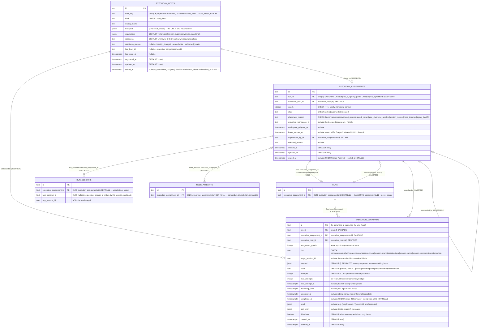

# Execution-host domain ERD

Tables for the local execution-host contract introduced by
[ADR-165](../decisions.md#adr-165-local-execution-host-contract--durable-host-identity-epoch-fenced-assignments-command-ledger-opaque-adopted-workspaces).
Behavior lives in
[`../system-analytics/execution-hosts.md`](../system-analytics/execution-hosts.md);
the narrative column reference is
[`../database-schema.md#execution-host-tables`](../database-schema.md#execution-host-tables-implemented--adr-165-migration-0129).

> **Status: Implemented.** Migration `0129_execution_hosts` (single, additive,
> never data-dependent) adds the three tables, the four attribution columns,
> and the indexes below. Historical rows keep `execution_assignment_id = NULL`
> forever — the documented meaning is "pre-Stage-A, never placed".



## Keys and constraints

- `execution_hosts_host_key_unique` — `UNIQUE (host_key)`.
- `execution_hosts_local_active_uq` — partial `UNIQUE (kind) WHERE kind =
'local_direct' AND retired_at IS NULL`: **at most one non-retired local
  host** (E-EH-01). The registrar's identity-change policy runs under a
  `SELECT … FOR UPDATE` of that one row.
- `execution_hosts_kind_check` (`local_direct`) and
  `execution_hosts_readiness_check` (`unknown|ready|unavailable`).
- `execution_assignments_run_epoch_uq` — `UNIQUE (run_id, epoch)`: a mint
  never reuses an epoch (E-EH-02, race backstop; `23505` → `CONFLICT`).
- `execution_assignments_run_active_uq` — partial `UNIQUE (run_id) WHERE
state = 'active'`: at most one active assignment per run (E-EH-02).
- `execution_assignments_epoch_check` (`epoch >= 1`),
  `execution_assignments_state_check`,
  `execution_assignments_placement_reason_check` (ten tokens), and
  `execution_assignments_active_shape_check` — `(state = 'active') =
(ended_at IS NULL)`, so an `active` row can never carry `ended_at` and a
  terminal row always does.
- `execution_commands_kind_check` (eight kinds),
  `execution_commands_state_check` (six states), and
  `execution_commands_terminal_shape_check` — `(state IN ('succeeded',
'failed', 'fenced')) = (completed_at IS NOT NULL)`.
- Indexes: `execution_assignments_host_state_idx (execution_host_id, state)`
  (the registrar's "does the old row still own active work" scan),
  `execution_commands_open_idx (state, next_attempt_at) WHERE state IN
('queued', 'delivering', 'accepted')` (the recovery pass and the deliverer's
  due scan — the predicate is mirrored by `loadOpenCommands`),
  `execution_commands_run_created_idx (run_id, created_at)` (per-run command
  history), `execution_commands_assignment_idx (execution_assignment_id)`,
  `runs_execution_assignment_idx (execution_assignment_id)`,
  `run_sessions_host_session_idx (host_session_id)` (the reconcile lookup by
  host session id), `run_sessions_assignment_idx (execution_assignment_id)`,
  `node_attempts_assignment_idx (execution_assignment_id)`.
- FK constraint names follow drizzle's `<table>_<col>_<reftable>_<refcol>_fk`
  convention; the exact set is listed in
  [`../database-schema.md`](../database-schema.md#execution-host-tables-implemented--adr-165-migration-0129).

## Cascade chain

```
runs
  ├── execution_assignments   (FK run_id,                  CASCADE)
  │     ├── execution_commands (FK execution_assignment_id, CASCADE)
  │     └── execution_assignments.superseded_by_id (self-ref,  SET NULL)
  ├── execution_commands      (FK run_id,                  CASCADE — also direct)
  ├── runs.execution_assignment_id          (FK → execution_assignments, SET NULL)
  ├── run_sessions.execution_assignment_id  (FK → execution_assignments, SET NULL)
  └── node_attempts.execution_assignment_id (FK → execution_assignments, SET NULL)

execution_hosts
  ├── execution_assignments.execution_host_id (RESTRICT — a host with history is retired, never deleted)
  └── execution_commands.execution_host_id    (RESTRICT)
```

Deleting a run drops its assignments and commands in one statement (the
project cascade reaches them through `runs`). An execution host is never
hard-deleted while any assignment or command references it — retirement is
`retired_at`, which is also what frees the partial unique index for the next
local host.

## Retention

- `execution_commands`: terminal rows (`succeeded | failed | fenced`) older
  than **7 days** are pruned by the `system_sweep` pass (constant, no env
  var). Open rows are never pruned.
- `execution_assignments`: kept — the immutable placement history is the
  audit trail (R-04).
- `execution_hosts`: kept; `retired_at` marks a superseded identity.
- Supervisor-private state (`host_identity`, `run_fences`, `workspaces`,
  `command_receipts` in the host's `state.sqlite`) is NOT in Postgres and is
  documented in [`../supervisor.md`](../supervisor.md#execution-host-state-store);
  receipts prune on a 7-day TTL at boot and hourly.

## Linked artifacts

- Decision: [ADR-165](../decisions.md#adr-165-local-execution-host-contract--durable-host-identity-epoch-fenced-assignments-command-ledger-opaque-adopted-workspaces).
- Behavior: [`../system-analytics/execution-hosts.md`](../system-analytics/execution-hosts.md).
- Column reference: [`../database-schema.md`](../database-schema.md).
- Related ERDs: [`runs-domain.md`](runs-domain.md) (`runs`, `run_sessions`,
  `node_attempts`).
- Wire: [`../api/supervisor.openapi.yaml`](../api/supervisor.openapi.yaml)
  (`CommandEnvelope`, `AdoptWorkspaceRequest`, `CommandReceipt`).
- Source (Implemented): `web/lib/db/schema.ts`,
  `web/lib/db/migrations/0129_execution_hosts.sql`,
  `web/lib/execution-host/{hosts,assignments,commands}.ts`.
