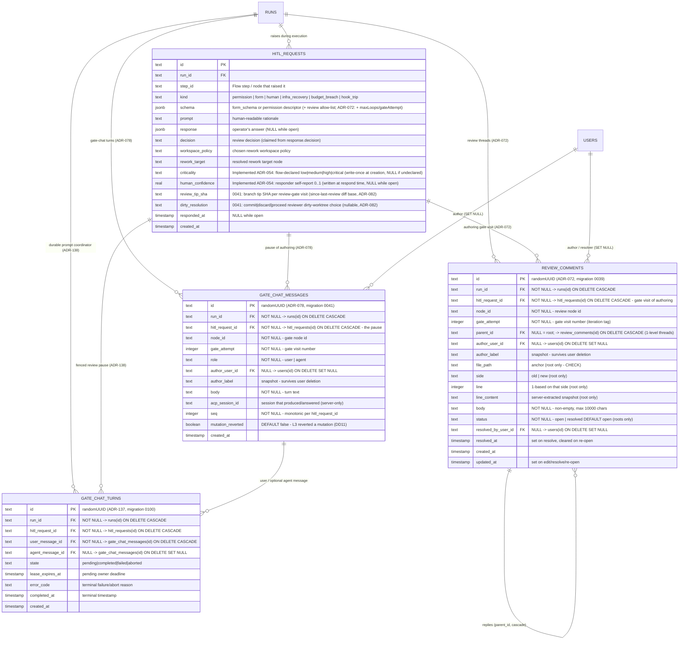
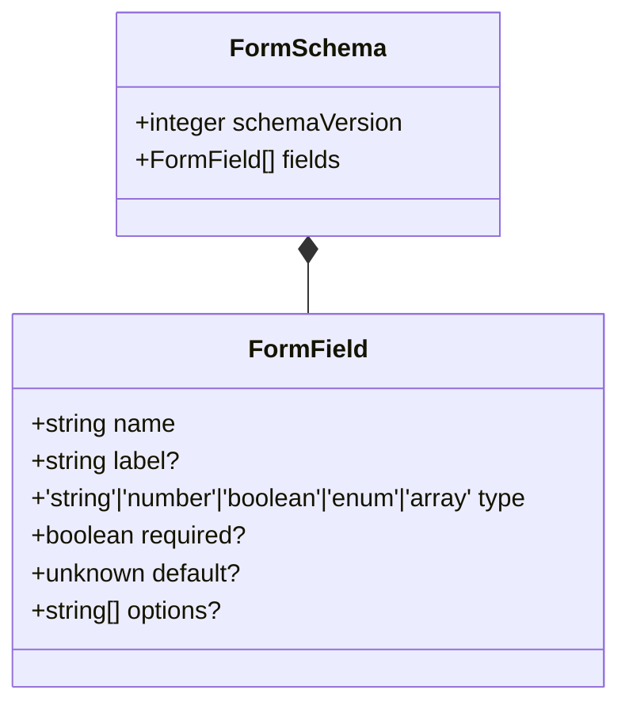
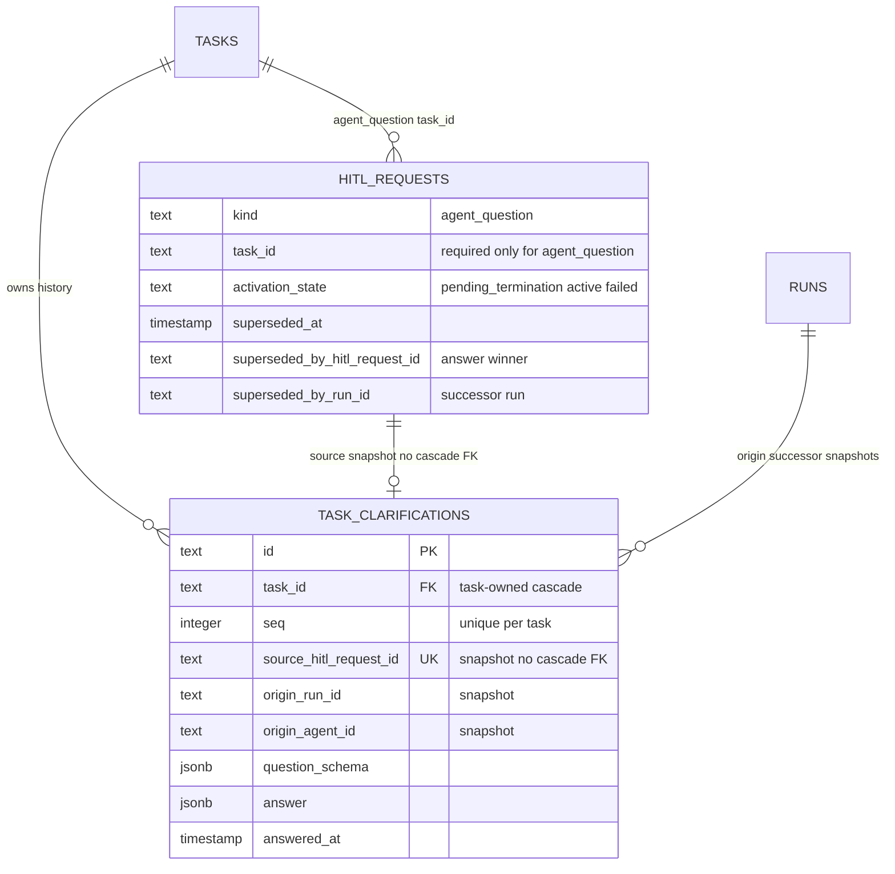

# HITL domain ERD

Three tables — `hitl_requests`, the **(ADR-072 — Implemented, migration
`0039`)** `review_comments` thread store, and the **(ADR-138 — Implemented,
migration `0101`, terminal-invariant follow-up `0102`)** `gate_chat_turns` coordinator — plus the in-jsonb shape of the
`schema` (form schema) and `response` payload. See
[`../system-analytics/hitl.md`](../system-analytics/hitl.md) and
[`../system-analytics/review-comments.md`](../system-analytics/review-comments.md)
for process flows.



> **(Designed, migration `0010`.)** The `decision`, `workspace_policy`,
> and `rework_target` columns are populated only for a graph `human_review`
> HITL. The reviewer's choice rides inside the `response` form payload; the
> respond route validates it against the manifest-derived allow-list stored in
> `schema` at creation and copies the resolved values into these columns at claim
> time. See [`../system-analytics/flow-graph.md`](../system-analytics/flow-graph.md).

> **(Implemented, migration `0025`.)** The HITL assessment taxonomy (ADR-054):
> - `criticality` — flow-author-declared severity (`low | medium | high | critical`,
>   enforced at the app layer), copied from the `human` node/step manifest into the
>   row at INSERT. **Write-once**: set at creation, never updated; `NULL` when the
>   Flow author leaves it undeclared (no DB default).
> - `human_confidence` — the responder's self-reported certainty in `[0, 1]`,
>   written in the respond service's Phase-1 transaction and **also echoed into the
>   `response` jsonb** as `{ confidence: <number> }`. `NULL` while the row is open.
>   This is the *human* responder's self-report — distinct from the AI-judge
>   `GateVerdict.confidence` on `gate_results.verdict` (machine confidence). The two
>   are never conflated.

> **(ADR-072 — Implemented, migration `0039`.)** `review_comments` stores
> line-anchored, 1-level-threaded review comments drafted at an open review
> gate. A **root** row (`parent_id IS NULL`) carries the anchor —
> `(file_path, side ∈ old|new, line)` + the exact server-extracted
> `line_content` snapshot — and the `open|resolved` status; a **reply**
> (`parent_id = root.id`) carries neither (DB CHECK: anchor fields non-null ⇔
> root). Rows FK the `hitl_requests` row of their authoring gate visit
> (cascade) and tag `gate_attempt`, so threads survive across rework
> iterations within one run; `author_user_id`/`resolved_by_user_id` are
> SET-NULL user FKs with an `author_label` snapshot. Placement
> (`inline | outdated`) is computed at read time against the current diff —
> never stored. For the review-gate rows themselves, the stored `schema`
> additionally carries server-state `{ maxLoops, gateAttempt }` so the
> respond route can reject a rework decision past the loop boundary
> (`gateAttempt > maxLoops`; total visits = `maxLoops + 1`). See
> [`../system-analytics/review-comments.md`](../system-analytics/review-comments.md).

> **(ADR-138 — Implemented, migration `0101`; terminal-invariant follow-up
> `0102`.)** `gate_chat_turns` is the
> durable, one-active-turn coordinator for ACP-backed review chat. It FK-cascades
> from both `runs` and `hitl_requests`; its required `user_message_id` cascades
> with the transcript and optional `agent_message_id` is SET NULL. A pending row
> carries the lease and has no terminal fields. Reconciliation claims an expired
> lease before requesting ACP cancellation; it does not release the response
> fence until L3 workspace restore completes and the row becomes terminal.
> Completed rows require their agent message and terminal timestamp with no
> error; failed/aborted rows require a terminal timestamp and error with no
> agent message. Indexes are
> `(hitl_request_id, state)` and a partial unique `(hitl_request_id)` where
> `state='pending'`.

## In-jsonb shape — `schema` column

For `kind=form` and `kind=human`, `schema` stores the form schema and
is validated by `formSchemaSchema` in `web/lib/config.schema.ts`. For
`kind=permission`, `schema` stores `{ requestId, options, toolCall,
supervisorSessionId }`.



The `schemaVersion` integer is mandatory. Mismatched versions throw
`MaisterError("CONFIG")` via `validateFormSchemaVersion`.

## In-jsonb shape — `response` column

Shape varies by kind:

| Kind | Response shape |
| ---- | -------------- |
| `permission` | `{ optionId: string }` |
| `form` | An object whose keys match `schema.fields[].name`, with the matching `type`. |
| `human` | Form-shaped object, optionally including review fields such as `{ rejected?: boolean, comments?: string }`. **(Designed)** a graph `human_review` payload carries `{ decision, comments?, workspacePolicy? }` validated against the row's `schema` allow-list and mirrored into the `decision`/`workspace_policy`/`rework_target` columns. |

**(Implemented — ADR-054.)** On any `form`/`human`/review response the responder's
self-reported `human_confidence` is echoed into `response` as `{ confidence: <number> }`
(`0..1`), alongside whatever the kind's payload already carries. The canonical
store for the value is the `human_confidence` column; the `response.confidence`
echo keeps the answer self-describing without a separate read.

Free-form `additionalProperties` are tolerated (forward-compat).

## Constraints

- `hitl_requests_run_idx` on `(run_id)` — pending HITL panel queries.
- No UNIQUE on `(run_id, step_id)` — one step can raise multiple HITL
  asks over a run's lifetime.
- **(ADR-072)** `review_comments` CHECK: `(file_path, side, line,
  line_content)` non-null **iff** `parent_id IS NULL` (anchored roots vs
  anchor-less replies). Indexes: `review_comments_run_created_idx`
  `(run_id, created_at)`, `review_comments_run_status_idx`
  `(run_id, status)`, `review_comments_hitl_request_idx`
  `(hitl_request_id)`, `review_comments_parent_idx` `(parent_id)`.
- **(ADR-138)** `gate_chat_turns` CHECK: only `pending` may retain a non-null
  lease, and it must have neither terminal timestamp nor error. A completed row
  requires its agent message and timestamp without an error; failed/aborted
  rows require timestamp plus error and no agent message. The partial unique
  index permits at most one `pending` coordinator per HITL request.

### Human-ask extension (Implemented — ADR-136)



Exactly one supersession provenance is allowed. A history row persists after its
source request or run is removed; question and answer bodies are never logged.

## Lifecycle

```
open (response IS NULL, responded_at IS NULL)
  -> claimed (response populated, responded_at IS NULL)
  -> delivered (response populated, responded_at IS NOT NULL)
  -> timed out (permission deferred -> Failed; designed idle timeout -> Abandoned)
```

The row is never deleted (cascades from `runs` and `projects` only).

## Linked artifacts

- Process flows: [`../system-analytics/hitl.md`](../system-analytics/hitl.md),
  [`../system-analytics/review-comments.md`](../system-analytics/review-comments.md)
  (Implemented — ADR-072).
- Config: [`../configuration.md`](../configuration.md) §`form_schema versioning`.
- Source: `web/lib/db/schema.ts` (`hitl_requests`, `review_comments`, and
  `gate_chat_turns` tables — migrations `0039`, `0101`, and `0102`),
  `web/lib/config.schema.ts` (`formSchemaSchema`),
  `web/lib/config.ts` (`validateFormSchemaVersion`).

## Plan-review decision children (Implemented — ADR-137 / migration `0100`)

```text
parent human review
  └── decision_request (same run, one source artifact + decision id)
```

Each child holds a direct parent FK, immutable source-artifact FK, and contract
decision ID. The database permits only the row shape; the locked service proves
the parent schema and same-run relationship. `UNIQUE (run_id, source_artifact_id,
decision_id) WHERE kind='decision_request'` is the replay guard. Open children
are queried by `(parent_hitl_request_id, created_at)` and are system-closed when
the parent starts ordinary rework. A child response accepts exactly one
top-level `optionId`; extra fields are rejected before the stored response can
change.
