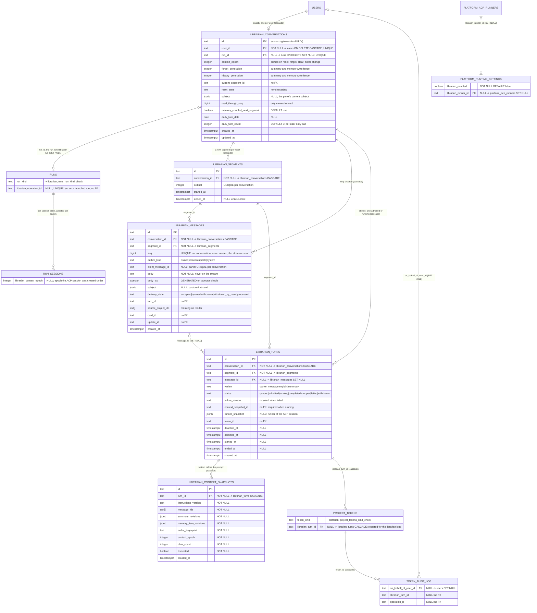
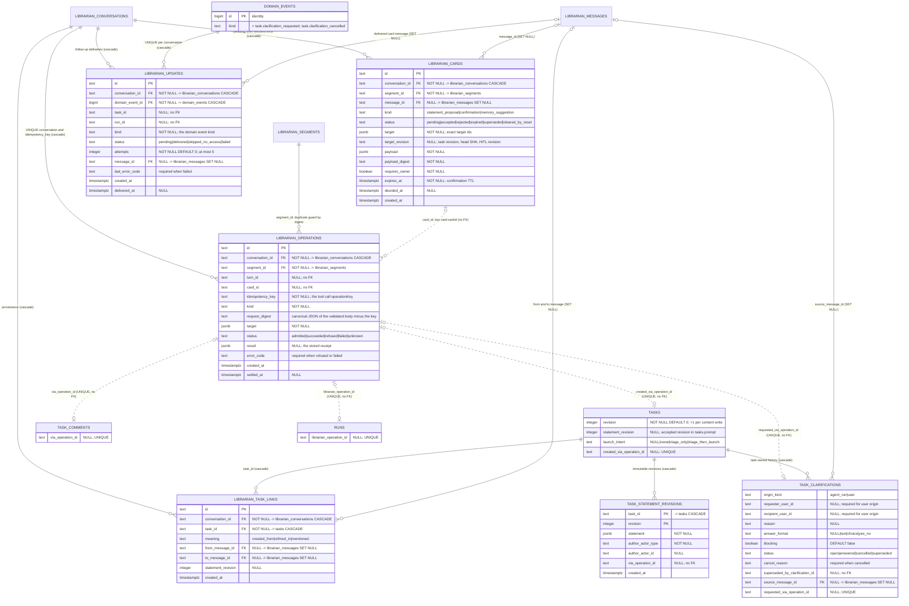
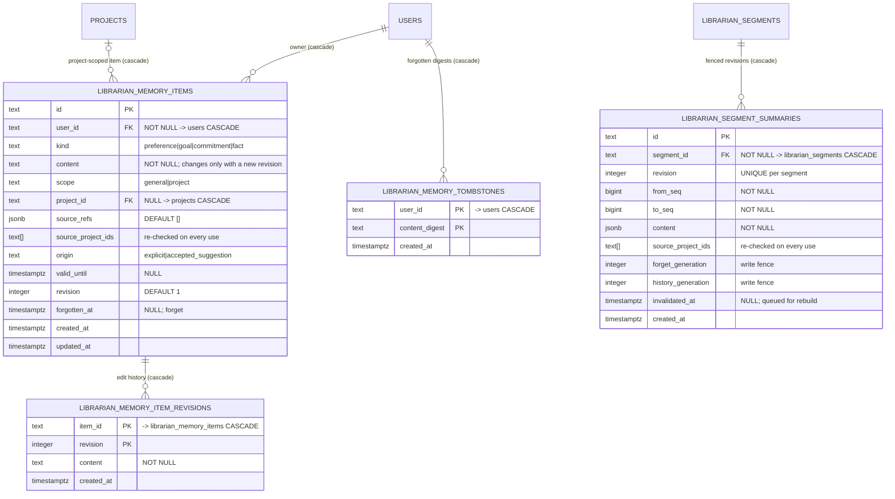

# Librarian domain ERD

Tables of the personal librarian: one conversation per user on a project-less
`run_kind='librarian'` run ([ADR-183](../decisions.md#adr-183)), per-turn
owner-bound tokens and their audit ([ADR-184](../decisions.md#adr-184)), the
operation ledger, confirmation cards and follow-up updates
([ADR-185](../decisions.md#adr-185)), task statements and conversation
provenance ([ADR-186](../decisions.md#adr-186)), user-origin clarifications
([ADR-187](../decisions.md#adr-187)), and memory, summaries, reset and history
deletion ([ADR-188](../decisions.md#adr-188)). Behaviour lives in
[`../system-analytics/librarian-conversation.md`](../system-analytics/librarian-conversation.md),
[`librarian-authority.md`](../system-analytics/librarian-authority.md),
[`librarian-operations.md`](../system-analytics/librarian-operations.md),
[`task-statements.md`](../system-analytics/task-statements.md),
[`task-clarifications.md`](../system-analytics/task-clarifications.md) and
[`librarian-memory.md`](../system-analytics/librarian-memory.md); the exact DDL,
constraint names and index names are in
[`../database-schema.md`](../database-schema.md#personal-librarian-tables-designed--adr-183188-migrations-01810188).

> **Status: Designed.** Migrations `0181`–`0188` specify every table and column
> drawn here; none has shipped. The generated [`erd.dbml`](erd.dbml) follows the
> Drizzle schema and gains them only when the migrations land. Shared tables
> (`users`, `runs`, `tasks`, …) are drawn with the librarian columns only; their
> full shape is in [`runs-domain.md`](runs-domain.md),
> [`hitl-domain.md`](hitl-domain.md), [`integrations-domain.md`](integrations-domain.md)
> and [`projects-domain.md`](projects-domain.md).

## Conversation, turns and runtime

A conversation is the user's single durable thread; each turn runs as one ACP
session on the conversation's one `runs` row and is authorized by one
turn-scoped token. Read it for the ownership chain from user to token.

## Operations, cards, provenance and follow-up

Every effect the librarian makes is an operation row joined to its result by a
unique column on the result table; a card is the owner-click path for
human-only effects. Read it for how a conversation reaches tasks and runs
without owning them.

## Memory and summaries

Personal memory belongs to the user, not to the conversation; summaries belong
to a segment and are fenced by the conversation's generations. Read it for what
survives a reset and what a forget removes.

## Keys and unique constraints

| Constraint | Table | Columns | Why |
| --- | --- | --- | --- |
| `librarian_conversations_user_uq` | `librarian_conversations` | `(user_id)` | exactly one conversation per user (`LCV-01`) |
| `librarian_conversations_run_uq` | `librarian_conversations` | `(run_id)` | one conversation per librarian run |
| `librarian_segments_ordinal_uq` | `librarian_segments` | `(conversation_id, ordinal)` | segment order |
| `librarian_messages_seq_uq` | `librarian_messages` | `(conversation_id, seq)` | the transcript order and the stream's replay cursor |
| `librarian_messages_client_id_uq` | `librarian_messages` | `(conversation_id, client_message_id)` WHERE NOT NULL | a resent client message returns the stored one (`LCV-02`) |
| `librarian_turns_one_active_uq` | `librarian_turns` | `(conversation_id)` WHERE `status IN ('admitted','running')` | at most one active turn (`LCV-03`) |
| `librarian_operations_key_uq` | `librarian_operations` | `(conversation_id, idempotency_key)` | idempotency (`LOP-02`) |
| `librarian_updates_event_uq` | `librarian_updates` | `(conversation_id, domain_event_id)` | one update per event under at-least-once dispatch (`LOP-11`) |
| `librarian_segment_summaries_revision_uq` | `librarian_segment_summaries` | `(segment_id, revision)` | summary revisions |
| PK | `task_statement_revisions` | `(task_id, revision)` | one row per accepted revision |
| PK | `librarian_memory_item_revisions` | `(item_id, revision)` | one row per edit |
| PK | `librarian_memory_tombstones` | `(user_id, content_digest)` | forget is idempotent |
| `tasks_created_via_operation_uq` · `task_comments_via_operation_uq` · `task_clarifications_requested_via_operation_uq` · `runs_librarian_operation_uq` | result tables | the operation id | a racing retry returns the existing result; reconcile is a lookup |

## Checks and triggers

| Name | Table | Rule |
| --- | --- | --- |
| `project_tokens_kind_check` | `project_tokens` | `token_kind IN ('project','user','agent','librarian')` |
| `project_tokens_librarian_check` | `project_tokens` | a librarian token has an owner, a turn and an expiry, and no project or agent |
| `runs_run_kind_check` | `runs` | `run_kind IN ('flow','scratch','agent','librarian')` |
| `runs_librarian_shape_check` | `runs` | a librarian run has no project or task, is `persistent`, has a creator and `agent_workspace='none'` |
| `librarian_turns_running_has_snapshot_check` | `librarian_turns` | a `running` turn has a context snapshot (`LCV-07`) |
| `librarian_turns_failed_has_reason_check` | `librarian_turns` | a `failed` turn has a reason |
| `librarian_operations_terminal_shape_check` | `librarian_operations` | `refused` / `failed` carry `error_code` |
| `librarian_updates_failed_has_error_check` | `librarian_updates` | `failed` carries `last_error_code` |
| `task_clarifications_origin_shape_check` | `task_clarifications` | agent-run rows keep their source ids; user rows have none, name requester and recipient, and `retrigger_mode='none'` |
| `task_clarifications_status_shape_check` | `task_clarifications` | `answered` iff answered and not superseded; `superseded` iff `superseded_at`; `cancelled` needs a reason |
| `task_clarifications_supersession_check` | `task_clarifications` | re-derived: exactly one of HITL, run or clarification successor |
| trigger `task_statement_revisions_immutable` | `task_statement_revisions` | refuses UPDATE and DELETE, except the cascade of a task delete |
| trigger `librarian_memory_items_content_immutable` | `librarian_memory_items` | content changes only together with the next revision |
| trigger `guard_agent_turn_source` (re-derived) | `agent_turns` | `requested_by_user_id` only on a message variant, immutable except the FK's `SET NULL` |

## Regular indexes

| Index | Table | Columns | Serves |
| --- | --- | --- | --- |
| `project_tokens_librarian_turn_idx` | `project_tokens` | `(librarian_turn_id)` | turn-end revocation and the turn FK cascade |
| `token_audit_librarian_turn_idx` | `token_audit_log` | `(librarian_turn_id)` | a turn's project set for source masking |
| `librarian_messages_body_tsv_idx` | `librarian_messages` | GIN `(body_tsv)` | history search |
| `librarian_operations_segment_digest_idx` | `librarian_operations` | `(segment_id, request_digest)` | the same-digest duplicate guard |
| `librarian_cards_pending_idx` | `librarian_cards` | `(conversation_id)` WHERE `status='pending'` | pending cards, expiry and reset clearing |
| `librarian_task_links_task_idx` | `librarian_task_links` | `(task_id)` | the conversations a task came from |
| `librarian_memory_items_user_active_idx` | `librarian_memory_items` | `(user_id)` WHERE `forgotten_at IS NULL` | active memory for the composer |

## Cascade chain

Deleting a user removes their conversation — segments, messages, turns (and
with them context snapshots and turn tokens with their audit rows),
operations, cards, task links and updates — plus their memory items, item
revisions and tombstones. The conversation's `runs` row is not under that
cascade: the reference points from the conversation to the run, and admin
hard-delete is refused for any user a run or a token still names.

Deleting a task removes its statement revisions and its librarian task links;
the conversation keeps its messages. Deleting a project removes its
project-scoped memory items and cascades its domain events, and with them the
librarian updates that referenced them; delivered update messages stay in the
conversation and render their target as unavailable. A clear history deletes messages, summaries, snapshots and cards,
and the `SET NULL` references clear on turns, links, updates and
`task_clarifications.source_message_id`; operations, links, statements and the
token audit are kept.

## Why result columns carry no FK

`tasks.created_via_operation_id`, `task_comments.via_operation_id`,
`task_clarifications.requested_via_operation_id` and
`runs.librarian_operation_id` are unique and nullable but reference nothing. The
operation ledger is the owner's private record and goes with the owner's
conversation, while the task, comment, clarification or run it produced is
project data that must outlive it unchanged — an FK would make a user deletion
rewrite project rows. The unique is what the protocol needs: a retry that races
the first attempt hits it and reads the existing result, and reconciling an
`admitted` or `unknown` operation is a lookup on the column.

## Linked artifacts

- [ADR-183](../decisions.md#adr-183) · [ADR-184](../decisions.md#adr-184) ·
  [ADR-185](../decisions.md#adr-185) · [ADR-186](../decisions.md#adr-186) ·
  [ADR-187](../decisions.md#adr-187) · [ADR-188](../decisions.md#adr-188)
- [`../database-schema.md`](../database-schema.md) — exact DDL
- [`../api/async/librarian-stream.asyncapi.yaml`](../api/async/librarian-stream.asyncapi.yaml) — the stream over `librarian_messages.seq`
- [`runs-domain.md`](runs-domain.md) · [`hitl-domain.md`](hitl-domain.md) ·
  [`projects-domain.md`](projects-domain.md) ·
  [`integrations-domain.md`](integrations-domain.md) ·
  [`domain-events.md`](domain-events.md) — the shared tables
