# Scheduler domain ERD

Tables for the unified scheduler clock introduced by M24. See
[`../system-analytics/scheduler.md`](../system-analytics/scheduler.md) for the
job lifecycle, tick route, and catch-up policy.

> **Status: Implemented (M24).** Migration `0027_m24_scheduler_service` adds these
> tables and indexes.
>
> **`run_schedules`: Implemented (M28).** Migration `0038_run_schedules` adds the
> user-facing cron schedule table fired by the seeded `run_schedule.dispatcher`
> job — see [`../system-analytics/run-schedules.md`](../system-analytics/run-schedules.md)
> and [ADR-071](../decisions.md#adr-071-user-facing-run-schedules-on-the-m24-clock).
> Cron expressions live ONLY here; `scheduler_jobs` stays fixed-interval.
>
> **Project Automations: Implemented (ADR-139, migration `0104`).** One-time
> task launches use their own intent/reservation/event ledger, but are driven
> only by the existing seeded `run_schedule.dispatcher` job.

```mermaid
erDiagram
    PROJECTS ||--o{ SCHEDULER_JOBS : "optional project scope"
    SCHEDULER_JOBS ||--o{ SCHEDULER_JOB_RUNS : "attempts"
    PROJECTS ||--o{ AGENT_SCHEDULES : "project agent schedules"
    AGENTS ||--o{ AGENT_SCHEDULES : "trigger bindings"
    PROJECTS ||--o{ RUN_SCHEDULES : "project schedules (M28)"
    TASKS ||--o{ RUN_SCHEDULES : "target task"
    RUNS ||--o{ RUN_SCHEDULES : "last launched run (nullable)"
    PLATFORM_ACP_RUNNERS ||--o{ RUN_SCHEDULES : "optional runner override"
    USERS ||--o{ RUN_SCHEDULES : "created by (nullable)"
    PROJECTS ||--o{ SCHEDULED_TASK_LAUNCHES : "one-time intents (ADR-139)"
    TASKS ||--o{ SCHEDULED_TASK_LAUNCHES : "target (SET NULL)"
    USERS ||--o{ SCHEDULED_TASK_LAUNCHES : "creator/last actor (SET NULL)"
    SCHEDULED_TASK_LAUNCHES ||--o{ SCHEDULED_TASK_LAUNCH_ATTEMPTS : "durable reservations"
    SCHEDULED_TASK_LAUNCHES ||--o{ SCHEDULED_TASK_LAUNCH_EVENTS : "safe audit"
    SCHEDULED_TASK_LAUNCHES ||--o| RUNS : "unique scheduled_launch_id"

    SCHEDULER_JOBS {
        text id PK
        text project_id FK "nullable projects(id) ON DELETE CASCADE"
        text job_kind "system_sweep|command|agent_tick|flow_run|run_schedule|webhook_delivery|domain_event_dispatch|auto_launch_triaged|auto_promote|repo_delivery_scan"
        jsonb target "validated per job_kind"
        integer cadence_interval_seconds
        timestamp next_run_at
        timestamp last_fired_at
        timestamp lease_expires_at
        timestamp disabled_at
        integer consecutive_failures
        integer max_failures
        timestamp created_at
        timestamp updated_at
    }

    SCHEDULER_JOB_RUNS {
        text id PK
        text job_id FK "scheduler_jobs(id) ON DELETE CASCADE"
        text job_kind
        text status "Claimed|Running|Succeeded|Failed|Skipped"
        timestamp claimed_at
        timestamp started_at
        timestamp lease_expires_at
        timestamp finished_at
        jsonb summary
        text error_code
        text error_message
        timestamp created_at
        timestamp updated_at
    }

    AGENT_SCHEDULES {
        text id PK
        text project_id FK "projects(id) ON DELETE CASCADE"
        text agent_id FK "agents(id) ON DELETE CASCADE"
        text trigger_type "cron|event"
        text cron_expr "cron rows only"
        text timezone "cron rows only"
        timestamp next_fire_at "cron rows only"
        timestamp last_fired_at
        jsonb event_match "{ kinds: string[] } for event rows"
        boolean enabled
        timestamp created_at
        timestamp updated_at
    }

    RUN_SCHEDULES {
        text id PK
        text project_id FK "projects(id) ON DELETE CASCADE"
        text task_id FK "tasks(id) ON DELETE CASCADE"
        text name
        text cron_expr "5-field, croner-validated"
        text timezone "IANA, validated"
        text overlap_policy "skip|queue_one|start_anyway"
        text runner_id FK "platform_acp_runners(id) ON DELETE SET NULL"
        boolean enabled
        timestamp next_fire_at "precomputed by the cron wrapper"
        boolean queue_one_pending "non-stacking catch-up flag"
        timestamp queued_fire_at
        timestamp last_fired_at
        text last_fire_outcome "launched|queued_pending|catchup_queued|skipped_task_busy|skipped_cap|skipped_target_terminal|skipped_crashed|skipped_blocked|skipped_unconfigured|launch_failed|dispatching"
        text last_fire_error "CODE: message, max 500 chars"
        text last_run_id FK "runs(id) ON DELETE SET NULL"
        text created_by_user_id FK "users(id) ON DELETE SET NULL"
        timestamp created_at
        timestamp updated_at
    }

    SCHEDULED_TASK_LAUNCHES {
        text id PK
        text project_id FK "NOT NULL -> projects(id) CASCADE"
        text task_id FK "NULL -> tasks(id) SET NULL"
        text state "Scheduled|Dispatching|RetryWaiting|Launched|Failed|Cancelled"
        integer revision "optimistic mutation fence"
        timestamp armed_at "latest create/edit arm time"
        text scheduled_local_time "requested wall time"
        text timezone "IANA timezone"
        text disambiguation "earlier|later nullable"
        timestamp scheduled_for_at "resolved UTC instant"
        timestamp next_attempt_at "due/retry key, nullable terminal"
        integer attempt_count "0..3 per arming"
        integer max_attempts "always 3"
        text request_hash "normalized public request + task/time hash"
        text idempotency_key "unique per project/creator"
        text claim_id "Dispatching only"
        integer claim_fence "Dispatching only"
        timestamp claim_expires_at "stale recovery lease"
        text claim_origin "tick|run_now"
        text latest_outcome
        text error_code
        text error_message "sanitized bounded remediation"
        bigint late_by_ms "null until an overdue launch/recovery outcome"
        timestamp created_at
        timestamp updated_at
    }

    SCHEDULED_TASK_LAUNCH_ATTEMPTS {
        text id PK
        text scheduled_launch_id FK "NOT NULL -> scheduled_task_launches(id) CASCADE"
        text run_id "preallocated durable Run identity"
        integer task_attempt_number
        text branch
        text worktree_path "verified managed path only"
        text request_hash
        integer claim_fence
        text state "Reserved|Materialized|RunLinked|Cleaned|Failed"
        timestamp created_at
        timestamp updated_at
    }

    SCHEDULED_TASK_LAUNCH_EVENTS {
        text id PK
        text scheduled_launch_id FK "NOT NULL -> scheduled_task_launches(id) CASCADE"
        text kind "created|edited_rearmed|claimed|retry_scheduled|cancelled|launched|failed"
        text actor_type "user|system"
        integer claim_fence
        text error_code
        text message "sanitized bounded remediation"
        timestamp created_at
    }
```

## Indexes

| Constraint / Index                  | Columns                      | Purpose                                |
| ----------------------------------- | ---------------------------- | -------------------------------------- |
| `scheduler_jobs_due_idx`            | `(disabled_at, next_run_at)` | Due-job scan                           |
| `scheduler_jobs_kind_due_idx`       | `(job_kind, next_run_at)`    | `jobKind` filtered ticks               |
| `scheduler_jobs_project_kind_idx`   | `(project_id, job_kind)`     | Project-scoped job read model          |
| `repo_delivery_rollups_project_branch_bucket_uq` (ADR-134) | `(project_id, branch, bucket_start, bucket_end)` UNIQUE | Idempotent daily target-branch denominator replacement |
| `repo_delivery_rollups_project_branch_bucket_idx` (ADR-134) | `(project_id, branch, bucket_start)` | Bounded project Observatory range read |
| `scheduler_job_runs_job_idx`        | `(job_id)`                   | Job attempt history                    |
| `scheduler_job_runs_lease_idx`      | `(status, lease_expires_at)` | Stuck-attempt reaper                   |
| `agent_schedules_project_agent_idx` | `(project_id, agent_id)`     | Project agent schedule lookup          |
| `agent_schedules_due_cron_idx`      | `(trigger_type, enabled, next_fire_at)` | Due cron schedule scan        |
| `run_schedules_project_idx` (M28)   | `(project_id)`               | Project schedules list                 |
| `run_schedules_task_idx` (M28)      | `(task_id)`                  | Per-task schedule lookup               |
| `run_schedules_due_idx` (M28)       | `(enabled, next_fire_at)`    | Dispatcher due-scan                    |
| `run_schedules_last_run_idx` (M28)  | `(last_run_id)`              | FK SET NULL + last-run status join     |
| `scheduled_task_launches_project_idx` (ADR-139) | `(project_id, updated_at)` | Bounded project listing |
| `scheduled_task_launches_due_idx` (ADR-139) | `(next_attempt_at, id)` partial for `Scheduled`/`RetryWaiting` | Bounded one-time due scan |
| `scheduled_task_launches_creator_key_uq` (ADR-139) | `(project_id, created_by_user_id, idempotency_key)` UNIQUE | Same-key replay/conflict boundary |
| `scheduled_task_launch_attempts_run_id_uq` (ADR-139) | `(run_id)` UNIQUE | One reservation identity per Run |
| `scheduled_task_launch_attempts_launch_live_uq` (ADR-139) | `(scheduled_launch_id)` partial for `Reserved`/`Materialized` | One in-flight reservation per intent |
| `scheduled_task_launch_attempts_launch_idx` (ADR-139) | `(scheduled_launch_id, created_at)` | Recovery and audit lookup |
| `scheduled_task_launch_events_launch_created_idx` (ADR-139) | `(scheduled_launch_id, created_at)` | Ordered safe audit trail |

## Linked artifacts

- Process flows: [`../system-analytics/scheduler.md`](../system-analytics/scheduler.md).
- Global ERD: [`erd.md`](erd.md).
- Narrative: [`../database-schema.md`](../database-schema.md).
- ADR: [ADR-060](../decisions.md#adr-060-unified-scheduler-clock-and-polymorphic-job-budgets),
  [ADR-071](../decisions.md#adr-071-user-facing-run-schedules-on-the-m24-clock),
  [ADR-089](../decisions.md#adr-089-platform-agent-catalog-with-per-agent-runner-and-a-five-source-trigger-model),
  [ADR-139](../decisions.md#adr-139-project-automations--one-time-task-launch-reservation-and-truthful-agent-binding-telemetry).
- Implemented: [ADR-134](../decisions.md#adr-134-observatory-agentization-and-commit-provenance).
