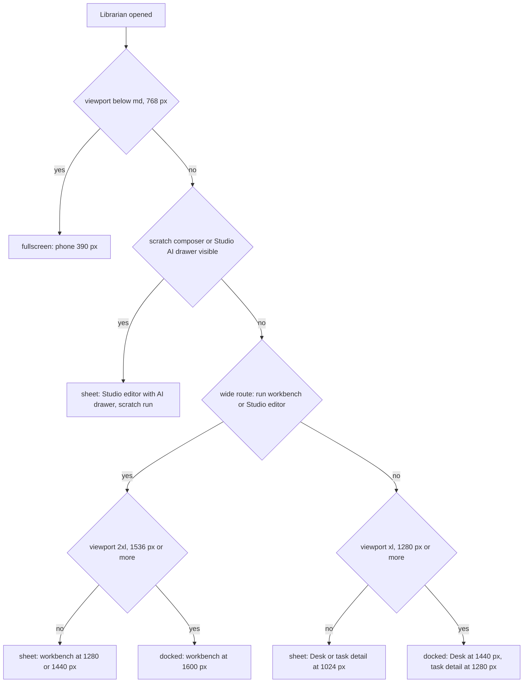

# ADR-191: Librarian surface: top-navigation entry and right-side panel

> Part of the ADR log — hub, index, and editing rules: [`../decisions.md`](../decisions.md).

**Date:** 2026-09-26
**Status:** Accepted

> Adds an entry to the top navigation of
> [ADR-172](../decisions.md#adr-172) and a state indicator that is deliberately
> **not** a third counter beside the two of
> [ADR-169](../decisions.md#adr-169-two-canonical-attention-counters-decisions-and-updates);
> neither record changes. The conversation it renders is
> [ADR-185](../decisions.md#adr-185-librarian-runtime-a-project-less-run-kind-with-per-turn-acp-sessions)'s.
> Owns requirement family `LUI`
> ([librarian-surface.md](../system-analytics/librarian-surface.md); screen:
> [librarian-panel.md](../screens/chrome/librarian-panel.md)).

**Context:** The brief ([personal librarian](../pv/personal-librarian.md) §4)
recommends a persistent top-navigation entry opening a right-side panel, docked
when there is room, a modal sheet on smaller widths and full screen on mobile, and
asks that the layout be confirmed on the Desk, task detail, workbench, Studio and a
390 px viewport. The shell it must fit, as it is today:

- `web/app/(app)/layout.tsx` renders `TopNav` (`:112`), a shell grid
  `grid-cols-1 md:grid-cols-[auto_1fr]` (`:127-128`) holding the left rail and
  `<main className="min-w-0 px-4 … md:px-9">` (`:139`), and the fixed status bar;
  the root reserves `pb-9` for it (`:111`). The layout computes both attention
  counters once per render (`:64-71`). Child navigation does not remount it.
- `TopNav` (`web/components/chrome/top-nav.tsx`) is sticky at `z-40` (`:35`); its
  right group holds `LangSwitch`, `ThemeSwitch` and `UserMenu` (`:79-83`). Its
  gutters were tuned so the header never scrolls the page sideways at 390 px
  (`EDGE-NAV-02`, `:36-43`). The status bar is `fixed … bottom-0 z-30 h-9`
  (`web/components/chrome/status-bar.tsx:30`). The rail is 260 px expanded, 48 px
  collapsed (`web/components/chrome/rail-collapse.tsx:36`).
- The Desk is one column at every width (`web/app/(app)/page.tsx:207-215`). Task
  detail is one column with a facts grid reaching five columns at `xl`
  (`web/app/(app)/projects/[slug]/tasks/[number]/page.tsx:608`). The run workbench
  splits at `xl` into content plus a 300–380 px column
  (`web/components/workbench/review-workspace.tsx:71`) over a file tree of up to
  300 px (`web/components/workbench/workbench-panel.tsx:206`); at 1280 px its split
  diff pane is already measured at 72 px (`web/CLAUDE.md`, review-comments note).
  The Studio local package editor keeps one right slot of `clamp(420px,34vw,560px)`
  for its own AI assistant, mounted and toggled with `hidden`
  (`web/components/studio/local-package-editor.tsx:1153-1165`).
- Cmd/Ctrl+K is taken: the primary scratch launcher listens on `window`
  (`web/components/chrome/scratch-launch-popover.tsx:54-86`) and stays silent while
  focus is in an input, textarea or contenteditable (`:70-79`) or while any
  `[aria-modal="true"]` element exists (`:80`).
- A project-less run's stream admits only its creator
  (`web/app/api/runs/[runId]/stream/route.ts:337-346` →
  `web/lib/scratch-runs/authorization.ts:12`), which is the librarian owner.

**Decision:** One librarian entry in the top navigation and one panel mounted once
in the authenticated layout. The panel has three presentations chosen by a pure
function of viewport, route and the presence of another assistant composer, and it
keeps its state across all of them.

**D1 — Entry.** A client island `web/components/librarian/librarian-trigger.tsx`
sits first in `TopNav`'s right group, before `LangSwitch`. It renders on every
`(app)` route for a signed-in user, `shrink-0`, icon-only below `md` and icon plus
label (**Librarian / Библиотекарь**) from `md` up, always with an accessible name
that includes the indicator state. When the librarian is disabled or has no ready
runner the entry still renders and the panel explains why (ADR-185 D8) (LUI-01;
`UT-LUI-01`, `E2E-LUI-01`).

**D2 — Indicator: a state, never a number.** The indicator is one of `none |
running | unread | action_required`, precedence `action_required > running >
unread`: `action_required` = a pending, unexpired owner card
(`librarian_cards.status='pending' AND requires_owner`); `running` = a turn
`admitted` or `running`; `unread` = a librarian, update or system message with
`seq > read_through_seq`. It is computed server-side once per layout render inside
the existing `Promise.all` (`layout.tsx:64`), like the counters (ADR-169 D8), and
kept live by `librarian.indicator` frames on `GET /api/librarian/stream`, which the
trigger holds while the tab is visible and reopens with `Last-Event-ID` after an
idle close or a `visibilitychange`. It renders as a dot — attention tone only for
`action_required`, which is actionable by the reader (ADR-169 D7), neutral for the
other two — and never as a count. Owner cards never enter `decisions`; the
librarian adds no badge and no notification type in this release (LUI-01;
`UT-LUI-01`).

**D3 — One panel, mounted in the layout.** `web/components/librarian/librarian-panel.tsx`
is rendered by `web/app/(app)/layout.tsx` inside a `LibrarianProvider` that also
wraps the trigger, so route navigation never remounts it: the conversation, the
draft, the scroll position and any in-flight turn survive. Collapse hides the panel
(the Studio slot's hide-don't-unmount precedent) and never cancels a server-side
turn or launched work. The draft is kept per user in `localStorage` inside
`try/catch`; reload restores messages, pending cards and queued messages from
`GET /api/librarian/conversation` (LUI-02; `E2E-LUI-02`).

**D4 — Three presentations, one pure rule.**
`librarianPanelMode({viewportWidth, pathname, hostComposerVisible})` in
`web/components/librarian/panel-mode.ts` returns:

| Condition (first match wins) | Mode | Shape |
| --- | --- | --- |
| width < `md` (768) | `fullscreen` | `fixed inset-0` above the top nav and status bar, `100dvh` column, composer sticky at the bottom so Send stays visible with the on-screen keyboard |
| another assistant composer is visible (D6) | `sheet` | right sheet `min(480px, 100vw - 64px)` with backdrop |
| wide route and width < `2xl` (1536) | `sheet` | as above |
| width < `xl` (1280) | `sheet` | as above |
| otherwise | `docked` | third track of the shell grid (`xl:grid-cols-[auto_1fr_auto]`), width `clamp(360px, 28vw, 440px)`, sticky below the top nav, bottom edge above the status bar |

Wide routes are a fixed prefix list in the same module: the run workbench
(`/runs/`) and the Studio editors (`/studio/edit/`, `/studio/local`). Docking there
below `2xl` would leave the diff and the canvas unusable (Context), so they get the
sheet until the viewport can afford both. An **expanded reading mode** toggle shows
the same panel as a sheet of `min(960px, 100vw - 32px)` for long statements; it is a
presentation of the one conversation, never a second one. A viewport change switches
mode without remounting the message list, so focus, draft and scroll are kept
(LUI-03; `E2E-LUI-03` at 1440, 1280, 1024 and 390 px).

**D5 — Focus and keys.** Docked, the panel is `<aside aria-label>` — a
complementary landmark, never `aria-modal` — so the page stays operable beside it.
Sheet and fullscreen are `role="dialog" aria-modal="true"` and use
`useModalA11y(ref, onClose, active)` (`web/components/use-modal-a11y.ts:22`, `active`
only in those modes) for containment, Escape, scroll lock and focus restoration.
Opening always focuses the composer; closing restores focus to the element that
opened the panel. The librarian registers **no** `window` or `document` key
listener of its own: Send and the composer shortcuts are bound on the composer
element, and docked Escape is an `onKeyDown` on the panel root, so an Escape meant
for a Studio dialog never collapses the librarian. It binds no Cmd/Ctrl+K. Because
docked mode sets no `aria-modal`, the scratch hotkey still opens the launcher while
the panel is docked and focus is outside an editable field; with focus in the
librarian composer, or while a modal presentation is open, the launcher's existing
guards keep it silent, as they do for every other text field and dialog (LUI-05,
LUI-09; `E2E-LUI-05`, `E2E-LUI-09`).

**D6 — Coexistence with other assistant composers.** A component that mounts an
assistant composer — `ScratchComposer` (`web/components/scratch/scratch-composer.tsx`)
and the Studio AI drawer (`StudioAiTab` in the local package editor) — registers
with `useLibrarianHostComposer(visible)` while it is visible. While one is
registered the librarian opens only as the sheet (fullscreen below `md`), so the two
composers are never side by side: exactly one has keyboard focus and the modal
librarian makes the host composer inert until it closes. The panel never reads,
renders or summarizes the host's transcript or Studio session; the owner can attach
the current page to the subject explicitly (a task or run reference by id), never
its history (LUI-05; `E2E-LUI-05`).

**D7 — Content behaviour.** The message list is built on `TranscriptView`
(`web/components/run-transcript/transcript-view.tsx:414`). An arriving message never
moves a reader who has scrolled up; a jump-to-latest control appears instead
(LUI-06; `UT-LUI-06`). The subject chip shows **General / Общий вопрос** or the
chosen tasks; it is stored on the message at send and a route change never
retargets a queued message or a pending card (LUI-04; `IT-LUI-04`). "Stop response"
(`POST /api/librarian/turns/current/stop`) and a run's "Stop run" are distinct named
controls, and every disabled control states its reason (disabled, no runner, budget,
reset in progress) (LUI-07; `UT-LUI-07`). The Needs attention / Related work region
reads `getLinkedWork(ownerId)` live (LUI-10; `IT-LUI-10`). A link in a card navigates
to the owning screen; docked, the panel stays; as a sheet or fullscreen it
collapses so the screen is visible, and reopening restores its scroll. Every string
lives in the `librarian` namespace in EN and RU with distinct copy (LUI-08;
`UT-LUI-08`).

**D8 — Live tokens ride the run stream.** While the panel is open (any mode) and a
turn is `running`, the panel subscribes `useRunStream` (`web/lib/use-run-stream.ts:42`)
on the conversation's run for that turn's tokens; the existing project-less authz
admits the owner only. The durable reply arrives as a `librarian.message` frame on
the librarian stream and replaces the streamed text. Collapsing unsubscribes; an
open or closed panel spends no model tokens by itself (LCV-12, ADR-185).

**Layout mockup.** Which presentation each confirmed screen gets. Every node is a
viewport and a route; the edges are the D4 rule.



Desk at 1440 px, docked; the Desk's single column narrows to about 690 px and keeps
its order.

```text
+------------------------------------------------------------------------------+
| = MAIster [Desk|Projects] PROJECTS / Desk       [Librarian .] EN  (o)  (AK)  |
+--------+--------------------------------------+------------------------------+
| rail   | Desk header, strip                   | Librarian            [<>] [x]|
| 260 px | Work in flight                       | Subject: General    [Attach] |
|        | Held                                 | Needs attention | Related    |
|        | Activity                             | messages (TranscriptView)    |
|        |                                      |            [Jump to latest]  |
|        |                                      | [composer                  ] |
|        |                                      | [Send] [Stop response]       |
+--------+--------------------------------------+------------------------------+
| status bar (fixed, h-9)                                                      |
+------------------------------------------------------------------------------+
```

Task detail at 1280 px, docked at the 360 px minimum; the facts grid keeps its five
columns in about 590 px, the tightest standard case.

```text
+-----------------------------------------------------------------------+
| = MAIster ... PROJECTS / app / KEY-12            [Librarian *]  (AK)   |
+--------+-------------------------------------+------------------------+
| rail   | KEY-12  title                       | Librarian       [x]    |
|        | [facts: 5 columns]                  | Subject: KEY-12        |
|        | prompt / statement                  | messages               |
|        | clarifications, comments, activity  | [composer] [Send]      |
+--------+-------------------------------------+------------------------+
```

Run workbench at 1440 px: a wide route below `2xl`, so the librarian is a sheet over
the workbench, which keeps its full width underneath.

```text
+------------------------------------------------------------------------+
| = MAIster ... PROJECTS / app / run                 [Librarian *] (AK)   |
+--------+-------------------------------------------+-------------------+
| rail   | workbench: file tree | diff | review col  | SHEET (modal)     |
|        | (dimmed behind the sheet backdrop)        | Librarian     [x] |
|        |                                           | messages          |
|        |                                           | [composer] [Send] |
+--------+-------------------------------------------+-------------------+
```

Studio local editor with its AI drawer open: another composer is visible, so the
librarian opens as a sheet at any width; the Studio drawer stays mounted and inert
until the sheet closes and focus returns to the invoker.

```text
+------------------------------------------------------------------------+
| = MAIster ... Studio / package                     [Librarian .] (AK)   |
+--------+---------------------------+---------------+-------------------+
| rail   | canvas / files            | Studio AI     | SHEET (modal)     |
|        |                           | (inert while  | Librarian     [x] |
|        |                           |  sheet open)  | [composer] [Send] |
+--------+---------------------------+---------------+-------------------+
```

Phone at 390 px: the entry is an icon in the top nav; opened, the panel is
fullscreen with the composer pinned to the bottom of the dynamic viewport.

```text
+--------------------------+      +--------------------------+
| = M  [D|P]   [L*] EN (AK)|      | Librarian          [x]   |
+--------------------------+      | Subject: General         |
| page content             |  ->  | Needs attention|Related  |
|                          |      | messages                 |
|                          |      | [composer              ] |
| status bar               |      | [Send] [Stop response]   |
+--------------------------+      +--------------------------+
```

**Amendment (2026-09-26, as built in T2.15).**

- **Header room at 390 px.** The top nav had about 5 px of slack at 390 px, and
  the entry needs ~46 px. Below `md` the logo's wordmark is now `sr-only`: the
  mark stays visible and the wordmark stays the home link's accessible name.
  `E2E-NAV-07`'s nav assertion holds with the entry present. (Its document
  assertion is red on `/projects` before this change too: the page's view
  toggle overflows by 6 px at 390 px.)
- **Live tokens.** See the ADR-185 amendment: the run stream drives a live
  "responding" status, not token text.
- **Subject attach.** The explicit "Attach this page" action attaches a run by
  the id in `/runs/{id}` or a project by the slug in `/projects/{slug}`; attaching
  a task by id arrives with task chips (T3.10).
- **Stop run.** "Stop response" ships now; the distinct "Stop run" control lands
  on the run chips of the Related work region (T3.10).
- **Unit test file.** `UT-LUI-01/06/07/08` live in
  `web/components/librarian/__tests__/panel.dom.test.ts`: the unit lane only
  collects `*.test.ts`, and `.dom.test.ts` is the existing jsdom convention.

**Consequences:**

- The librarian is reachable from every authenticated screen without claiming the
  bottom corner that task actions, editors, transcripts and the status bar use.
- Docking narrows `main`; screens with viewport-keyed `xl:` grids see less width
  than their breakpoint assumes. The Desk is unaffected (one column), task detail is
  the tightest accepted case, and the workbench and Studio editors are protected by
  the wide-route rule.
- A visible tab holds up to three streams: the attention stream, the librarian
  stream, and — only while a turn runs with the panel open — the run stream.
- A second assistant composer on screen forces the modal presentation; the owner
  trades side-by-side reading for an unambiguous focus owner.
- The indicator carries no number, so it never competes with `decisions` and
  `updates`; an owner card that also mirrors a real decision is counted once, by
  `decisions`.

**Alternatives Considered:**

- **A floating bottom-corner chat.** Rejected by the brief: that corner holds task
  actions, editors, transcripts and the status bar.
- **A left-rail section.** Rejected: the rail collapses to 48 px and is a drawer on
  mobile, so the entry would disappear exactly where the panel is fullscreen.
- **Dock at `xl` on every route.** Rejected: at 1280 px the workbench's diff pane is
  already 72 px wide; a docked panel would take the rest.
- **A numeric badge of unread replies.** Rejected: ADR-169 fixes two canonical
  counters; a third number would compete with them.
- **Reuse Cmd/Ctrl+K, or a second global chord.** Rejected: the chord belongs to the
  scratch launcher, and any window-level binding would fire while another composer
  or editor owns focus.
- **Absorb the Studio or scratch transcript into the librarian.** Rejected by the
  brief: each composer keeps its identity and history.

**Linked artifacts:** [`../system-analytics/librarian-surface.md`](../system-analytics/librarian-surface.md)
(`LUI-01..10`) · [`../screens/chrome/librarian-panel.md`](../screens/chrome/librarian-panel.md)
· [`../screens/chrome/top-nav.md`](../screens/chrome/top-nav.md)
· [`../system-analytics/librarian-traceability.md`](../system-analytics/librarian-traceability.md)
