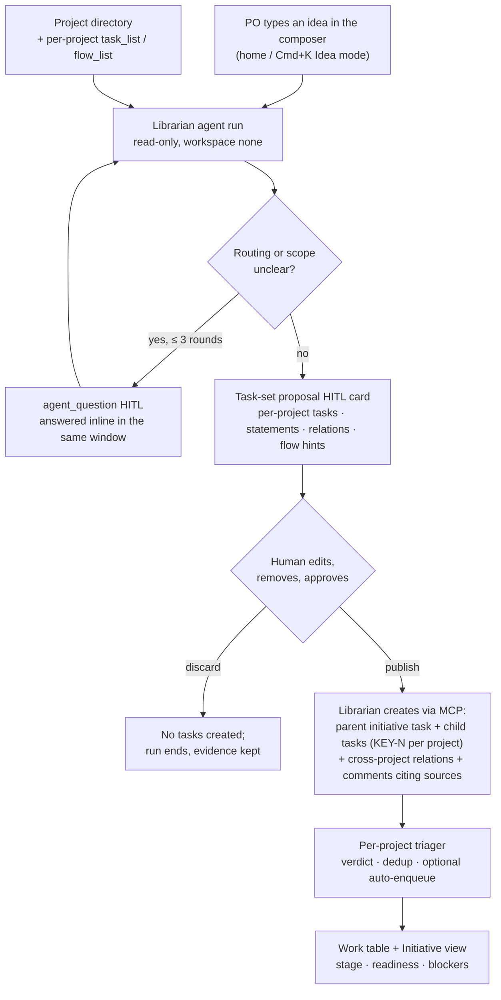
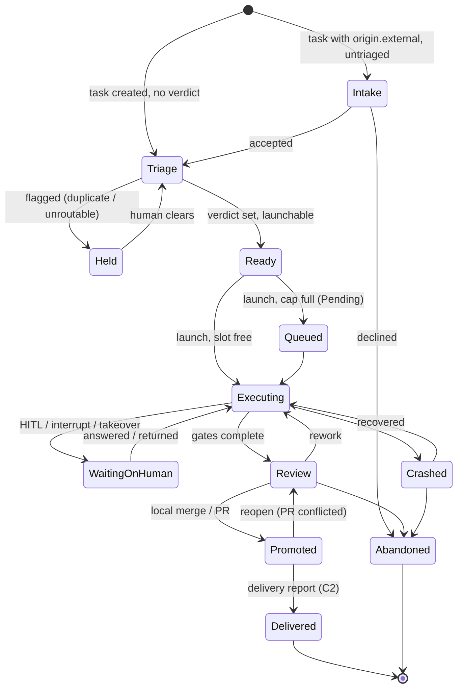

# Team visibility, decision routing, and PO idea intake — options brief

> **Status: research brief / ranked feature options (2026-09-10).** Not a
> committed plan, changes no ADR, supersedes nothing. Lives in `docs/pv/`
> beside [`improvement-roadmap.md`](improvement-roadmap.md) and
> [`flow-authoring-assistant.md`](flow-authoring-assistant.md). It answers one
> owner question: *what could MAIster add so that a team understands what is
> happening, what happened, what waits on them, what agents did outward, and
> so that a PO can drop an idea into one window and get it decomposed into
> tasks across projects* — and ranks the options by expected user comfort.
> Inputs: the current `docs/system-analytics/*`, `docs/screens/*`, and
> `.ai-factory/ROADMAP.md`.
> Everything tagged *(Implemented)* below is what those docs say exists today;
> nothing here is scheduled — M45 core-package qualification remains the only
> open milestone. **Owner review, 2026-09-10:** the open questions were
> answered (§7), the Desk layout was settled on a mockup (§8), and the wave-1
> scope was handed to `/aif-plan` (§9); §4 keeps the original wave order for
> the record.

## 1. The ask, split into five product questions

| # | Question a team member asks | Who asks it most |
| --- | --- | --- |
| A | **What is happening now, and what happened while I was away?** | everyone; async teammates |
| B | **What is waiting on me, and what decision exactly?** | reviewers, owners |
| C | **What did agents do outside MAIster** — PRs, comments, webhooks, tool calls — and did the change actually ship? Which work arrived from outside? | owners, PO |
| D | **Can I drop an idea in one window and have it turned into well-formed tasks across the right projects, with questions asked when needed?** | PO |
| E | **Where is every task in flight — stage, readiness, blockers, cost — on one surface?** | PO, owners |

The five are ranked separately in §3 and merged in §4. §5 sketches the one
piece that does not exist in any form today: the *librarian* agent behind D.

## 2. MAIster today — gap map per question

Everything in the "exists" column is *(Implemented)* per the domain docs;
pointers are to the owning doc.

| Area | Exists today | Gap | Locked constraints to respect |
| --- | --- | --- | --- |
| A — now / history | Per-project **Activity** tab: agent-run feed (30 items) + filterable task Log (`getProjectActivityLog`, actor/kind/task filters, page 50) — [`../system-analytics/social-board.md`](../system-analytics/social-board.md); run Timeline/Evidence — [`../screens/runs/workbench.md`](../screens/runs/workbench.md); `/runs` ledger; `domain_events` (13 kinds) and the assistant pulse `GET /api/v1/ext/activity` (`happened / now / needsYou / agents`) — machine-facing, project-scoped — [`../system-analytics/assistant-activity.md`](../system-analytics/assistant-activity.md); Observatory metrics | No **cross-project human feed**; no "since you last looked"; no digest (ROADMAP backlog §A1, ADR-123 reserved for a standup-digest agent); `run_finished` is not a `task_activity` kind yet (needs the `setRunStatus` choke point) | `task_activity` is written only by the domain layer in the same transaction; pulse never exposes raw ACP frames, worktree paths, diff bodies |
| B — waiting on me | Unified `/inbox` (HITL cards + mentions), canonical `needsYou = pendingHitl + unreadInbox` on rail/home/board/inbox — [`../screens/inbox.md`](../screens/inbox.md); seven HITL kinds; machine inbox `hitl_inbox` (personal token only) | Review-ready runs (`needsYou.promotable` exists only on the machine pulse), `Crashed` recover/discard, `flagged` duplicates, and relation-blocked tasks the user owns are outside the inbox; no snooze/delegate; assignments `Open | Claimed | Working` are *(Planned)*; no notification channel at all; escalation calendars deferred | token/agent actors answer only `permission`/`form`; `human`, `budget_breach`, `node_interrupt` are human-only; "Web UI notifications first; Telegram later" |
| C — external actions | Outbound: PR creation via `gh`/`glab` (ADR-049), `pr_state_scan` → `run_pr_merged`, outbound webhooks (16 types, HMAC, retries, delivery log UI — ADR-077), MCP facade to MAIster itself, third-party MCPs via capability profiles (strict at the ACP seam for flow nodes; standalone agents still a follow-up); inbound: `POST /api/agents/{id}/event`, ext `tasks:create`, `external_check` gate reports — [`../system-analytics/external-operations.md`](../system-analytics/external-operations.md) | No human-readable **effects ledger** (`token_audit_log` has no UI); **no delivery/rollout state after merge** — the board's `InDelivery` column is a worktree-presence approximation; no **intake queue** for inbound work; GitHub issue / Linear sync is "Later" | "Deploy/release management stays manual and outside MAIster"; board sync only after draft/publish, dedup, severity, cooldown, human-feedback controls exist ([`../PRODUCT_VIEW.md`](../PRODUCT_VIEW.md) §Phase 2.7) |
| D — idea intake | Simple-intent tasks (title + prompt, flow optional); the **triager** agent per project: dedup → `duplicate_of` + `flagged`, clarify ≤ 3 rounds via comments/`ask_human`, verdict `flowId + runnerId + baseBranch`, optional `launch_mode='auto'` — [`../system-analytics/triage.md`](../system-analytics/triage.md); orchestrator `run_plan` (same-project DAG with `requires` edges); Brain proposal → Backlog task projection; cross-project agent reach: `tasks:create`, `comments:*`, `relations:*` in a sibling project with `cross_project_reach` (ADR-156, chain depth ≤ 2); Cmd/Ctrl+K scratch launcher | **No librarian**: nothing takes a multi-project idea, decides which project owns what, asks, and drafts a task set; no cross-project project knowledge (Brain recall "MUST NEVER return items across a `project_id` boundary"); no draft state for an agent-authored task set; no task statement schema | orchestrator delegation stays same-project (M49 non-goal); nothing auto-applies; `triage_confidence` is advisory only; relations may cross projects, the automation they drive may not |
| E — observation | Board with 7 derived columns, compact flight card (progress spine + current node label) — [`../screens/projects/project-board.md`](../screens/projects/project-board.md); inbox card `done/total` + stage chip; run page graph + node list; orchestrator run tree; readiness read models incl. bulk `computeReadinessByRun`; portfolio home = project cards + active workspaces; Observatory autonomy/correction/agentization | No **cross-project task-level table** (home is repo-centric, `/runs` is run-level); no canonical *stage* vocabulary shared by board/inbox/feed; no typical-duration signal; no initiative/epic view across projects | task state stays `Backlog | InFlight | Done | Abandoned`; no drag-and-drop, no WIP limits, no cross-project task moves; Observatory labels say "signals", never recommendations |

## 3. Options, ranked per area

### 3.0 Scoring

- **Comfort** (the requested primary key, 1–5): how much daily friction it
  removes for the people who hit it, with near-zero learning. 5 = removes a
  question people ask every day; 3 = pleasant for power users; 1 = cosmetic.
- **Who**: PO · owner · reviewer · engineer · everyone.
- **Fit**: ✓ fits locked decisions and needs no new engine/state; ⚠ needs one
  decision (new read model, additive schema, DSL floor, or IA change);
  ✗ conflicts with a stated non-goal.
- **Effort**: S = read-only projection over existing read models, one surface;
  M = a new read model or additive table plus one or two surfaces; L = a new
  entity or agent plus several surfaces.

Within each area the table is sorted by comfort, then fit, then effort.

### 3.A — What is happening / what happened

| Id | Option | Comfort | Who | Fit | Effort | Depends on |
| --- | --- | --- | --- | --- | --- | --- |
| A2 | **Attention digest** — a per-user, per-period summary card (home + `/inbox` header): finished · blocked · needs you · promoted · crashed · cost, with links; v0 deterministic SQL over runs/HITL/`task_activity`, v1 optionally narrated by the reserved standup-digest agent (ADR-123) | 5 | everyone, async teams | ✓ (ROADMAP backlog §A1) | M | none for v0 |
| A1 | **Cross-project Activity stream** (`/activity`, also the home side rail): one feed over `task_activity` + run terminal transitions + gate failures + promotions + PR merged + outbound effects, filters (project / actor type / kind / mine), live via SSE; the human twin of the machine pulse | 4 | everyone | ✓ | M | A1 needs `run_finished` in `task_activity` or a read-side union with `domain_events.run.*` |
| A5 | **"Since you were away"** — per-user read cursor on A1 with an unread divider and a count in the rail | 4 | everyone | ✓ | S | A1 |
| A6 | **Home "Now" strip** — running · waiting on human · in review · crashed counts with jump links, per-project activity sparkline | 4 | owner | ✓ | S | none |
| A3 | **Task story** — one vertical timeline on task detail merging attempts, HITL, comments, relations, promotion, PR state (today: a runs table plus a separate comment/activity timeline) | 4 | engineer, reviewer | ✓ | S–M | none |
| A4 | **Run replay scrubber** — step through Timeline entries with the transcript and the diff-at-node beside them; export bundle | 3 | power users | ✓ | M | none |

Notes:

- A2 beats A1 on comfort because the digest answers the question a returning
  person actually has ("what do I need to know") instead of showing everything.
  A1 is the drill-down A2 links into; build A1's read model first, render the
  digest from it.
- Nothing in A needs schema; the only write is the per-user cursor (A5).

### 3.B — What is waiting on me

| Id | Option | Comfort | Who | Fit | Effort | Depends on |
| --- | --- | --- | --- | --- | --- | --- |
| B1 | **Complete decision queue** — admit to `/inbox` the item kinds the machine pulse already classifies but humans never see: *ready to promote* (`needsYou.promotable`, bulk readiness), *crashed — recover or discard*, *flagged — duplicate or unroutable*, *blocked — a relation you own*; one section each, same card shell, same `needsYou` count | 5 | reviewer, owner | ✓ | S–M | none |
| B3 | **Notification routing** — (a) web push for `needsYou` deltas and A2 digests, self-hosted VAPID, per-user opt-in; (b) a Telegram notifier as a *consumer* of the ADR-077 outbound-webhook primitive (the "Telegram / notifier consumers" Phase-2 candidate), later answering `permission`/`form` HITL through the existing token rules | 5 | async teams | ✓ ("web first, Telegram later") | S (push) · M (Telegram) | A2 for digest push |
| B5 | **Mobile pass** — `/inbox` cards, the node-interrupt matrix, and the promote decision usable on a phone; PWA manifest so it installs | 4 | owner, reviewer | ✓ | M | none |
| B4 | **Structured Ask** — every human HITL carries `{question, why, options[{label, consequence}], recommended}` the way plan-review cards already do (ADR-137); flows declare it per human node, adapters fill it for permission asks | 4 | everyone | ⚠ (DSL floor bump) | M | none |
| B2 | **Snooze / delegate / claim** — snooze until time or event, hand an item to a teammate, claim-to-work, keyboard triage (`j/k`, allow/deny) | 4 | heavy users | ⚠ (assignment semantics "must be proven first") | M | assignments |
| B6 | **Aging and escalation** — waiting-time thresholds per criticality, auto-route to the next role after N hours | 3 | teams | ⚠ (escalation calendars deferred) | M | B2 |

Notes:

- B1 is the single highest value-per-effort item in this brief: every read
  model exists, the card shell exists, and it turns the inbox into a complete
  decision inbox without a new concept.
- B3(a) web push is small and keeps the "no external service" property; the
  Telegram consumer should be built once, as a webhook consumer, so Slack or
  email are later configurations, not new integrations.

### 3.C — Agent actions with the outside; inbound work

| Id | Option | Comfort | Who | Fit | Effort | Depends on |
| --- | --- | --- | --- | --- | --- | --- |
| C2 | **Delivery observation** — an inbound, provider-neutral *delivery report* (`POST …/runs/{runId}/delivery` or a webhook: `{environment, status, url, ref}`) recorded as an artifact and rendered as chips on task card, work table, and task story: `merged → staging ✓ → prod ⏳`; `InDelivery` becomes real instead of a worktree-presence guess | 5 | PO, owner | ⚠ (must stay observation-only; deploy management remains outside MAIster) | M | none |
| C3 | **Intake queue** — inbound sources (generic webhook, GitHub issue webhook, Telegram/Slack bot message, email, form, ext API) create tasks with `origin {source, externalRef, url}` and `triage_status = NULL`, shown in a derived **Intake** board column with *Accept / Decline / Merge into KEY-N*; per-source policy: dedup by external ref, cooldown, severity default, auto-accept for trusted sources; the triager handles routing after accept | 5 | PO, teams | ⚠ (this *is* the draft/dedup/severity/cooldown control set the docs require before board sync) | L | none; C4 for visibility |
| C1 | **External effects ledger** — one read model + UI over `token_audit_log`, `webhook_deliveries`, PR create/merge facts, and external MCP tool calls projected from `run_messages` (tool name, target, outcome, never bodies): per run ("what this run did outward"), per project, and as A1 entries | 4 | owner, reviewer | ✓ (evidence principle) | M | none |
| C4 | **Outward actions in the feed** — A1 renders C1 entries: "opened PR #12", "posted comment", "webhook delivered to …", "deployed to staging (reported by CI)" | 3 alone, part of A1 | everyone | ✓ | S | A1, C1 |
| C5 | **Provider two-way sync** (GitHub issues, Linear, YouGile) | 4 | teams on those trackers | ✗ ("Later" in VISION) | L | C3 is the prerequisite either way |

Notes:

- C2 answers "did it ship?" — the one question the board cannot answer today —
  while keeping MAIster out of deploy management: it only *receives* reports,
  the way `external_check` receives gate results.
- C3 reuses the four locked task states (Intake is a derived column like the
  other seven), the existing triager, and `KEY-N` numbering (holes are already
  accepted). The Telegram bot from B3 doubles as an intake source.

### 3.D — Idea intake and decomposition (the librarian)

| Id | Option | Comfort | Who | Fit | Effort | Depends on |
| --- | --- | --- | --- | --- | --- | --- |
| D1 | **Librarian v1** — one idea composer (home / Cmd+K "Idea" mode) → a read-only platform agent reads the project directory and backlogs → asks bounded clarifying questions in the same window → proposes a **task set** (per-project tasks with statements, cross-project relations, flow hints) as a purpose-built HITL card the human edits → **publish** creates the tasks, relations, and a parent initiative task; nothing launches unless the human opts in | 5 | PO | ⚠ (new agent + one HITL schema + a directory read model; every target project opts in via `cross_project_reach`) | L | D5, D7 |
| D5 | **Project directory** — a platform-level, human-editable summary per project (purpose, domains, owners, tech, launchable flows, recent task titles, top Brain state facts) exposed as a `project_directory` MCP tool and a small `/projects` index page; Brain stays per-project | 4 | PO, new teammates, agents | ✓ | M | none |
| D7 | **Task statement schema** — `task_statement` typed artifact `{context, goal, acceptance[], outOfScope[], links[]}`; the composer, the librarian, and the triager fill it; flows may require it (`input.requires`); board and work table show completeness | 4 | teams, agents | ✓ | S–M | none |
| D2 | **Conversational librarian** — a persistent chat where tasks are created live as the conversation goes | 4 | PO | ✗ (no draft/publish gate; "chat-with-agent" deferred post-dogfood) | M | D5 |
| D3 | Decompose through an orchestrator flow | 3 | — | ✗ (delegation is same-project by construction) | — | — |
| D4 | Manual epic + child templates, no agent | 2 | PO | ✓ | S | D7 |

Notes:

- D1's comfort is the requested JTBD; its fit is ⚠ only because it adds one
  agent definition and one HITL schema — the write path (tasks, relations,
  comments in N projects) already exists under ADR-156. §5 has the sketch.
- D5 is worth doing on its own: a human-readable "what is this project for"
  page is missing for teammates too, and it is the knowledge the librarian
  needs to route ("from its own understanding of which project does what").
- D2 is the chat-first version; it is ranked below D1 because publishing a
  task set without a review step is exactly the agent-output noise the docs
  gate on. It can become D1's v2 (keep the conversation, keep the gate).

### 3.E — One surface for every task in flight

| Id | Option | Comfort | Who | Fit | Effort | Depends on |
| --- | --- | --- | --- | --- | --- | --- |
| E1 | **Work table** — `/work` (and the home default for non-admin members): every `InFlight` task across visible projects as one dense list: `KEY-N` · title · project · **stage** · run dot · readiness · `done/total` · waiting-on (role, age) · blockers · tokens · last activity · next action; group by project / stage / initiative / owner; filters; saved views; SSE-refreshed | 5 | PO, owner | ✓ (pure read: board read model + `computeReadinessByRun` + `getRunNodeStatuses` + needs-you) | M | E4 for the stage column |
| E3 | **Initiative view** — the librarian's parent task rendered as a cross-project DAG (React Flow + dagre, the evidence-graph stack) with per-child stage, readiness, and "what blocks the initiative"; the existing decomposition block generalized | 5 | PO | ✓ (`parent_of` + cross-project relations exist) | M | D1 (or manual parent tasks) |
| E4 | **Canonical stage model** — one derived vocabulary `Intake → Triage → Ready → Queued → Executing(node k/N) → Waiting on human → Review → Promoted → Delivered`, plus `Held / Crashed / Abandoned`, computed by one `deriveTaskStage` used by board, inbox, feed, work table, digest | 4 | everyone | ✓ (derived, no new persisted state) | S–M | C2 for `Delivered` |
| E5 | **Typical duration** — per flow/node medians from the Observatory ledger shown as "typically 40 min · running 25 min"; never an ETA estimate | 3–4 | owner | ✓ ("signals, never recommendations") | S–M | none |
| E2 | **Timeline / Gantt-lite** — tasks as bars over time with dependency edges | 3 | PO planning | ✓ | M–L | E1, E3 |

Notes:

- E1 is a projection: the board read model, `computeReadinessByRun`,
  `getRunNodeStatuses`, the needs-you query, and cost summaries already exist;
  the new work is one query that joins them across visible projects and one
  dense table with grouping and saved views.

### 3.F — Cross-cutting: the "one window"

| Id | Option | Comfort | Who | Fit | Effort | Depends on |
| --- | --- | --- | --- | --- | --- | --- |
| F1 | **Desk** — the home page recomposed for people who think in work, not repos: idea composer on top (D1), the decision queue strip (B1), the work table (E1) grouped by initiative, the activity stream / digest in a side column (A1/A2); the project-card portfolio stays one toggle away | 5 | PO, owner | ⚠ (home IA change) | M once its parts exist | A1/A2, B1, D1, E1 |
| F2 | **Command palette** — the existing Cmd/Ctrl+K launcher grows modes: *Scratch* (today), *Idea* (D1), *Go to KEY-N / project / run*, *Answer next decision* | 4 | everyone | ✓ | S–M | D1 for Idea |

## 4. Overall ranking and a suggested order

Sorted by comfort, then fit, then effort. The order is *not* a schedule: the
current milestone is M45, and the vision says to pull surface work forward only
when pilot data shows the need. Wave 1 is the cheapest way to produce that
evidence — it is all read-only.

| Rank | Option | Comfort | Fit | Effort | Why here |
| --- | --- | --- | --- | --- | --- |
| 1 | B1 Complete decision queue | 5 | ✓ | S–M | highest value per effort; finishes the inbox |
| 2 | E1 Work table (+ E4 stage model) | 5 | ✓ | M | the requested observation surface; no schema |
| 3 | B3 Notifications (web push, then Telegram consumer) | 5 | ✓ | S · M | comfort is unlocked only when people are told |
| 4 | A2 Attention digest (v0 deterministic) | 5 | ✓ | M | the answer to "what did I miss" |
| 5 | D1 Librarian v1 (after D5, D7) | 5 | ⚠ | L | the PO JTBD; gated, reuses the write paths |
| 6 | C2 Delivery observation | 5 | ⚠ | M | closes "did it ship?" without deploy management |
| 7 | E3 Initiative view | 5 | ✓ | M | makes the librarian's output observable |
| 8 | C3 Intake queue and sources | 5 | ⚠ | L | the missing front door; also the required control set for board sync |
| 9 | A1 + A5 Activity stream with unread cursor | 4 | ✓ | M + S | drill-down for A2; the human pulse |
| 10 | D5 Project directory | 4 | ✓ | M | prerequisite of D1, useful alone |
| 11 | C1 External effects ledger | 4 | ✓ | M | "every action leaves evidence", outward |
| 12 | D7 Task statement schema | 4 | ✓ | S–M | quality floor for tasks from any source |
| 13 | B5 Mobile pass / PWA | 4 | ✓ | M | phone-grade steering |
| 14 | F1 Desk home | 5 | ⚠ | M | only once 1–9 exist; otherwise it is an empty shell |
| 15 | B4 Structured Ask | 4 | ⚠ | M | needs a DSL floor bump |
| 16 | A3 Task story | 4 | ✓ | S–M | nice, overlaps E3 and A1 |
| 17 | B2 Snooze / delegate / claim | 4 | ⚠ | M | wait for assignment semantics |
| 18 | E5 Typical duration | 3–4 | ✓ | S–M | honest signal, small |
| 19 | A6 Home "Now" strip | 4 | ✓ | S | folds into F1 |
| 20 | F2 Command palette modes | 4 | ✓ | S–M | with D1 |
| 21 | A4 Replay scrubber · B6 escalation · E2 Gantt-lite · C5 provider sync | ≤ 3 or ✗ | | | later or non-goal |

Suggested waves:

1. **See everything (read-only, no schema).** E4 → E1 → B1 → A1/A5 → A6 → A2
   v0 → B3 web push. Every item is a projection over existing read models, so
   it deepens the wedge and ships evidence for the pilot telemetry (review
   reach, human-attention time).
2. **The librarian.** D5 → D7 → D1 → E3 → F2 Idea mode → F1 Desk.
3. **Edges.** C1 → C2 → C3 (with the Telegram bot as both notifier and intake
   source) → B5 → B2/B4 once assignments and the DSL bump are decided.

The owner review (§7) pulled F1 Desk v0 into wave 1 and replaced the Telegram
bot with a personal-assistant token plus a publish channel; the agreed wave-1
cut is in §9.

## 5. Librarian v1 — concept sketch

The librarian is a **platform agent** in the core package
(`maister-agents/librarian.md`), the same substrate as the triager
([`../system-analytics/triage.md`](../system-analytics/triage.md)): `workspace:
none`, `mode: session`, `risk_tier: read_only`, triggers `manual` and an
`idea.submitted` event. It never launches anything. What it adds beyond the
triager is *scope* (many projects) and *output* (a set of tasks, not a verdict
on one).

This flow shows one idea travelling from the composer to observable work; every
box after "publish" is existing machinery.

Interaction contract:

- **One window.** The composer, the clarification thread, and the proposal card
  are one scrolling surface; a question the PO does not answer now also lands
  in `/inbox` as an `agent_question` card (ADR-136), so leaving the window
  never loses the run.
- **Reading, not guessing.** The librarian routes with the project directory
  (D5), each project's backlog (`task_list`), launchable flows (`flow_list`),
  and, when available, that project's Brain state facts; it cites what it used
  in the task comment ("routed here because the directory names billing as this
  project's domain; depends on KEY-42 which already changes the invoice model").
- **Proposal card = draft state.** The proposal lives in the run's
  `hitl_requests` row with a purpose-built schema (like consensus and
  budget-breach cards): editable title/statement per item, project picker,
  remove/add, relation kind between items, "launch after triage" per item
  (default off). No new table until a second consumer of drafts appears.
- **Publish path reuses ADR-156.** The librarian is attached to every project
  that allows it (`agent_project_links.cross_project_reach = true`,
  scopes `tasks:create`, `comments:create`, `relations:*`); a project that has
  not opted in is simply not a routing target, and the card says so. The
  initiative is a normal task in the PO's chosen project with `parent_of` edges
  to children in other projects — the board already renders each child's own
  `KEY-N` and project slug. *Revised in review (§7): the initiative becomes its
  own entity that holds the conversation and the decisions, and the librarian
  attaches at platform level; the per-project reach and parent-task variants
  above stay as the zero-schema fallback.*
- **Bounds.** Clarification ≤ 3 rounds then `flagged` (triager rule); at most
  N items per proposal (config); chain depth stays ≤
  `MAISTER_MAX_AGENT_CHAIN_DEPTH`; the librarian holds no `runs:*` scope.
- **Failure modes are domain outcomes, not errors.** No project fits → the
  card asks the PO to pick or to register a project; a near-duplicate is shown
  as "looks like KEY-17 — link instead of create?"; a target project without the
  librarian enabled is listed with a one-click "enable in project settings".

The derived stage vocabulary (E4) that the work table, inbox, feed, and
initiative view would share — computed, never persisted; the four task
statuses and the run statuses stay as they are:

## 6. Risks and anti-patterns to avoid

- **Turning the inbox into a second board.** B1 admits *decisions*, not work;
  an item leaves the queue the moment it no longer needs a human.
- **Percent-complete theatre.** `done/total` nodes and typical durations are
  honest; a computed ETA is not. E5 must stay a signal (Observatory rule).
- **Agent output without a gate.** D2/C5-style live creation is the noise the
  product has deliberately refused so far; keep the proposal card and the
  intake column as the gates.
- **A second event log.** A1/A2/C1 read from `task_activity`, `domain_events`,
  and existing audit tables; they must not introduce another outbox (the
  webhook-outbox consolidation, ROADMAP §A12, goes the other way).
- **Breaking project isolation for knowledge.** D5 is a *directory* of
  summaries, opt-in per project; Brain recall stays inside `project_id`.
- **Notification fatigue.** B3 sends `needsYou` deltas and digests only; never
  per-event streams by default.

## 7. Decisions from the owner review (2026-09-10)

The seven questions the first cut left open were answered in review, together
with two questions raised while planning. "Leaning" marks an answer the owner
gave as a preference rather than a final call.

| # | Question | Decision | Consequence |
| --- | --- | --- | --- |
| 1 | Is the Desk (F1) a replacement for the portfolio home? | Yes — try it. A log of events and decisions, with the librarian conversation living in it later, is the better Home; the project-card portfolio moves to `/projects`, one switch away. | F1 Desk v0 moves into wave 1; A1, B1, A2 and E1 are built as its regions. |
| 2 | Where does an initiative live? | Leaning: a separate entity. The conversation with the librarian and the decisions taken attach to it; it is decomposed into project tasks afterwards. | D1 gets an initiative entity instead of a parent task; E3 renders it. It groups tasks and holds decisions — it never owns repos or automation, so the M49 meta-project non-goal is not reopened. |
| 3 | Delivery reports (C2): generic inbound only, or GitHub deployment statuses too? | Undecided; the value looks significant once the unified surface exists. | C2 stays in wave 3; the source question is decided then. |
| 4 | Intake (C3): declined items as `Abandoned` tasks or a pre-task row? | A separate entity, so declined intake never burns `KEY-N` numbers. | C3 gets an intake row; *accept* creates the task. |
| 5 | Notifications (B3): web push or Telegram first? | Web push first. No Telegram bot inside MAIster: an external personal assistant holding a personal API token reads the decision queue and relays it. Add a publish channel with per-user subscriptions so events can be forwarded anywhere. | B3 = web push + user notification subscriptions (`web_push` \| `webhook`) delivered through the ADR-077 engine + ext parity for personal tokens. |
| 6 | Structured Ask (B4) needs an engine-floor bump — acceptable? | Yes. | B4 stays out of wave 1 but is unblocked for the librarian's proposal card in wave 2. |
| 7 | Librarian: platform-level attachment or per-project opt-in? | Leaning: platform-level, with access to the projects on the platform. | D1 plans a platform-level attachment; whether a project can opt out is settled in the librarian plan. |
| — | One counter or two? | Two canonical counters, each from one query and identical on every surface: **decisions** = respondable HITL + ready to promote + crashed + flagged (rail Inbox badge, attention tone); **updates** = unread mentions and comments + unread activity since the cursor (rail Activity badge, neutral tone). Relation-blocked tasks count in neither. `needsYou` retires in favour of `decisions`. | B1 and A5 define the two queries; the ADR restates the one-number-per-surface rule for both. |
| — | Design the Desk before building it? | Settle the layout on a mockup first (three states, desktop and narrow), write `docs/screens/desk.md` as the contract, then build the components in code and tune them on live data. Components need no mockup — the design system already fixes them. | §8; P4 of the plan starts with the screens doc. |

## 8. Desk mockup

[MAIster Desk canvas](https://claude.ai/code/artifact/c1326e0e-5aec-4aae-aa82-e4459ed647f5)
— six artboards: busy, quiet and empty, each at desktop 1440 and narrow 390,
drawn with the app's own tokens (forest palette, Inter and JetBrains Mono,
260 px rail, 14 px cards, the chip and pill vocabulary of `HitlCard` and
`ProjectCard`). Static, not clickable; copy in English; the sample projects and
tasks are invented.

What the mockup settles:

- **Hierarchy, top to bottom:** composer (scratch run today, Idea mode with
  the librarian in wave 2) → Now tiles (Running · Decisions · In review ·
  Queued · Crashed) → Decisions with inline actions (Allow / Deny, Promote,
  Review plan, Recover / Discard, Link duplicate) → Work in flight grouped by
  project (stage with a progress spine, readiness, waiting on, tokens, last
  event) → Activity with the unread divider "your last visit". On desktop
  Activity sits beside Decisions and the table takes the full width; narrow
  stacks Decisions → Work → Activity.
- **Two counters in the rail:** Inbox shows decisions (attention tone),
  Activity shows updates (neutral tone).
- **The portfolio stays one switch away:** a Desk | Projects control top
  right; `/projects` keeps today's project cards.
- **Empty state** reuses the first-run checklist and the empty-state card
  inside the Desk frame; the composer is absent until a project exists.
- **Every number is derivable:** tiles, badges, group headers and "showing N
  of M" are computed from one sample data set — the property the real read
  models must keep.

## 9. Wave 1 scope as handed to `/aif-plan`

In: E4 stage model · E1 work table (`/work`) · B1 complete decision queue with
the two counters and ext parity (`GET /api/v1/ext/decisions`) · A1 activity
stream (`/activity`) · A5 unread cursor · A6 Now strip + A2 digest v0
(deterministic) · F1 Desk v0 as `/` with the portfolio moved to `/projects` ·
B3 web push + user notification subscriptions (`web_push` \| `webhook` over
ADR-077) + subscription ops for personal tokens.

Out: D1 librarian, the initiative entity and E3, D5 project directory, D7 task
statement schema, C3 intake, C2 delivery reports, C1 effects ledger, B4
structured Ask, B2 snooze / delegate, B5 mobile pass, any Telegram bot, agent
narration, USD cost, any change to the run or task state machines.

Phases: P1 stage model + work table · P2 decision queue + ext parity · P3
activity + cursor + digest v0 · P4 Desk home + `/projects` + rail (screens doc
first, per §8) · P5 web push + subscriptions · P6 docs, ADR, `validate:docs`.
If one plan is too large, split it as 1a = P1, P2, P4 and 1b = P3, P5, P6.

## Sources

- Repo docs: [`../VISION.md`](../VISION.md), [`../PRODUCT_VIEW.md`](../PRODUCT_VIEW.md),
  [`../system-analytics/tasks.md`](../system-analytics/tasks.md),
  [`../system-analytics/social-board.md`](../system-analytics/social-board.md),
  [`../system-analytics/triage.md`](../system-analytics/triage.md),
  [`../system-analytics/agents.md`](../system-analytics/agents.md),
  [`../system-analytics/assistant-activity.md`](../system-analytics/assistant-activity.md),
  [`../system-analytics/hitl.md`](../system-analytics/hitl.md),
  [`../system-analytics/external-operations.md`](../system-analytics/external-operations.md),
  [`../system-analytics/outbound-webhooks.md`](../system-analytics/outbound-webhooks.md),
  [`../system-analytics/orchestrator.md`](../system-analytics/orchestrator.md),
  [`../system-analytics/project-brain.md`](../system-analytics/project-brain.md),
  [`../system-analytics/observatory.md`](../system-analytics/observatory.md),
  [`../screens/inbox.md`](../screens/inbox.md),
  [`../screens/projects/project-board.md`](../screens/projects/project-board.md),
  [`../screens/chrome/left-rail.md`](../screens/chrome/left-rail.md),
  [`../screens/runs/flow-run.md`](../screens/runs/flow-run.md),
  `.ai-factory/ROADMAP.md` (M45 open; backlog §A1, §A12).
- Desk mockup: the canvas linked in §6.
