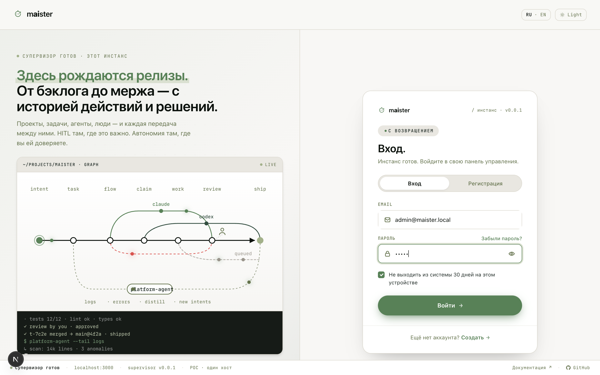
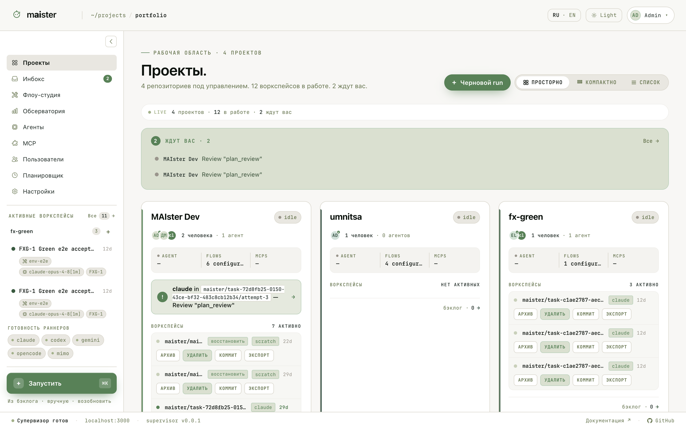

# Вход и оболочка интерфейса

Откройте `http://localhost:3000` (или адрес вашего инстанса) и войдите под
своим пользователем. В свежей установке администратора создаёт
`pnpm --filter maister-web db:seed`; детали запуска — в
[Первом запуске](../getting-started.md).

## Как устроена оболочка

После входа вы попадаете в портфель проектов. Оболочка одинакова на всех
экранах:

- **Левая панель** — разделы (Проекты, Инбокс, Флоу-студия, Обсерватория,
  Агенты, MCP, Пользователи, Планировщик, Настройки), блок активных
  воркспейсов со статусами живых прогонов, готовность раннеров и кнопка
  **Запустить** (`Cmd/Ctrl+K`). Числовой бейдж на Инбоксе — сколько запросов
  ждут вашего решения по всем проектам.
- **Верхняя панель** — хлебные крошки, переключатели локали (RU/EN) и темы,
  меню пользователя.
- **Строка состояния** внизу — здоровье супервизора и его версия. Если
  супервизор недоступен, прогоны не стартуют; начните разбор с этой строки.

Блок активных воркспейсов обновляется вживую: состояние прогона, Flow,
исполнитель и переход к задаче доступны из любой точки интерфейса. На самом
портфеле такой же сигнал собран в блок «Ждут вас».
