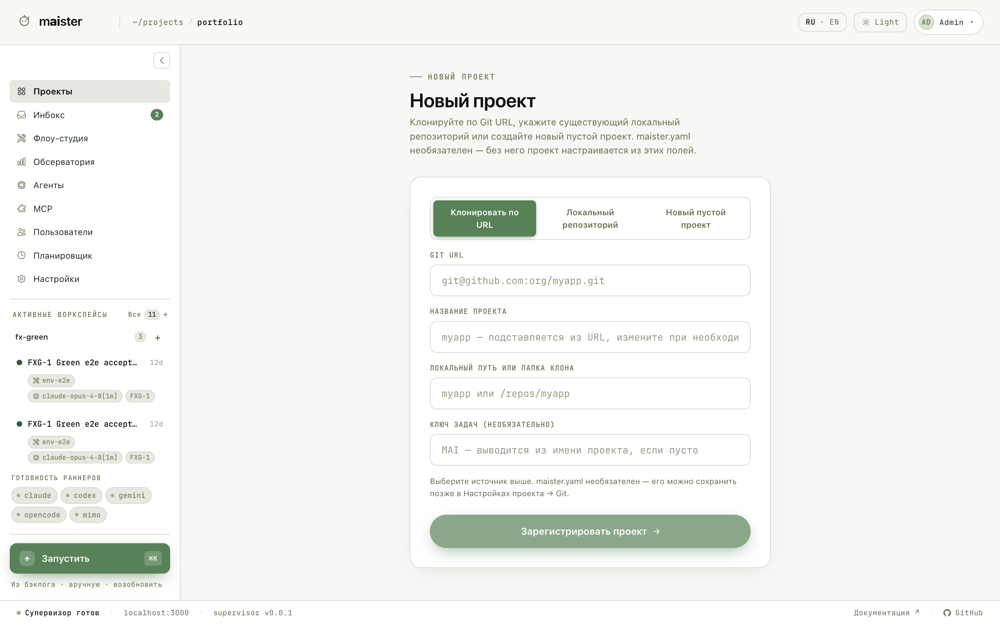
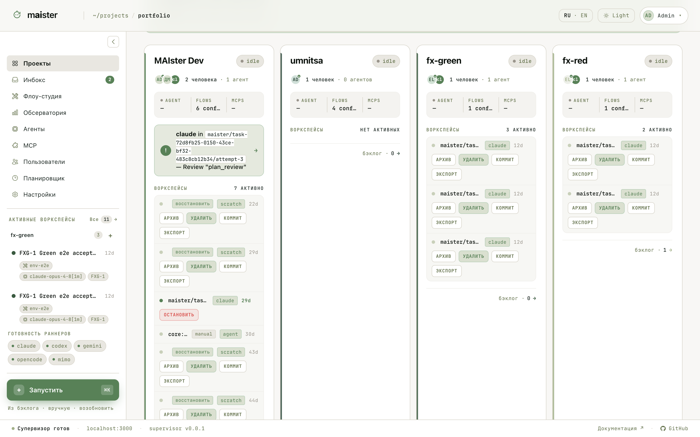

# Проекты и портфель

Проект в MAIster — внешний git-репозиторий под управлением платформы: со
своей доской задач, Flow-пакетами и исполнителями.

## Регистрация

Откройте `/projects/new`. Три режима подключения:

- **Клонировать по URL** — MAIster сам клонирует репозиторий в каталог
  репозиториев хоста;
- **Локальный репозиторий** — укажите путь к уже существующему клону;
- **Новый пустой проект** — создать репозиторий с нуля.

Манифест `maister.yaml` необязателен: имя проекта, путь и ключ задач
(префикс вида `MAI-1`) задаются прямо в форме, а манифест можно сохранить
позже через Настройки проекта → Git. Если манифест в репозитории есть,
MAIster валидирует его: версию схемы, Flow-пакеты, ссылки на исполнителей
и уникальность `slug` и `repo_path`. Полная схема — в
[Configuration](../../configuration.md).

Репозиторий должен быть доступен на хосте MAIster и иметь чистую git-базу:
рабочие копии прогонов создаются из предсказуемого состояния родительского
репозитория.

## Портфель

Главная страница `/` показывает все проекты: команда, Flow, активные
воркспейсы с быстрыми действиями, бэклог и сигнал «Ждут вас». Три вида —
просторный, компактный и список.

Отсюда удобно начинать день: видно, где работа идёт, где агент ждёт
человека, и какие рабочие копии пора прибрать (архив, коммит, экспорт,
удаление — прямо с карточки).
