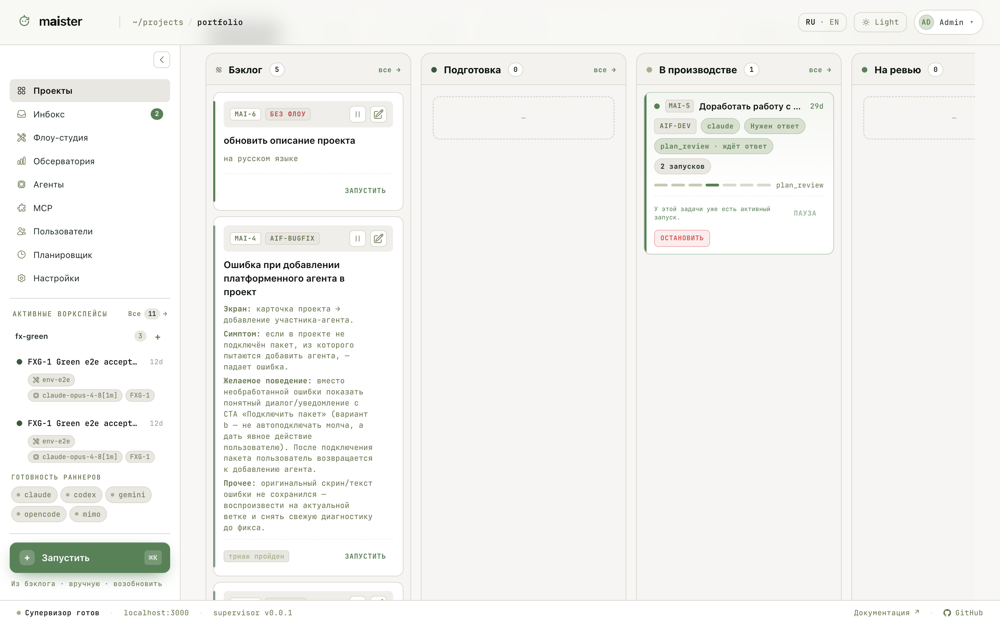
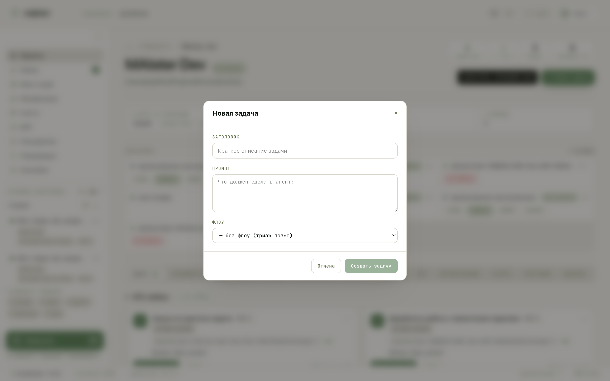
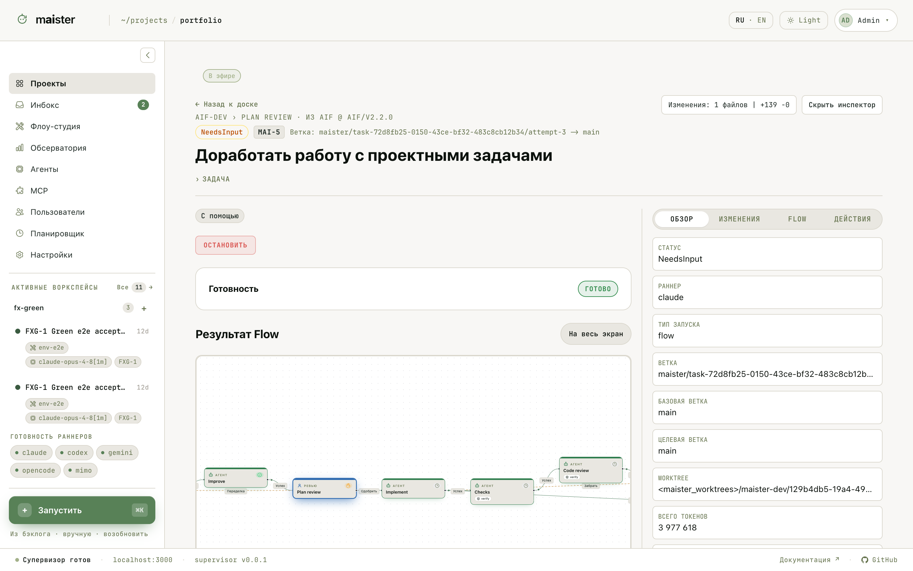
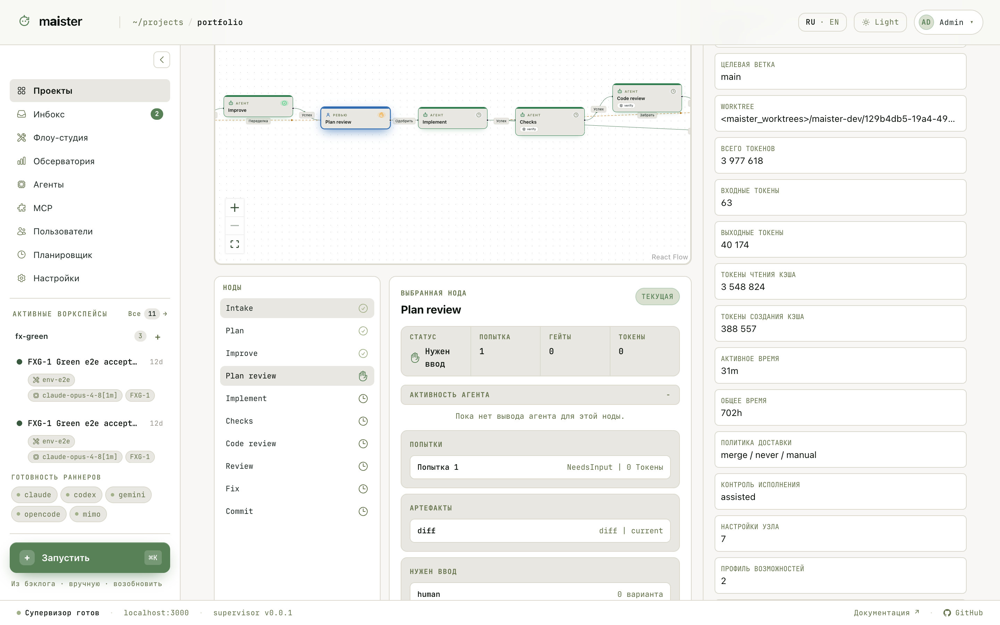

# Задачи, запуск и прогоны

## Доска проекта

Страница `/projects/{slug}` — центр проекта: шапка с метриками («нужно
вам», «в проде», бэклог), воркспейсы, HITL-инбокс и доска задач с
колонками Бэклог · Подготовка · В производстве · На ревью · В доставке ·
Сбой · Готово. Вид переключается: доска, дорожки, список; фильтры — по
Flow, агенту, приоритету и давности.

## Создать задачу

Кнопка **Новая задача**: заголовок, промпт (что должен сделать агент) и
Flow. Задачу можно создать и «без флоу» — тогда её позже разберёт триаж.

Одну задачу можно запускать много раз: если прогон упал или был остановлен,
задача возвращается в Бэклог, и кнопка запуска появляется снова. Карточка
показывает последний прогон и число попыток.

## Запуск

Кнопка **Запустить** создаёт рабочую копию (`git worktree`) и просит
супервизор открыть ACP-сессию. Перед стартом проверяются предусловия:

| Проверка | Зачем |
| -------- | ----- |
| Родительский репозиторий чистый | Прогон стартует с понятной базы |
| Ветка и путь worktree свободны | Ничего не перетирается |
| Исполнитель зарегистрирован и готов | ACP-адаптер реально стартует |
| Глобальный лимит прогонов не превышен | Хост и бюджет не перегружены |

Если лимит занят, прогон встаёт в очередь со статусом `Pending` и стартует,
когда освободится слот.

## Страница прогона

Откройте прогон из доски, портфеля или блока активных воркспейсов.

Слева — результат Flow и хронология, справа — инспектор: статус, раннер,
ветки, worktree, токены, время. Вкладки инспектора: обзор, изменения, flow,
действия.

Что здесь важно:

- статус прогона и активный узел Flow, попытки и гейты по нодам;
- шкала событий и живой поток обновлений (SSE);
- логи и артефакты по шагам, счётчик токенов;
- HITL-запросы, если агент ждёт вашего решения.

Супервизор пишет события и вывод на диск, поэтому после перезагрузки
страницы или рестарта веб-интерфейса контекст восстанавливается из
сохранённых событий.

## Статусы прогона

| Статус | Значение |
| ------ | -------- |
| Pending | Ждёт свободный слот |
| Running | Выполняется |
| NeedsInput | Ждёт человека, сессия жива |
| NeedsInputIdle | Сессия сохранена в checkpoint; ответ человека возобновит прогон |
| HumanWorking | Человек забрал рабочую копию в ручную работу |
| Review | Работа остановлена для проверки |
| Crashed | Процесс или сессия оборвались; доступно восстановление |
| Failed | Агент завершился с ошибкой без пути восстановления |
| Done | Работа завершена и принята |
| Abandoned | Прогон остановлен и не продолжается |
