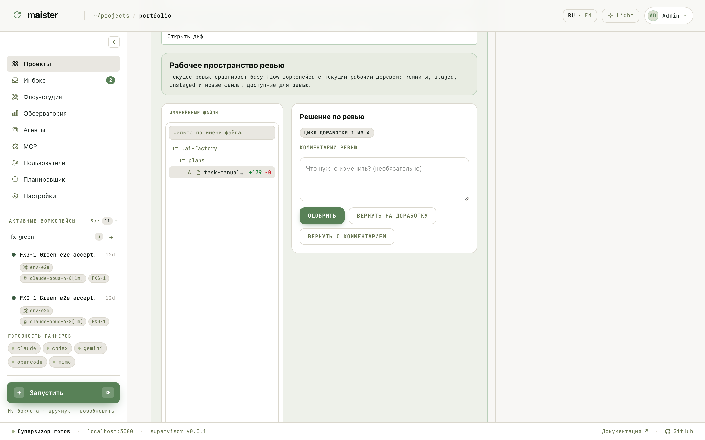
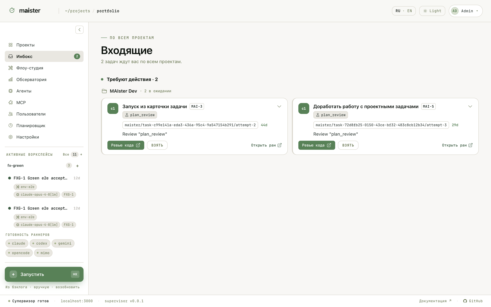

# HITL: когда агент ждёт человека

HITL (human-in-the-loop) — момент, когда Flow или агент останавливается и
ждёт вашего решения. Прогон переходит в `NeedsInput`, запрос появляется на
странице прогона, в HITL-инбоксе доски проекта и в общем Инбоксе.

| Вид запроса | Пример |
| ----------- | ------ |
| Разрешение | Агент просит разрешить действие: команду, запись файла |
| Форма | Flow ждёт структурированные поля |
| Проверка человеком | Вы принимаете работу узла или возвращаете её с комментариями |

Для проверки человеком MAIster открывает рабочее пространство ревью:
изменённые файлы, поле для комментариев и решение — одобрить, вернуть на
доработку или вернуть с комментарием. Циклы доработки ограничены Flow
(например, «цикл 1 из 4»): бесконечная переделка исключена.

Ответ на разрешение уходит через супервизор прямо в живую ACP-сессию.
Ответы форм и проверок записываются атомарно как артефакты в `.maister/`,
чтобы исполнитель не прочитал полузаписанный JSON.

Если вы не отвечаете долго, прогон уходит в `NeedsInputIdle`: сессия
сохраняется в checkpoint, процесс агента освобождает ресурсы. Ваш ответ
поднимет свежий процесс и восстановит контекст сессии; история не теряется.

## Инбокс

`/inbox` собирает всё, что ждёт вас, по всем проектам. Из карточки можно
открыть ревью кода, забрать работу на себя («Взять») или перейти к прогону.

Как отвечать осознанно:

1. Откройте запрос и посмотрите прогон: узел, последние события, логи.
2. Для разрешения выберите безопасный вариант, а не первый попавшийся.
3. Для проверки человеком пишите конкретные комментарии: что исправить, где
   проверить, какой результат нужен. Комментарии уходят агенту в цикл
   доработки.
4. После ответа убедитесь, что прогон вернулся в `Running`.
