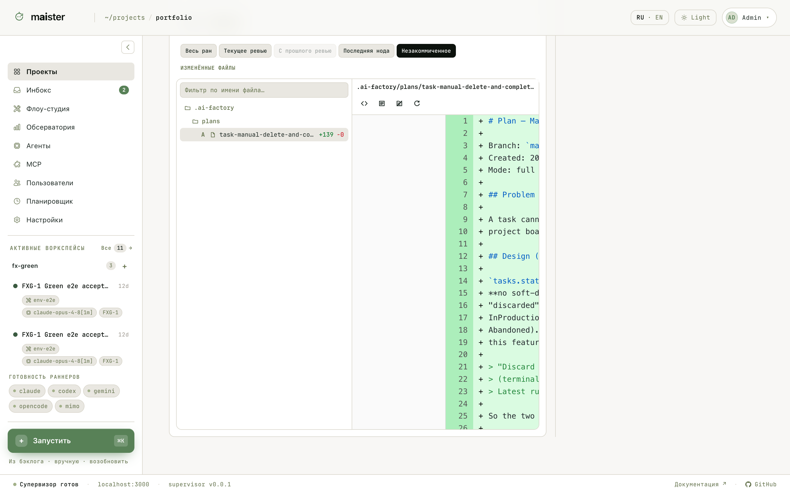
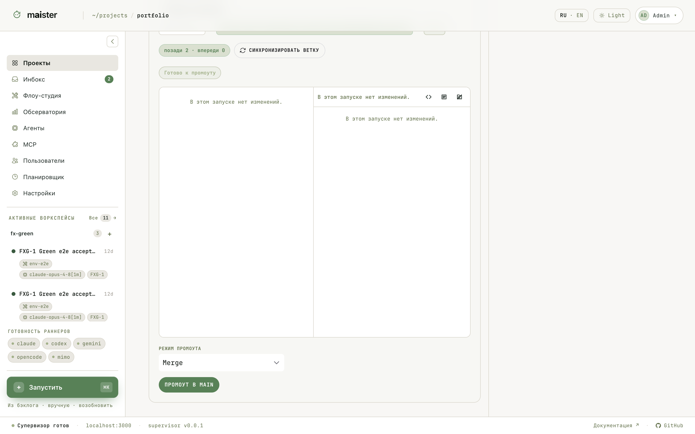

# Проверка результата и слияние

Перед слиянием смотрите не «успешно/неуспешно», а набор доказательств:
изменённые файлы, пройденные проверки, логи, комментарии проверки, остаток
лимитов доработки и бюджета, сводку готовности.

## Изменения

Вкладка «Диф / Файлы» показывает изменения рабочей копии: дерево файлов со
статистикой и построчный просмотр. Срез выбирается фильтром — весь ран,
текущее ревью, с прошлого ревью, последняя нода или незакоммиченное.

Комментарии можно привязывать к строкам дифа; при возврате на доработку они
уходят агенту одним пакетом.

## Готовность и слияние

Сводка готовности собирает блокирующие гейты Flow: проверки, вердикты,
обязательные артефакты, проверку человеком. Пока блокирующий гейт красный,
продвижение закрыто.

Блок «Ревью и промоут» показывает путь изменений: базовая ветка → ветка
прогона → целевая ветка, отставание от цели («позади N · впереди M») и
действие «Синхронизировать ветку», если цель уехала вперёд.

Когда результат принят, выберите режим промоута и продвиньте ветку:

| Режим | Что происходит |
| ----- | -------------- |
| Локальное слияние (Merge) | `git merge --no-ff` в целевую ветку на хосте; токены провайдера не нужны |
| Pull request | Ветка публикуется и открывается PR; для GitHub нужен `gh` или `GH_TOKEN`, для GitLab — `glab` или `GITLAB_TOKEN` |
| Ручной перехват | Вы забираете рабочую копию и заканчиваете руками; прогон переходит в `HumanWorking` |

Отдельно настраивается **авто-промоушен**: проект может автоматически
продвигать безопасные классы изменений (документация, тесты) при зелёной
готовности. По умолчанию выключен.

При конфликте MAIster не решает его «магией»: продвижение останавливается,
интерфейс показывает репозиторий, ветки и команду, на которой всё встало.
Решите конфликт руками или через ручной перехват и повторите продвижение.
