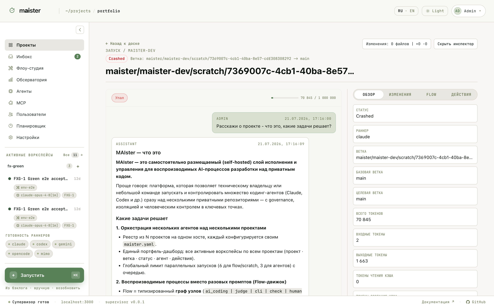

# Scratch-сессии

Scratch — агентная сессия вне доски задач: без Flow, в свободном диалоге, но
в управляемой рабочей копии. Подходит, когда работа ещё не оформлена как
задача:

- исследовать проблему или прочитать код;
- попросить план до создания Flow-задачи;
- сделать маленькую ручную правку;
- проверить гипотезу.

Запускается из кнопки запуска в левой панели или по `Cmd/Ctrl+K`: выберите
проект и исполнителя.

Scratch использует ту же инфраструктуру, что и прогоны Flow: изолированный
`git worktree`, HITL-разрешения, просмотр изменений и продвижение. Если
результат стоит забрать — сливайте как обычный прогон.

Для повторяемой доставки создавайте задачу и запускайте Flow: scratch не
оставляет воспроизводимого сценария.
