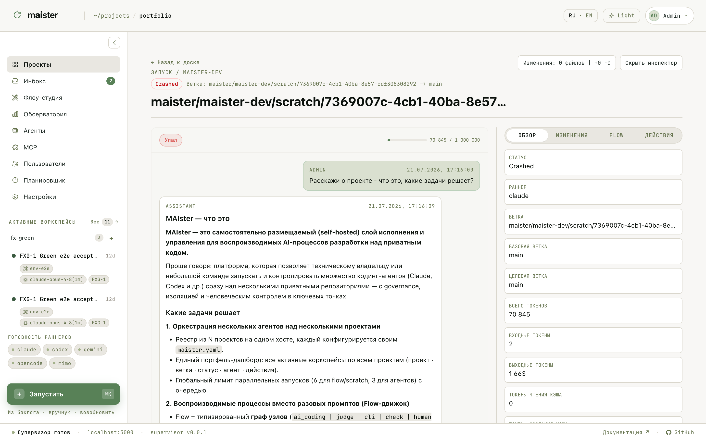

# Scratch-сессии

Scratch — агентная сессия вне доски задач: без Flow, в свободном диалоге, но
в управляемой рабочей копии. Подходит, когда работа ещё не оформлена как
задача:

- исследовать проблему или прочитать код;
- попросить план до создания Flow-задачи;
- сделать маленькую ручную правку;
- проверить гипотезу.

Запускается из кнопки запуска в левой панели или по `Cmd/Ctrl+K`: выберите
проект и исполнителя.

Scratch использует ту же инфраструктуру, что и прогоны Flow: изолированный
`git worktree`, HITL-разрешения, просмотр изменений и продвижение. Если
результат стоит забрать — сливайте как обычный прогон.

Если сессия оборвалась, диалог переходит в `Crashed`, а в подсказке видна
причина сбоя. Отправка сообщения в таком диалоге — это «Восстановить»
(Recover): сначала уходят сообщения, стоявшие в очереди до сбоя, затем ваше.
Восстановить можно только прогон в статусе `Crashed`. Прогон, остановленный
бюджетом (`Failed`), не восстанавливается — сообщения в его очереди помечены
«Не отправлено». Если сессия ждёт ответа на разрешение и была отложена
(`NeedsInputIdle`), ответьте на разрешение — ответ сам возобновит сессию.

Для повторяемой доставки создавайте задачу и запускайте Flow: scratch не
оставляет воспроизводимого сценария.
