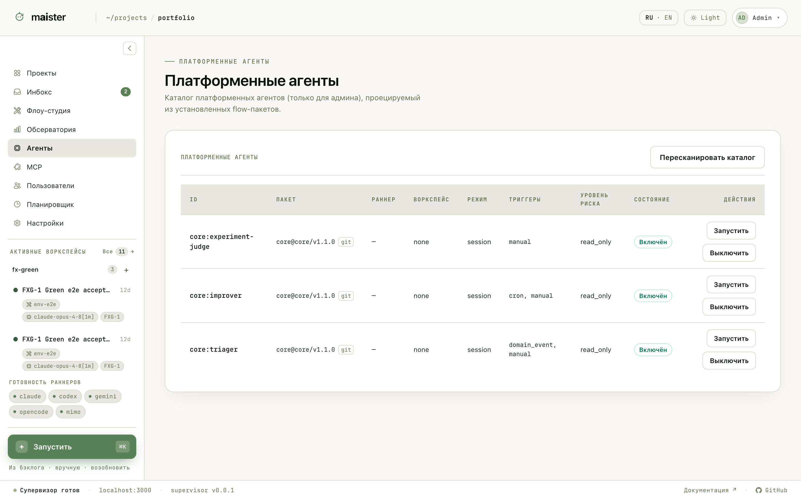

# Платформенные агенты

Кроме Flow-прогонов по задачам, MAIster запускает платформенных агентов —
служебных помощников, которые поставляются внутри flow-пакетов как
`.md`-описания. Каталог `/agents` (для администратора) проецируется из
установленных пакетов: пакет, воркспейс, режим, триггеры, уровень риска,
включение и ручной запуск.

Примеры из пакета `core`:

- **core:triager** — триаж бэклога: разбирает задачи «без флоу», задаёт
  уточняющие вопросы комментарием, подбирает Flow и доводит задачу до
  запускаемого состояния.
- **core:improver** — регулярный (cron) агент улучшений.
- **core:experiment-judge** — судья для Лаборатории оценки.

Отдельный встроенный помощник — **AI-резолвер конфликтов**: когда
синхронизация ветки или rebase-промоушен упираются в конфликт, MAIster может
поднять резолвер-сессию, которая решает конфликт в рабочей копии; результат
всё равно возвращается на ревью.

## Как агент попадает в проект

1. Установите и доверьте пакет с агентом, подключите пакет к проекту.
2. На странице проекта (вкладка Агенты) подключите агента: раннер, ветка,
   права, триггеры.
3. Триггеры: вручную, по расписанию (cron), по доменным событиям (например,
   новая задача без Flow — для триажера), по входящему вебхуку и по
   упоминанию `@агента` в комментарии задачи.

Что важно знать:

- **Read-only по умолчанию.** Агент с уровнем риска `read_only` получает
  рабочую область без права менять код: смотреть можно, писать нельзя.
- **Отдельный лимит.** Агентские запуски считаются отдельно от Flow-прогонов
  (по умолчанию 3 одновременно) и не съедают слоты ваших задач.
- **Память агента.** Подключению агента можно включить файл памяти: агент
  накапливает заметки между запусками, владелец видит и чистит их в
  настройках подключения.
- Каждый запуск агента — обычный Run: события, логи и токены видны на той же
  странице прогона.
