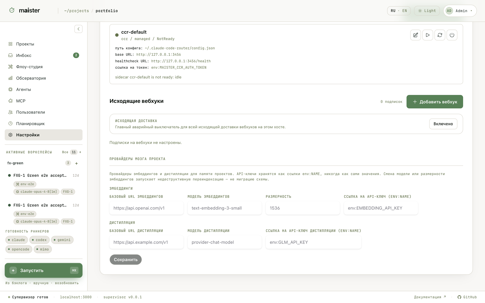

# Мозг проекта (память)

Мозг проекта — долговременная память поверх прогонов. Три слоя:

- **Записи владельца** — факты, решения и договорённости, которые вы
  сохраняете сами;
- **Индекс источников** — код и документация проекта, проиндексированные
  эмбеддингами для семантического поиска;
- **Предложения** — выводы, которые агенты предлагают сохранить после
  прогонов; каждое предложение утверждает или отклоняет владелец.

Агенты работают с памятью через MCP-инструменты: `memory_recall` — вспомнить
контекст перед работой, `memory_retain` — предложить сохранить вывод. Так
знание проекта накапливается между запусками, а не теряется с завершением
сессии.

## Включение

Мозг выключен, пока не настроены все слои:

1. PostgreSQL с расширением pgvector + отдельная линейка миграций
   `pnpm --filter maister-web db:migrate:brain`.
2. Провайдер эмбеддингов в `/settings` → «Провайдеры Мозга проекта»: базовый
   URL, модель, размерность, ссылка на API-ключ вида `env:NAME` (ключи
   никогда не хранятся значениями). Опционально — провайдер дистилляции.
3. Включение Мозга у конкретного проекта.

После этого на странице проекта появляется вкладка «Мозг»: поиск по памяти,
записи, статус индексации источников и очередь предложений.

Смена модели или размерности эмбеддингов запускает фоновую переиндексацию,
а не миграцию схемы — память при этом не теряется.
