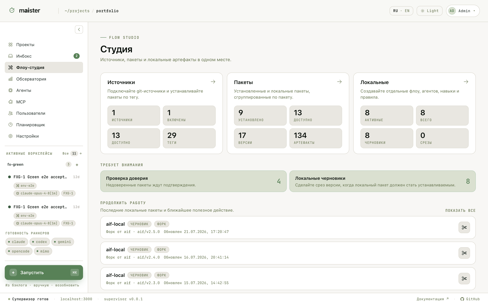
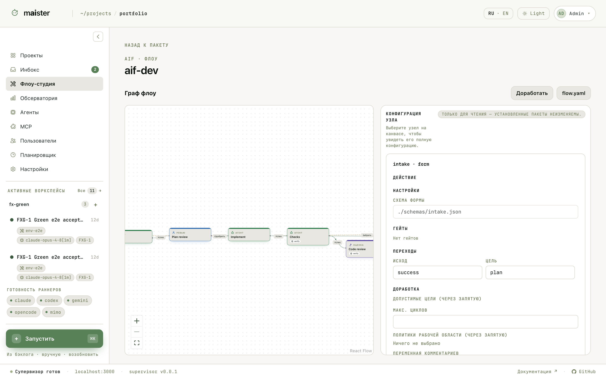

# Studio и Flow-пакеты

Flow приходят в MAIster пакетами — git-репозиториями с манифестом, Flow,
навыками и агентами. Пакет устанавливается по тегу, версии неизменяемы;
проект подключает пакет и получает его Flow на доске.

`/studio` — рабочая область для всего этого:

- **Источники** — откуда ставить пакеты: git-URL или локальный путь.
- **Пакеты** — установленные версии, доверие, подключение к проектам,
  предпросмотр обновления.
- **Локальные** — редактируемые копии и черновики: правьте Flow, срезайте
  версию, возвращайте изменения в источник.

Блок «Требует внимания» подсказывает следующее полезное действие:
недоверенные пакеты ждут подтверждения, черновики ждут среза версии.

## Просмотр и редактирование Flow

У каждого Flow в пакете есть граф и конфигурация узлов: действие, настройки,
гейты, переходы, лимиты доработки. Установленные пакеты неизменяемы —
их Flow открываются только для чтения; кнопка **Доработать** создаёт
локальную редактируемую копию пакета, где граф правится визуально.

Узлы типизированы: агентная работа, judge, cli-команда, проверка, форма,
проверка человеком, orchestrator, consensus. Переходы именованные, циклы
доработки ограничены. Срезанная версия локального пакета попадает в ту же
линейку версий, что и установленные.

Доверие пакету — осознанное действие владельца: оно открывает настройку и
включение ревизий, но не выдаёт произвольных прав времени выполнения.
