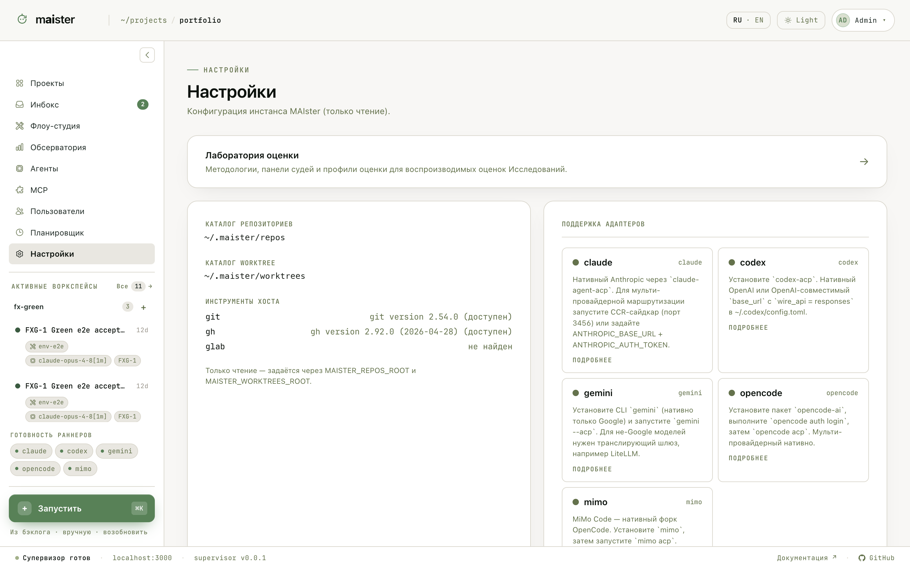

# Исполнители и настройки

Исполнитель (runner) — настроенный способ запустить агента: адаптер
(`claude`, `codex`, `gemini`, `opencode`, `mimo`), модель, провайдер,
политика разрешений. Текущая готовность раннеров всегда видна в левой
панели; клик ведёт в `/settings`.

Страница `/settings` показывает конфигурацию инстанса: каталоги
репозиториев и worktree, инструменты хоста (`git`, `gh`, `glab`), карточки
поддержки адаптеров с инструкциями по установке, исходящие вебхуки,
провайдеров Мозга проекта и Лабораторию оценки.

Исполнитель должен быть не только создан, но и готов:

- бинарь адаптера доступен на `PATH` хоста;
- токены провайдера заданы в окружении веб-интерфейса и супервизора;
- проверки готовности зелёные;
- модель совместима с адаптером.

Если прогон не стартует, смотрите в этом порядке: готовность исполнителя →
логи супервизора → текст ошибки предпроверки в интерфейсе.

## Выбор исполнителя для узла

Исполнитель для конкретного узла Flow разрешается по приоритету: явный выбор
при запуске → привязка в узле Flow → проектный дефолт для Flow → дефолт
Flow → дефолт проекта → платформенный дефолт. На практике достаточно задать
платформенный дефолт и переопределять его точечно.

## Куда дальше

Мануал сознательно короткий. Подробности по темам:

| Тема                  | Где читать                                   |
| --------------------- | -------------------------------------------- |
| Ежедневный процесс    | [Рабочий процесс](../workflow.md)            |
| Словарь терминов      | [Ключевые понятия](../concepts.md)           |
| Сценарии оператора    | [Операторский гид](../operators-guide.md)    |
| Манифесты и окружение | [Configuration](../../configuration.md) (EN) |
| Архитектура           | [Architecture](../../architecture.md) (EN)   |
