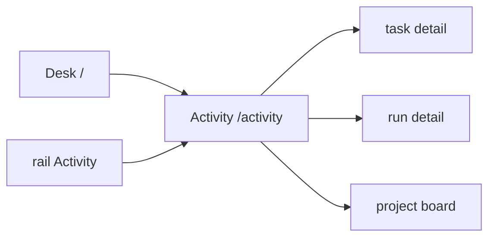
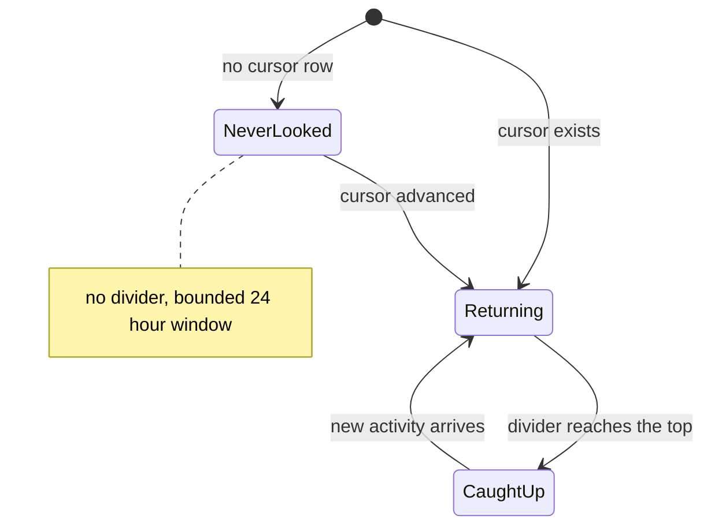

# Activity

**Route:** `/activity` · **Status:** Designed (ADR-168) · **Source:** `web/app/(app)/activity/page.tsx`

The cross-project activity feed, with a per-user read cursor and an unread
divider. Answers "what happened that I have not seen" — nothing here waits on
the reader.

## JTBD

- When I come back after time away, I want a single chronological feed across my
  projects, so I can catch up in one pass.
- When I am catching up, I want to see where I left off, so I do not re-read what
  I already saw.
- When I only care about one project or one kind of event, I want to filter, so
  the feed stays readable.

## Roles & capabilities

| Role | Sees | Does |
| --- | --- | --- |
| Global `admin` | Activity from every non-archived project | Filter; advance their own cursor |
| Global `member` | Activity from their own projects only | Same |
| Global `viewer` | Activity from their own projects only | Same |

A reader may advance only their **own** cursor. Activity is filtered by
**current** visibility, and the cursor is never rewound (`EDGE-ATN-02`).

## Navigation

## Layout & regions

A reverse-chronological list unioning task activity, run terminal transitions and
gate outcomes, PR merges, and webhook **delivery outcomes** — never payloads. A
"your last visit" divider marks the cursor position. Filters — project, actor
type, kind, and "mine" — are URL-synchronized.

The feed carries **no worktree path, no diff body and no raw ACP frame**
(`ATN-09`); every row is an explicit DTO projection.

The rail's Activity badge shows `updates` in a **neutral** tone: it says
"N things happened you have not seen", never "N things need you". Only the Inbox
badge wears the attention tone.

## States

## Data & APIs

- Feed, counters and cursor semantics — see
  [`system-analytics/attention.md`](../system-analytics/attention.md).
- `POST /api/activity/cursor` — monotonic upsert; a future timestamp is refused
  `PRECONDITION` (`ATN-10`).
- Liveness — `GET /api/attention/stream`.

## i18n

`activityFeed` namespace (EN + RU). Deliberately **not** `nav.activity`, which is
already the project board's Activity *tab* label.

## Linked artifacts

- [ADR-168](../decisions.md#adr-168) · [ADR-170](../decisions.md#adr-170)
- [`system-analytics/attention.md`](../system-analytics/attention.md)
- [`system-analytics/social-board.md`](../system-analytics/social-board.md)
- [`desk.md`](desk.md) · [`work.md`](work.md) · [`inbox.md`](inbox.md)
