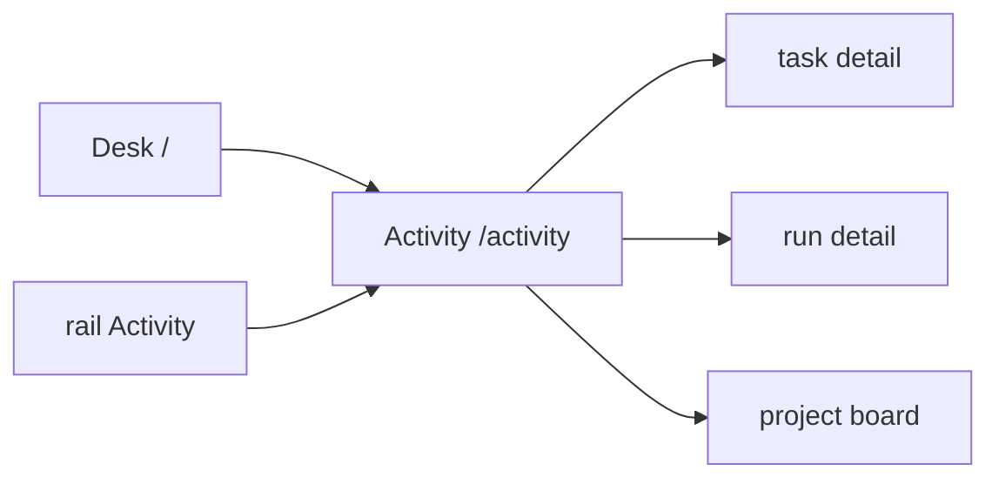
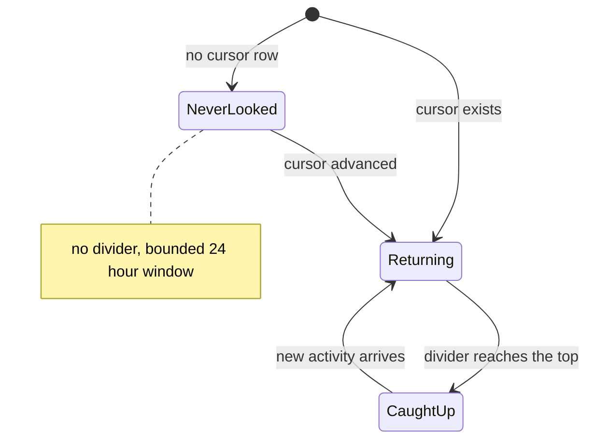

# Activity

**Route:** `/activity` · **Status:** Implemented (ADR-169, ADR-171) · **Source:** `web/app/(app)/activity/page.tsx`

The cross-project activity feed, with a per-user read cursor and an unread
divider. Answers "what happened that I have not seen" — nothing here waits on
the reader.

## JTBD

- When I come back after time away, I want a single chronological feed across my
  projects, so I can catch up in one pass.
- When I am catching up, I want to see where I left off, so I do not re-read what
  I already saw.
- When I only care about one project or one kind of event, I want to filter, so
  the feed stays readable.

## Roles & capabilities

| Role | Sees | Does |
| --- | --- | --- |
| Global `admin` | Activity from every non-archived project | Filter; advance their own cursor |
| Global `member` | Activity from their own projects only | Same |
| Global `viewer` | Activity from their own projects only | Same |

A reader may advance only their **own** cursor. Activity is filtered by
**current** visibility, and the cursor is never rewound (`EDGE-ATN-02`).

## Navigation

## Layout & regions

A reverse-chronological list unioning task activity, run terminal transitions and
gate outcomes, PR merges, and webhook **delivery outcomes** — never payloads. A
"your last visit" divider marks the cursor position. Filters — project, actor
type, kind, and "mine" — are URL-synchronized.

The feed carries **no worktree path, no diff body and no raw ACP frame**
(`ATN-09`); every row is an explicit DTO projection.

As built (`web/lib/queries/activity-feed.ts`, `getCrossProjectActivityFeed`):

- **Three sources, one bounded read.** `task_activity` (all 13 kinds),
  `domain_events` restricted to `ATTENTION_EVENT_KINDS`, and settled
  `webhook_deliveries` (`delivered` / `dead` — `pending` is the drainer's
  business). Each source is fetched newest-first and capped, then merged in
  memory; the statement count is independent of the row count.
- **`ATTENTION_EVENT_KINDS`** (`web/lib/domain-events/taxonomy.ts`) is the
  taxonomy minus the three kinds written in the SAME transaction as a
  `task_activity` row carrying the same fact (`task.created`,
  `task.comment_added`, `task.triage_requeued`). Rendering both would print one
  fact twice, and counting both made `updates` score one task creation as two.
  `task.clarification_answered` has no twin and stays on the attention side.
  The two lists must PARTITION the taxonomy — `UT-ATN-09` fails if a new kind
  lands in neither.
- **No `payload` column is ever selected.** The three scalars the feed needs out
  of one (`gateId`, `hitlRequestId`, and `run_launched`'s `runId`) are extracted
  as `->>` expressions in SQL, so a path or a hunk sitting in a payload has no
  route into the process. The webhook row carries subscription name, attempt
  count, HTTP status and error KIND — never `last_error_message`, never the
  response snippet, never the target URL.
- **`mine`** means activity on tasks the reader SUBSCRIBES to
  (`task_subscribers`), not activity the reader caused — "what I did" is already
  reachable through the actor-type filter and is the one slice nobody needs to
  catch up on. It excludes the taskless webhook source entirely.
- **A project filter naming a project the reader cannot see** resolves to no id
  and drops the feed to empty, rather than refusing and revealing that the
  project exists.
- **No paging.** One bounded page (100, capped at 200) with a `hasMore` flag;
  the surface says "showing the latest N" rather than inventing a cursor
  contract nothing asks for.

Freshness comes from the attention stream (ADR-171): `AttentionLiveRefresh`
holds one `EventSource`, and a pushed tick becomes `router.refresh()`. There is
no client timer. The accessible liveness pill and its reconnect affordance are
`<RunStreamLiveness>`, shared with the run and evaluation surfaces.

The rail's Activity badge shows `updates` in a **neutral** tone: it says
"N things happened you have not seen", never "N things need you". Only the Inbox
badge wears the attention tone.

## States

## Data & APIs

- Feed, counters and cursor semantics — see
  [`system-analytics/attention.md`](../system-analytics/attention.md).
- `POST /api/activity/cursor` — monotonic `GREATEST` upsert on the SESSION's own
  cursor (no user id in the body); a future timestamp is refused `PRECONDITION`
  → HTTP 409 (`ATN-10`, `EDGE-ATN-03`). The response returns the STORED cursor,
  so a stale request can see that it was absorbed rather than applied.
  "Mark all as read" sends one millisecond PAST the newest rendered row: a
  `timestamptz` carries microseconds that a JS `Date` has already floored away,
  so a cursor set to the row's own millisecond would leave that row unread
  forever.
- Liveness — `GET /api/attention/stream` (ADR-171).

## i18n

`activityFeed` namespace (EN + RU). Deliberately **not** `nav.activity`, which is
already the project board's Activity *tab* label.

### Shared with the Desk

The feed's ROWS live in `web/components/activity/activity-row-list.tsx`
(`ActivityRowList`) and their labels in
`web/lib/activity/activity-row-labels.ts`, both shared with the Desk
(ADR-172 D1). The filters, the row count and — importantly — the "mark all as
read" control stay here: the read cursor is written from ONE place.

## Linked artifacts

- [ADR-169](../decisions.md#adr-169) · [ADR-171](../decisions.md#adr-171)
- [`system-analytics/attention.md`](../system-analytics/attention.md)
- [`system-analytics/social-board.md`](../system-analytics/social-board.md)
- [`desk.md`](desk.md) · [`work.md`](work.md) · [`inbox.md`](inbox.md)
