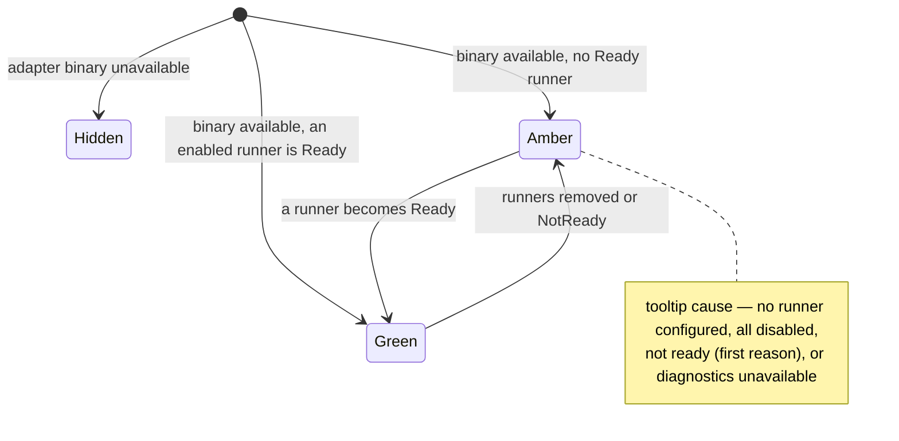

# Left rail

- **Type:** chrome (persistent shell, every `(app)` screen).
- **Status:** Implemented (WI-3 runners readiness). The Inbox badge count is
  unified by WI-1 — see [`../inbox.md`](../inbox.md). The section nav is
  route-aware and uses packaged Heroicons for destination and flyout icons.
  UI completion mobile navigation and Observatory placement are Implemented.
- **Source:** `web/components/chrome/left-rail.tsx`,
  `web/components/chrome/left-rail-nav.tsx`,
  `web/components/chrome/left-rail-route.ts`, fed by
  `web/app/(app)/layout.tsx`.

## JTBD

When I am working across projects, I want one rail that shows where I can go,
what is running right now, whether my runner adapters are healthy, and a way to
launch — so I can navigate and start work without leaving the current screen.

## Roles & capabilities

| Role | Sees | Notes |
| --- | --- | --- |
| Global viewer / member | Home, Projects, Work, Activity, Inbox, Flow Studio, Observatory nav; active workspaces; runners readiness; launch | `Agents` / `MCPs` / `Users` / `Scheduler` / `Execution host` / `Settings` are hidden (admin-only) |
| Global admin | All of the above plus `Agents`, `MCPs`, `Users`, `Scheduler`, `Execution host`, `Settings` | Hidden nav is convenience only; admin routes recheck authorization, and execution-host diagnostics reject before any detailed read |

The hidden admin nav is never the authorization boundary — the route enforces it.

## Navigation

The rail is the primary navigation spine. Entry points / exits:

- **Section nav** → `/` (the Desk — [`../desk.md`](../desk.md)), `/projects`
  (the portfolio), `/work` ([`../work.md`](../work.md)), `/activity`
  ([`../activity.md`](../activity.md)), `/inbox` ([`../inbox.md`](../inbox.md)),
  `/studio` ([`../studio/README.md`](../studio/README.md)), `/observatory`, `/agents` (admin),
  `/mcps` ([`../mcps.md`](../mcps.md), admin), `/admin/users`,
  `/admin/scheduler`, `/admin/execution-host`, `/settings`. The active section is resolved from the
  current pathname, so `/settings` selects Settings, `/inbox` selects Inbox,
  `/` selects **Home** (ADR-172 D4 — not Projects), and `/runs/*` /
  `/scratch-runs/*` stay under Projects.
- **Active workspaces** → each row links to its run/workbench (`/runs/[id]`).
- **Launch** → opens the [launch dialog](launch-dialog.md).
- **Collapsed rail** → section icons keep direct navigation; active workspaces
  and runners readiness open right-side flyouts from their rail icons.

See [`../README.md`](../README.md) for the global IA map.

## Layout & regions

Expanded mode, top to bottom:

1. **Section nav** — Home, Projects, Work, Activity (badge), Inbox (badge),
   Flow Studio, Observatory, then the admin block
   (Agents, MCPs, Users, Scheduler, Execution host, Settings). **Two badges, two tones**
   (ADR-169 D7): the Inbox badge shows `decisions` in the **attention** tone
   (amber, `data-testid="inbox-nav-badge"`) and means "N things are blocked on
   you"; the Activity badge shows `updates` in a **neutral** tone
   (`data-testid="activity-nav-badge"`) and means "N things happened you have
   not seen". Nothing non-actionable may wear the attention tone. Both values
   are computed once in `web/app/(app)/layout.tsx` and passed down as one
   `RailBadges` map — neither badge recomputes its own number (`ATN-05`), and
   the TONE travels with the value rather than being inferred from the section
   id, so nothing non-actionable can acquire the attention tone by being moved.
   The badge element itself is a bare digit (`aria-hidden`); its meaning is a
   sibling `sr-only` phrase in the expanded variant and part of the link's
   `aria-label` in the collapsed one, where an `aria-label` would otherwise
   replace the contents. Collapsed badges carry
   `data-testid="<section>-nav-badge-collapsed"`. See
   [`../inbox.md`](../inbox.md) and [`../activity.md`](../activity.md). Section
   icons come from `@heroicons/react`; Settings uses the gear icon and the
   collapsed/expanded states share the same route-derived active marker.
   **The section nav is capped, not `shrink-0`** (`max-h-[45%]`, `min-h-0`,
   `overflow-y-auto`). The rail is a fixed-height flex column
   (`h-[calc(100vh-64px-36px)]`) and an admin's list is twelve sections since `/`
   became the Desk (ADR-172 D4); the new admin destination makes thirteen.
   Uncapped, the nav took 422 of the 576px of rail
   content at a 720px-tall viewport and the active-workspaces block below it
   resolved to **zero** height — its rows still rendered but stopped being
   clickable, because a zero-height scroll parent swallows pointer events. The
   block measured 3px even at eleven sections, so the cap fixes a latent defect
   rather than a new one. Under pressure the nav scrolls; the rail does not
   introduce grouping.
2. **Active workspaces** — per-project groups of live runs. The block's surface
   (compact rows, single colour-coded state dot, ticket-derived names + scratch
   rename, linked flow/issue chips, runner info chip, hover/focus icon actions,
   TTL/archived badges) is documented in
   [`active-workspaces.md`](active-workspaces.md).
3. **Runners readiness** (WI-3) — one chip per available adapter (hidden /
   binary-unavailable adapters are omitted by design). Hovering or focusing a
   chip opens a popover listing that adapter's configured platform runners —
   identity (`model` / provider kind) as text, `enabled` + `readiness` as
   `aria-label`led icon/colour indicators, plus the first blocking reason for a
   not-ready runner, or a "no runners configured" empty state. Secret provider
   refs (`env:NAME`) are never projected to the client. For **admins** the chip
   links to `/settings` (the platform runner catalog) and the popover shows a
   "Configure in Settings" cue; for non-admins it is information-only (the
   `title` is the keyboard/SR fallback — non-admin chips are not focusable).
   The admin-only platform status pill below this region links to
   `/admin/execution-host`; it reuses the layout's cached health sample.
4. **Platform status** — admin-only ready/behind/unavailable pill linking to
   execution-host diagnostics. Members do not receive the link or a DB read.
5. **Launch** — primary launch button + hint, with a Cmd/Ctrl+K shortcut
   ([`launch-dialog.md`](launch-dialog.md)).

### Collapse / icon rail (Implemented — Phase B)

The rail is **collapsible** so wide canvases (the Flow editor,
[`../studio/editor.md`](../studio/editor.md)) can claim near-full width. A toggle
button switches between **expanded** (nav labels + active-workspaces + readiness +
launch) and **collapsed** (icon rail). Collapsed mode keeps all top-level
destination icons visible; the active-workspaces and runners-readiness regions
open as right-side flyout menus from their icons, and launch remains available
as the compact `+` control. The choice persists to `localStorage` (default
**expanded**); it is restored after hydration (a brief expanded flash on a
collapsed reload is accepted — no inline script, matching the script-free theme
convention). The toggle is a small client island; the rail's data fetch stays in
the async Server Component.

Collapsed mode order:

1. **Section icon stack** — Home, Projects, Work, Activity (badge), Inbox
   (badge), Flow Studio, Observatory, then the admin
   icons when allowed (Agents, MCPs, Users, Scheduler, Execution host, Settings). These packaged
   icons are the same destinations as expanded mode, not a separate compact menu.
2. **Active workspaces flyout** — one icon opens the same per-project live-run
   groups documented in [`active-workspaces.md`](active-workspaces.md). The rail
   itself shows only the affordance and count, not duplicate narrow text rows.
3. **Runners readiness flyout** — one icon opens the same adapter readiness rows
   as expanded mode.
4. **Platform status dot** — admin-only, with the same accessible status label
   and `/admin/execution-host` link as the expanded pill.
5. **Compact launch** — the `+` control opens the existing
   [`launch-dialog.md`](launch-dialog.md).

### Mobile drawer (Implemented — UI completion batch)

Below `md`, the top-nav hamburger opens one HeroUI drawer that receives the
same server-projected sections as this rail. It is not a second navigation
definition and mounts the interactive rail content only while open, preventing
duplicate scratch popovers/hotkeys. It traps focus, locks background scrolling,
closes on Escape and route change, and restores focus to the hamburger. The
existing route authorization remains the authority; Observatory follows the
same visibility model as its route.

## States

Per-adapter readiness verdict (WI-3), from
`summarizeAdapterReadiness`:

## Data & APIs

- `getRailWorkspaceGroups(userId, role)` — active workspaces, RBAC-scoped.
- `railSectionForPathname(pathname)` — maps app routes to the active rail
  section (`/` → Home, `/settings` → Settings, `/inbox` → Inbox, run detail
  routes → Projects). Total over the app's prefixes, where `null` ("nothing
  highlighted", e.g. `/account`) is a decided answer — see
  [`../../system-analytics/home-navigation.md`](../../system-analytics/home-navigation.md)
  (`NAV-04`).
- `summarizeAdapterReadiness({ runners, diagnostics })`
  (`lib/acp-runners/readiness-summary.ts`) over `checkSupervisorDiagnostics()`
  `/diagnostics` × `platform_acp_runners` rows (`loadRunnerReadinessRows`, which
  also selects `id` / `capabilityAgent` / `model` / `provider`). Stored
  `readiness_status` is recomputed on each runner write; live availability gates
  visibility. Each summary carries a `runners: RailRunnerDTO[]` projection (safe
  fields only — `providerKind`, never the secret-bearing `provider`) that feeds
  the chip popover (`runners-readiness-rail.tsx`).
- Inbox badge count — see [`../inbox.md`](../inbox.md) and
  [`../../system-analytics/social-board.md`](../../system-analytics/social-board.md).

## i18n

`nav` (section labels, `comingSoon`), `portfolio` (`runnersReadiness`,
`runnerReady` / `runnerNoRunner` / `runnerAllDisabled` / `runnerNotReady` /
`runnerDiagnosticsUnavailable` / `runnersNone`; popover: `runnerNoneConfigured` /
`runnerEnabledShort` / `runnerDisabledShort` / `runnerConfigureCta` /
`runnerStatusNotReady` / `runnerStatusUnknown`; launch + active-workspace
labels), `gc` (TTL badges).

## Linked artifacts

- ADR: [ADR-065](../../decisions.md#adr-065) — platform ACP runner catalog +
  readiness recompute.
- Behavior: [`../../system-analytics/acp-runners.md`](../../system-analytics/acp-runners.md),
  [`../../system-analytics/social-board.md`](../../system-analytics/social-board.md)
  (inbox fanout),
  [`../../system-analytics/attention.md`](../../system-analytics/attention.md)
  (both badge counters and their tones),
  [`../../system-analytics/home-navigation.md`](../../system-analytics/home-navigation.md)
  (the rail re-cut and the total route classifier).
- Source: `web/components/chrome/left-rail.tsx`,
  `web/components/chrome/left-rail-nav.tsx`,
  `web/components/chrome/runners-readiness-rail.tsx`,
  `web/components/chrome/left-rail-route.ts`, `web/app/(app)/layout.tsx`,
  `web/lib/acp-runners/readiness-summary.ts`,
  `web/lib/acp-runners/runner-readiness-rows.ts`.
