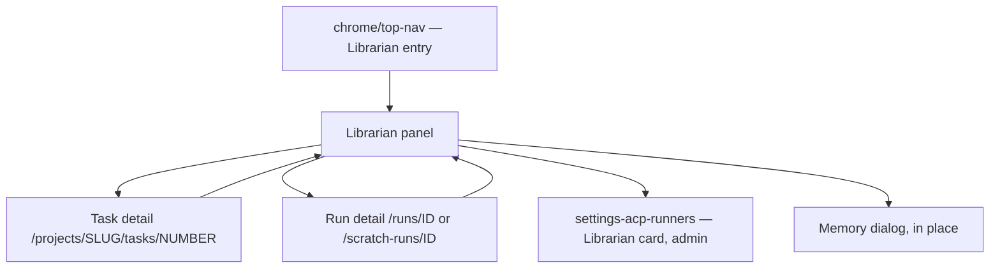
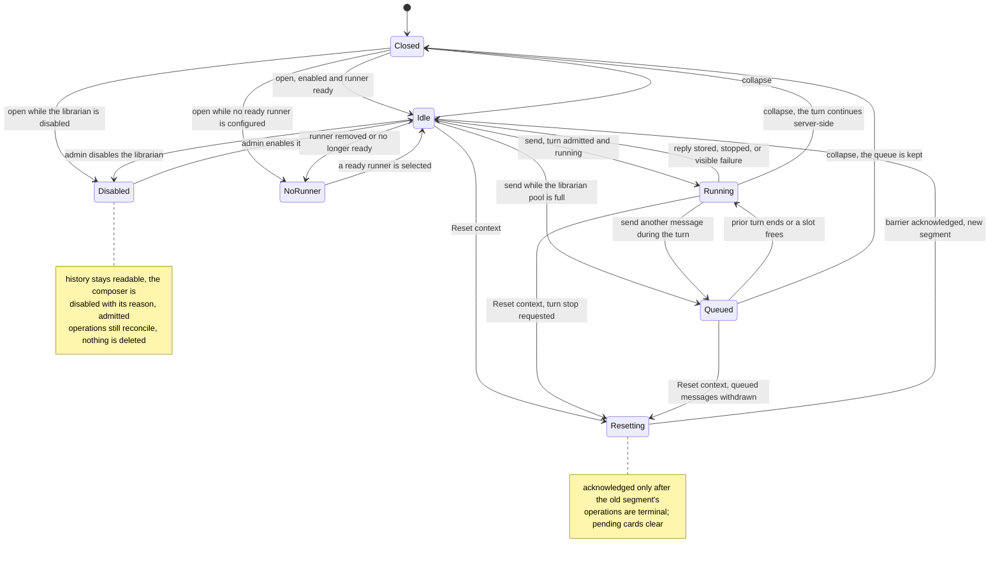

# Librarian panel

- **Type:** chrome (a persistent top-nav entry plus a right-side panel present
  on every `(app)` screen).
- **Route:** none of its own — the panel is mounted once in
  `web/app/(app)/layout.tsx`, so it survives route changes.
- **Status:** Designed (ADR-191; runtime ADR-185, authority ADR-186,
  operations ADR-187, memory and reset ADR-190).
- **Source:** `web/components/librarian/librarian-trigger.tsx`,
  `web/components/librarian/librarian-panel.tsx`,
  `web/components/librarian/librarian-provider.tsx` (open state, indicator, the
  librarian stream), `web/components/librarian/panel-mode.ts` (the D4 rule),
  `web/components/chrome/top-nav.tsx` (right group), `web/app/(app)/layout.tsx`.
  The shell (entry, panel, composer, queued chips, subject chip, presentation
  modes, focus) ships with T2.15; cards, the Related work strip, memory and
  reset arrive with their phases.

## JTBD

When I am anywhere in MAIster and want to describe, find, launch or follow work
across my projects in plain words, I want one personal conversation that opens
beside the screen I am on and remembers where we left off — so I can turn a
rough request into correctly filed tasks, answers and next steps without
leaving my current context or re-explaining myself.

When a result I asked for moves — a run finishes, a teammate answers my
question — I want a short update in the same conversation, so I learn the
outcome without polling task pages.

## Roles & capabilities

The panel is personal: it shows only the signed-in user's own conversation, and
the owner always comes from the session (no route accepts a user id). What the
librarian may do in a project is the owner's **live** project role, re-checked
on every request of every turn through `requireProjectActionForUser`.

| Role | Sees | Can do through the librarian |
| --- | --- | --- |
| Any authenticated user | The entry on every route; their own conversation, memory and pending cards | Talk, stop a response, withdraw a queued message, reset context, manage memory, clear history |
| Project viewer (in that project) | Reads the project's tasks, runs and activity through the librarian | Nothing effectful: a create/update/launch is refused at request time |
| Project member / admin / owner | Same | Create, update, triage, launch and message work as the role allows; human-only actions (human HITL answers, promotion, discard) only by clicking a confirmation card, which runs through a session route under `requireProjectAction` |
| Global admin | Only their own conversation — never another user's conversation, memory or snapshots | Same as their project roles; enables the librarian and selects its runner on [Settings → ACP runners](../settings-acp-runners.md) (`requireGlobalRole("admin")`) |

## Navigation

- **Entry:** the Librarian entry in the [top nav](top-nav.md), on every `(app)`
  route. No keyboard shortcut: Cmd/Ctrl+K stays the scratch launcher
  ([`launch-dialog.md`](launch-dialog.md)) and keeps working while the panel is
  docked.
- **Within:** send, stop the response, withdraw a queued message, change the
  subject chip, open the Memory dialog, reset context, clear history, decide a
  card, Explain an update card. None of these navigates.
- **Exit:** a task chip opens task detail
  ([`../projects/project-board.md`](../projects/project-board.md)); a run chip
  opens run detail ([`../runs/flow-run.md`](../runs/flow-run.md) or
  [`../runs/scratch-run.md`](../runs/scratch-run.md)); a clarification card
  opens the task's clarifications section; an admin's "not configured" line
  links to [`../settings-acp-runners.md`](../settings-acp-runners.md). Every
  exit keeps the panel and its conversation open beside the new screen.
  Closing restores focus to the element that opened the panel.

## Layout & regions

**Placement.** At `xl` and wider the panel docks to the right of the page
content, non-modal, and the page reflows beside it. From `md` to `xl` it opens
as a modal sheet over the page; below `md` it takes the full screen. At a 390 px
viewport nothing overflows horizontally and Send stays visible. Modal modes trap
focus (`useModalFocusTrap`) and follow the shared ✕ / Esc / backdrop close
([popup conventions](../README.md#shared-popup--density-conventions)); the docked
mode does not trap focus. An expanded reading mode widens the same conversation
for long statements — it is not a second conversation or route.

**Coexistence.** Flow Studio's and a scratch run's composers keep their own
identity and focus owner. The panel can open on those routes but never shows or
absorbs their history, and opening it moves focus to its own composer only.

Regions, top to bottom:

1. **Header** — title, the **subject chip** (**General** or the selected
   task(s); page context is attached only by an explicit action, and a route
   change never retargets a queued message or a pending card), Memory, Reset
   context, the expanded-reading toggle, and ✕.
2. **Needs attention / Related work** — a compact strip of the conversation's
   linked tasks and runs with their live status and work-stage chip, read from
   the domain on every render (never copied chat text), so the owner can return
   to work without scrolling.
3. **Transcript** — owner and librarian messages, rendered on the shared
   `TranscriptView`; the running turn shows a responding state until its reply
   arrives. Message cards: statement proposal (a diff against the task's
   current revision), confirmation card (human-only action, bound to a target
   revision and expiring), clarification request, operation receipt (per-item
   status for a batch), follow-up update card with **Explain**, memory
   suggestion, and "memory used in this reply" chips. Task chips show key and
   live status. A librarian message whose source project the owner can no
   longer see renders an unavailable marker; the owner's own messages always
   render. Arriving messages never move a reader who scrolled up; a
   **Jump to latest** control appears instead.
4. **Queued messages** — chips for messages waiting behind the running turn,
   each with **Withdraw** while still queued.
5. **Composer** — text area, **Send**, and **Stop response** (stops the
   librarian's turn only). Stopping a launched run is a separate, named
   **Stop run** action on that run's chip. Every disabled control states its
   reason. The draft is kept per user in browser storage and survives collapse,
   navigation and reload.

**Entry indicator.** The top-nav entry shows one of `running`, `unread` or
`action_required` (a pending card that needs the owner), never a numeric count:
the canonical counts stay `decisions` and `updates`
([`../../system-analytics/attention.md`](../../system-analytics/attention.md)).

## States

The panel's own states. Closing (collapse) never cancels a turn or launched
work; reopening shows whatever the server state is by then.

## Data & APIs

Session routes only — the panel never holds a token. Behaviour is owned by the
analytics documents linked below; this list names the feeds.

- `GET /api/librarian/conversation` — conversation, active segment, indicator,
  pending cards, queued messages and the active turn (creates the conversation
  on first call).
- `GET /api/librarian/messages?beforeSeq&limit` — transcript pages, masked for
  lost visibility.
- `POST /api/librarian/messages` (`clientMessageId`, `body`, `subject?`) ·
  `DELETE /api/librarian/messages/{id}` (withdraw a queued message) ·
  `POST /api/librarian/turns/current/stop` · `POST /api/librarian/read-cursor`.
- `POST /api/librarian/cards/{id}/decide` (`accept | reject`,
  `expectedRevision?`) — the only path for human-only actions.
- `GET|POST|PATCH|DELETE /api/librarian/memory[/{id}]` — the Memory dialog.
- `POST /api/librarian/reset` · `GET /api/librarian/history/clear-preview` ·
  `POST /api/librarian/history/clear` (`previewDigest`).
- `POST /api/librarian/updates/{id}/explain` — enqueues a read-only turn.
- `GET /api/librarian/stream` — change notifications (`librarian.message`,
  `librarian.turn`, `librarian.indicator`, `librarian.reset`), replayed by
  durable `seq` through `Last-Event-ID`; frames carry no bodies, so the client
  refetches. Contract:
  [`../../api/async/librarian-stream.asyncapi.yaml`](../../api/async/librarian-stream.asyncapi.yaml).
- Live tokens of the running turn: the existing
  `GET /api/runs/{runId}/stream` of the conversation's `run_kind='librarian'`
  run, read through `useRunStream`.
- The Needs attention / Related work strip and task chips: one batched,
  visibility-filtered live read (`getLinkedWork(ownerId)`).

Behaviour: [`../../system-analytics/librarian-surface.md`](../../system-analytics/librarian-surface.md)
(surface, focus, layout, i18n — `LUI-*`),
[`../../system-analytics/librarian-conversation.md`](../../system-analytics/librarian-conversation.md)
(turns, queue, budgets, stream — `LCV-*`),
[`../../system-analytics/librarian-operations.md`](../../system-analytics/librarian-operations.md)
(operations, cards, follow-up updates),
[`../../system-analytics/librarian-memory.md`](../../system-analytics/librarian-memory.md)
(memory, reset, clear history). Routes:
[`../../api/web.openapi.yaml`](../../api/web.openapi.yaml).

## i18n

`librarian` namespace in `web/messages/{en,ru}.json`, every key with distinct EN
and RU copy — the entry label (**Librarian / Библиотекарь**), the subject chip
(**General / Общий вопрос**), **Needs attention / Требует внимания**,
**Related work / Связанные задачи**, composer and card actions, indicator
names, every disabled reason, and the reset / clear-history confirmations.
Work-stage chips reuse `workStage`.

## Linked artifacts

- ADRs: [ADR-191](../../decisions.md#adr-191-librarian-surface-top-navigation-entry-and-right-side-panel)
  (entry, panel, breakpoints, focus, no Cmd/Ctrl+K),
  [ADR-185](../../decisions.md#adr-185-librarian-runtime-a-project-less-run-kind-with-per-turn-acp-sessions)
  (turn runtime and run stream),
  [ADR-186](../../decisions.md#adr-186-librarian-delegated-authority-per-turn-owner-bound-tokens-with-live-rbac)
  (owner-bound authority),
  [ADR-187](../../decisions.md#adr-187-librarian-operation-ledger-confirmation-cards-and-launch-intent)
  (cards and receipts),
  [ADR-190](../../decisions.md#adr-190-librarian-memory-summaries-reset-barrier-and-history-deletion)
  (memory, reset, clear history).
- Behaviour: [`../../system-analytics/librarian-surface.md`](../../system-analytics/librarian-surface.md),
  [`../../system-analytics/librarian-conversation.md`](../../system-analytics/librarian-conversation.md),
  [`../../system-analytics/librarian-authority.md`](../../system-analytics/librarian-authority.md),
  [`../../system-analytics/librarian-operations.md`](../../system-analytics/librarian-operations.md),
  [`../../system-analytics/librarian-memory.md`](../../system-analytics/librarian-memory.md),
  [`../../system-analytics/task-clarifications.md`](../../system-analytics/task-clarifications.md).
- Neighbouring chrome: [`top-nav.md`](top-nav.md),
  [`launch-dialog.md`](launch-dialog.md).
- Source (planned): `web/components/librarian/`, `web/app/(app)/layout.tsx`,
  `web/components/run-transcript/transcript-view.tsx` (reused),
  `web/lib/use-run-stream.ts` (reused),
  `web/components/feedback/use-modal-focus-trap.ts` (reused).
