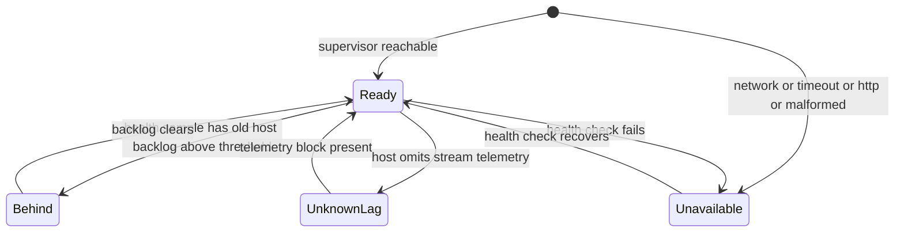

# Status bar

- **Type:** chrome (persistent footer, every `(app)` screen).
- **Status:** Implemented (WI-3 — persistent supervisor-status source).
- **Source:** `web/components/chrome/status-bar.tsx`.

## JTBD

When I am anywhere in the app, I want a single always-visible indicator of
whether the supervisor is reachable — so I know at a glance whether launches and
live runs can proceed.

## Roles & capabilities

No role gate — the footer renders for every authenticated user. It shows status
only; it exposes no mutation. The same coarse behind/unknown field is safe for
every role; only an admin receives a link to execution-host diagnostics.

## Navigation

The platform pill links admins to `/admin/execution-host`; it remains plain text
for other roles. The **Docs** and **GitHub** links open external destinations in
a new tab.

## Layout & regions

Left: the supervisor pill (`PlatformStatusPill`), the host origin
(`localhost:3000`), and the supervisor version when ready. Right: the
attention-stream liveness pill with its reconnect action, then outbound Docs
and GitHub links. Admins also receive the same request-cached coarse status in
the left rail as a direct diagnostics link.

## States

`unknown` means the host reported no stream block at all — a pre-P0-7
supervisor, or one whose telemetry snapshot failed. A host that DOES report,
with nothing outstanding, reads `clear`: the block's age is null exactly at zero
backlog, and that is the healthy steady state, not an absence of information.

## Data & APIs

`getPlatformStatus()` (`lib/execution-host/platform-status.ts`, a cached
`executionHosts.local().platformStatus()` over `checkSupervisorHealth`) — the
same value the layout passes to the rail launch hint. It is the ONLY caller
that opts into the host's stream block; readiness probes deliberately do not,
so a telemetry fault can never refuse a launch. The lag decoration uses only that health response; it does not invoke the
Postgres lag collector. No client polling.

`AttentionLiveRefresh` owns one `GET /api/attention/stream` connection in this
persistent footer. Its ticks refresh the shared sidebar counters and the current
page, including Inbox; see [attention behavior](../../system-analytics/attention.md).

## i18n

`status` namespace (`supervisorReady`, `supervisorBehind`,
`supervisorUnavailable`, `supervisor`, `docs`), plus the `run.stream*`
liveness labels.

## Linked artifacts

- Behavior: [`../../supervisor.md`](../../supervisor.md) (supervisor daemon),
  [`../../system-analytics/instance-config.md`](../../system-analytics/instance-config.md).
- Source: `web/components/chrome/status-bar.tsx`,
  `web/components/chrome/platform-status.tsx`.
