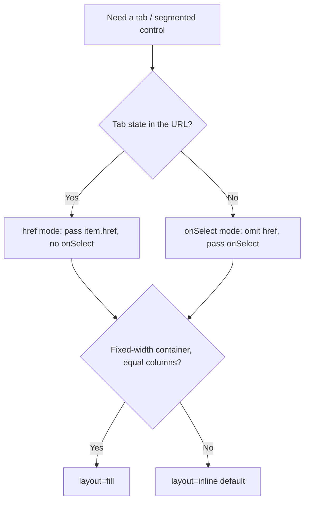

# Shared UI primitives (`components.md`)

- **Kind:** primitive (reusable building blocks shared across screens, blocks
  and chrome — not a route).
- **Status:** Implemented.
- **Source:** `web/components/navigation/tabs.tsx` and the token conventions
  documented below.

> This is the canonical reference for the small, cross-cutting UI building
> blocks that must look the **same everywhere**. When a screen needs a tab bar,
> a status/count chip, or a content card, use the pattern here instead of
> hand-rolling another variant — divergence here is exactly the drift this doc
> exists to prevent.

The app theme tokens (`--ink`, `--ink-2`, `--mute`, `--line`, `--paper`,
`--ivory`, `--amber`, `--amber-line`, `--amber-soft`, `--shadow-sm`, …) live in
`web/styles/globals.css` and are light/dark-tuned. Every primitive below is
expressed in those tokens — never raw hex.

## Feedback primitives (Implemented — UI completion batch)

The shared feedback layer is the only app-wide owner for transient mutation
outcomes and destructive confirmation. It lives under
`web/components/feedback/` and uses HeroUI v3 without a second component
library.

- **Feedback provider / toast:** one provider sits below the theme provider.
  Success uses the existing green-check convention; failure copy is localized,
  non-sensitive, and never shows a raw error code/message. A completed request
  emits at most one toast.
- **Confirm dialog:** a `ConfirmDialogFrame` owns deterministic frame markup;
  `ConfirmDialog` portals it to `document.body`. It supplies an accessible
  label, focus trap/restore, and busy lock. Escape, backdrop, cancel, and a
  repeat confirm do nothing while the unchanged destructive request is pending.
- **Error fallback / skeleton / liveness pill:** error fallback exposes only
  localized recovery plus a recognized diagnostic code label; skeletons mark
  their region `aria-busy`; liveness combines text, color, `aria-live`, and a
  reconnect action. These are presentation state and do not write run state.

The SDD evidence in the UI-completion specification records the implementation
and validation of this contract.

## Tabs — the segmented control

`Tabs` (`web/components/navigation/tabs.tsx`) is the **one** tab/segmented-control
component. It is the rounded-full "pill track" look used by the project board
nav, the run workbench strip, the Flow Studio package viewer, the run inspector,
and the portfolio density toggle. There is no other tab style.

### Why one component renders both Server and Client tabs

`Tabs` has **no `"use client"` directive** and uses no hooks, so it adopts its
importer's environment:

- **href mode** — an item with `href` renders as a `next/link` `<Link>`. Used by
  URL-driven navigation in Server Components (project board, workbench, package
  viewer). Tab state lives in the URL and survives refresh / back-forward.
- **onSelect mode** — an item without `href` renders as a `<button>` that calls
  `onSelect(key)`. Used by state-driven controls in Client Components (run
  inspector, density toggle).

A single file therefore serves both worlds without a client/server split. Do not
fork it.

### API

```ts
interface TabItem {
  key: string;
  label: ReactNode;
  href?: string;     // present → <Link> (href mode); absent → <button> (onSelect mode)
  count?: number;    // optional trailing count badge (uses the chip styling below)
  icon?: ReactNode;  // optional leading glyph (e.g. density toggle)
  testId?: string;   // forwarded as data-testid on the tab
}

interface TabsProps {
  items: TabItem[];
  activeKey: string;
  onSelect?: (key: string) => void;  // required for href-less items
  layout?: "inline" | "fill";        // inline (default) = auto width; fill = full-width equal columns
  ariaLabel?: string;
  className?: string;                 // outer-margin utilities only (e.g. "mb-[22px]")
}
```

### Rules

- **Never restyle a tab inline.** Visual changes go into `Tabs` so every consumer
  moves together. Consumers pass data (`items`, `activeKey`), not classes — the
  only allowed `className` use is outer spacing.
- **`layout="fill"`** for tab bars that should span a fixed-width container with
  equal columns (the run-inspector sidebar). Everything else uses `inline`.
- **Counts** render through the shared chip (amber-tinted when active, neutral
  otherwise) — do not add a second count visual.
- **Active state** is `aria-selected` (`role="tablist"`/`role="tab"`). Tests pin
  the role + `aria-selected` + (for href mode) the `href`, so those are the
  stable contract.

### Choosing the mode



### Documented exceptions

Two controls are intentionally **not** `Tabs`, but share its tokens:

- **Flow Studio editor toolbar toggles** (`web/components/flows/editor/editor-top-bar.tsx`)
  — the Graph / Files / YAML / Diff drawer toggles sit inside a toolbar next to
  Save/Publish and read as `rounded-md` buttons, not a pill track. They use the
  same `line` / `amber-soft` / `amber` / `ivory` tokens. Treat them as a toolbar
  toggle group, not page navigation.

## Auto-apply filter bar (Implemented — first consumer: Observatory)

A filter bar whose controls take effect the moment they change, with **no Apply
button**. Locked by
[ADR-177](../decisions.md#adr-177-observatory-overview-table-day-aligned-period-url-views-and-auto-apply-filters)
for the Observatory; other screens keep their GET-form bars until they get their
own task. Do not convert a bar to this pattern in passing.

### Rules

- **The URL is the state.** Every control reads its value from the current search
  params and writes back to them. No `useState` mirror of a committed filter, so
  a deep link, a refresh and a back/forward all reproduce the same page.
- **Commit with `router.replace(href, { scroll: false })` inside a
  `useTransition`.** `replace`, not `push`, so a slider of intermediate filter
  states does not fill the history stack; `scroll: false` so the page does not
  jump to the top on every keystroke-free change.
  **Consequence, stated plainly:** because `replace` overwrites the current
  history entry, Back does NOT step through previous filter states — it leaves
  the page. That is the trade `replace` buys. A control that SHOULD be
  history-navigable (a view tab, say) belongs in a `<Link>` instead, which
  pushes; the Observatory's view tabs do exactly that.
- **Commit on `change` for presets, selects and date inputs; on blur or Enter
  for free text.** A free-text field that committed per keystroke would issue one
  server round-trip per character.
- **Pending is visible and accessible.** While the transition is pending the bar
  carries `aria-busy` and shows a text-plus-colour indicator (never colour
  alone). The previous content stays on screen — a filter change never blanks the
  page.
- **Clearing a field removes its param**, rather than writing an empty value —
  an empty param is a different URL for the same page.
- **Compose each commit onto the edits still in flight.** The bar's view of the
  current filters is a SERVER value: it does not change until a round-trip
  lands. A second control touched before then, built from that stale value,
  silently overwrites the first edit — and because these controls are
  uncontrolled and re-keyed on their effective value, the discarded one keeps
  DISPLAYING the reader's choice while the page is filtered by something else.
  Accumulate the patch, and discard it the moment the URL the state represents
  changes — that covers both the navigation landing and the reader leaving
  through a link, after which replaying it would re-impose a filter they
  dropped. Do NOT key that reset on the transition's pending flag: a transition
  whose scope schedules no state update settles before the page it asked for
  arrives.
- **Anything else that builds a URL from the same state must read the pending
  patch too.** A view tab, a "reset" link, a breadcrumb — if its href is built
  from the server's copy of the filters, it is stale by construction and a click
  on it silently discards whatever the reader just committed. Two clicks in one
  gesture is the ordinary case, not a corner: clicking such a control BLURS the
  focused field, which commits. Hold the patch as STATE, not only as a ref, or
  those hrefs never re-render; own it above every consumer; and make the
  provider mandatory rather than defaulting to "compose onto nothing", which is
  the same invisible degradation in a new place.
- **A param the current view does not own is not a filter.** Where the field set
  varies by view (or tab, or mode), drop the unowned params where the URL is
  PARSED, so the applied filters and the rendered controls come from one
  ownership rule. Dropping them only when building the tab link leaves a
  bookmark or a pasted URL narrowing the page through a control it never shows.
- **A draft the URL does not carry must SAY so.** Keeping uncommitted text on
  screen is right (see the mount rule below), but a field showing a value the
  page is not filtered by, with no signal, is a lie the reader cannot see — and
  the only way out of it is to focus and blur the field. Render a hint beside
  any free-text field whose value differs from the URL's, wired with
  `aria-describedby`. Text, never colour alone.
- **Mount the bar once, above any view switch.** If the bar re-mounts when the
  view changes, text typed but not yet committed is lost.
- **Every control has a visible `<label>`** (or, for a grouped control like a
  preset track, a `<fieldset>` whose `<legend>` names the group).
- **This pattern requires JavaScript.** It replaces a GET form rather than
  enhancing one, so a surface that must work without JS keeps its form. The
  Observatory is a read-only view where that trade is acceptable; weigh it
  before adopting the pattern elsewhere.

### Where this is used

- Observatory portfolio and project routes
  (`web/components/observatory/observatory-filter-bar.tsx`) — period presets +
  custom range, run kind, project, and the flow-ledger drill-down keys.

## Pill / Badge / count chip

A small inline chip used for statuses, counts, lifecycle labels and metadata
tags. Two tones cover almost every case:

- **Neutral** — `rounded-full border border-line bg-ivory` (or `bg-paper`),
  `text-mute`. The default for metadata and inactive counts.
- **Accent / active** — `rounded-full border border-amber-line bg-amber-soft
  text-amber`. Marks the active or attention-worthy state (e.g. the active tab's
  count, a draft lifecycle pill).

Sizing is `font-mono`, `~9.5–11px`, `uppercase tracking-[0.06em]` for label
chips; count chips drop the uppercase. `Tabs` renders its count badge with
exactly this chip, so a tab count and a standalone status chip read as the same
family. Reach for the neutral tone first; escalate to amber only to signal
"active / needs attention".

## Card

Content cards are a **token convention**, not yet a single component (≈14
hand-rolled card surfaces share the same shell). Keep them on the canonical
shell so they stay visually uniform:

- **Primary card** — `rounded-[14px] border border-line bg-paper`. The default
  for top-level cards (project cards, element cards, board flight cards).
- **Compact / nested card** — `rounded-[10px] border border-line bg-paper`. For
  denser lists and cards nested inside another surface.
- **Inset / muted panel** — swap `bg-paper` → `bg-ivory` for a recessed panel
  inside a card.

Interactive cards add `transition-colors hover:border-amber` and a focusable
wrapper. Do not introduce new corner radii or border colors for cards — pick the
nearest of the three shells above. (A shared `Card` component is a future
extraction; until then this convention is the contract.)

## Where this is used

- `Tabs` — `board/project-tabs.tsx`, `workbench/workbench-tabs.tsx`,
  `studio/package-tabs.tsx`, `runs/run-inspector.tsx`,
  `portfolio/density-toggle.tsx`, `observatory/observatory-views.tsx`.
- Auto-apply filter bar — `observatory/observatory-filter-bar.tsx`.
- Chip + Card conventions — used app-wide; see the source list above for
  representative examples.
