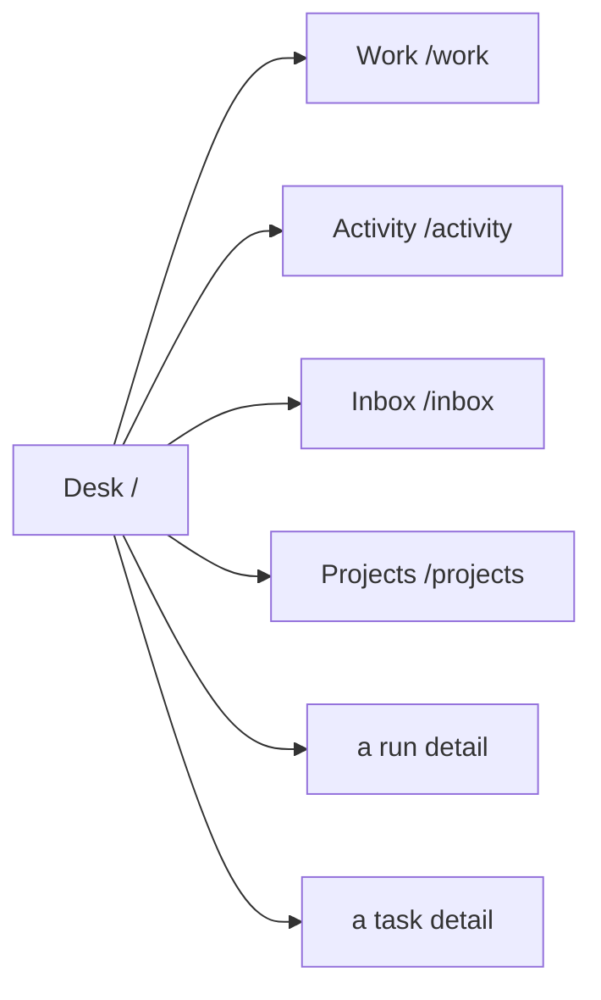
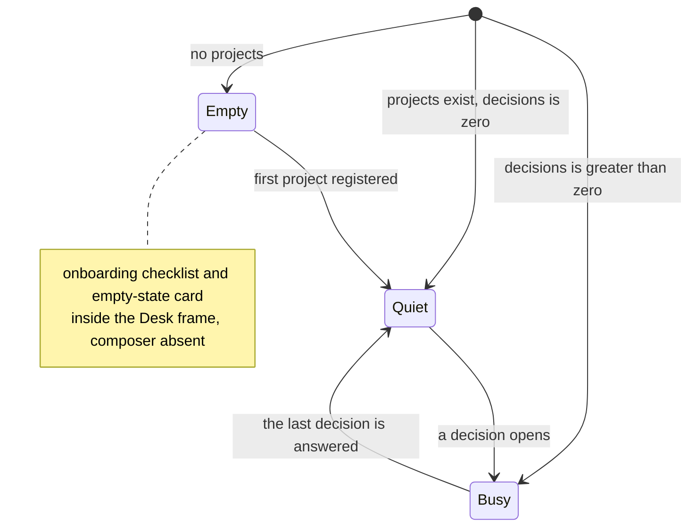

# Desk

**Route:** `/` · **Status:** Implemented (ADR-171) · **Source:** `web/app/(app)/page.tsx`

The home surface. Answers "what needs me, what moved, what is running" in one
screen, across every project the reader can see. It **composes** surfaces owned
elsewhere and re-implements none of them.

## JTBD

- When I sit down in the morning, I want one screen that tells me what is blocked
  on me, so I can start working instead of hunting across project boards.
- When I have been away, I want to see what changed while I was gone, so I can
  catch up without reading every run.
- When I want to start something ad hoc, I want to launch it from where I already
  am, so I do not have to pick a project first.

## Roles & capabilities

| Role | Sees | Does |
| --- | --- | --- |
| Global `admin` | Every non-archived project's decisions, work and activity | Every inline action the underlying surface allows |
| Global `member` | Only their own projects | Same actions, scoped to those projects |
| Global `viewer` | Only their own projects | Read-only; inline actions are absent, not merely disabled |

An admin lands here (`NAV-01`); `member` and `viewer` land on `/work` instead
(`NAV-02`). Scoping is `getVisibleProjectIds`, and every action is authorized
server-side on its own route — the Desk hides nothing it does not also refuse
(`NAV-06`).

## Navigation

Entry: the rail's **Home** section, both logo links, the error fallback, and the
post-sign-in landing route for an admin. Exits: each region links to its full
surface.

## Layout & regions

Top to bottom, in mockup order:

1. **Header + digest sentence** — the deterministic digest for the window since
   the reader's cursor (or a bounded 24 h fallback): promoted, crashed, new
   decisions, new events, tokens spent. One sentence, no narration, no cost in
   USD.
2. **Composer** — the existing scratch launcher. Idea-mode intake is a later
   milestone and is **not stubbed here**.
3. **Now tiles** — the same five counts as the digest, each a link target.
4. **Decisions** — the decision queue with inline actions, reusing the
   `/inbox` section components. Ordered by HITL criticality then age
   (`ATN-07`).
5. **Work in flight** — the work table's row component, full width on desktop.
6. **Activity** — the cross-project feed, beside Decisions on desktop.

Liveness comes from one `EventSource` on the attention stream; the regions
refetch on a tick and never hold an accumulated event list.

### As built

Composition is literal: `HitlInboxList` + `DecisionSections` from `/inbox`,
`WorkRowsTable` from `/work`, `ActivityRowList` from `/activity`, `NowTiles`,
and — for the empty state — `OnboardingChecklist` + `EmptyState` from the
portfolio. The two row components were **split out** of their surfaces in this
phase (`components/work/work-rows-table.tsx`,
`components/activity/activity-row-list.tsx`), and their label sets come from
one builder each (`lib/work/work-row-labels.ts`,
`lib/activity/activity-row-labels.ts`) so a new column cannot reach `/work`
and miss the Desk. The composer is the existing scratch launcher under a
`composer` variant that deliberately does **not** register the global
Cmd/Ctrl+K listener — the rail already owns it, and a second registration
would open two dialogs.

The Desk shows a bounded slice of each region (12 work rows, 12 activity rows)
and links to the full surface; there is no paging here.

**"Work in flight"** is `WORK_IN_FLIGHT_STAGES` — `Queued`, `Executing`,
`WaitingOnHuman`, `Review`, `Crashed`. It is one third of a spelled-out
partition of `WORK_STAGES` (`lib/work/stage.ts`, `UT-STG-11`), so an
eleventh stage falls into no bucket and fails rather than silently appearing
or disappearing here.

**The Decisions region count is the rail badge; the Now `decisions` tile is
not.** The region renders `getDecisionsQueue().count` — the canonical total
`ATN-05` constrains — while the tile is T5.4's *windowed* number, decisions
that are new since the reader's cursor. `E2E-NAV-01`'s companion case asserts
region == badge and tile ≤ badge; asserting tile == badge would be asserting a
bug.

Region counts render as a bare digit with the phrase in an `sr-only` sibling,
for the same reason the rail badges do: a testid whose text reads
"3 blocked on you" cannot be compared numerically.

A **viewer** gets `canAct={false}` on the HITL list, per the role table above.
`/inbox` still passes `canAct` unconditionally; that difference is the
inbox's, and is not changed here.

## States

Narrow viewports stack Decisions, then Work, then Activity (`EDGE-NAV-02`).

The grid is one column below `xl`, so the narrow order **is** the source order;
desktop's different arrangement (Activity beside Decisions, the table full
width below) is done with explicit grid coordinates rather than by reordering
the source. The work table scrolls inside its own `overflow-x-auto` container,
which needs `min-w-0` on the grid item — a grid item defaults to
`min-width: auto` and would otherwise stretch the content area to the table's
1180px min-content width.

Each state is reached by a different reader rather than by a flag, which is how
`e2e/desk.spec.ts` exercises all three: the seeded admin sees every project
(busy), the `/work` fixture's member sees one project and no decisions (quiet),
and a member of no project at all sees the first-run frame (empty).

## Data & APIs

- Decision queue and both counters — see
  [`system-analytics/attention.md`](../system-analytics/attention.md).
- Work rows and stages — see
  [`system-analytics/work-stages.md`](../system-analytics/work-stages.md).
- Liveness — `GET /api/attention/stream`.
- Inline actions reuse the existing promote / recover / discard / HITL-respond
  routes. The Desk adds **no new mutation path**.

## i18n

`desk`, plus the existing `attention`, `work`, `activityFeed` and `inbox`
namespaces for the composed regions. Count-bearing client templates use
`$count`; numeric totals render through `Intl.NumberFormat(locale)`.

## Linked artifacts

- [ADR-171](../decisions.md#adr-171) · [ADR-168](../decisions.md#adr-168) · [ADR-170](../decisions.md#adr-170)
- [`system-analytics/home-navigation.md`](../system-analytics/home-navigation.md)
- [`system-analytics/attention.md`](../system-analytics/attention.md)
- [`work.md`](work.md) · [`activity.md`](activity.md) · [`inbox.md`](inbox.md)
