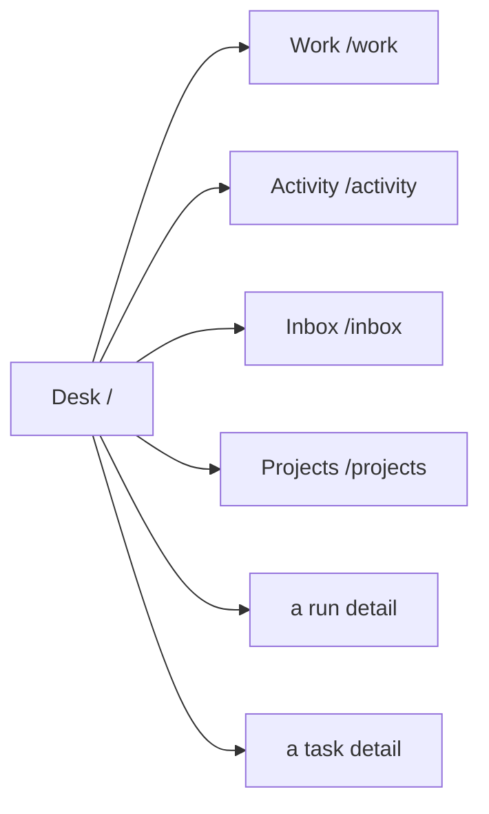
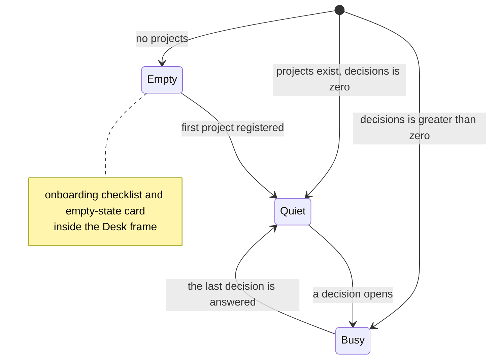

# Desk

**Route:** `/` · **Status:** Implemented (ADR-172, ADR-174) · **Source:** `web/app/(app)/page.tsx`

The home surface. Answers "what needs me, what moved, what is running" in one
screen, across every project the reader can see. It **composes** surfaces owned
elsewhere and re-implements none of them.

## JTBD

- When I sit down in the morning, I want one screen that tells me what is blocked
  on me, so I can start working instead of hunting across project boards.
- When I have been away, I want to see what changed while I was gone, so I can
  catch up without reading every run.
- When I want to start something ad hoc, I want to launch it from where I already
  am, so I do not have to pick a project first.

## Roles & capabilities

| Role | Sees | Does |
| --- | --- | --- |
| Global `admin` | Every non-archived project's decisions, work and activity | Every inline action the underlying surface allows |
| Global `member` | Only their own projects | Same actions, scoped to those projects |
| Global `viewer` | Only their own projects | Read-only; inline actions are absent, not merely disabled |

An admin lands here (`NAV-01`); `member` and `viewer` land on `/work` instead
(`NAV-02`). Scoping is `getVisibleProjectIds`, and every action is authorized
server-side on its own route — the Desk hides nothing it does not also refuse
(`NAV-06`).

## Navigation

Entry: the rail's **Home** section, both logo links, the error fallback, and the
post-sign-in landing route for an admin. Exits: each region links to its full
surface.

## Layout & regions

One column at **every** width, top to bottom (`REQ-D21`, ADR-174 D1) — **(Implemented)**:

1. **Header** — eyebrow and title. No digest sentence, no period, no window
   selector: the Desk answers "what is true now", and a windowed number answers a
   different question (ADR-174 D3).
2. **Now strip** — five tiles, one per `WORK_IN_FLIGHT_STAGES` member
   (`Queued`, `Executing`, `WaitingOnHuman`, `Review`, `Crashed`), in that order.
   All five render at zero; tiles that appear and disappear destroy the fixed
   positions a reader scans by. Activating a tile filters the table **in place**
   via `?stage=<WorkStage>` and does not navigate away.
3. **Work in flight** — the spine of the page (ADR-174 D1). A row expands into its
   own decision panel; every other region is either a summary of this one or a
   different kind of fact about it.
4. **Held** — `flagged` decisions, the one kind the table does not carry: `Held` is
   a `WORK_BACKLOG_STAGES` member, not an in-flight one.
5. **Activity** — the cross-project feed, chronological. Repeated events are never
   collapsed, grouped or reordered (ADR-174 D4).

**The strip's sum is total work in flight, not the number of visible rows.** The
table slices to 12; the counts are derived from the full row array before the slice,
so the strip stays truthful about work the reader cannot see (`REQ-D2`). Both come
from the same array, so strip and table are one population by construction rather
than by agreement.

Gone from the previous cut (ADR-174 supersedes ADR-172 D1 in part): the digest
sentence, the scratch composer, and the Decisions region. The composer is removed
outright — the rail already renders the launcher with the global Cmd/Ctrl+K listener,
so no capability is lost (`REQ-D22`).

Liveness comes from one `EventSource` on the attention stream; the regions refetch on
a tick and never hold an accumulated event list (Implemented). An active `?stage=`
filter survives the refetch tick (`REQ-D5`, Implemented).

### As built

Composition stays literal, and that principle is reaffirmed rather than replaced:
`WorkRowsTable` from `/work`, `ActivityRowList` from `/activity`, `DecisionSections`
from `/inbox`, `NowTiles`, and — for the empty state — `OnboardingChecklist` +
`EmptyState` from the portfolio (Implemented). The two row components were **split
out** of their surfaces rather than copied, and their label sets come from one builder
each (`lib/work/work-row-labels.ts`, `lib/activity/activity-row-labels.ts`) so a new
column cannot reach `/work` and miss the Desk (Implemented).

**The row carries its own decision** (Implemented). The row→decision join is built in the
page from the decision queue it **already loads**, keyed on `runId`;
`getWorkTable` is not modified and the Desk adds no query (`REQ-D2`, `REQ-D15`). Panel
content resolves by stage: `WaitingOnHuman` → the HITL panel; `Review` → a **link** to
the run's review surface, never an inline promote, because the drift-guarded reviewed
target commit exists only there; `Crashed` → recover/discard; `Executing`/`Queued` →
that run's recent events.

**A row expands only when its panel has something to say.** The two read models the
join spans are scoped differently by design: the table reads `getVisibleProjectIds`,
the decision queue reads `getActionableProjectIds` — project `member` and up, because
ADR-169 D7 made the queue *actionable*, not merely visible. A project-`viewer`
therefore sees `WaitingOnHuman` and `Crashed` rows with no decision behind them, and
those rows render inert: no panel, and so no `aria-expanded`, no `tabIndex`, no hover
affordance. That is the intended degradation — an expansion whose every control
answers 403 is what D7 already refused. The `Review` and `Executing`/`Queued` arms
need no decision and expand for every reader.

**The HITL panel is one implementation, not two** (Implemented). `HitlCard` was
monolithic — its own expansion state, header toggle, lazy `inbox-context` fetch and
trailing response form. The panel body is extracted with its `expanded` state owned by
the parent, and **`/inbox` is rebuilt on the extracted panel**, so the Desk and the
inbox render one component. Shipping the extraction without that rebuild would leave
the second copy ADR-172 D1 exists to prevent. The panel fetches `inbox-context` on
**first expand only** — the Desk may hold many `WaitingOnHuman` rows, and a mount-time
fetch would fire one request per row on load (`REQ-D16`).

**The expansion adds no mutation path** (`REQ-D18`, Implemented). Every action inside a
panel posts to the route `/inbox` already uses; the page source carries no
`"use server"`, no `fetch(`, and no `method: "POST"`, and that assertion is not
relaxed.

**The shared table is not forked** (`REQ-D12`). `WorkTableLabels extends
WorkRowsLabels` deliberately, so a column change is a compile error at both call
sites. Expansion ships behind a prop defaulting to **off**, and `/work` turns it on in
a later increment (ADR-174 D5). Two columns go: the `project` column is hidden when
and only when `groupBy === "project"` — the group header already names it — and the
raw `runStatus` column is removed, its distinction folded into `WorkStageChip`
(Implemented).

The Desk shows a bounded slice of each region (12 work rows, 12 activity rows) and
links to the full surface; there is no paging here (Implemented).

**"Work in flight"** is `WORK_IN_FLIGHT_STAGES` — `Queued`, `Executing`,
`WaitingOnHuman`, `Review`, `Crashed`. It is one third of a spelled-out partition of
`WORK_STAGES` (`lib/work/stage.ts`, `UT-STG-11`), so an eleventh stage falls into no
bucket and fails rather than silently appearing or disappearing here (Implemented).

Region counts render as a bare digit with the phrase in an `sr-only` sibling, for the
same reason the rail badges do: a testid whose text reads "3 blocked on you" cannot be
compared numerically (Implemented).

A **viewer** gets `canAct={false}` on the HITL surface, per the role table above.
`/inbox` still passes `canAct` unconditionally; that difference is the inbox's, and is
not changed here (Implemented).

## States

Every viewport stacks strip, then Work, then Held, then Activity (`EDGE-NAV-02`,
Implemented) — there is no second arrangement, so the rendered order **is** the source
order at every width and the two cannot disagree.

Narrow viewports drop table columns by priority (`tokens` and `readiness` first)
rather than scrolling the table sideways (`REQ-D11`, Implemented). Hiding is CSS-driven,
so the `<td>` elements stay in the DOM and any `colSpan` must be the **full** column
count, never the visible count — an expanded row computed from the visible count
misaligns exactly where the columns drop.

Each state is reached by a different reader rather than by a flag, which is how
`e2e/desk.spec.ts` exercises all three: the seeded admin sees every project
(busy), the `/work` fixture's member sees one project and nothing needing them
(quiet), and a member of no project at all sees the first-run frame (empty).

## Data & APIs

- Decision queue and both counters — see
  [`system-analytics/attention.md`](../system-analytics/attention.md).
- Work rows and stages — see
  [`system-analytics/work-stages.md`](../system-analytics/work-stages.md).
- Liveness — `GET /api/attention/stream`.
- Inline actions reuse the existing promote / recover / discard / HITL-respond
  routes. The Desk adds **no new mutation path**.

## i18n

`desk`, plus the existing `attention`, `work`, `activityFeed` and `inbox`
namespaces for the composed regions. Count-bearing client templates use
`$count`; numeric totals render through `Intl.NumberFormat(locale)`.

## Linked artifacts

- [ADR-174](../decisions.md#adr-174-the-desk-renders-one-object-per-work-item) · [ADR-172](../decisions.md#adr-172) · [ADR-169](../decisions.md#adr-169) · [ADR-171](../decisions.md#adr-171)
- [`system-analytics/home-navigation.md`](../system-analytics/home-navigation.md)
- [`system-analytics/attention.md`](../system-analytics/attention.md)
- [`work.md`](work.md) · [`activity.md`](activity.md) · [`inbox.md`](inbox.md)
