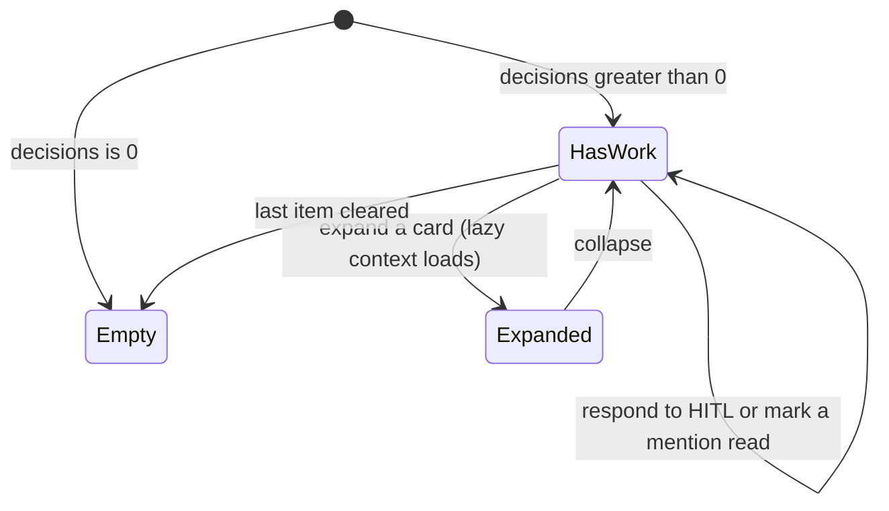

# Inbox

- **Type:** screen.
- **Route:** `/inbox` (session-required).
- **Status:** Implemented (WI-1 + the full-width, project-grouped, 3-tier HITL
  card redesign).
- **Source:** `web/app/(app)/inbox/page.tsx`; the unified
  `components/inbox/{hitl-card,hitl-inbox-list}.tsx` (shared with the
  per-project board); the unchanged `components/portfolio/inbox-panel.tsx`.

## JTBD

When several things across my projects are waiting on me, I want one full-width,
project-grouped surface where each card explains _what the question is about_ —
not only its answer options — so I can clear most of my queue without opening a
run, and dive into the run only when I need the full task context.

When a consensus node cannot reach agreement, I want the inbox card to show the
draft options, disagreement summary, and safe decision controls — so I can pick a
draft, provide a resolution, rerun the round, or abort without reading raw
artifacts first.

## Roles & capabilities

| Role                   | Sees                                                                  |
| ---------------------- | --------------------------------------------------------------------- |
| Global admin           | Pending HITL and unread mentions across **all** non-archived projects |
| Global member / viewer | Pending HITL and unread mentions for projects they are a member of    |

Scoping is inherited from `getCrossProjectHitlInbox` / `getInboxItems` /
`getUnreadInboxCount` (admin = all, member = own); a foreign run or inbox item is
never listed. Inline HITL responses go through the same authorization as the
board (`answerHitl`); the lazy per-card expand payload (`inbox-context`) is gated
by `readBoard` on the run's project.

## Navigation

- **Entry:** the rail **Inbox** nav item; the Desk's **Decisions** region
  ([`desk.md`](desk.md), [`chrome/left-rail.md`](chrome/left-rail.md)).
- **Within:** **expand a card in place** to load decision context; respond to a
  HITL item inline (no navigation); mark a mention read / read-all.
- **Exit:** **View run** links through to the run / task on the project board.

## Layout & regions

Full-bleed page (no centered max-width — `main` gutter provides air). A page
header (eyebrow, title, and the canonical `decisions` count — ADR-169), then:

1. **Needs your action** — `HitlInboxList`: pending HITL across visible projects,
   **grouped by project** (a `project · N waiting` header per group); each group's
   cards render in a responsive grid that flows to **two columns on wide** screens
   and one otherwise, preserving the criticality-then-age order within a project.
2. **Ready to promote** — mechanically promotable runs. The action opens the
   run's review surface rather than calling `POST /api/runs/{id}/promote` from
   here: promotion is guarded against target drift by a **reviewed target
   commit**, which only the review surface holds. Promoting without it would
   bypass that guard, so the card links to the surface that owns the action.
3. **Crashed — recover or discard** — `Crashed` runs owing a decision. The
   inline actions are the existing `RunRecoverActions` control, unchanged,
   posting to the existing recover / discard endpoints.
4. **Held — flagged** — tasks a triage verdict flagged; the action opens the
   task, where triage lives.
5. **Mentions & comments** — the reused `InboxPanel` (unread `comment_added` /
   `task_mentioned`, with mark-read and read-all), unchanged.

Sections 1–4 are the four kinds summed by `decisions`; section 5 is `updates` and
carries the **neutral** tone (ADR-169 D7). Sections 2–4 reuse the `HitlCard` shell
and add **no new mutation path**.

The empty state appears only when `decisions === 0` across all four decision
sections **and** section 5 is also empty. Gating it on `decisions` alone would
hide unread mentions behind an "all clear" message — `updates` is a separate
population precisely so that one cannot mask the other.

Every card in sections 1–4 wears a [`WorkStageChip`](../system-analytics/work-stages.md)
(`WaitingOnHuman` · `Review` · `Crashed` · `Held`). This is the page where the
chip earns its place: with four populations side by side it varies, which is
what makes them comparable at a glance.

### The HITL card

**P0-4 (Implemented):** A pending card whose answer is already stored remains in
“Needs you” until delivery, but displays its selected option and “Answer saved
— delivery pending” read-only. Choices and structured fields are disabled;
one “Retry delivery” action sends the identical sanitized answer when the
operator can act. Read-only viewers still see the saved state without a retry
control. Structured saved values appear under “Saved response” in a bounded,
formatted view. A recognized 202 pending-delivery state updates the card before inbox refresh,
including the `onRespond` path. A 409 for a competing answer refreshes the
authoritative stored choice, never assumes the losing tab's selection won.
An unsuccessful refresh keeps choices locked and offers refresh. A terminal
410 names the ended agent session and relaunch action in feedback that remains
after the card disappears. Refusal copy uses localized `(code, details.reason)`
with a per-code fallback; prompt-owner `causeCode` alone may appear as a
monospaced diagnostic. No raw reason token, host handle or `_delivery` value
is rendered. Saved/delivery feedback uses `aria-live`, keeps keyboard focus
on the available retry or refresh control, and disables repeat submission
while a POST is in flight. The per-project board uses the same card contract.
A budget-breach claim at `stage: "failed"` remains replaceable despite its
stored response; it keeps the existing authorized recovery options in the
expanded card. Active and terminalized budget claims remain read-only.

A unified `HitlCard` (shared with the per-project board, which renders it without
the project-group header) with three disclosure tiers:

- **Collapsed (scan):** agent avatar · task title · `KEY-N` · criticality pill ·
  **stage chip** (node label + type icon) · **branch chip** (the workspace) ·
  time · the prompt (1–2 lines) · a binary permission ask shows `Allow`/`Deny`
  inline (answerable without expanding) · `View run`. Form/human asks show a
  Respond affordance + `View run`.
- **Expanded (decide), lazy:** fetches `inbox-context` (`role="status"` while
  loading, `role="alert"` + retry on error) → **Gates & evidence** (per-gate
  chips, blocking-first, capped with "+k more") + a **separate neutral stale
  chip** · **Last agent message** · **stage progress** (`done/total`) · an optional
  **Changes** line (`N files · +X −Y`) · the respond controls
  (`hitl-decision-controls`) · `View run`.
- **Budget breach HITL (expanded):** renders the ADR-125 progress block before
  the controls: breached dimension, spent vs limit, overshoot, per-dimension
  budget observations, node progress, diff numstat when available, gate counts,
  wall-clock, and resume count. Decision buttons are rendered only from the
  server-provided `availableOptions`: **Raise & continue**, **Restart fresh**,
  **Park the result**, and **Discard**. Park exposes snapshot/export mode with a
  branch-name input only for export; discard exposes the destructive
  drop-workspace confirmation only when the server marks drop available.
  `claimStage` disables controls for an active composite and re-enables failed
  pre-boundary claims.
- **Consensus HITL (expanded):** the same card chrome renders a `consensus`
  stage chip, draft count, current round, material-axis disagreement summary,
  and capped draft/debate excerpts from the HITL schema. Decision controls are
  purpose-built buttons/inputs for `pick-draft-N`, `provide-resolution`,
  `re-run-round`, and `abort`; the card never exposes participant ids, child run
  ids, or unbounded draft bodies as editable fields.
- **Node-interrupt HITL (expanded, ADR-161):** the card renders the same
  four-option interrupt surface the run page uses — *Restart node* as the
  one-click default, *Resume* and *Stop* beside it, *Restart from* behind a
  disclosure toggle, plus the correction textarea and workspace-policy selector.
  The option matrix (per-option `enabled`/`disabledReason`, the ledger-derived
  restart targets, and the interrupted node id) is server-supplied through the
  same loader run detail uses, so an interrupt raised anywhere is answerable
  here without falling back to a raw JSON response body.
- **Run (deep dive):** `View run` opens the full run page.

Per-card criticality accent (critical red / high amber / medium info / low
neutral); the prior block-level amber "alarm" chrome is removed.

## States

### Agent clarification cards (Implemented — ADR-136)

An active `agent_question` card remains visible after its source standalone run
is `Done`; it identifies the task as an agent clarification, renders the stored
strict form schema, and has the same localized busy/error feedback as existing
HITL controls. Pending termination, failed activation, answered, and superseded
questions are never actionable cards. A response is human-only and never offers
ACP resume. EN/RU labels cover asking-agent context, answer, stale/superseded,
and activation-unavailable states.

## Data & APIs

- The shared [status bar](chrome/status-bar.md) subscribes to attention updates,
  so newly actionable forms appear without reloading or reopening Inbox.
- `getCrossProjectHitlInbox(userId, role)` → respondable HITL items + count;
  each item additionally carries `taskTitle` and `stage {label, type}`
  alongside the existing project / branch / flow / criticality / assignment
  fields.
- `getInboxItems(userId, role)` → unread mentions/comments.
- `getUnreadInboxCount(userId, role)` → unread count, one input to `updates`.
- `getDecisionsCount` / `getDecisionsQueue` → the canonical `decisions` value and
  the list it labels, from one query (see
  [`../system-analytics/attention.md`](../system-analytics/attention.md)).
- `GET /api/runs/{runId}/inbox-context` — the lazy per-card
  expand payload `{ lastAgentMessage, gates[], diff, progress }` plus
  `budgetProgress`, `availableOptions`, and `claimStage` for budget-breach
  cards; `readBoard` on the run's project. The consensus card needs no expand
  payload: its bounded drafts, refs and failures come from the HITL row's own
  `consensus_resolution` schema;
  read-only, partial-null on a missing peek. Behavior in
  [`../system-analytics/hitl.md`](../system-analytics/hitl.md).
- Mutations: `POST /api/runs/{runId}/hitl/{hitlRequestId}/respond` (inline
  respond), `PATCH /api/inbox/[itemId]/read`, `POST /api/inbox/read-all`.

## i18n

`inbox` (page eyebrow/title/subtitle/empty + the new card keys: `needsActionTitle`,
`waiting`, `respond`, `viewRun`, `contextLoading`, `contextError`, `retry`,
`gatesEvidence`, `lastAgentMessage`, `stageProgress`, `changes`, `changesSummary`,
`moreGates`, `staleEvidence`, plus budget progress/decision labels) and
`portfolio` (reused notification block labels).
The card reuses `run.*` (criticality / HITL decision) and `board.*` (assignment)
labels; node-type and gate-status are shown by icon, not text, so no `stage.*` /
`gate.*` keys exist.

The consensus card's keys live under `run.*` (the namespace `RunHitlResponse`
reads): `consensusTitle`, `consensusRound`, `consensusDrafts`,
`consensusDraftFallback`, `consensusPickDraft`, `consensusPartial`,
`consensusPartialCause.{output_cap_exceeded|max_tokens|max_turn_requests|refusal|cancelled|host_failure|unknown}`,
`consensusUnavailable`, `consensusUnavailableReason`, `consensusExcerptOmitted`,
`consensusDraftExcerptAria`, `consensusDebateExcerptAria`,
`consensusDownloadDraft`, `consensusDownloadDraftAria`,
`consensusDownloadDebate`, `consensusDisagreements`,
`consensusNoDisagreements`, `consensusTechnicalFailures`,
`consensusTechnicalFailureRow`, `consensusTechnicalFailureTarget`,
`consensusTechnicalDiagnostic`,
`consensusTechnicalCode.{invalid_json|invalid_schema|missing_axes|unknown_axes|empty_disagreement|output_cap_exceeded|target_missing|EXECUTOR_UNAVAILABLE|ACP_PROTOCOL|CRASH|other}`,
`consensusEscalation.{technical_only|rounds_exhausted|single_pass}`,
`consensusDebateLog`, `consensusResolutionLabel`,
`consensusResolutionPlaceholder`, `consensusProvideResolution`,
`consensusRerunRound`, `consensusAbort`, and `consensusResolutionRequired`.
The three dotted families are closed maps in `hitl-decision-controls.tsx`
(`Record<Union, string>` English fallbacks), so a new cause, code or reason is a
compile-time gap, not a silently raw token. EN + RU parity is required.

## Consensus acceptance criteria

- A consensus HITL card is scannable while collapsed and shows the same project,
  criticality, stage, branch, and `View run` affordances as existing HITL cards.
- Expanding the card shows bounded draft/debate context and the four allowed
  consensus decisions without layout overflow on one-column and two-column grids.
- The response body is allow-list driven by stored HITL payload data; arbitrary
  draft ids, runner refs, participant ids, or child run ids from the browser are
  ignored or rejected server-side.
- Clearing the last consensus HITL updates `decisions` through the existing inbox
  count path.

P0-5 v2 (Implemented): the card decodes its schema through the shared
client-safe `decodeConsensusResolutionSchema`
(`web/lib/flows/consensus-resolution.ts`) — the same decoder the respond route
validates with, so the slots it disables are exactly the picks the server
refuses. Legacy payloads (no `slot`/`classification`/`decision`, `participantLabel`,
`debate_log`) stay readable and pickable.

- **Escalation headline.** `escalationReason` renders one localized line above
  the drafts: `technical_only` (amber, warning glyph — the verifiers could not
  judge the drafts; run another round or resolve manually), `rounds_exhausted`,
  or `single_pass`.
- **Partial drafts** show `Partial · <cause>`, the cause from
  `consensusPartialCause` mapped to a localized label (an output-cap overflow
  reads "output size limit reached", never the host's `end_turn`). A partial is
  pickable but its button uses the secondary (outline) tone, not the primary
  fill.
- **Unavailable slots** keep their card and number: an "Unavailable" chip, a
  short localized reason, and a *disabled* pick button (`aria-disabled`,
  `aria-describedby` pointing at the reason). No server placeholder text.
- **Technical failures** render in amber with a warning glyph, one row per cell:
  "Verifier `<id>` · Draft `<N>`" (`targetSlot`; the target id only when a
  legacy row has no slot), a localized code label, and the raw code as a
  labelled secondary diagnostic. When every failure is technical and there are
  no material rows, the "No material disagreements" box is not shown.
- **Excerpts** are keyboard-focusable scroll regions with an accessible name.
  When the record carries `excerptBounds`, the engine's English truncation
  marker is stripped and a localized "Excerpt — N KB omitted" chip is shown.
- **Downloads.** The payload route always answers as an attachment, so the
  links read "Download full draft" / "Download full debate" with a download
  icon and open in place (no new tab); each draft link is named by its slot.
  Draft links use the child run ID and the round debate link uses the parent run
  ID; the round debate row exists at HITL creation.
- **Viewer gate.** Draft downloads serve agent output that can quote repository
  files, so the route requires `readRepoFiles` for
  `default:consensus-draft|consensus-verdict|consensus-synthesis`; the card
  shows the draft link only when the server-derived `canReadRepoFiles` is true
  (run page: the viewer's project role; `/inbox` and the Desk:
  `decisionQueueGrants("readRepoFiles")`, the queue's own role floor; project
  board: the board's role). The round debate link stays at `readBoard`.

A human may pick partial text; synthesis carries the partial label and reason.
The response API's allowed decisions and authorization remain unchanged.

## Budget-breach acceptance criteria

- The card shows the progress block in both full-source and degraded states
  without surfacing file contents.
- The option set exactly matches the server `availableOptions`; the UI has no
  independent availability matrix.
- A destructive workspace drop requires confirmation and is hidden when the run
  has no owned workspace.
- Active staged claims are not counted in needs-you and render disabled
  controls; `stage:"failed"` rows are answerable again.

## Flow Review Workspace triage (Implemented — ADR-138)

For `schema.review === true`, a card remains scannable but is not answerable
inline. It replaces generic decision controls with **Review code**, linking to
`/runs/{runId}?wb=review&scope=review`. The card retains task, branch,
iteration, and change summary context. Permissions, forms, clarification,
consensus, budget, and non-review human HITL keep the current inline response.

The CTA has EN/RU parity and a visible unavailable message when the run cannot
open a review workspace. The Inbox never presents a second approve/rework form.

## Linked artifacts

- Behavior: [`../system-analytics/hitl.md`](../system-analytics/hitl.md)
  (cross-project inbox, respond two-phase commit, stage resolution +
  `inbox-context` reads),
  [`../system-analytics/consensus.md`](../system-analytics/consensus.md)
  (consensus no-agreement HITL decisions),
  [`../system-analytics/social-board.md`](../system-analytics/social-board.md)
  (inbox fanout),
  [`../system-analytics/attention.md`](../system-analytics/attention.md)
  (the canonical `decisions` and `updates` counters),
  [`../system-analytics/run-continuation.md`](../system-analytics/run-continuation.md)
  (the node-interrupt option matrix and its shared loader).
- ADRs: [ADR-057](../decisions.md#adr-057) (HITL hybrid surface),
  [ADR-083](../decisions.md#adr-083) (social board / inbox),
  [ADR-125](../decisions.md#adr-125-budget-breach-four-way-fork-with-staged-claims),
  [ADR-161](../decisions.md#adr-161-operator-node-interrupt-with-corrective-restart)
  (node-interrupt card).
- Plan: `.ai-factory/plans/feature-inbox-card-redesign.md`.
- Source: `web/app/(app)/inbox/page.tsx`, `web/lib/queries/needs-you.ts`,
  `web/lib/queries/portfolio.ts` (`getCrossProjectHitlInbox`),
  `web/lib/queries/inbox.ts`, `web/lib/queries/inbox-context.ts`,
  `web/lib/queries/hitl-stage.ts` (`resolveNodeInterruptMatrices`),
  `web/components/inbox/hitl-card.tsx`.

## Plan-review decision card (Implemented — ADR-137)

The card identifies the immutable plan review, shows the blocking question,
recommended option and consequences, and offers only the server-provided option
IDs. On submit it disables the choice, reports localized failure/retry feedback,
and removes itself when answered or parent-reworked. It does not create or mark
social Inbox items; the parent review keeps its existing gate chat.
