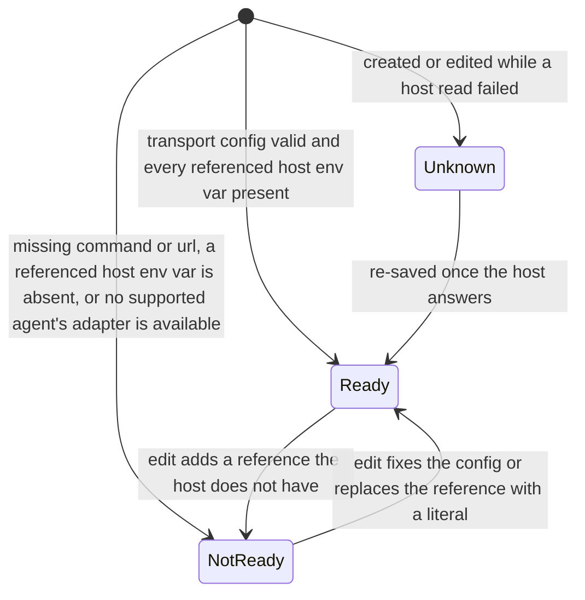

# MCP servers (platform)

- **Type:** screen (admin).
- **Route:** `/mcps` (global admin only).
- **Status:** Implemented (WI-2); trust action + used-by column + test-connection Designed (ADR-129).
- **Source:** `web/app/(app)/mcps/page.tsx`, reusing
  `components/settings/{mcp-servers-panel,mcp-server-modal}.tsx`.

## JTBD

When I administer the platform, I want to see and manage every host-wide MCP
server and whether each is actually ready — so I can keep the shared tool
catalog healthy without digging through settings.

## Roles & capabilities

| Role | Access |
| --- | --- |
| Global admin | Full list / create / edit / delete of `platform_mcp_servers` |
| Everyone else | No nav item; the route returns `UNAUTHORIZED` (`requireGlobalRole("admin")`) |

The hidden nav item is convenience only — the route is the authorization
boundary. Project members continue to manage **project**-scoped MCPs on the
board's `?tab=mcps`; this screen is platform scope.

## Navigation

- **Entry:** the admin block of the [left rail](chrome/left-rail.md) (alongside
  Users / Scheduler / Settings).
- **Within:** "Add MCP server" and per-row edit open the `McpServerModal`
  (create / edit / delete); the table itself is view-only.

## Layout & regions

A page header, then the reused `McpServersPanel`: a full-width view-only table
(id, transport, target, agents, **readiness**, **trust**, **used by N**,
enabled, actions) plus the create/edit/delete modal. Follows the data-management
page bar from `web/CLAUDE.md` (full-width, view-only table, modal edits).

**Trust action (Implemented, ADR-129).** Each row shows its
`trust_status ∈ {untrusted, trusted, trusted_by_policy}` as a badge and offers a
**trust / revoke** control (mirrors the `studio` namespace `trust`/`needsTrust`
labels). Flipping trust calls `POST /api/admin/mcp-servers/{id}/trust`. An
untrusted platform MCP is **visible but not executable** — projects see it in
the hub but it is withheld from materialization (`platform-untrusted`) until
trusted. The **used by N** column counts projects referencing the server
(`web/lib/mcp/usage.ts loadMcpUsageReferences`, mirrors `studio.usedBy`).

**Readiness reasons (Implemented, ADR-179).** The **readiness** cell is a status
chip carrying `readiness_reasons` as a tooltip — the same pattern as the runner
panel's readiness cell. A presence check whose reason (`env ref missing: X`) is
invisible is not actionable, so the page selects the column and the panel
renders it.

**Modal field order (Implemented, ADR-179).** `McpServerModal` presents: server
id, description, transport (`sse` is labelled `sse (legacy)`), then
`command` + `args` **or** `url` + bearer token env, then the env rows **or** the
header rows (the shared `KeyValueRows` control — same component as the ACP
runner modal), then supported agents and enabled. Each row's value is
`literal | env:NAME`; the hint states the grammar, a row under a secret-shaped
key carrying a literal shows an inline non-blocking warning, and a malformed
`env:` value shows an inline row error that blocks submit. Choosing `sse` while
`codex` is among the supported agents shows an inline note that the server will
be withheld for codex runs (`agent-unsupported-transport`).

## States

`readiness_status` per server, recomputed on every write (WI-2):

## Data & APIs

- Read: `db.select(...).from(platform_mcp_servers)` (admin-scoped page load).
- Mutations: `POST /api/admin/mcp-servers`,
  `PATCH /api/admin/mcp-servers/{id}` (accepts `trustStatus`),
  `DELETE /api/admin/mcp-servers/{id}`, and (Designed, ADR-129)
  `POST /api/admin/mcp-servers/{id}/trust`.
  `readiness_status` / `readiness_reasons` are recomputed by
  `evaluateMcpReadiness(row, { presence, adapters })` on POST + PATCH (never
  DELETE), where `presence` comes from `HostAdminClient.checkEnvRefs(names)` over
  supervisor `POST /diagnostics/env-refs` and `adapters` from `diagnostics()`;
  both are read BEFORE the write and either failing yields `Unknown` with the
  write still committing — see
  [`../system-analytics/mcp-management.md`](../system-analytics/mcp-management.md).
- Used-by count: `web/lib/mcp/usage.ts loadMcpUsageReferences`.
- The "Test connection" probe (Implemented, ADR-129) proxies to supervisor
  `POST /mcp-probe`; a stdio server from an untrusted source is refused with a
  typed `CONFIG` reason (no override in v1).

## i18n

`mcps` (page eyebrow/title/subtitle) and `settings` (reused panel + modal
labels: `mcpServersTitle`, `colReadiness`, `addMcp`, …). The trust + used-by UI
mirrors the `studio` namespace keys (`trust`, `needsTrust`, `usedBy`). The
ADR-179 fields add `settings.fieldDescription`, `fieldHeaders` /
`fieldHeaderName` / `fieldHeaderValue` / `addHeader` / `removeHeader`,
`fieldBearerTokenEnv` + `bearerTokenEnvHint`, `valueGrammarHint`,
`secretShapedWarning`, `transportSseLegacy` and `readinessReasonsTitle`, and
reuse `fieldEnv` / `fieldEnvKey` / `fieldEnvValue` / `addEnv` / `removeEnv` from
the runner modal; the retired name-list labels and `secretRefHint` are gone from
both catalogs. EN + RU parity is gated.

## Linked artifacts

- ADR: [ADR-070](../decisions.md#adr-070) — platform MCP admin CRUD + delete
  guard; [ADR-129](../decisions.md#adr-129) — load-bearing trust + used-by +
  health probe; [ADR-179](../decisions.md#adr-179) — value maps, bearer field,
  readiness reasons, shared rows control, `sse (legacy)`.
- Behavior: [`../system-analytics/mcp-management.md`](../system-analytics/mcp-management.md).
- Project-side hub: [`projects/project-mcps-hub.md`](projects/project-mcps-hub.md).
- Shared rows control: `web/components/settings/key-value-rows.tsx` — also used
  by the ACP runner modal ([`settings-acp-runners.md`](settings-acp-runners.md)),
  the project MCP modal, the overlay dialog and the Studio template editor.
- Source: `web/app/(app)/mcps/page.tsx`, `web/lib/mcp/readiness.ts`,
  `web/lib/mcp/value-grammar.ts`,
  `web/app/api/admin/mcp-servers/route.ts`,
  `web/app/api/admin/mcp-servers/[id]/route.ts`.
