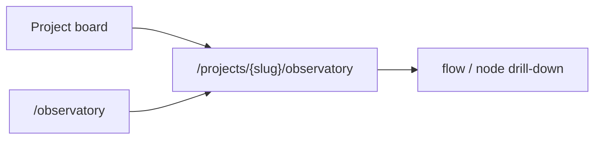
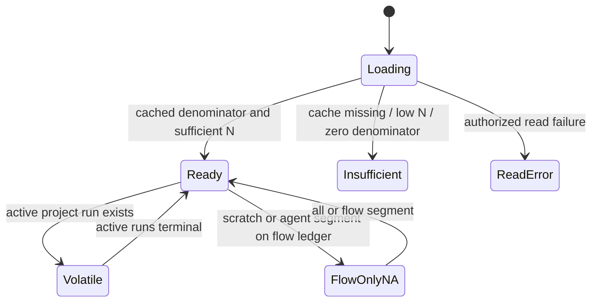

# Observatory

## Header

Routes: `/observatory` and `/projects/{slug}/observatory`.

Status: existing process/cost Observatory and the ADR-134 agentization,
run-kind segment, funnel, and scope labels are Implemented.

Sources: `web/app/(app)/observatory/page.tsx`,
`web/app/(app)/projects/[slug]/observatory/page.tsx`, and
`web/components/observatory/*`.

## JTBD

When I need to understand delivery and operating quality for a project, I want
to inspect read-only AI-attributed delivery, cost, budget, and flow-ledger
signals so I can make a human decision without this surface changing work.

## Roles & capabilities

| Role | Capability |
| --- | --- |
| Project viewer/member/admin/owner | Read the Observatory only for visible projects. |
| Global viewer/member/admin | Read the portfolio scope permitted by existing project visibility. |
| Global admin | Has no write privilege on this surface; scheduler administration is elsewhere. |

## Navigation

The project board links to its project Observatory. The portfolio route can
narrow to a project; flow and node drill-down links preserve the current
window and valid `runKind` segment.

## Layout & regions

The project page shows the existing filter bar plus the following designed
read-only additions:

- `all | flow | scratch | agent` segment;
- agentization panel: lines headline, merge/PR secondary rate, daily trend,
  flow/scratch/agent buckets, volatility and `as of` freshness;
- all-run autonomy/human-touch/promotion funnel;
- cost and budget kind attribution;
- visible `flow runs` scope labels on correction, autonomy, signals, harness,
  artifact, coverage, and node panels.

For scratch or agent selection, flow-ledger panels show an explicit
not-applicable state instead of relabeling flow-only values. The portfolio route
does not show agentization or the new funnel.

## States

No state has a reconcile, fetch, promotion, target, benchmark, A/B, or
write-back action. Missing/ambiguous PR attribution or unavailable cache stays
insufficient, never estimated.

## Data & APIs

Server-component queries bulk-read final `runs` delivery evidence,
`repo_delivery_rollups`, cost/budget rows, and existing ledger data. The
repository scanner alone fetches and writes its cache; no public page API is
introduced. See [`../system-analytics/observatory.md`](../system-analytics/observatory.md)
and [`../system-analytics/scheduler.md`](../system-analytics/scheduler.md).

## i18n

`web/messages/en.json` and `web/messages/ru.json` carry every new segment,
scope, freshness, insufficiency, volatility, kind, and not-applicable label;
the parity test requires matching key sets.

## Linked artifacts

- [ADR-134](../decisions.md#adr-134-observatory-agentization-and-commit-provenance)
- [`../system-analytics/observatory.md`](../system-analytics/observatory.md)
- [`../system-analytics/runs.md`](../system-analytics/runs.md)
- [`../db/runs-domain.md`](../db/runs-domain.md)
