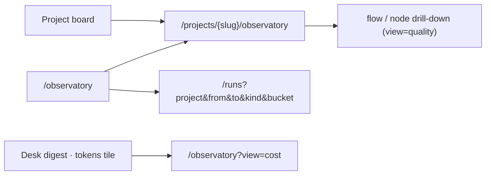
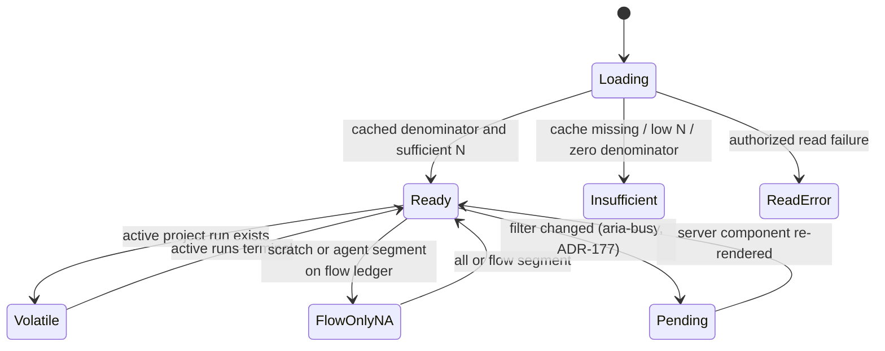

# Observatory

## Header

Routes: `/observatory` and `/projects/{slug}/observatory`.

Status: existing process/cost Observatory and the ADR-134 agentization,
run-kind segment, funnel, and scope labels are Implemented. The ADR-177 overview
table, period model, URL view axis, and auto-apply filter bar are **(Designed)**.

Sources: `web/app/(app)/observatory/page.tsx`,
`web/app/(app)/projects/[slug]/observatory/page.tsx`, and
`web/components/observatory/*`.

## JTBD

When I need to understand delivery and operating quality for a project, I want
to inspect read-only AI-attributed delivery, cost, budget, and flow-ledger
signals so I can make a human decision without this surface changing work.

## Roles & capabilities

| Role | Capability |
| --- | --- |
| Project viewer/member/admin/owner | Read the Observatory only for visible projects. |
| Global viewer/member/admin | Read the portfolio scope permitted by existing project visibility. |
| Global admin | Has no write privilege on this surface; scheduler administration is elsewhere. |

## Navigation

The project board links to its project Observatory. The portfolio route can
narrow to a project; flow and node drill-down links preserve the current
window and valid `runKind` segment.

**(Designed, ADR-177)** Both routes carry a **view axis** in the URL:
`?view=overview|cost|quality|harness`, default `overview`. A link that carries
`flowId`, `nodeId`, `artifactKind` or `artifactDefId` **without** `view` defaults
to `quality`, so pre-existing drill-down links land where their filters apply.
The view tab bar is the shared `Tabs` primitive in href mode
([`components.md`](components.md)); on the project route it sits below
`ProjectTabs`.

Two entry points reach a specific view: the Desk digest `tokens` tile opens
`/observatory?view=cost`, and every numeric run cell of the overview table opens
`/runs?project=&from=&to=&kind=&bucket=` — the ledger filtered to exactly that
cell. Task cells open the project board instead.

## Layout & regions

Page order on both routes **(Designed, ADR-177)**: header → filter bar → view
tabs → the selected view. The filter bar is mounted **once, above** the view
switch, so text typed but not yet committed survives a view change.

| View | Portfolio | Project |
| --- | --- | --- |
| Overview | overview table with totals and the Platform row; compact cost strip (period total, top models / runners / flows, link to Cost) | overview row plus per-flow breakdown; compact cost strip; Agentization; Run autonomy funnel |
| Cost | token tiles, By model, By runner, **By flow**, By run kind, Budget pressure | same |
| Quality | correction tiles; per-project quality table; node heatmap; Autonomy Score; Signals; Artifacts | correction tiles; per-flow quality table; heatmap; Autonomy Score; Signals; Artifacts; node drill-down |
| Harness | Sensor firing, Control effectiveness, Coverage map | same |

### Overview table (Designed)

Column groups, left to right: **Project** · **Tasks** (in work, taken into work)
· **Runs** (flow, scratch, agent) · **In flight** (queued, executing, waiting on
human, review, crashed) · **Settled** (delivered, PR open, result only, failed,
abandoned). Then a totals row, and — for a global admin with at least one
project-less run in the period — a **Platform** row whose task cells are empty.

The table does **not** drop columns responsively: it lives in one
`overflow-x-auto` container with a `min-w-[…]`, so the page itself never scrolls
horizontally and no `<th>`/`<td>` pair can fall out of step. A `live` band marks
a table holding at least one in-flight run (the existing `volatile` convention).

Below it sits the **compact cost strip**: the period token total, the top three
models / runners / flows, and a link to the Cost view.

### Filter bar (Designed)

One client-owned bar, **no Apply button**. Fields by view:

| Field | Views |
| --- | --- |
| Period (`7d` / `30d` / `90d` presets, plus `from` / `to` dates) | all |
| Run kind (`all \| flow \| scratch \| agent`) | all |
| Project (`project=<slug>`) | portfolio only |
| Flow, Node | Quality, Harness |
| Artifact kind, Artifact definition | Quality |

Presets, selects and date inputs commit on `change`; free-text fields commit on
blur or Enter. Clearing a field removes its param. The bar renders the
**effective** period, so a clamped or dropped custom range is visible rather than
silently ignored. The behavioral contract for this pattern lives in
[`components.md`](components.md) → "Auto-apply filter bar".

### Existing regions

The project page also shows:

- agentization panel: lines headline, merge/PR secondary rate, a daily
  target-branch-share bar chart (with gaps rather than fabricated zeroes for
  insufficient daily evidence), flow/scratch/agent buckets, volatility and
  `as of` freshness;
- all-run autonomy/human-touch/promotion funnel;
- cost and budget kind attribution;
- visible `flow runs` scope labels on correction, autonomy, signals, harness,
  artifact, coverage, and node panels. The Harness coverage card is a
  node-by-control matrix: guide count, blocking/advisory gate counts, and
  observed executions; amber rows mark guides without sensors. Sensor firing
  stays compact when it has no gate executions and does not stretch to match a
  taller adjacent card.

For scratch or agent selection, flow-ledger panels show an explicit
not-applicable state instead of relabeling flow-only values; **(Designed,
ADR-177)** that state becomes the whole Quality and Harness view, and the Quality
layout uses a responsive grid with `items-start` and no fixed aside, so an empty
ledger is one short card rather than a viewport. The portfolio route does not
show agentization or the funnel.

## States

No state has a reconcile, fetch, promotion, target, benchmark, A/B, or
write-back action. Missing/ambiguous PR attribution or unavailable cache stays
insufficient, never estimated.

**(Designed, ADR-177)** Two additional states:

- **Pending** — a filter change is in flight. The bar sets `aria-busy` and shows
  a text-plus-color indicator until the server component has re-rendered; the
  previous content stays visible and nothing is cleared.
- **View × run kind not applicable** — with `runKind ∈ {scratch, agent}`, the
  Quality and Harness views render the flow-ledger not-applicable state as the
  **whole** view. Overview and Cost stay fully populated for those kinds.

## Data & APIs

Server-component queries bulk-read final `runs` delivery evidence,
`repo_delivery_rollups`, cost/budget rows, and existing ledger data. The
repository scanner alone fetches and writes its cache; no public page API is
introduced. See [`../system-analytics/observatory.md`](../system-analytics/observatory.md)
and [`../system-analytics/scheduler.md`](../system-analytics/scheduler.md).

**(Designed, ADR-177)** The overview adds `getObservatoryOverview`
(`web/lib/queries/observatory-overview.ts`): two grouped SELECTs on the portfolio
— runs by `(project_id, run_kind, bucket)` and tasks by `project_id` — plus one
more on the project route for the per-flow / per-kind sub-rows. The query count is
**fixed**, independent of how many projects are visible. Still RSC only: no new
route, no migration, no index.

## i18n

`web/messages/en.json` and `web/messages/ru.json` carry every new segment,
scope, freshness, insufficiency, volatility, kind, and not-applicable label;
the parity test requires matching key sets.

**(Designed, ADR-177)** New families: `observatory.views.*` (four view names),
`observatory.period.*` (presets, from/to, clamped, pending), `observatory.overview.*`
(title, column groups, project/platform/total, empty, live hint, open-in-ledger),
`observatory.cost.byFlowTitle` + `observatory.cost.periodScoped` (replacing
`costBreakdown.storedLifetime`), `observatory.quality.*`, `runsList.filters.{kind,bucket}` —
and a **top-level `runBucket.*`** namespace with the ten D3 names, shared by the
Observatory and the `/runs` ledger so the two never carry different words for one
bucket.

## Linked artifacts

- [ADR-134](../decisions.md#adr-134-observatory-agentization-and-commit-provenance)
- [ADR-177](../decisions.md#adr-177-observatory-overview-table-day-aligned-period-url-views-and-auto-apply-filters)
- [`components.md`](components.md)
- [`runs/list.md`](runs/list.md)
- [`../system-analytics/observatory.md`](../system-analytics/observatory.md)
- [`../system-analytics/runs.md`](../system-analytics/runs.md)
- [`../db/runs-domain.md`](../db/runs-domain.md)
