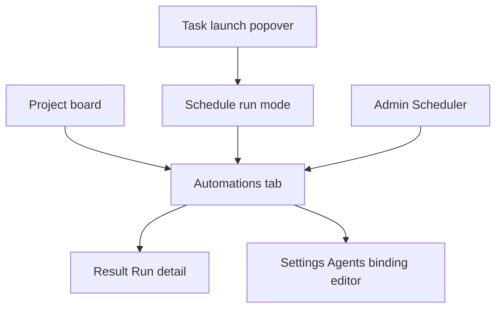
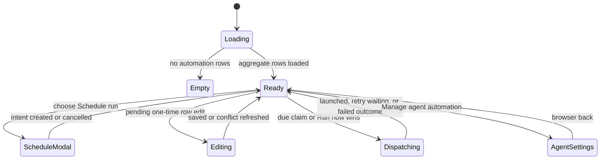

# Project Automations

- **Type:** project board tab.
- **Route:** `/projects/{slug}?tab=automations`; legacy
  `?tab=schedules` resolves to this tab.
- **Status:** Designed.
- **Source:** planned `web/components/automations/*`,
  `web/components/board/launch-popover.tsx`, and
  `web/components/board/project-tabs.tsx`.

## JTBD

When I need a configured task to start later, I want to create and understand
its one-time automation alongside recurring task schedules and effective agent
bindings, so I can act on future work without learning scheduler internals or
accidentally creating a Run early.

## Roles & capabilities

| Role | Can see | Can do |
| --- | --- | --- |
| Project viewer | Aggregate rows, safe outcomes, detail links, resulting Runs | Inspect only |
| Project member | Same | Create, edit, cancel, and Run now one-time task launches when `manageSchedules`, `launchRun`, and applicable `launchUnattended` pass |
| Project admin/owner | Same | Existing recurring schedule controls; follow agent rows to Settings → Agents |
| Global admin | Same project semantics | Inspect host-wide diagnostics at Scheduler; no project automation CRUD there |

## Navigation

The board renders **Automations** in place of the former visible Schedules tab.
New links use `?tab=automations`; the old query is a compatibility alias with a
documented future retirement, not a second surface.

## Layout and regions

- **Schedule run** is a sibling submit mode in the existing task launch
  popover. It preserves the exact validated Flow/runner/branch/policy selection
  that normal launch uses, forces `allowConcurrent=false`, and creates only an
  intent. It does not reserve capacity or create a Run before the due claim.
- **Time controls** show local date-time, IANA timezone, selected DST
  disambiguation, resolved UTC preview, and the normal 60-second scheduler-tick
  expectation. A nonexistent time shows field remediation; an ambiguous time
  requires an explicit earlier/later choice.
- **Automation list** groups/filter rows from the aggregate reader:
  one-time task launch, recurring task schedule, agent cron, and agent event.
  It shows only effective target, timing, state, safe latest outcome, and a
  resulting Run link when present.
- **One-time detail/actions** retain the latest ETag/revision. Pending rows may
  edit, cancel, or Run now; claimed and terminal rows expose their outcome but
  no misleading action. Conflicts refresh the safe latest DTO.
- **Recurring rows** reuse their existing controls and APIs. **Agent rows**
  show the effective binding and a **Manage agent automation** deep link to the
  single Project Settings → Agents editor. They never render Run now in this
  phase.

No row renders scheduler job IDs, leases, worktree/repository paths, raw
targets, secret values, or raw provider errors.

## States

Busy state disables duplicate action submission. Accessible status and error
feedback uses `aria-live`, an icon plus label for actions, and localized safe
copy. Successful actions use the shared green-check convention; no raw HTTP
status, domain code, or server message is displayed as user-facing text.

## Data and APIs

- Aggregate: `GET /api/projects/{slug}/automations?limit=&cursor=`.
- Detail: `GET /api/projects/{slug}/automations/{kind}/{id}`.
- One-time intent: `POST /api/projects/{slug}/scheduled-launches`, then
  `GET/PATCH /api/projects/{slug}/scheduled-launches/{id}` and
  `POST .../{id}/cancel` or `POST .../{id}/run-now`.
- Creation supplies an opaque `Idempotency-Key`; mutation sends the exact
  quoted `If-Match` revision from the response ETag. A same key and same
  normalized request replays; a key used for a different request is a conflict.
- Recurring controls remain the existing `/schedules` contract. Agent binding
  configuration remains the existing project-agent PATCH contract.

Behavior, recovery, retry, and permissions live in
[project-automations.md](../../system-analytics/project-automations.md), not in
this surface document.

## i18n

Planned namespaces: `automations`, `launch`, `projectSchedules`, `apiErrors`,
and `common` in `web/messages/{en,ru}.json`. Every aggregate discriminant,
state, outcome, DST prompt, retry state, action, and unavailable remediation
requires matching English and Russian copy.

## Linked artifacts

- Behavior: [project-automations.md](../../system-analytics/project-automations.md),
  [run-schedules.md](../../system-analytics/run-schedules.md), and
  [agents.md](../../system-analytics/agents.md).
- Related screens: [project-board.md](project-board.md),
  [project-settings-agents.md](project-settings-agents.md), and
  [../admin-scheduler.md](../admin-scheduler.md).
- API: [../../api/web.openapi.yaml](../../api/web.openapi.yaml).
