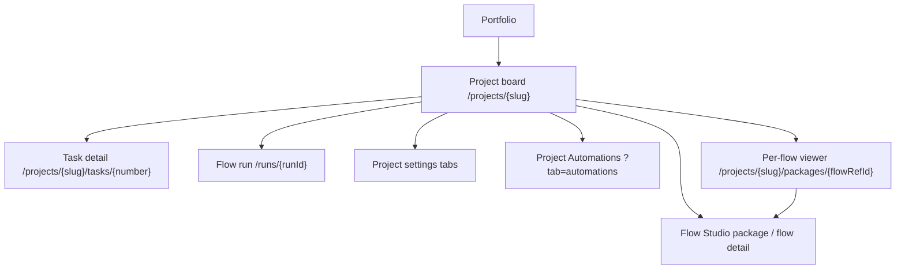
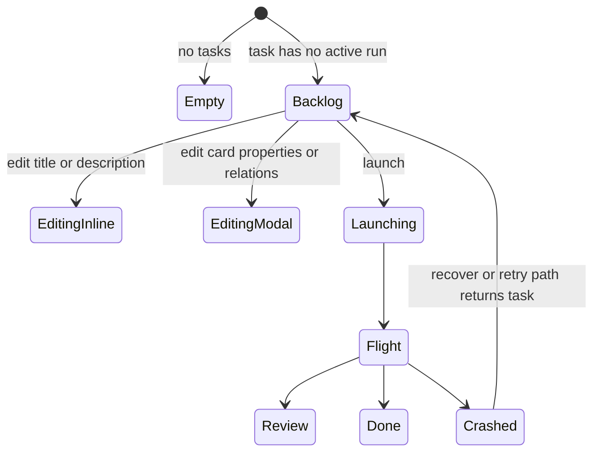

# Project board

## ADR-140 target state (Designed)

The board receives workspace presence alongside latest-run status. An archived
`Review` or `Crashed` run remains visible as history but no longer blocks a new
launch. It never renders a worktree action for a removed workspace; direct
server routes, not this visual state, enforce the guard.

## Cut-over incompatible task state (ADR-131 — Implemented)

A task bound to an incompatible revision stays visible and shows its typed
reason beside the disabled launch affordance. The board derives it from the
authoritative enabled revision, not the mutable `flows.manifest` cache: legacy
`steps[]` receives republish guidance, while an engine-range mismatch reports
its declared range. Launch is unavailable. For D2 runs the board shows terminal
Failed state and never offers Recover, Resume, Respond, Promote or retry.

- **Route:** `/projects/{slug}`
- **Status:** Implemented
- **Source:** `web/components/board/board.tsx`,
  `web/components/board/task-card.tsx`,
  `web/components/board/task-card-editing.tsx`,
  `web/components/social/markdown-body.tsx`,
  `web/components/social/task-detail-prompt-editor.tsx`,
  `web/app/(app)/projects/[slug]/tasks/[number]/page.tsx`

## JTBD

When I am operating a project, I want a dense task board with runnable backlog
cards and live work cards so I can decide what to launch, unblock, review, or
edit without leaving the project context.

## Roles & Capabilities

| Role | Can see | Can do |
| --- | --- | --- |
| Project viewer | Board columns, task cards, run cards, blockers, relations | Open task and run detail pages |
| Project member/admin/owner | Same | Create tasks, edit Backlog task fields, edit relations, launch allowed tasks |
| Global admin | Same as project role through implicit access | Same as an owner for every project |

Edits use `requireProjectAction(projectId, "editTask")`; relation mutations use
`requireProjectAction(projectId, "manageTaskRelations")`; launches use the run
launch capability gates.

## Navigation

- **Entry:** portfolio project card, active workspace group, runs ledger,
  launch dialog return path.
- **Exit:** task detail, flow run detail, project settings tabs, the project
  per-flow viewer (`/projects/{slug}/packages/{flowRefId}`), Project
  Automations (`?tab=automations`), and Flow Studio package / flow detail links
  from the Packages tab.

## Layout & Regions

The board is a horizontally scrollable set of columns:

- **Backlog cards** show a compact top metadata bar (`KEY-N`, flow tag, full
  edit action), then a full-width title row, run count, description, relation
  blockers, decomposition children, triage state, and the launch control.
  Backlog card title and description expose an inline edit icon on hover/focus;
  the displayed description renders Markdown in the card body, and description
  editing uses a rich Markdown editor with heading, list, quote, inline
  formatting, link, inline-code, code-block, and divider controls in a shared
  toolbar. The toolbar keeps the WYSIWYG/Markdown switch at the right edge.
  Markdown preview code blocks use a distinct block background and show a
  language badge when the fence declares one. The editor preserves the HTML/Word
  paste path where the browser provides rich clipboard content. The inline save uses
  `PATCH /api/projects/{slug}/tasks/{number}`.
- **Full card editor** opens from the card edit icon. It follows an issue-detail
  layout: title and description on the left; persisted first-level task
  properties on the right (`flowId`, `runnerId`, `baseBranch`,
  `targetBranch`, `promotionMode`, `executionPolicy`) plus editable relations.
  Flow options come from launch-options: launchable Flows are selectable, while
  non-launchable Flows remain disabled with a short reason. The full save uses
  `PUT /api/projects/{slug}/tasks/{number}` and is accepted only before work
  starts. Relation targets are picked with a compact search field that matches
  task number, title, and prompt text; the relation-kind select stays narrow so
  the target search has the primary width.
- **Task detail page** repeats the same inline title/description editing and
  full task editor so an operator can make issue-style changes without returning
  to the board. The header keeps breadcrumbs, status chips, and action buttons in
  a compact top strip, then gives the editable task title a full-width row before
  the prompt. The launch-configuration summary mirrors the editable properties
  form: inherited defaults are displayed as concrete effective values while still
  saving as inherited task fields unless the operator chooses an override. Its
  comments/activity timeline sits below the run history; a threaded hierarchy can
  be added later without changing the current read flow.
- **Comment composer — agent mentions (Implemented, ADR-151).** Typing `@` at a
  word boundary opens a hand-rolled popover (project convention — no HeroUI
  Autocomplete anywhere) listing up to 8 **summonable** agents of this
  project, filtered by id and name, prefix matches before substring matches.
  It never opens when the project has zero summonable agents, and the
  composer hint then does not advertise the feature. Keyboard:
  `ArrowDown`/`ArrowUp` with wrap, `Enter`/`Tab` to select, `Escape` to close
  keeping the typed text; all keys behave natively while the popover is
  closed, and key handling is skipped while `nativeEvent.isComposing` (RU/CJK
  input). ARIA: textarea carries `aria-expanded` / `aria-controls` /
  `aria-activedescendant`, the list is `role="listbox"` with `role="option"`
  + `aria-selected`, and a polite live region announces the match count.
  Selecting replaces the partial token with `@<canonical id>` plus one
  trailing space and keeps focus. The popover is anchored below the textarea,
  not caret-tracked.
- **Comment timeline — chips and summon notes (Implemented, ADR-151).** A
  resolved agent mention renders as a **non-navigating accent pill** with the
  agent id as its `title` — deliberately not a link, since `/agents` is
  admin-only; `KEY-N` task mentions keep their existing amber-link treatment
  so the two mention kinds stay visually distinct. A comment whose mentions
  resolved but were **not summonable** carries a per-comment footnote naming
  them with remediation copy ("no mention trigger — a project admin can
  enable one in project settings"). A suppressed summon (the agent already
  has an active run on this task) renders as its own
  `agent_summon_suppressed` timeline event. A **successful** summon gets no
  extra row — the run itself is the evidence.
- **Flight cards** show active or latest runs, readiness, assignment/takeover
  state, HITL hints, and lifecycle actions. When PR lifecycle tracking ships
  (Implemented, ADR-140), a card in `Done` / `InDelivery` / `OnReview` also shows a
  **PR-state chip** (`open` / `merged` / `closed`) derived from the latest run's
  workspace `pr_state`; a conflicted PR (`pr_has_conflicts`) renders a distinct
  conflicts affordance with a **Reopen** action (`Done → Review`, ADR-141). Chip
  and action copy come from the `board` / `run` namespaces in
  `web/components/board/flight-card.tsx`; behavior lives in
  [`../../system-analytics/branch-sync.md`](../../system-analytics/branch-sync.md).
- **Relation blockers** disable launch when a task is blocked by open
  `blocks`, `depends_on`, or success-gated `requires` edges.
- **Integrations panel** in the project settings area is project-bound. Its API
  tokens table lists only tokens with `project_id` set to this project; global
  personal API tokens live on [`../account.md`](../account.md) and are not
  created or listed here.
- **Packages tab** (`?tab=packages`) consolidates package management for the
  project — the standalone Flows tab is gone. It stacks three regions: the
  **attached-packages** config table (each package **name links to its Flow
  Studio package detail**, plus version · trust · flows · attach / trust /
  upgrade / downgrade / detach actions), a **local packages** subsection, and
  per-package **Contents** — the shared Studio flow preview cards (the card
  **title opens the project per-flow viewer** at
  `/projects/{slug}/packages/{flowRefId}` and a right-aligned **Open in Studio**
  icon opens the Studio flow detail) followed by an artifact count line
  (`N skills · N agents · …`); the Contents block header carries an **Open in
  Studio** link to the package detail. The per-flow viewer shows the static
  graph, a **View in Studio** link, and the stored `flow.yaml` collapsed behind a
  disclosure toggle. The flow preview card surface is described in
  [`../studio/package-viewer.md`](../studio/package-viewer.md).

  The **Add package** picker (ADR-132) lists, beside upstream installs,
  **local-cut installs** (Studio cuts — `package_installs` with
  `sourceLocalPackageId` set), each labeled `local-<digest12>` with a
  local-cut badge. When the selected install's package name equals an
  existing attachment's `packageName`, a **pre-flight explainer** renders
  BEFORE submit: "the fork shares its upstream's package name — rename the
  fork (Studio → manifest `name` → commit → cut) to attach it beside the
  upstream", with a link to the fork's editor. Submitting anyway surfaces the
  server's 409 `CONFLICT` naming the colliding `packageName` and the rename
  path (never an opaque DB error). There is no auto-rename and no
  attachment-level aliasing — the per-project name unique stays
  authoritative.
- **Automations tab** (`?tab=automations`, Implemented, ADR-139) replaces the visible
  Schedules tab. It aggregates one-time task launch intents, existing recurring
  task schedules, and effective agent bindings without merging their mutation
  owners. The launch popover offers a Schedule run mode which stores an intent,
  not a Run. `?tab=schedules` remains a compatibility alias; new links use
  `automations`. Details are in
  [`project-automations.md`](project-automations.md).

### UI completion contract (Implemented)

- The board has no PR tab or deferred placeholder. An old `?tab=prs` deep link
  follows the established invalid-tab fallback; the board does not gain a new
  query or API path.
- When no enabled, launchable Flow is available, **New Task** provides an
  explicit link to the Packages tab rather than a silent empty Flow selector.
  The existing simple-intent flowless task creation path remains available.
- Before global-admin package trust, the Packages tab uses the shared
  confirmation dialog and shows an advisory count of distinct projects attached
  to the selected package install. The count does not replace the existing
  server authorization or trust request.

## States

## Data & APIs

### Clarification visibility (Implemented — ADR-136)

Task detail shows ordered answered clarification history and an
`awaitingClarification` indicator without changing the authored prompt. A fresh
standalone launch clears active pending clarification cards atomically; a
successful answer targets the requester or requeues the core triager according
to server-stored mode. The board never renders a stale question as answerable.

- Board read model: `web/lib/queries/board.ts`.
- Inline/full task edit: `PATCH` and `PUT`
  `/api/projects/{slug}/tasks/{number}`.
- Relation add/remove: `POST` and `DELETE`
  `/api/projects/{slug}/tasks/{number}/relations`.
- Launch options for flow/runner/branch/policy selects:
  `GET /api/runs/launch-options?taskId=...`.
- Launch run: `POST /api/runs`.
- Project Automations (Implemented, ADR-139): `GET /api/projects/{slug}/automations`
  and the project-scoped scheduled-launch routes; recurring APIs and the
  Project Settings → Agents PATCH remain authoritative for their row types.
- PR-state chip + reopen (Implemented, ADR-140/141): the board read model
  (`web/lib/queries/board.ts`) carries `prState` / `prHasConflicts` from the
  latest run's workspace, and the Reopen affordance posts to
  `POST /api/runs/{runId}/reopen`.
- Project Integrations tokens: `GET/POST /api/projects/{slug}/tokens` and
  `DELETE /api/projects/{slug}/tokens/{tokenId}`. These routes remain scoped to
  `project_id = current project`; personal global tokens use
  `GET/POST /api/account/tokens` and
  `DELETE /api/account/tokens/{tokenId}`.

- Agent mentions (Implemented, ADR-151): **no new endpoint**. The task-detail
  page already loads the project's agents and computes launchability inline,
  so the composer's mention candidates are derived there and passed as
  props; the comment `POST` response carries `mentionedAgents` for callers
  outside the page.

Behavior details live in
[`../../system-analytics/tasks.md`](../../system-analytics/tasks.md),
[`../../system-analytics/runs.md`](../../system-analytics/runs.md),
[`../../system-analytics/social-board.md`](../../system-analytics/social-board.md),
and [`../../system-analytics/agent-mentions.md`](../../system-analytics/agent-mentions.md).
External token behavior lives in
[`../../system-analytics/external-operations.md`](../../system-analytics/external-operations.md).

## i18n

Uses `board`, `common`, `launch`, `run`, `readiness`, `taskDetail`, `tokens`,
and planned `automations` namespaces from `web/messages/{locale}.json`.
Uses `board`, `common`, `launch`, `run`, `readiness`, `taskDetail`, and
`tokens` namespaces from `web/messages/{locale}.json`. The PR-state chip and
Reopen labels (Implemented, ADR-140/141) live under the existing `board` / `run`
namespaces; EN + RU parity required.

## Linked Artifacts

- ADRs: [#adr-018](../../decisions.md#adr-018-task--run-cardinality-is-1n),
  [#adr-083](../../decisions.md#adr-083-social-board-substrate--per-project-task-numbering-typed-relations-polymorphic-actor),
  [#adr-132](../../decisions.md#adr-132-forked-package-loop--ephemeral-pins-package-experiment-axis-local-sources-upstream-sync)
  (local-cut attach picker + name-collision explainer),
  [#adr-139](../../decisions.md#adr-140-pr-lifecycle-tracking) (PR-state chip on
  flight cards),
  [#adr-140](../../decisions.md#adr-141-branch-sync-with-ai-conflict-resolver-and-reopen)
  (reopen affordance).
- Source: `web/components/board/board.tsx`,
  `web/components/board/task-card.tsx`,
  `web/components/board/task-card-editing.tsx`,
  `web/components/board/panels/integrations-panel.tsx`,
  `web/components/board/token-actions.tsx`,
  `web/components/social/markdown-body.tsx`,
  `web/components/social/task-detail-prompt-editor.tsx`,
  `web/lib/queries/board.ts`.
