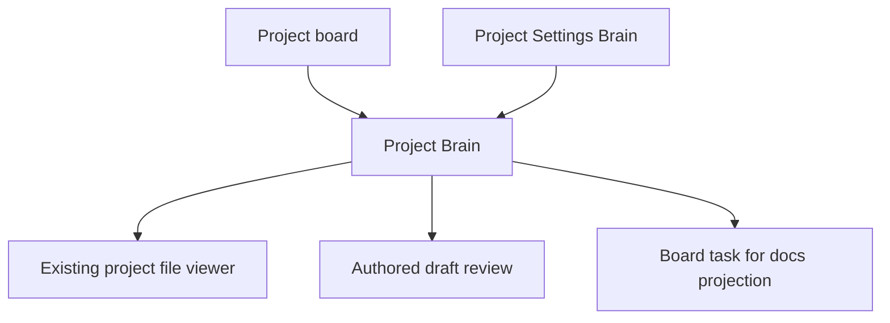
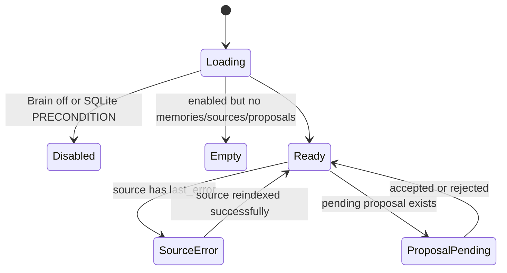

# Project Brain

Route: `/projects/{slug}/brain`
Status: Designed (ADR-127/ADR-128)
Source components: `web/app/(app)/projects/[slug]/brain/*`,
`web/components/brain/*`

## JTBD

When I need project decisions, conventions, lessons, and current direction, I
want one Brain page that searches owned memory and indexed canonical sources, so
I can act from the project's actual context without digging through every file.

When an improvement proposal exists, I want to inspect its evidence and draft,
then accept or reject it through the normal catalog/task permissions, so the
Brain improves the system without becoming a second authority.

## Roles & capabilities

| Role | Can see | Can act |
| --- | --- | --- |
| Project viewer | Memory search results, source list, proposal list | Open canonical pointers only when `readRepoFiles` also passes |
| Project member/admin/owner | Same | Same |
| Project admin/owner | Same | Add/update/remove/reindex sources via `editSettings`; accept catalog proposals with `manageCatalog`; accept docs projection proposals with task permissions |
| Global admin | Same as project owner | Same as project owner |

## Navigation

Entry points: project board Brain tab/link, project settings Brain block, proposal
notifications. Exits: existing project file viewer for canonical pointers,
Project Settings Brain, authored draft review, board task created from a docs
projection.

## Layout & regions

The page uses the existing app shell and project chrome. Primary regions:

- Memory search: compact search input, kind filter, tier badges (`owned` /
  `indexed`), confidence, score, provenance, and canonical pointer link.
- Sources tab: table with path/glob, kind, chunker, enabled state, chunk count,
  last indexed time, last error, per-source reindex, and index-all action.
- Proposals tab: pending/applied/rejected grouping, evidence links, draft diff
  or summary, accept action, reject with reason, and linked authored draft/task.
- Edges/degraded indicator: only visible when edges exist or degradation needs
  attention.

No Brain API returns source file content. Pointer links open the existing file
viewer and therefore reuse its member gate and `readRepoFiles` checks.

## States

## Data & APIs

- `GET /api/projects/{slug}/brain`
- `GET/POST /api/projects/{slug}/brain/sources`
- `PATCH/DELETE /api/projects/{slug}/brain/sources/{sourceId}`
- `POST /api/projects/{slug}/brain/sources/{sourceId}/reindex`
- `POST /api/projects/{slug}/brain/proposals/{proposalId}/conclusion`
- Existing project file viewer/API for pointer opening

Behavior lives in
[`system-analytics/project-brain.md`](../../system-analytics/project-brain.md).

## i18n

Namespace: `brain.*` in `web/messages/en.json` and `web/messages/ru.json`.

## Linked artifacts

- ADR-127, ADR-128
- [`docs/api/web.openapi.yaml`](../../api/web.openapi.yaml)
- [`docs/api/external/operations.openapi.yaml`](../../api/external/operations.openapi.yaml)
- [`docs/db/brain-domain.md`](../../db/brain-domain.md)
