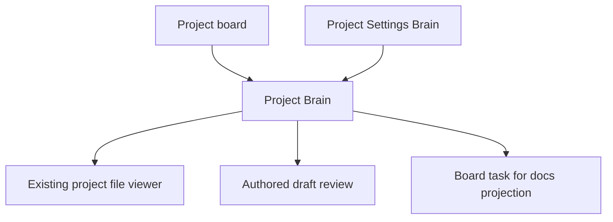
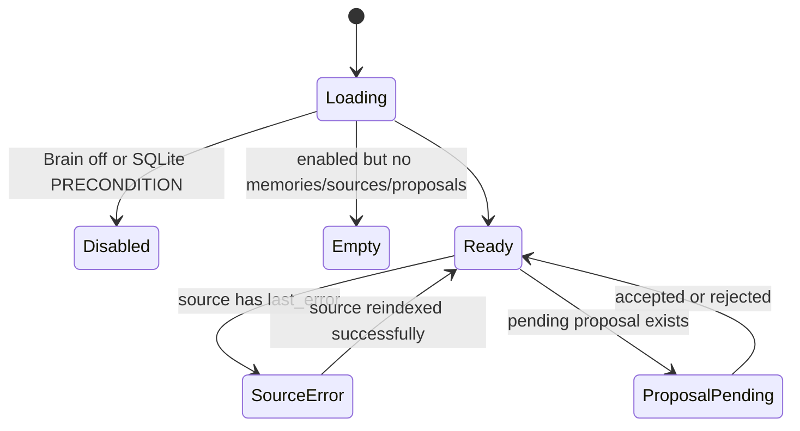

# Project Brain

Route: `/projects/{slug}?tab=brain`
Status: Implemented (ADR-127/ADR-128)
Source components: `web/app/(app)/projects/[slug]/page.tsx`,
`web/components/brain/*`, `web/lib/brain/ui-queries.ts`

## JTBD

When I need project decisions, conventions, lessons, and current direction, I
want one Brain page that searches owned memory and indexed canonical sources, so
I can act from the project's actual context without digging through every file.

When an improvement proposal exists, I want to inspect its evidence and draft,
then accept or reject it through the normal catalog/task permissions, so the
Brain improves the system without becoming a second authority.

## Roles & capabilities

| Role | Can see | Can act |
| --- | --- | --- |
| Project viewer | No Brain page access; `readBrain` requires project member | No Brain actions |
| Project member | Memory search results, source list, proposal list | Open canonical pointers only when `readRepoFiles` also passes; reject pending proposals via `writeBrain`; accept docs/state projection proposals through task permissions |
| Project admin/owner | Same | Reindex individual sources and run index-all via `editSettings`; accept catalog proposals with `manageCatalog`; accept docs/state projection proposals with task permissions |
| Global admin | Same as project owner | Same as project owner |

## Navigation

Entry points: project board Brain tab/link, project settings Brain block, proposal
notifications. Exits: existing project file viewer for canonical pointers,
Project Settings Brain, authored draft review, board task created from a docs
projection.

## Layout & regions

The page uses the existing app shell and project chrome. Primary regions:

- Memory search: compact search input. Until the user enters a query, the
  region shows an instruction empty-state instead of recent/default recall
  results. Query results show tier badges (`owned` / `indexed`), confidence,
  preview, and canonical pointer link.
- Index status: compact inventory cards for indexed file count, chunk count,
  source enablement, failed sources, queued/running jobs, and latest successful
  source index time. It also shows queued/running/failed/completed
  `brain_index_jobs` counts and active index jobs with source, reason, status,
  and progress. This is project-local status; the full cross-project queue lives
  in `/admin/scheduler`.
- Project settings: admins choose the managed source profile (`docs`,
  `docs_source`, or `all`). `docs` covers documentation/contracts,
  `docs_source` adds common source-code folders, and `all` also includes
  MAIster/agent internals such as `.ai-factory`, `.agents`, `.codex`, and
  `.claude`. Profile changes upsert managed source rows and queue source
  reindex jobs when Brain is enabled; manually added sources are left untouched.
- Sources: table with path/glob, kind, chunker, enabled state, indexed-file
  count with expandable file links, chunk count, last indexed time, last error,
  per-source reindex, and index-all action. Source add/update/remove exist on
  the API surface but are not currently exposed as UI controls on this page.
- Proposals: pending count, evidence links, draft JSON preview, allowed accept
  actions, and reject with reason. Catalog accept controls render only for
  `manageCatalog` users; docs/state projection accept controls render for users
  with task permissions. Accepted catalog proposals link to authored drafts;
  accepted docs/state proposals link to board tasks.

No Brain API returns source file content. Pointer links open the existing file
viewer and therefore reuse its member gate and `readRepoFiles` checks.

## States

## Data & APIs

- Server data loader: `web/lib/brain/ui-queries.ts`
- `GET/POST /api/projects/{slug}/brain/sources`
- `PATCH/DELETE /api/projects/{slug}/brain/sources/{sourceId}`
- `POST /api/projects/{slug}/brain/sources/reindex`
- `POST /api/projects/{slug}/brain/sources/{sourceId}/reindex`
- `POST /api/projects/{slug}/brain/proposals/{proposalId}/conclusion`
- Existing project file viewer/API for pointer opening

Behavior lives in
[`system-analytics/project-brain.md`](../../system-analytics/project-brain.md).

## i18n

Namespace: `brain.*` in `web/messages/en.json` and `web/messages/ru.json`.

## Linked artifacts

- ADR-127, ADR-128
- [`docs/api/web.openapi.yaml`](../../api/web.openapi.yaml)
- [`docs/api/external/operations.openapi.yaml`](../../api/external/operations.openapi.yaml)
- [`docs/db/brain-domain.md`](../../db/brain-domain.md)
