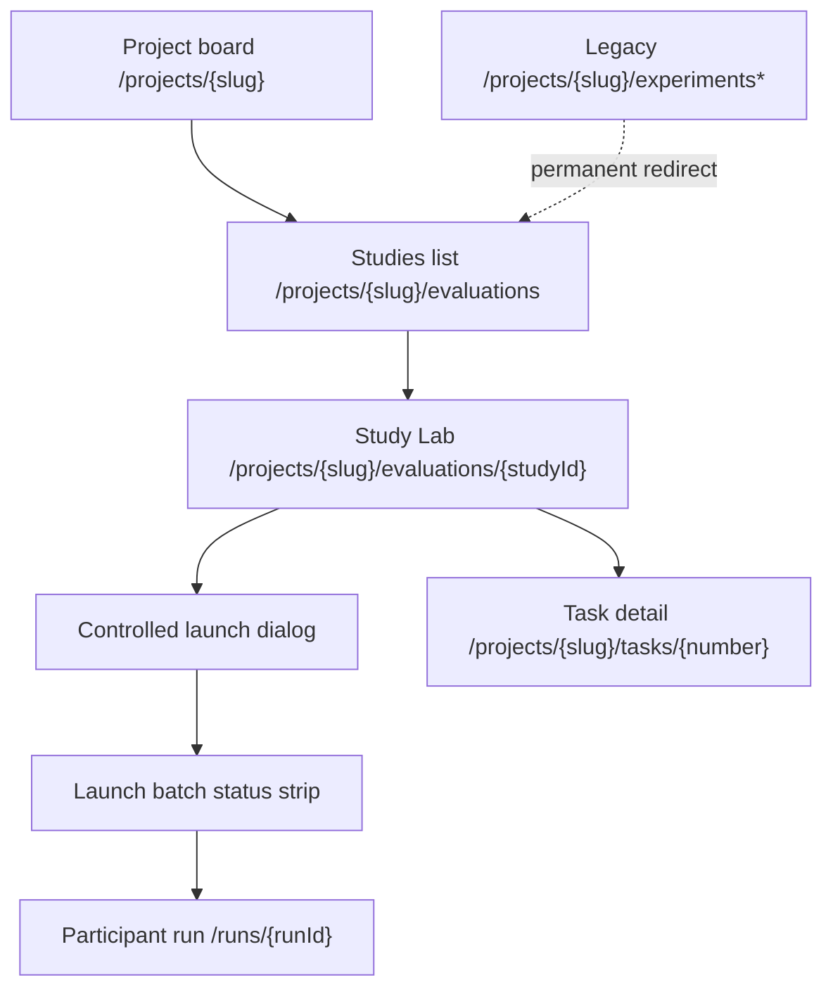
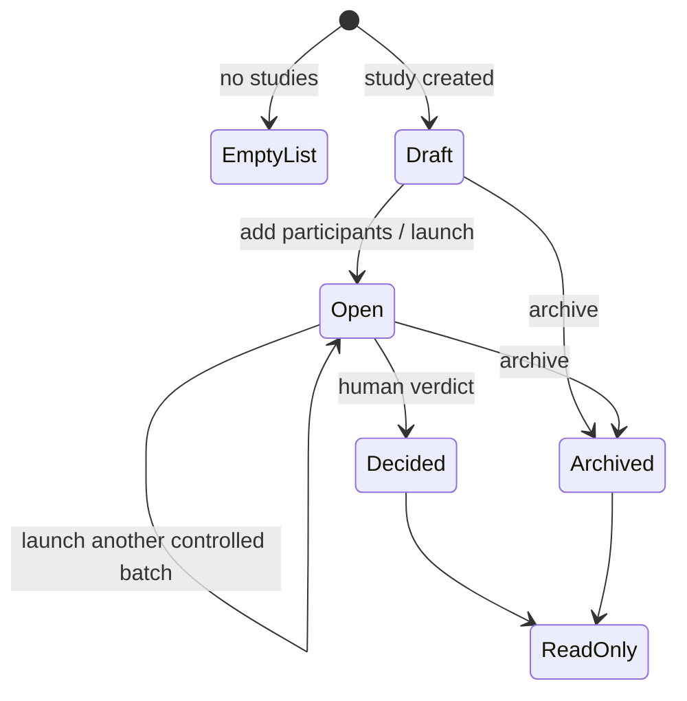

# Project evaluations

- **Routes:** `/projects/{slug}/evaluations`,
  `/projects/{slug}/evaluations/{studyId}`
- **Status:** Implemented (ADR-142..147); controlled-launch UI and
  legacy-experiment cut-over (ADR-150). Supersedes the retired Experiment
  Comparison Studio — legacy `/experiments` deep-links permanently redirect here.
- **Source:** `web/app/(app)/projects/[slug]/evaluations/page.tsx`,
  `web/app/(app)/projects/[slug]/evaluations/[studyId]/page.tsx`,
  `web/components/evaluations/*`, `web/lib/evaluations/*`

## JTBD

When I need to decide between several ways of doing one task, I want to run
controlled variants from an immutable recipe (a pinned Flow revision, slot-keyed
runners, an optional capability overlay, and an execution policy) and compare
their evidence under one Study, so a launched participant is reproducible and
never auto-promotes.

When a Study needs a second opinion, I want package-sourced judges to score the
same methodology so I can see calibrated, disagreement-aware recommendations
while the human verdict stays the only path that promotes a winner.

## Roles & Capabilities

| Role | Can see | Can do |
| --- | --- | --- |
| Project viewer | Study list, Study Lab, participants, evidence, judge attempts/aggregates, verdict state | Open a Study and its participant runs |
| Project member/admin/owner | Same | Create a Study, add observed runs, launch controlled batches, start evaluation, record a human verdict |
| Study owner/admin | Same | Standardize a recipe / roll a standardization back |

Screen read access uses the project membership boundary; controlled launch,
start-evaluation, and verdict actions require a manage-capable project role and a
human actor (machine/token actors never record a verdict).

## Navigation

- **Entry:** project tab bar Evaluations tab, project board task actions, and
  task-detail Study links.
- **Exit:** project board, task detail, and the flow-run detail for each
  participant run.
- **Deviation:** like Observatory, this tab points at nested routes instead of
  the `?tab=` board pattern because the Study Lab needs its own route, browser
  history, live SSE stream, and shareable URL.

## Layout & Regions

- **List page** is a full-width table of Studies with title, task key/link,
  status chip, participant count, created time, and the winner when decided.
  Rows open the Study Lab. A `migrated` badge marks Studies backfilled from a
  legacy Experiment (`legacy_experiment_id`).
- **Study Lab** streams live over SSE and composes:
  - **Participants** — observed runs and launched participants, each with run
    status, source type (`observed` / `launched`), and its recipe label.
  - **Controlled launch dialog** (manager-gated) — one or more inline variant
    editors, each with a label, per-slot runner hard-pin picker (server-scoped
    to the Study's Flow slot keys), an optional package-pin picker, an execution
    policy preset, four capability-overlay classes (rules/skills/mcps/subagents
    add+remove), and a replicate count. A **preflight preview** lists localized
    refusal/warning codes per variant before launch; the launch emits a batch,
    and a polled **batch status strip** shows per-item chips with a retry
    control. The recipe's Flow revision and contract digests come only from the
    server scaffold, so a launched participant is reproducible and preflight can
    catch a stale revision.
  - **Evaluation + scoreboard** — start evaluation runs the judges; the
    scoreboard renders criteria/pairwise results from the sealed aggregate.
  - **Verdict panel** — the human verdict over the methodology snapshot; only a
    human verdict promotes a winner.
  - **Standardization panel** — standardize the winning recipe or roll a prior
    standardization back (owner/admin, human-only).

## States

A launched participant's worktree is Study evidence: `draft`/`open` hold it
against GC and auto-promotion; only `decided`/`archived` release the hold.
Loading/error states reuse the project-page patterns: skeletons for the
list/lab, explicit empty states, and translated `MaisterError.code` messages.

## Data & APIs

- Session API under `/api/projects/{slug}/evaluations`: `studies` (list/create),
  `studies/{studyId}` (detail), `.../participants` (+`/{participantId}`),
  `.../launch-preflight`, `.../launch-batches` (+`/{batchId}` and `.../retry`),
  `.../evaluations` (start), `.../verdicts`, `.../standardize` +
  `standardization` (+`/rollback`), `.../standardization-eligibility`,
  `reviews/{reviewId}`, and `pin-options`.
- **Live stream:** `GET /api/projects/{slug}/evaluations/studies/{studyId}/stream`
  (SSE) drives the Study Lab; run streams/status compose underneath.
- Controlled participants launch through the shared `launchRun` seam with a
  forced `evaluation_study` promotion hold and a batch-item idempotency key —
  they never auto-promote or auto-deliver.

Behavior details live in
[`../../system-analytics/evaluations.md`](../../system-analytics/evaluations.md),
[`../../system-analytics/runs.md`](../../system-analytics/runs.md), and
[`../../system-analytics/readiness.md`](../../system-analytics/readiness.md).

## i18n

Uses `evaluationsLab`, `evaluationsControlled`, `nav`, `run`, `readiness`,
`common`, and `apiErrors` namespaces from `web/messages/{locale}.json`.

## Linked Artifacts

- ADR: [#adr-142](../../decisions.md#adr-142-evaluation-study-domain-and-legacy-experiment-compatibility),
  [#adr-146](../../decisions.md#adr-146-controlled-evaluation-recipes-and-slot-keyed-execution-profiles),
  [#adr-147](../../decisions.md#adr-147-advanced-evaluation-suites-calibration-and-recipe-standardization),
  [#adr-149](../../decisions.md#adr-150-experiments-cut-over-completion).
- API contracts: [`../../api/web.openapi.yaml`](../../api/web.openapi.yaml),
  [`../../api/async/web-evaluations.asyncapi.yaml`](../../api/async/web-evaluations.asyncapi.yaml).
- DB docs: [`../../database-schema.md`](../../database-schema.md),
  [`../../db/erd.md`](../../db/erd.md).
- Source: `web/components/evaluations/*`,
  `web/app/(app)/projects/[slug]/evaluations/*`, `web/lib/evaluations/*`.
