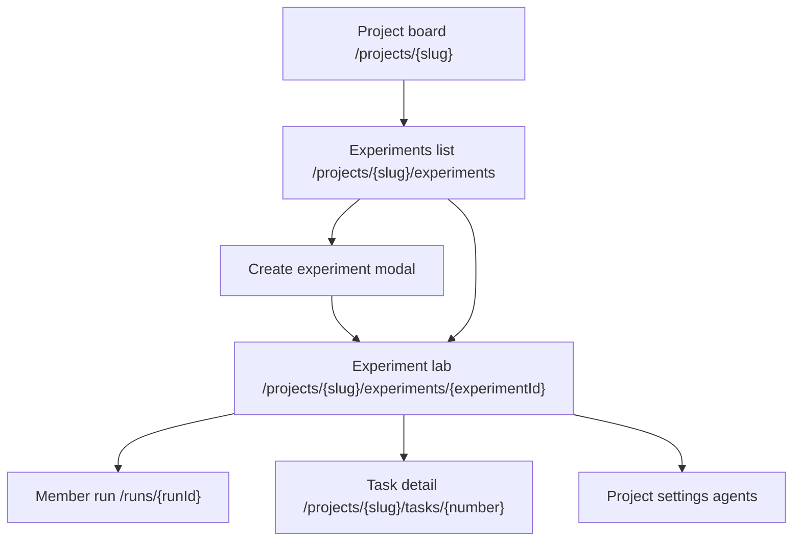
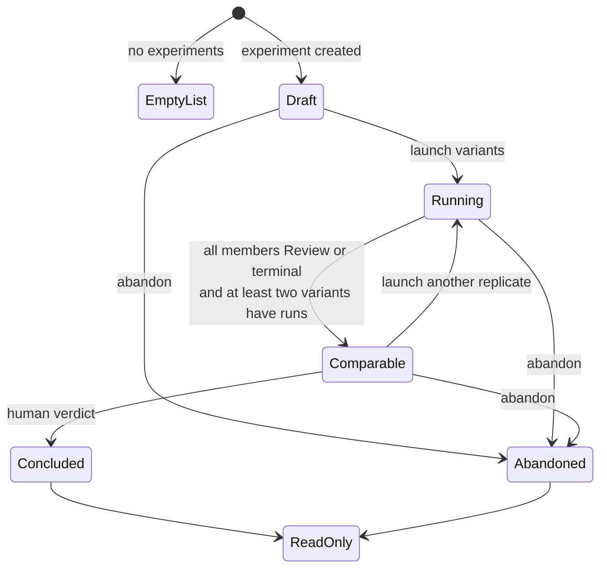

# Project experiments

- **Routes:** `/projects/{slug}/experiments`,
  `/projects/{slug}/experiments/{experimentId}`
- **Status:** Designed (ADR-124, Phase 1)
- **Source:** `web/app/(app)/projects/[slug]/experiments/page.tsx`,
  `web/app/(app)/projects/[slug]/experiments/[experimentId]/page.tsx`,
  `web/components/experiments/*`

## JTBD

When I am deciding between several ways to implement one task, I want to launch
variants from the same pinned base commit and compare their evidence side by
side so I can choose a winner without losing ordinary run history.

When a comparison needs a second opinion, I want an advisory judge to score the
same rubric so I can see a recommendation without letting a machine conclude
or auto-promote work.

## Roles & Capabilities

| Role | Can see | Can do |
| --- | --- | --- |
| Project viewer | Experiment list, lab matrix, stored snapshots, gates, token rollups, verdict/advisory state | Open experiment lab and member runs |
| Project member/admin/owner | Same | Create experiments, launch variants/replicates, abandon non-terminal experiments, ask the judge |
| Project member/admin/owner with conclusion affordance | Same | Conclude comparable experiments with a human verdict |
| Agent token with `experiments:read` | External comparison DTO subset | Read experiment detail/comparison through MCP/API |
| Agent token with `experiments:advise` | Existing comparison DTO plus rubric | Append advisory scores only |

Screen read access uses `requireProjectAction(projectId, "readExperiments")`.
Create/launch/abandon use `manageExperiments`; conclusion uses
`concludeExperiments`. Machine/token actors never conclude.

## Navigation

- **Entry:** project tab bar Experiments tab, project board task actions,
  task detail experiment links, and member-run breadcrumbs.
- **Exit:** project board, task detail, flow run detail for each member run,
  project agent settings when the judge is unavailable, and Flow Studio/package
  links from variant capability selectors.
- **Deviation:** this tab points at nested routes instead of the existing
  `?tab=` board pattern because the comparison lab needs its own route,
  browser history, and shareable URL.

## Layout & Regions

- **List page** is a full-width table with title, task key/link, FSM chip,
  variant count, pinned commit short SHA, created time, and verdict/winner when
  concluded. Rows open the lab. Empty state offers create when the user can
  manage experiments.
- **Create flow** is a modal wizard: task picker with inline task creation,
  title/description, base branch and optional explicit ref, variant editor, and
  rubric editor pre-filled from the platform default template. The pinned SHA
  is shown before save. Variant config validates the closed registry and
  localizes errors.
- **Lab header** shows localized FSM chip, pinned commit with copy action, base
  branch, task link, and icon+label actions: launch, ask judge, abandon, and
  conclude when comparable.
- **Variant matrix** lays variants across replicates. Each cell shows run
  status tone, duration, queue position for `Pending`, launch reason, run link,
  and compact node status strip. Failed/crashed members stay visible and do not
  hide the conclude affordance once the experiment is comparable.
- **Replicate and pair selectors** default to the latest replicate per variant.
  N>2 variants use a pair selector for diff and diff-of-diffs tabs.
- **Comparison tabs**: Diff, Diff-of-diffs, Files, Gates, Cost, and Verdict.
  Files supports All/Different/Same filters and per-file A-vs-B drilldown. Cost
  labels token classes and resume-attributed tokens; it never renders dollars.
- **Verdict panel** renders from the immutable rubric snapshot: criteria x
  variant scores, optional skips, weights, outcome selector, comment, and
  `abandonLosers`. Judge advisories appear beside human inputs as advisory data.

## States

UI loading and error states use the existing project-page patterns: skeletons
for table/lab regions, explicit empty/no-data states for missing snapshots and
cost rollups, translated `MaisterError.code` messages for route failures, and
read-only controls for viewers or terminal experiments.

## Data & APIs

- Session API: `GET/POST /api/projects/{slug}/experiments`,
  `GET /api/projects/{slug}/experiments/{experimentId}`,
  `POST /api/projects/{slug}/experiments/{experimentId}/launch`,
  `POST /api/projects/{slug}/experiments/{experimentId}/conclude`,
  `POST /api/projects/{slug}/experiments/{experimentId}/abandon`, and
  `GET /api/projects/{slug}/experiments/{experimentId}/comparison`.
- Generic launch API: `POST /api/runs` gains optional `baseCommit` and
  `relaunchOfRunId` for pinned launches and membership inheritance.
- External API/MCP: `GET /api/v1/ext/projects/{slug}/experiments/{id}` powers
  `experiment_get`; `POST .../advisory` powers `experiment_advise`.
- No new SSE channel exists. The lab composes existing run streams/status
  surfaces and refetches comparison DTOs at tab/action boundaries.

Behavior details live in
[`../../system-analytics/experiments.md`](../../system-analytics/experiments.md),
[`../../system-analytics/runs.md`](../../system-analytics/runs.md),
[`../../system-analytics/flow-settings.md`](../../system-analytics/flow-settings.md),
[`../../system-analytics/readiness.md`](../../system-analytics/readiness.md), and
[`../../system-analytics/agents.md`](../../system-analytics/agents.md).

## i18n

Uses `experiments`, `experimentLab`, `experimentCreate`, `experimentVerdict`,
`experimentJudge`, `run`, `readiness`, `common`, and `apiErrors` namespaces from
`web/messages/{locale}.json`.

## Linked Artifacts

- ADR: [#adr-124](../../decisions.md#adr-124-experiment-comparison-studio-for-pinned-base-comparison-runs).
- API contracts:
  [`../../api/web.openapi.yaml`](../../api/web.openapi.yaml),
  [`../../api/external/operations.openapi.yaml`](../../api/external/operations.openapi.yaml).
- DB docs: [`../../database-schema.md`](../../database-schema.md),
  [`../../db/erd.md`](../../db/erd.md).
- Source: `web/components/experiments/*`,
  `web/app/(app)/projects/[slug]/experiments/*`,
  `web/lib/experiments/*`.
