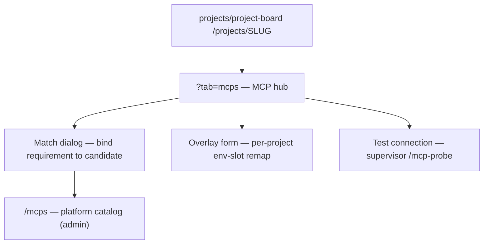
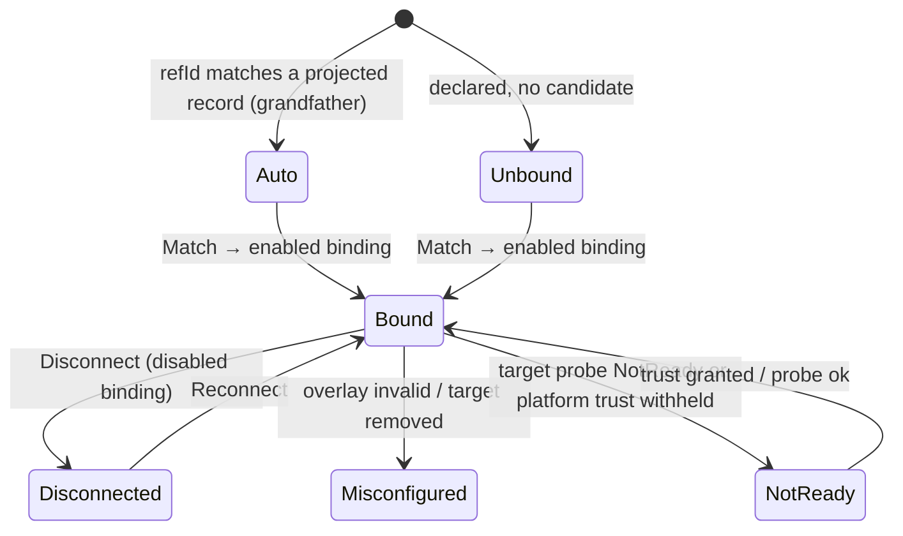

# Project MCP hub (board tab)

- **Type:** block (board tab).
- **Route:** `/projects/{slug}?tab=mcps`.
- **Status:** Implemented — project-local list + the ADR-129 hub (requirements ledger, 3-source servers list, match/connect/overlay dialogs, test-connection with inline result).
- **Source:** `web/components/board/panels/mcp-panel.tsx` (rebuilt) + `mcp-bind-dialogs.tsx`, `web/components/mcp/mcp-select.tsx`, `web/lib/mcp/{hub-service,requirements-ledger,binding-service}.ts`.

## JTBD

When I run flows/agents in a project, I want one place to see every MCP the
project can use — from the platform catalog, from installed packages, and
project-local — to see which **requirements** are satisfied, and to **match**,
**connect**, **configure**, and **test** them, so a required MCP never silently
blocks a launch and I control which server backs each ref per project.

## Roles & capabilities

| Role | Access |
| --- | --- |
| Project `owner` / `admin` (or global admin) | View the hub; bind/rebind/connect/disconnect; edit overlay; test connection (`requireProjectAction(projectId, "editSettings")`) |
| Project `member` | View the hub and requirement statuses (read-only) |
| Project `viewer` | View only (no mutation controls) |

`projectId` is always server-derived from the URL `slug`; no mutation body
carries a project locator (see [mcp-management.md](../../system-analytics/mcp-management.md) §7).

## Navigation

- **Entry:** the project board's `mcps` tab (`?tab=mcps`), alongside the board
  columns and the HITL inbox.
- **Within:** a **match dialog** (bind a requirement to a platform/project
  candidate), a **connect** control (pick up a platform server), a per-binding
  **overlay** form (env-slot remap), and a **Test connection** button per row.

## Layout & regions

Two regions:

1. **Requirements ledger** — every ref required by attached packages, enabled
   flow-revision node `settings.mcps`, and attached agents'
   `capability_profile.mcps`, each with a status chip: `bound` · `auto` ·
   `unbound` · `misconfigured` · `not_ready`. An `unbound`/`auto` requirement
   offers **Match**; a `bound` one offers **Rebind / Disconnect / Configure**.
2. **Servers list** — all three sources merged (platform / project / package)
   with columns: id, source, transport, **trust**, **readiness**, **used by N**,
   enabled, actions. Platform rows offer connect/disconnect; project rows keep
   the existing project-local CRUD (edit modal). The match dialog only offers
   **bindable** candidates (existing, kind-matching, trusted-or-warned).

The board-header MCP **metacell** shows the project-effective MCP count (from the
hub read model), replacing the previous hardcoded `—`.

## States

Per requirement classification:

## Data & APIs

- Read: `web/lib/mcp/hub-service.ts` (merged list + used-by via
  `web/lib/mcp/usage.ts`) + `web/lib/mcp/requirements-ledger.ts` (derived ledger).
- Mutations (Implemented, ADR-129):
  `POST /api/projects/{slug}/mcp/bindings`,
  `PATCH/DELETE /api/projects/{slug}/mcp/bindings/{refId}`,
  `POST /api/projects/{slug}/mcp/connect`, `POST /api/projects/{slug}/mcp/disconnect`,
  `POST /api/projects/{slug}/mcp/probe` (test connection, trust-gated).
- Behavior lives in
  [`../../system-analytics/mcp-management.md`](../../system-analytics/mcp-management.md)
  (do not restate — R7).

## i18n

`mcpPanel` (board tab, extended for the hub columns/actions/dialogs, including
`bind`/`rebind`/`configure`/`disconnect`/`connect`/`match*`/`overlay*`/`probing`).
The shared MCP-select reuses `mcpPanel`/`flowEditor.nodeForm` labels (node) +
new `scratch.mcpSource*` keys; the agent effective-MCPs column adds
`agentsAttach.colEffectiveMcps`. EN + RU parity enforced by
`web/lib/__tests__/i18n-parity.test.ts`.

## Linked artifacts

- ADR: [ADR-129](../../decisions.md#adr-129) — requirements & bindings,
  per-project overlay, trust & health activation.
- Behavior: [`../../system-analytics/mcp-management.md`](../../system-analytics/mcp-management.md).
- SDD: [`../../../.ai-factory/specs/feature-mcp-management-v2.md`](../../../.ai-factory/specs/feature-mcp-management-v2.md).
- Platform-scope screen: [`../mcps.md`](../mcps.md).
- Source: `web/components/board/panels/{mcp-panel,mcp-bind-dialogs}.tsx`, `web/components/mcp/mcp-select.tsx`, `web/lib/mcp/{hub-service,requirements-ledger,binding-service}.ts`.
