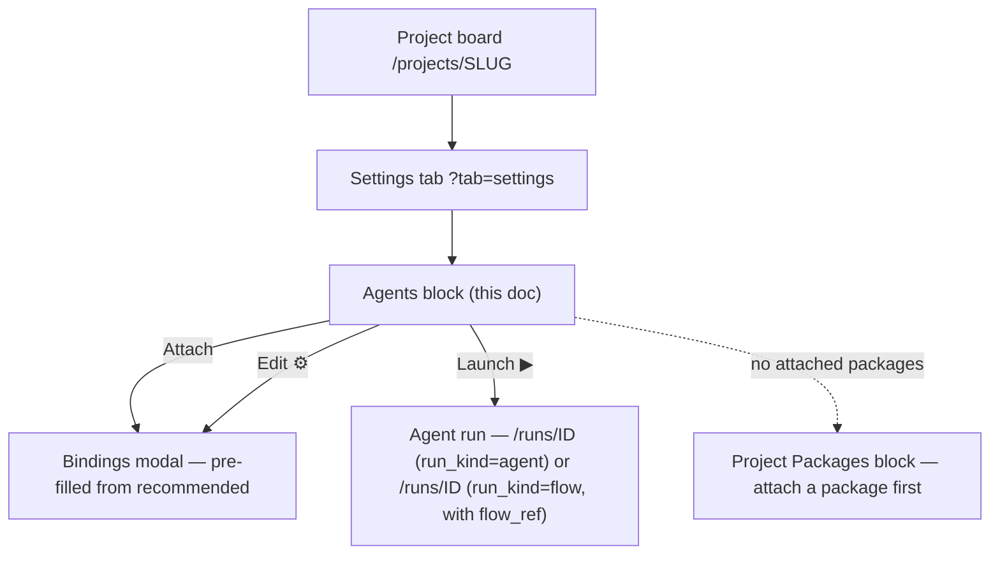
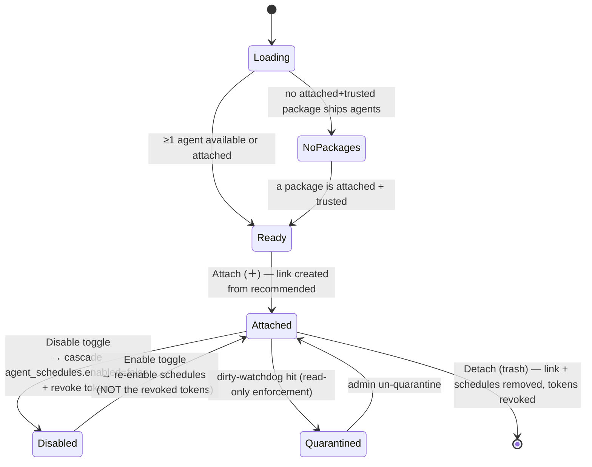

# Project Settings → Agents

- **Name / route:** Project Settings → **Agents** block · `/projects/{slug}?tab=settings` (Agents section)
- **Status:** Implemented (M39, ADR-106)
- **Source:** `web/components/board/panels/agents-attach-panel.tsx` +
  `web/components/board/panels/agents-attach-edit-modal.tsx` — a second instance
  of the data-management-page pattern (precedent: admin
  `web/components/settings/agents-panel.tsx`,
  `web/components/admin/users-table.tsx` + `user-edit-modal.tsx`). The panel
  renders on the project **board** surface (`web/app/(app)/projects/[slug]/page.tsx`,
  component `AgentsAttachPanel`), not under `settings/`.

## JTBD

> When I have attached a flow package that ships platform agents, I want to
> **enable specific agents in this project, bind their cron/event triggers, and
> tune their runner + autonomy policy**, so the agents run on this project's
> repo exactly the way I intend — autonomously where I allow it, paused where I
> don't.

## Roles & capabilities

| Role (project) | See | Do |
| --- | --- | --- |
| `viewer` | — (the Settings tab is `member`+) | — |
| `member` | the attached + available lists (read model, `getProjectAgents`) and **Launch** an enabled agent (`launchRun`) | launch a manual agent run |
| `admin` / `owner` | everything | attach/detach, enable/disable, edit the instance config (triggers, runner override, branch base, autoApply, onBudgetBreach) via `editSettings` |

The hidden nav/tab is convenience; the route still enforces
`requireProjectAction(projectId, 'editSettings'|'launchRun'|...)`. `projectId` is
always server-derived from the URL `slug`, never a body field.

## Navigation

Entry: project board → **Settings** tab → **Agents** block. Exit: **Launch** →
the run detail ([`../runs/flow-run.md`](../runs/flow-run.md)); attaching a package
is a prerequisite handled in the project **Packages** surface.

## Layout & regions

Full-width block (drop `mx-auto max-w`); the table sits in an `overflow-x-auto`
with a `min-w`. Forms (the modal) stay narrow (520–760px).

- **Attached agents — view-only table.** One row per attached agent. Columns:
  **Agent** (`packageName:stem` + name, the `flow_ref` shown as a small "drives
  *flowId*" chip when set), **State** (a green-check `✓` enabled / `—` disabled
  glyph + a quarantine warning glyph when `quarantined_at`), **Triggers** (chips:
  `cron`, `event` counts and — **Implemented, ADR-151** — a `mention` chip when an
  enabled mention binding exists; `manual`/`webhook`/`flow` are capability badges
  from the definition), **Runner** (override or the resolved default), **Auto-apply**
  (`off` / `permissions` "с чел" / `full` "без чел"), **On budget breach**
  (`escalate` / `terminate` / `terminate_restorable`), **Branch base**, and a
  **`brain:rw` chip** (ADR-122) when the link grants `canReadBrain` /
  `canWriteBrain` (`r`, `w`, or `rw` per the granted axes), and — **(ADR-152 —
  Implemented)** — a **`mem` chip** in the same axes cluster when
  `memoryEnabled` is set. No inline
  editing — the row carries data only; an action cluster on the right reads
  left→right **Edit (⚙) · Memory (📄, ADR-152 — Implemented) · Launch (▶) ·
  Disable/Enable (toggle) · Detach (trash, danger tone)**, all icon buttons
  with `aria-label`.
- **Memory drawer** (ADR-152 — Implemented) — the row's Memory action opens a
  **dedicated portaled drawer**, deliberately NOT the 520–760px instance-config
  modal: a memory file is a document up to
  `MAISTER_AGENT_MEMORY_MAX_CHARS` (default 32 768) characters and needs the
  width. It renders `memory.md` read-only by default with a live
  **`sizeChars / max`** indicator (so "compact when near the cap" is actionable),
  an **Edit** affordance switching to a textarea, and a **Save** that submits
  directly (the request carries `ifHash` — a stale hash returns 409 with the
  current content, which is surfaced in place with the agent's version, because
  a blind human Save must not clobber a concurrent agent write). **Clear** is
  destructive and goes through the **shared portaled `ConfirmDialog`**; a failed
  clear reports its own error rather than silently reloading. Save is
  deliberately NOT confirmed — it is reversible and CAS-guarded, while Clear is
  neither. Accessibility comes from the shared `useModalFocusTrap` (focus trap,
  initial focus, focus restore, Esc, body scroll lock) plus `aria-labelledby`,
  `role="alert"` for errors, and `createPortal` to `document.body`. Behavior
  lives in
  [`../../system-analytics/agent-memory.md`](../../system-analytics/agent-memory.md).
- **Available agents — list.** Agents projected from the project's **attached +
  trusted** packages that are not yet linked. Each shows `packageName:stem` + name
  + risk tier; an **Attach (＋)** icon button opens the bindings modal pre-filled
  from the definition's `recommended` block. Agents whose package is untrusted are
  not listed (attach requires trust).
- **Instance config modal** (`agents-attach-edit-modal.tsx`) — a single
  `create | edit` modal that also owns Detach. ONE aggregating `PATCH` (partial
  body, one transaction) on save — never a per-field fan-out. Fields, each seeded
  from `recommended` and overridable on the instance:
  - **Enabled** toggle (disabling cascades to the agent's triggers — see States).
  - **Triggers** — add/remove cron rows (`cronExpr` + IANA `timezone`) and event
    rows (kind multiselect over the ADR-086 taxonomy). Full-replacement on save.
    The Project Automations aggregate links here to manage a binding; it
    does not add another editor or a synthetic agent Run now action. The
    stable IDs and schedules revision make an unseen concurrent binding change a
    visible conflict rather than a delete-and-reinsert loss.
    **(Implemented, ADR-151)** a third row type, **mention**, takes no cron and no
    event input — it is the operator's grant that lets anyone with
    `commentTask` summon this agent by writing `@<agentId>` in a task comment
    on this project. At most ONE enabled mention row per agent (`CONFIG` →
    422 otherwise). It is prefilled from `recommended.mention`, and editing it
    stays `editSettings`-gated: **the binding IS the authorization**, so only a
    project `admin` can create or enable it. Behavior lives in
    [`../../system-analytics/agent-mentions.md`](../../system-analytics/agent-mentions.md).
  - **Runner override** — select from the enabled runner catalog (or "use
    default").
  - **Branch base** — text (default = the project main branch).
  - **Auto-apply** — a 3-way segmented control: **off** (normal HITL) ·
    **permissions** ("с чел" — auto-approve ACP tool permissions; human/form still
    pause) · **full** ("без чел" — also auto-pass human review). A helper line
    states `form`/`infra_recovery` always pause and `budget_breach` is never
    auto-applied.
  - **On budget breach** — a 3-way control: **escalate** (live pause, holds a
    slot) · **terminate** (Failed) · **terminate_restorable** (checkpoint → freed
    slot → recoverable `NeedsInputIdle`, restore by raising the budget).
  - **Brain access** (ADR-122) — two toggles: **canReadBrain** (gates
    `memory_recall`) and **canWriteBrain** (gates `memory_retain`, a separate
    write axis — read never grants write). Both default off.
  - **Memory** (ADR-152 — Implemented) — a third toggle in the same section,
    **`memoryEnabled`**, labelled explicitly as a **separate axis** from
    `canWriteBrain`: it gates the agent's own private `memory.md`, not Project
    Brain, and neither Brain axis implies it. Default off, seeded server-side on
    attach from the effective definition's `memory:` field. For a **flow-bound
    agent** (an effective definition declaring `flow:`) the toggle renders
    **disabled with its reason shown** — "this agent drives a Flow; Flow runs do
    not carry agent memory" — never hidden and never silently inert, because the
    launch diverts to the agent-driven flow path and never reaches the prompt
    seam. The disabled control is an affordance, not the boundary: `attachAgent`
    lands `false` for a flow-bound agent regardless of its definition, and the
    `PATCH` refuses an explicit `memoryEnabled: true` with `422 CONFIG`, so no
    client can land a permanently inert `true`.
  - Close affordance: top-right **✕** (+ Esc + backdrop), `createPortal` to body
    (shared popup convention).

## States

## Data & APIs

- **Read:** `GET /api/projects/{slug}/agents` → `{ attached: AttachedAgent[],
  available: AgentSummary[] }` (member+). `AttachedAgent` now carries
  `branchBase` + `executionPolicyOverride` (ADR-106),
  `canReadBrain` + `canWriteBrain` (ADR-122), and `memoryEnabled`
  (ADR-152 — Implemented).
- **Memory (ADR-152 — Implemented):** `GET | PUT | DELETE
  /api/projects/{slug}/agents/{agentId}/memory`. `GET` is `readBoard` and
  returns `200` even when the file is absent (`content: ""`, `hash: null`) —
  the first-writer state, not a 404. `PUT` and `DELETE` require `editSettings`;
  `PUT` carries `ifHash` and answers `409` with the current state on a stale
  hash, `DELETE` is idempotent (`204`). An unknown project OR an unattached
  agent is `404` on all three — the attachment is the addressable resource here.
  `memoryEnabled` itself is NOT a per-field route — it rides the existing
  aggregating `PATCH /api/projects/{slug}/agents/{agentId}` in one transaction,
  which refuses an explicit `true` for a flow-bound agent with `422 CONFIG`.
- **Attach:** `POST /api/projects/{slug}/agents` `{ agentId, enabled?,
  runnerOverrideId? }` (admin) — `409 PRECONDITION` when the package is not
  attached+trusted.
- **Edit (one aggregating endpoint):** `PATCH /api/projects/{slug}/agents/{agentId}`
  — partial `{ enabled?, runnerOverrideId?, branchBase?, executionPolicyOverride?,
  schedules?, canReadBrain?, canWriteBrain? }` in one transaction.
- **Detach:** `DELETE /api/projects/{slug}/agents/{agentId}` (revokes tokens).
- **Launch:** `POST /api/projects/{slug}/agents/{agentId}/launch` `{ taskId?,
  runnerId?, workspace? }` (launchRun). The launch dialog may override the
  workspace for this run; runner compatibility is checked against that final
  workspace before any run/workspace artifact is created.

Behavior (gating allow-list, trigger-toggle cascade, run_kind discriminant,
runner policy, read-only runner compatibility, and package-skill materialization)
lives in
[`../../system-analytics/agents.md`](../../system-analytics/agents.md) — not
restated here (R7).

Project Automations may display effective binding timing and safe latest outcome
telemetry, but this modal remains the sole mutation owner. The aggregation never
shows an agent trigger-now control in its first phase.

Read-only standalone validation is runner-family based, not claude-name based.
If a `workspace: none | repo_read` launch selects a non-proven adapter, the UI
surfaces the server's `EXECUTOR_UNAVAILABLE` message with the selected runner,
adapter, workspace, and missing read-only-session evidence; no partial run row is
shown.

Stale evidence is the same typed refusal family: the surface keeps the runner,
adapter, workspace, and reason context and directs the operator to the ACP
runner Settings evidence row. It never synthesizes a fallback runner or creates
a partial run.

## i18n

`web/messages/{en,ru}.json` namespace **`agentsAttach`** (table headers, the
3-way control labels incl. the **с чел / без чел** captions, trigger editor,
empty states, action `aria-label`s, modal). EN + RU parity required — verified
52 ≡ 52 keys on 2026-07-27. (Corrected: this doc previously named
`projectSettings.agents`; no `projectSettings` namespace exists in either
catalog, and code wins over docs.) The ADR-152 memory strings — `mem` chip, the
Memory row action `aria-label`, drawer title/Edit/Save/Clear, the
`sizeChars / max` indicator, the over-cap warning, the CAS-conflict message,
and the flow-bound disabled-reason — all land in this namespace.

## Linked artifacts

- ADR: [#adr-106](../../decisions.md#adr-106-package-based-platform-agents--package-identity-attachment-gating-optional-flow-enrichment-and-per-agent-runner-policy).
- Behavior: [`../../system-analytics/agents.md`](../../system-analytics/agents.md),
  [`../../system-analytics/execution-policy.md`](../../system-analytics/execution-policy.md).
- API: [`../../api/web.openapi.yaml`](../../api/web.openapi.yaml)
  (`getProjectAgents`, `postProjectAgentLink`, `patchProjectAgentLink`,
  `deleteProjectAgentLink`, the agent launch route).
- Conventions: `web/CLAUDE.md` → "Data-management page patterns" + "UI affordance
  conventions" (view-only table, popup edits, icon buttons, green-check, one
  aggregating endpoint, accessible modal).
- Source: `web/components/board/panels/agents-attach-panel.tsx`,
  `web/components/board/panels/agents-attach-edit-modal.tsx`.
