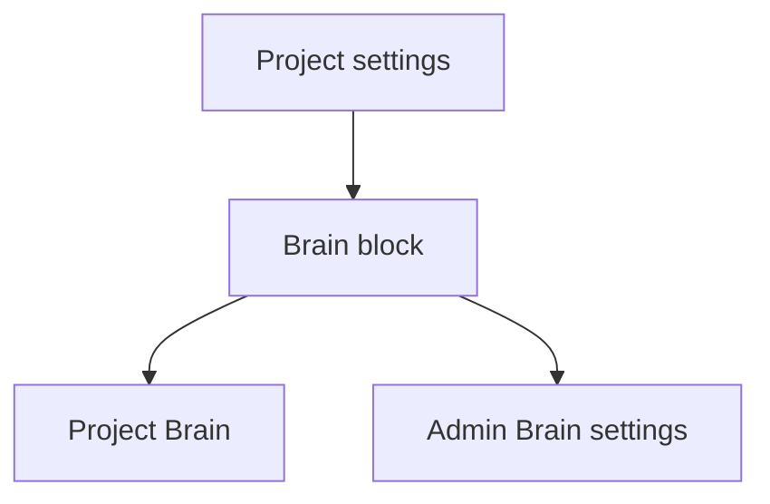
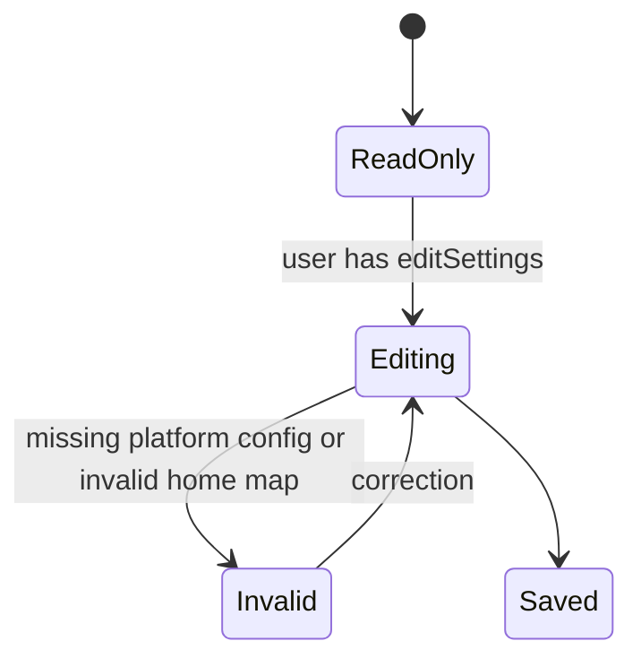

# Project Settings Brain

Route: `/projects/{slug}?tab=settings`
Status: Designed (ADR-127/ADR-128)
Source components: `web/components/projects/*`,
`web/components/brain/*`

## JTBD

When I configure a project, I want to decide whether Brain is enabled, which
kinds have canonical homes, and which flow handles docs projection, so the
Brain's behavior matches the repository's documentation model.

## Roles & capabilities

| Role | Can see | Can act |
| --- | --- | --- |
| Project viewer/member | Current Brain settings summary | No edits |
| Project admin/owner | Current Brain settings | Toggle Brain, edit home resolution, choose projection flow, configure source defaults |
| Global admin | Same as project owner | Same as project owner |

Editing requires `editSettings`. Enabling Brain still requires platform
embedding and distill settings; otherwise the route refuses `CONFIG`.

## Navigation

Entry points: project settings tab, Project Brain empty/disabled state. Exits:
Project Brain page, source list, platform Brain settings for global admins.

## Layout & regions

- Enablement row: project Brain toggle and status.
- Home resolution: per-kind segmented controls for `owned` versus `indexed`.
- Sources shortcut: link to Project Brain sources tab.
- Projection: flow picker for docs/state projection tasks.
- Autonomy overrides: compact selectors limited to `manual` and `auto_draft`.

The block does not explain how Brain works inline; it exposes controls and state.
Detailed behavior stays in system analytics docs.

## States

## Data & APIs

- `GET /api/projects/{slug}/settings/brain`
- `PATCH /api/projects/{slug}/settings/brain`
- Existing project settings route may continue to carry `brainEnabled` during
  migration; this dedicated contract is the B/C target.

## i18n

Namespace: `projectSettings.brain.*` and shared `brain.*`.

## Linked artifacts

- ADR-122, ADR-127, ADR-128
- [`system-analytics/project-brain.md`](../../system-analytics/project-brain.md)
- [`api/web.openapi.yaml`](../../api/web.openapi.yaml)
